Once you’ve set up the Venue & Location details, the next step is to create and manage your event tickets. The Tickets section lets you define how attendees can join your event — whether through free, paid, or donation-based tickets. You can customize pricing, set quantities, apply sales tax, and even offer promo codes for discounts.

## Navigation and prerequisites

Open **Events**, create or edit the event, then select **Tickets**. Create a ticket or open an existing ticket to edit its fields. Some controls are conditional on ticket type, site platform, or plan. An upgrade prompt identifies an unavailable feature.

Set up [brand colors and logo](../branding-and-design/brand-design) first. For Shopify events using seating, dates/time slots, access codes, or quantity controls, configure the [Ticket Selector](../plugins/connect-shopify#configure-the-ticket-selector-for-advanced-ticketing).

Use the [current ticket options reference](./ticket-options-reference) to locate each field. The main editor groups settings into Details, Pricing & Access, Sales & Capacity, Check-in, Autopilot, and Seat Categories. The custom day editor uses its own section labels and is documented in [Date-specific Tickets](./day-specific-tickets).

## Sales Tax

The **Sales Tax** field appears for supported non-Shopify sites. For events sold as Shopify products, configure tax in Shopify and verify the storefront checkout.

Add a sales tax to your tickets, and it will be automatically applied at checkout. The configured percentage changes the checkout total; choose the rate appropriate to your event.  
For example, if your ticket price is 50 dollar and you set a 10% sales tax, the total amount charged at checkout will be 55 dollar.

> **INFO:** Leave this as it is if you don’t need to apply any tax to your ticket sales.

## Tickets

<Frame caption="Tickets contains seating setup, currency, event capacity, the ticket list, and promo codes. Create Ticket opens the full ticket editor.">
  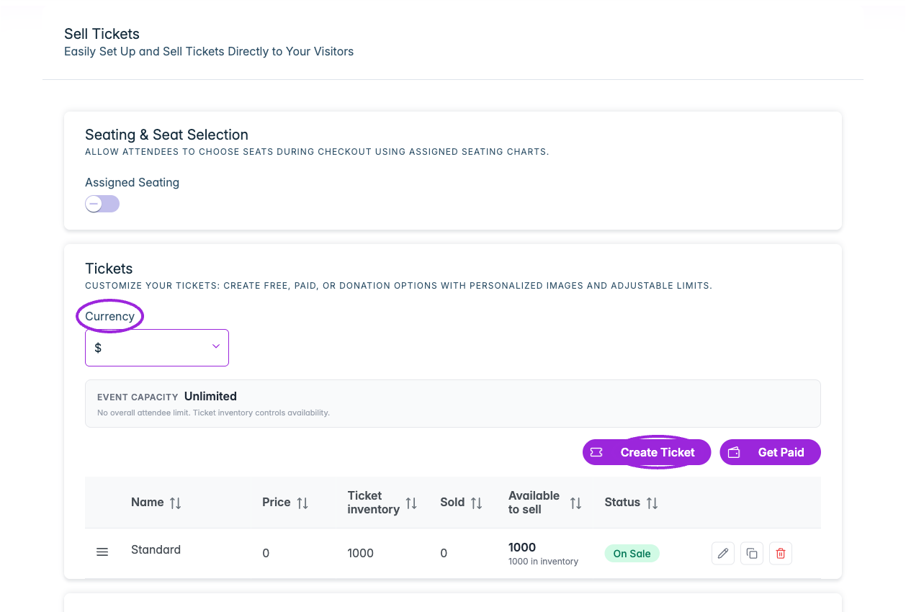
</Frame>

Create tickets for your event to define how attendees can register or gain access. You can set up free, paid, or donation-based tickets depending on your event type. Each ticket can have its own name, price, quantity, and sales start and end date — giving you full control over availability and pricing.

## Currency

Select the currency in which you want to sell your tickets. You can choose from multiple options such as USD (dollar), EUR (€), JPY (¥), GBP (£), AUD (AU$), or CAD (CA$) based on your event’s location and payment preferences.

## Get Paid

Use **Get Paid** to open [payment settings](../account/get-paid). Available providers depend on your site's platform and configuration. Connect the provider you intend to use, then verify a test checkout and its payment record. Installments specifically require an enabled Stripe connection; a Square connection alone does not enable them.

<Frame caption="Payment connections available to this Demo site. Provider details are concealed.">
  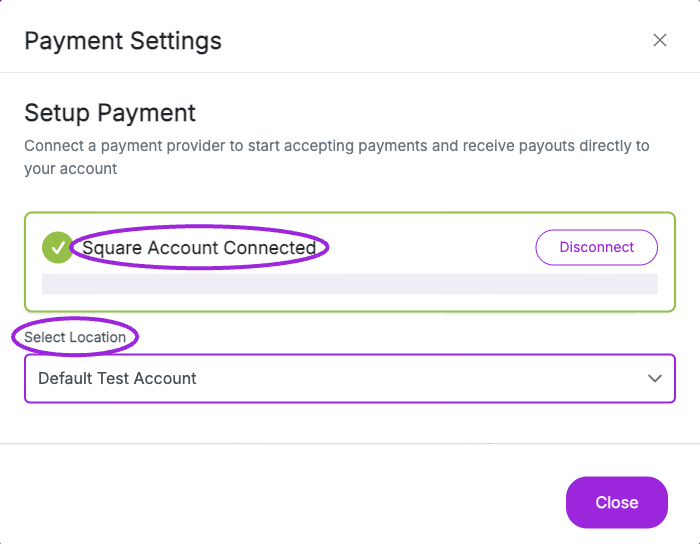
</Frame>

## Create Ticket

<Frame caption="The ticket editor groups options into Details, Pricing &amp; Access, Sales &amp; Capacity, Check-in, and Autopilot. Seat Categories appears when assigned seating is configured.">
  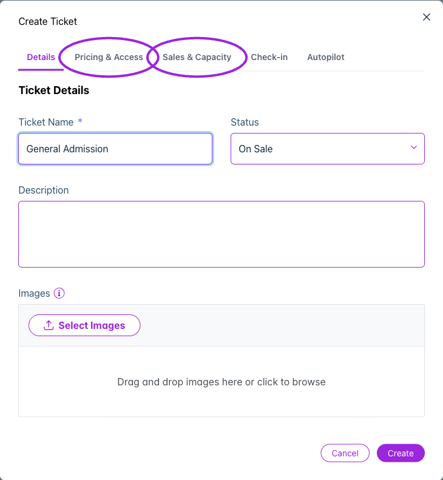
</Frame>

Click **Create Ticket** to create a ticket. For a saved ticket, use its pencil/edit action in the ticket list.

## Basic Ticket Information

<Frame caption="Create Ticket → Details contains the ticket name, status, description, and images. This example is an unsaved demo ticket.">
  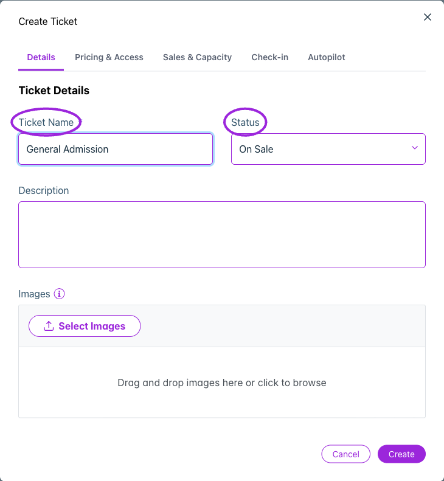
</Frame>

This section allows you to define the essential details for your ticket — from its visibility and visuals to access rules and validity duration.

### Fields

| S.no | Field | Description |
|------|--------|-------------|
| 1 | **Images** | Add one or more images by clicking on the + button to visually represent your ticket. The images appear next to the ticket, and if multiple images are added, they will rotate automatically in a carousel display. |
| 2 | **Ticket Name** | Enter a clear, recognizable name for your ticket. |
| 3 | **Status** | Choose from the dropdown — On Sale, Cancelled, or Postponed — to define the current state of the ticket. |
| 4 | **Description** | Use this box to add a short description for your ticket, such as access details, inclusions, or benefits. |

## Hidden tickets and access codes

<Frame caption="Hidden tickets can use an access code. Shopify events also offer Include in Shopify Variant.">
  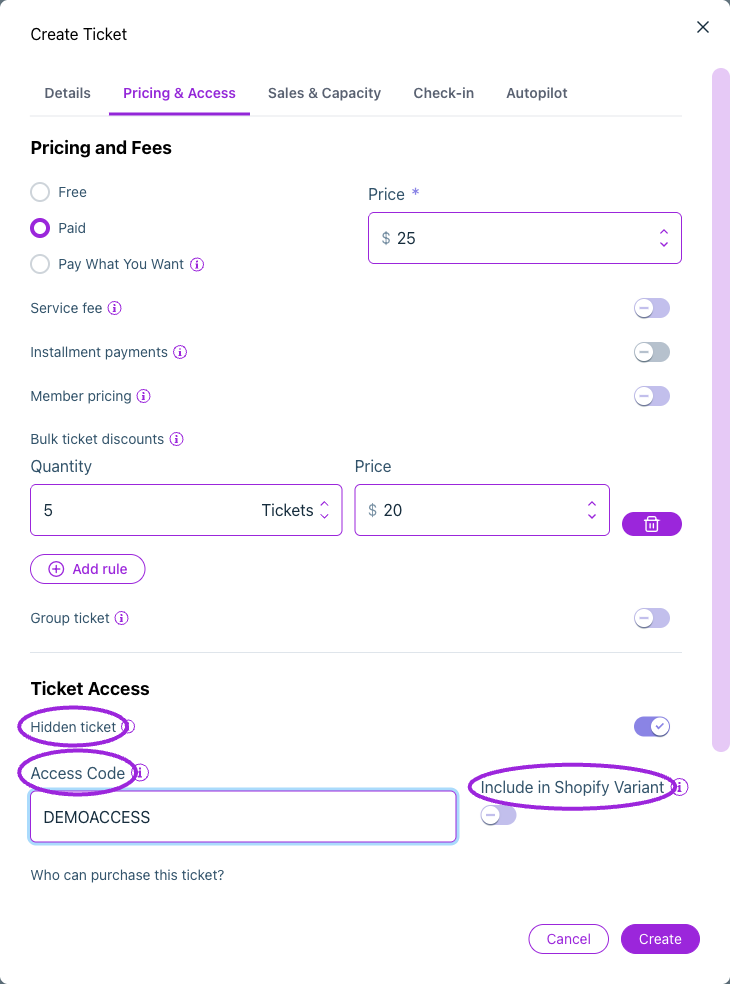
</Frame>

1. In **Pricing & Access**, enable **Hidden ticket** to hide the ticket from normal public selection.
2. Enter an **Access Code** if attendees should be able to reveal and buy it by entering that code. Leaving the code blank does not create a code to share.
3. On a Shopify site, review **Include in Shopify Variant**. Hidden tickets are excluded from Shopify product variants by default; enabling this explicitly includes the hidden ticket in those variants.
4. Save the ticket and update the event. Test the public selector without a code, with the correct code, and with an incorrect code.

A ticket access code is different from a private event's access code. Hiding an event listing is also different from restricting a ticket.

## Membership access

<Frame caption="Members only restricts ticket purchase to the selected active membership programs. Choose at least one eligible membership, then save the ticket and event.">
  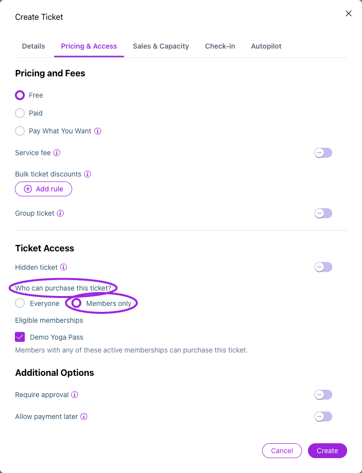
</Frame>

<Frame caption="Enable Member pricing, select eligible programs, and enter a member price. This example offers a $15 member ticket against the $25 regular price.">
  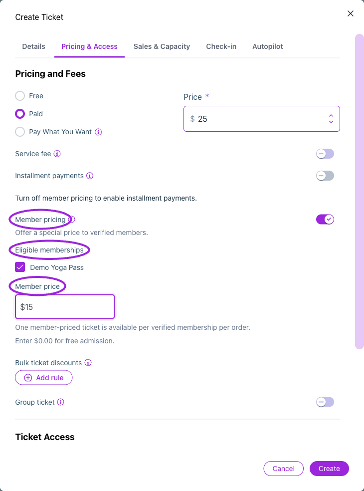
</Frame>

Under **Who can purchase this ticket?**, choose **Everyone** or **Members only**. For Members only, select the eligible active membership programs. Under **Member Pricing**, enable **Offer members a special price**, select eligible memberships, and enter the member price (0 for a free ticket).

These controls are independent. See [members-only tickets and member pricing](../memberships/ticket-access-and-pricing) for the one-ticket-per-verified-membership pricing limit and test cases.

## Pricing and Fees

<Frame caption="Service fee reveals a Custom Service Fee for this ticket. Review how the resulting total appears at checkout.">
  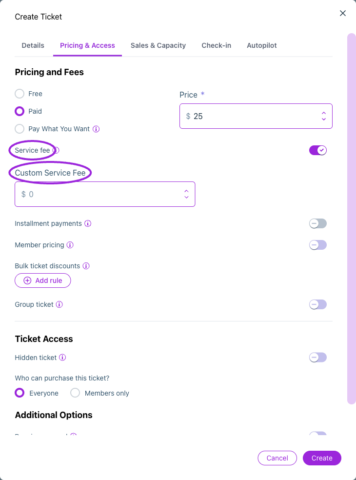
</Frame>

<Frame caption="Pay What You Want lets buyers choose an amount and supports a Minimum Price.">
  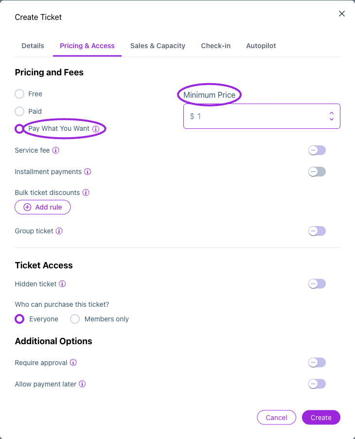
</Frame>

<Frame caption="Pricing &amp; Access offers Free, Paid, and Pay What You Want. A paid ticket has a fixed price, with service fees configured separately.">
  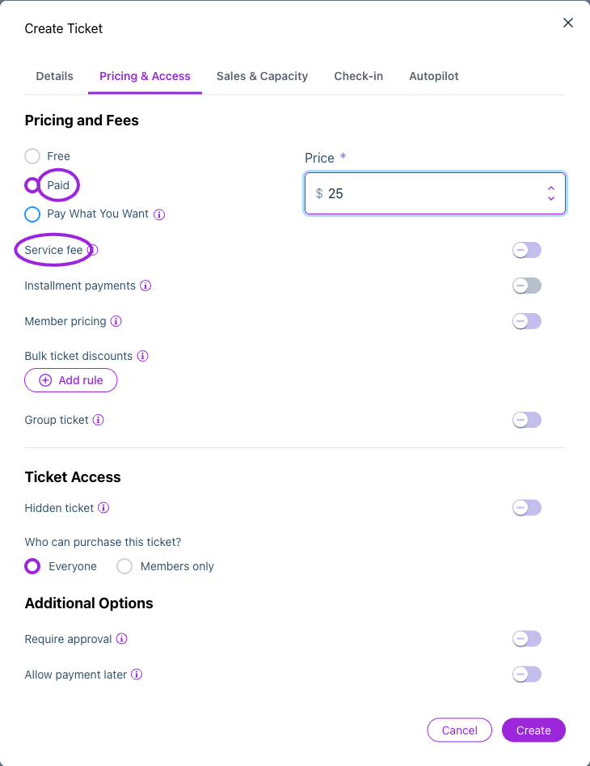
</Frame>

Choose how you want to charge for this ticket:

### Free  

Select this option if you would like your attendees to register for the event at no cost.

### Paid  

This option activates the **Price** field, which allows you to define the ticket cost that attendees will pay for registering for the event.

### Pay What You Want  

When you select this option, attendees have the flexibility to decide how much they wish to pay.  
Additionally, you can specify a minimum amount in the **Minimum Price** field.  
For example, if you set the minimum price to 30, attendees can choose to pay 30 or any higher amount.

For Shopify, follow the [pay-what-you-want checkout instructions](/plugins/shopify-ticket-selector#pay-what-you-want-tickets-on-shopify), including its supported ticket combinations and payment-confirmation requirements.

### Enable Service Fee  

Toggle this option ON to apply a custom booking fee to each ticket. When enabled, the **Custom Service Fee** field becomes active, allowing you to enter a fixed amount. The specified fee will then be added to the ticket price.

## Bulk Ticket Discounts (Volume Discount Pricing)

<Frame caption="Add a bulk pricing rule: this example changes the unit ticket price to $20 when the quantity reaches five tickets.">
  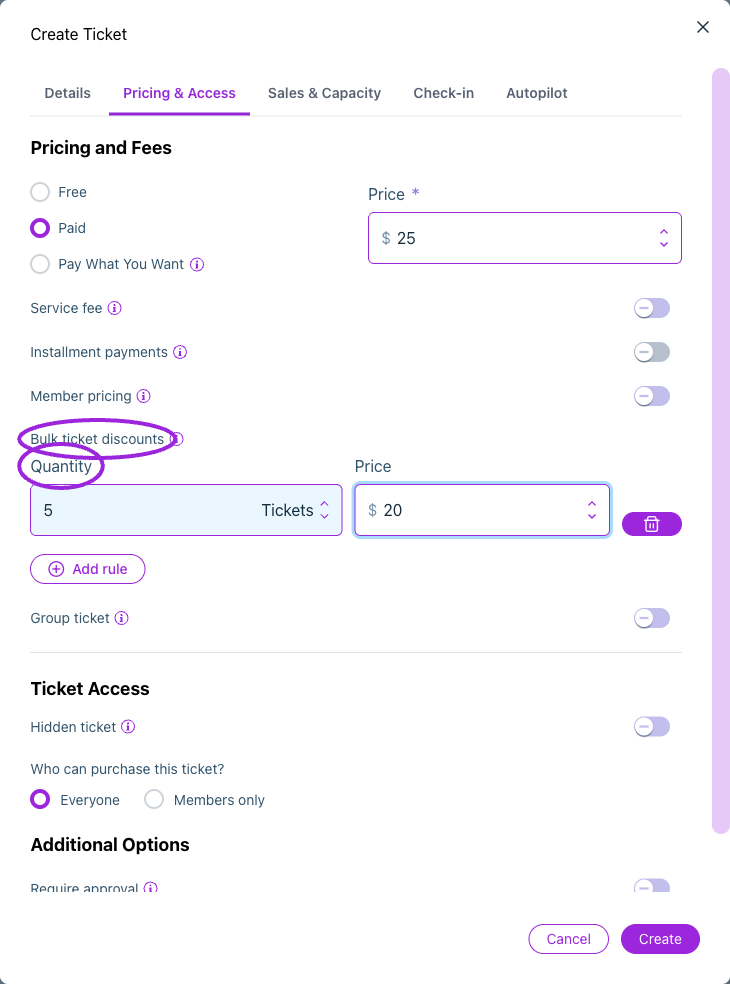
</Frame>

Use this section to define pricing rules for bulk ticket purchases. Click the **Add rule** button to create custom quantity and price pairs. For instance, if 1–4 tickets are priced at 50 each, you can add a rule to set the price at 45 each when 5 or more tickets are purchased.

>**INFO:** Add more rules anytime using **Add rule**, or remove them using the Trash icon.
## Group Ticket Settings

<Frame caption="A group ticket bundles quantities of saved ticket types. This example includes two Standard tickets.">
  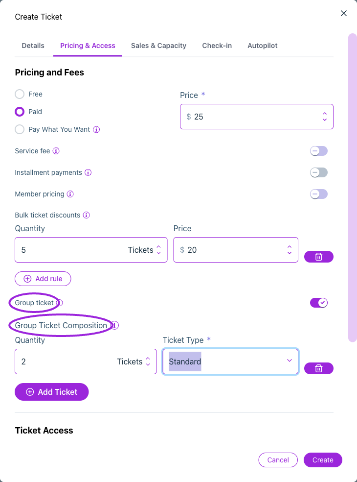
</Frame>

This section lets you bundle multiple ticket types together under one group ticket — ideal for family packages, team passes, or combo offers that include different ticket types at a single price.

### Enable Group Ticket  

Enable this toggle to create a bundled ticket that includes multiple tickets of different types. Attendees will receive the individual tickets within the group rather than a single group ticket.

### Group Ticket Composition 

After enabling **Group ticket**, use this section to define what the group includes by clicking on the **Add Ticket** button.

Specify the **Quantity** and select the **Ticket Type** from the dropdown (previously created tickets).

> **INFO:** You can similarly add additional tickets at any time by clicking the **Add Ticket** button, or remove existing ones whenever needed by clicking the **Trash** icon
## Sales and Capacity Settings

<Frame caption="Set ticket inventory separately from the minimum and maximum quantity in each order.">
  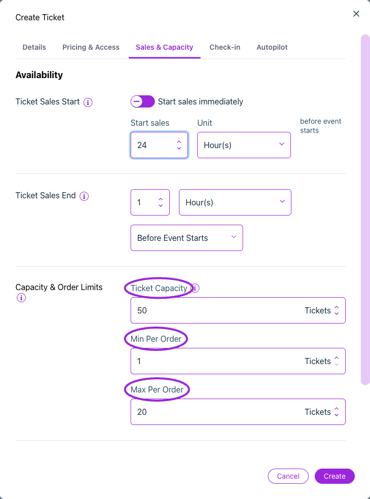
</Frame>

<Frame caption="This example opens sales 24 hours before the event and closes them one hour before it starts. Start sales immediately removes the opening offset.">
  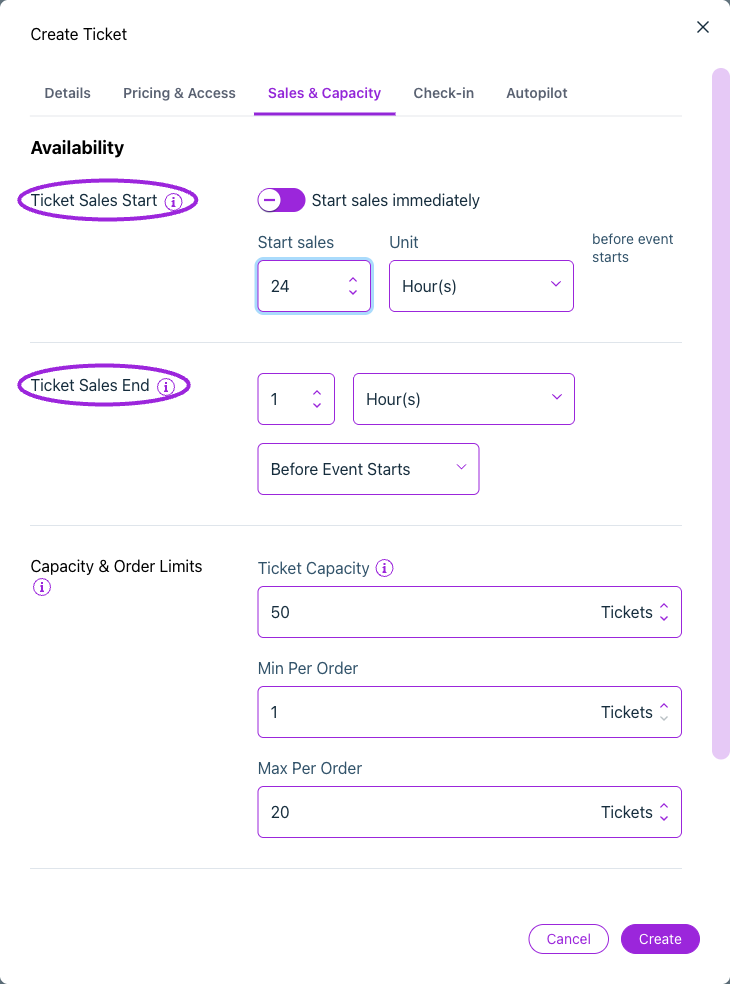
</Frame>

This section helps you control when your tickets go on sale, when they stop selling, and how many can be sold — ensuring you stay within your event’s capacity limits and manage ticket availability effectively.

### Ticket Sales Start  

Set when ticket sales should begin relative to the event’s start time.

- Specify a value in **days, hours, or minutes** before the event.

- Alternatively, turn **Start sales immediately** **ON** to start sales instantly, which disables manual input.

### Ticket Sales End  

Set when ticket sales should stop, either before the event starts or before it ends.

- Specify a time offset using days, hours, or minutes according to your event’s requirements.

### Ticket Capacity 

Define how many tickets can be sold for this type. You can also set:

- **Min Per Order:** Minimum number of tickets a buyer must purchase.  
- **Max Per Order:** Maximum number of tickets per purchase.

## Required Ticket

<Frame caption="Require a minimum quantity of another ticket in the same order. This example requires one Standard ticket.">
  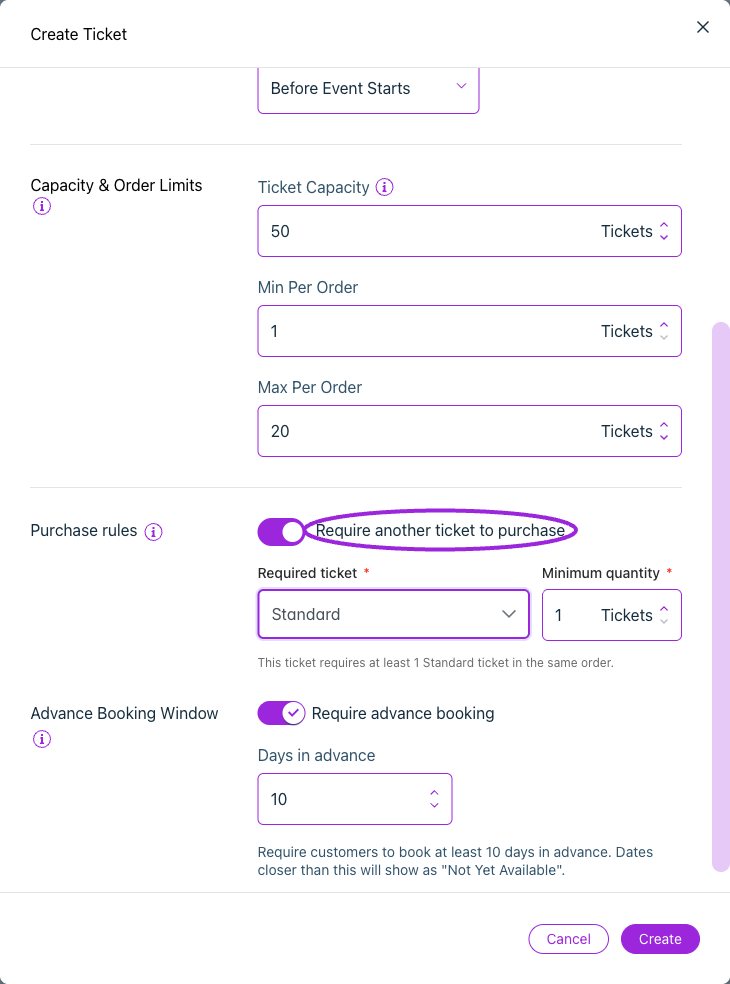
</Frame>

Use **Required Ticket** to require a minimum quantity of another ticket **in the same order**. For example, a Child ticket can require at least one Adult ticket.

1. Create and save the prerequisite ticket first, such as **Adult**.
2. Create or edit the dependent ticket, such as **Child**.
3. In **Required Ticket**, enable **Require another ticket to purchase**.
4. Choose the prerequisite under **Required ticket**. Only other saved tickets are offered; a ticket cannot require itself.
5. Set **Minimum quantity** to a whole number of at least 1.
6. Read the summary, such as “This ticket requires at least 1 Adult ticket in the same order.”
7. Save the ticket and update the event.

This is an order minimum, not a ratio: requiring 1 Adult does not mean 1 Adult for every Child. It does not automatically add the prerequisite ticket. **Min Per Order** controls the quantity of the ticket being edited; Required Ticket controls another ticket. A **Group Ticket** bundles component tickets instead.

Test an order containing only the Child ticket, then an order with the required Adult quantity. Also remove the Adult ticket from the test order and check the validation. Keep the prerequisite available during the dependent ticket's sales window, with enough capacity and compatible access rules.

Required Ticket is available on Business and higher. If the dropdown has no choices, save another ticket first.

## Advance Purchase Window

<Frame caption="Require advance booking sets the minimum number of days before the event when this ticket can be bought.">
  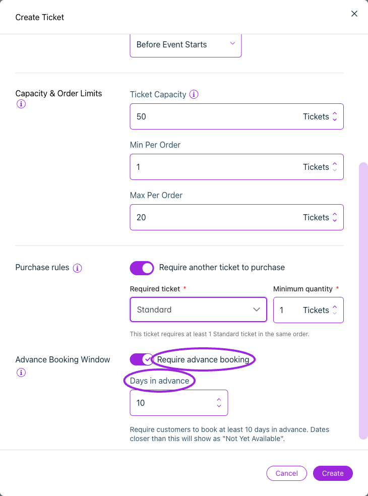
</Frame>

In **Sales & Capacity**, enable **Require advance booking** and enter **Days in advance** to require booking at least that many days before an event. This is a minimum booking lead time, not the maximum distance into the future a customer can book.

For example, 10 days means dates closer than 10 days are unavailable for purchase. Check the date picker around the cutoff before promoting it, and review the event timezone and other sales-window settings.

## Check-In Timing Controls

<Frame caption="Delayed entry opens check-in after the event starts. If both opening rules are enabled, delayed entry takes priority.">
  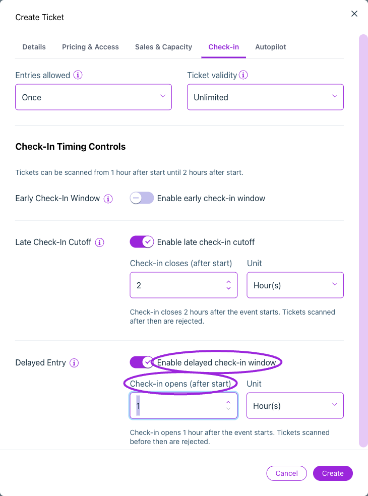
</Frame>

<Frame caption="Set the opening time before the event and the cutoff after it starts. A cutoff alone does not prevent early scans.">
  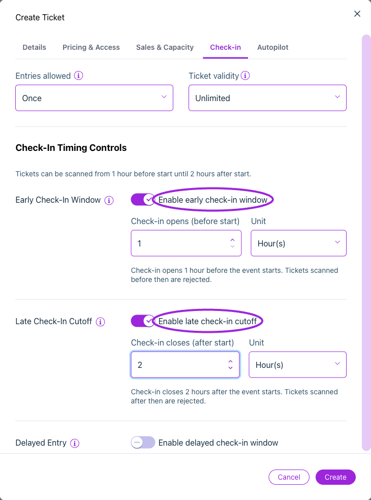
</Frame>

<Frame caption="Control how many times a ticket can be scanned and its validity after purchase.">
  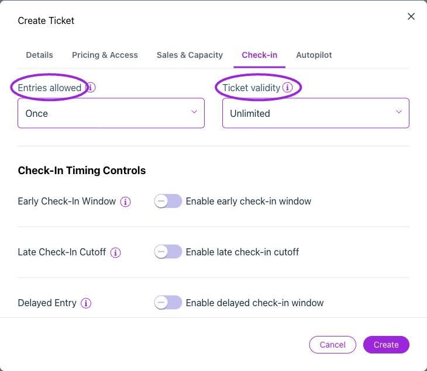
</Frame>

These settings control scanning, independently of when a ticket can be purchased. They are available on Business and higher.

| Control | Fields and effect | Example for an 18:00 start |
|---|---|---|
| **Early Check-In Window** | Enable, set **Check-in opens (before start)** and **Unit**. Controls the earliest scan before the event starts. | 1 hour opens check-in at 17:00. |
| **Late Check-In Cutoff** | Enable, set **Check-in closes (after start)** and **Unit**. Controls when admission closes after the start. | 2 hours closes check-in at 20:00. |
| **Delayed Check-In Window** | Enable, set **Check-in opens (after start)** and **Unit**. Opens admission after the event has started. | 30 minutes opens check-in at 18:30. |

Delayed Check-In takes priority over Early Check-In if both are enabled. Do not set a closing time earlier than the effective opening time. Review the editor's scan-window summary and test before, inside, and after the permitted window. **Entries allowed** and **Ticket Validity Period** remain separate constraints. Entries allowed is the scan limit (0 means unlimited); validity can be Unlimited, One Day, One Week, One Month, or One Year after purchase.

## Approval & Payment Settings

<Frame caption="Require approval controls pending registration; Allow payment later provides the later-payment option.">
  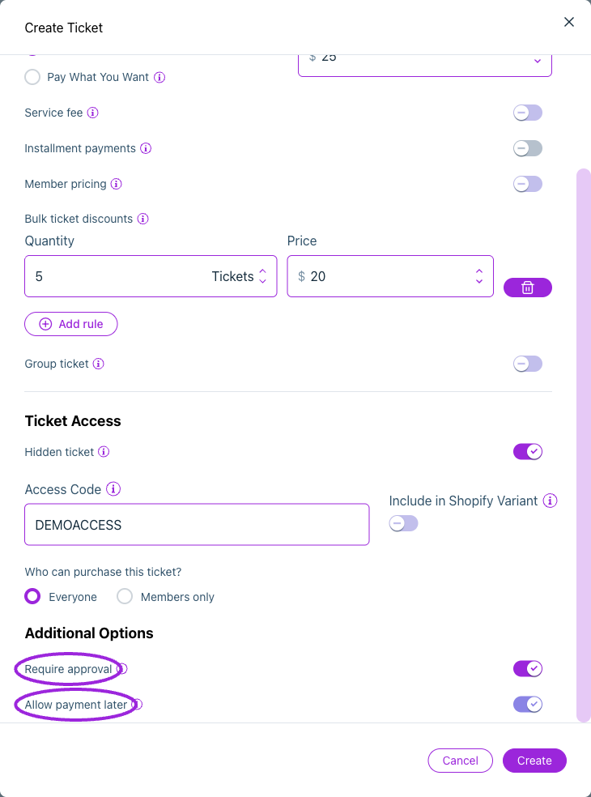
</Frame>

This section allows you to control how registrations are approved and when payments are collected — giving you more flexibility in managing attendees and payment timing.

### Require Approval  

Enable this option if you want to manually approve registrations before confirming attendance.
Attendees will appear as **Pending** until approved, which applies to both free and paid tickets.

### Allow Payment Later  

Toggle this **ON** to let approved guests complete their payments at a later time.
Ideal for corporate or sponsor-based registrations where payment is collected post-approval.

## Autopilot

<Frame caption="An Autopilot rule combines timing relative to the event with an action. Review the resulting timeline before saving.">
  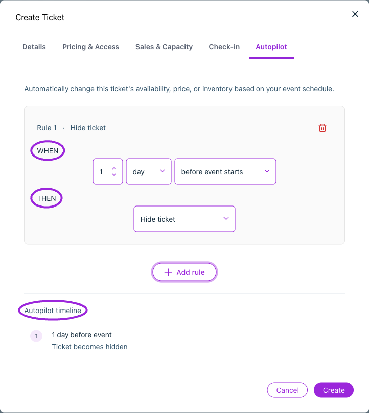
</Frame>

<Frame caption="Autopilot can hide or show a ticket, change its price, or change its inventory.">
  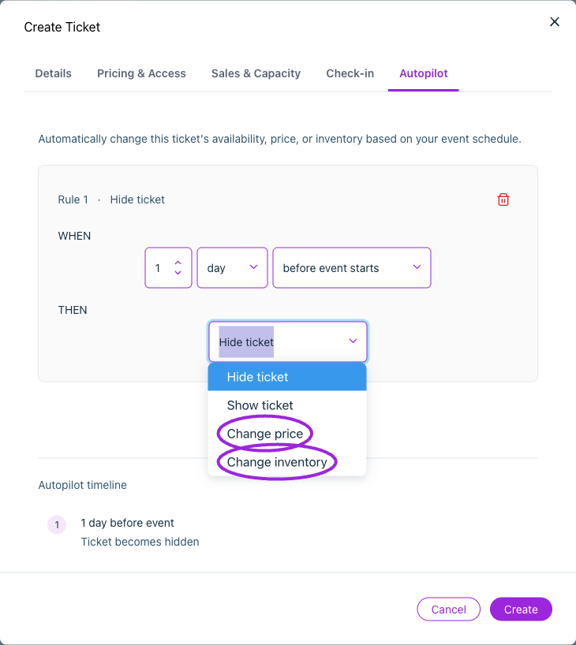
</Frame>

The Autopilot tab allows you to create automated rules that modify ticket properties based on time triggers relative to your event’s start or end time. Rules can hide or show a ticket, change its price, or change its inventory.

### How It Works

Click the **Add rule** button to create your first automation rule.

Each rule defines when and how a ticket property should change, using time-based conditions and actions.

| S.no | Field | Description |
|------|--------|-------------|
| 1 | **Enabled** | Shown for saved rules. Turn a rule on or off; disabled rules remain saved but inactive. |
| 2 | **Trigger Value** | Set the numerical trigger value (e.g., 1). |
| 3 | **Unit** | Choose Minutes, Hours, or Days. |
| 4 | **Timing** | Select Before Event Starts or Before Event Ends. |
| 5 | **Action** | Choose Hide ticket, Show ticket, Change price, or Change inventory. The current editor combines the action type and action choice. |
| 6 | **New value** | Enter the new amount for Change price or Change inventory. Hide/Show needs no amount. |

>**INFO:** You can similarly add additional rules at any time by clicking the **Add rule** button, or remove existing ones whenever needed by clicking the **Trash** icon.
Click on the **Create** button to proceed. Your ticket will be created successfully.

## Manage Tickets

<Frame caption="Compare inventory, sold tickets, and what remains available to sell. The row controls edit, duplicate, and delete; the left handle changes order.">
  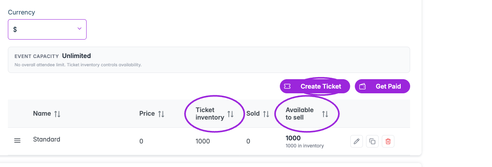
</Frame>

The saved ticket table shows **Name**, **Price**, **Ticket inventory**, **Sold**, **Available to sell**, status, and row actions. **Available to sell** can be lower than inventory because event capacity is shared across ticket types. A group ticket uses the number of attendee spots in its composition; the table shows that requirement when applicable.

The **Event capacity** panel shows used and remaining attendee spots, or **Unlimited**. Sales stop when a ticket's inventory or the overall event capacity is reached. Status messages distinguish **Ticket sold out**, **Event at capacity**, and **Unavailable**.

- Use the pencil to **Edit ticket**.
- Use **Duplicate ticket** to create a similar offer, then review its name, price, inventory, dates, and restrictions.
- Drag the row handle to change ticket order. Sorting a column changes the table view; dragging changes the saved order.
- **Delete ticket** opens **Confirm Delete**. **No** keeps the ticket; **Yes** confirms removal. Do not use deletion to handle a paid attendee refund.

<Accordion title="Delete confirmation">

<Frame caption="Delete ticket asks for confirmation. Choose No to keep the ticket; this example was canceled.">
  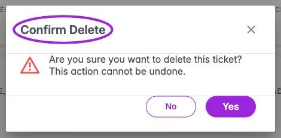
</Frame>

</Accordion>

Saving the main ticket editor creates or updates the ticket immediately. The event's other unsaved fields have a separate Save action. If the ticket saves but its seat-category update fails, retry and verify the category mappings before selling it.

## Promo Codes

Promo Codes allow you to offer **discounts or special pricing** to your attendees. You can create limited-time offers, early-bird discounts, or group incentives to drive more ticket sales and reward specific audiences.

To create a new promo code, click **Create Promo Code**.

## Promo Code Setup Fields

<Frame caption="Set the code name, percentage or fixed discount, eligible tickets and total discounted-ticket limit. This example limits DEMO10 to 100 discounted Standard tickets.">
  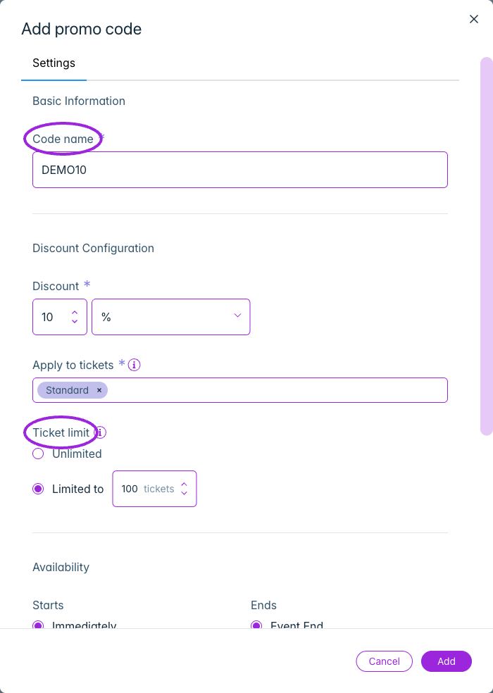
</Frame>

| Control | What it does |
|---|---|
| **Code name** | The code the buyer enters. |
| **Discount** | Choose a percentage or fixed amount using the adjacent selector. |
| **Apply to tickets** | Choose the eligible ticket types for an event-specific code. |
| **Ticket limit** | **Unlimited** or **Limited to** a total number of discounted tickets. |
| **Starts** | **Immediately** or **Schedule** a date and time. |
| **Ends** | **Event End** or **Schedule** a date and time. |
| **Multi-Event Code** | Apply across all current and future events. The ticket-specific picker is hidden when enabled. |
| **Volume Discounts** | Require a **Minimum Quantity** before the promo discount applies. |
| **Sync with Shopify** | Create and maintain a matching discount code in the connected Shopify store. |

Choose **Add** to create the code. Advanced controls depend on the site's plan. A promo code is separate from a hidden ticket's access code; enable the appropriate buyer input in [Checkout settings](../branding-and-design/checkout-settings).

<Accordion title="Scheduling, volume discounts and multi-event codes">

<Frame caption="Choose Immediately or Schedule for the start, and Event End or Schedule for the end. A scheduled code has its own start and end date/time.">
  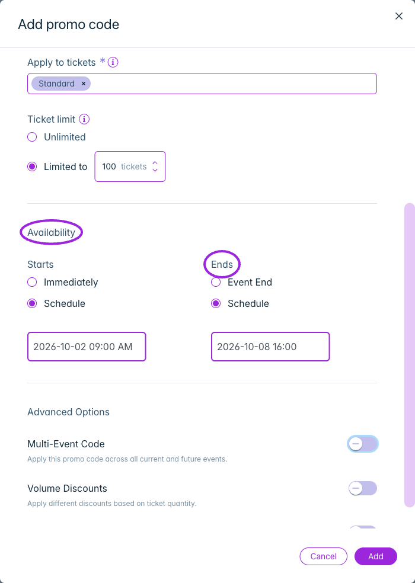
</Frame>

<Frame caption="Volume Discounts adds a minimum ticket quantity. Multi-Event Code applies to current and future events; Sync with Shopify creates and maintains a matching Shopify discount code.">
  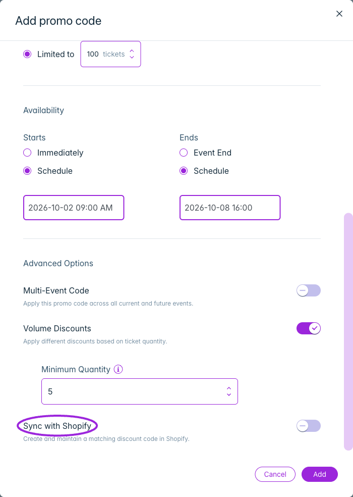
</Frame>

<Frame caption="Multi-Event Code applies across current and future events. Its ticket-specific picker is hidden while this site-wide option is enabled.">
  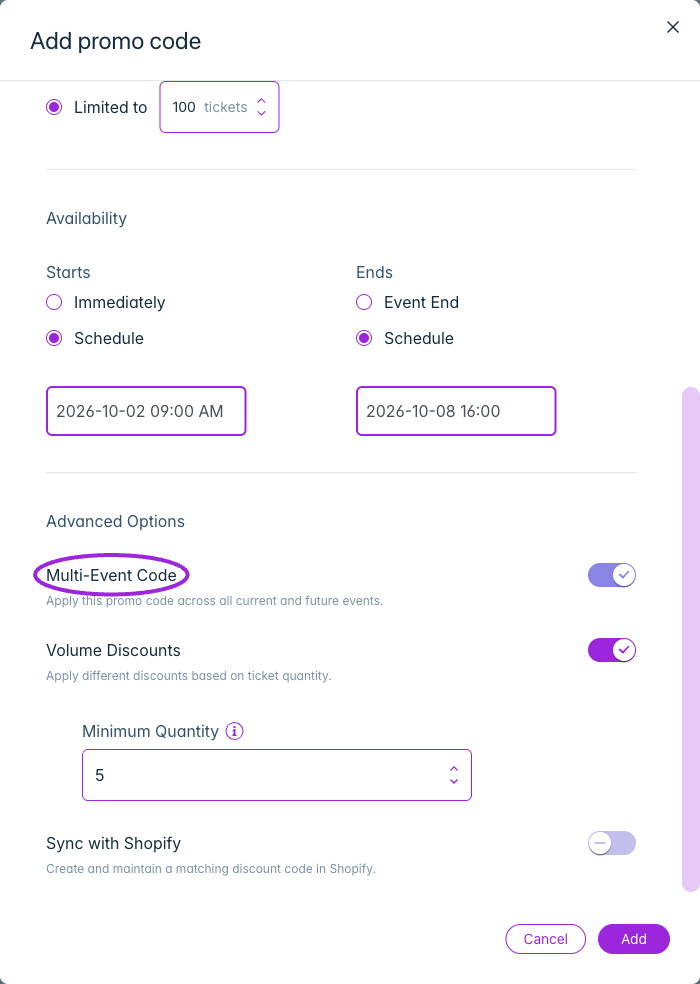
</Frame>

</Accordion>

## Manage Promo Codes

<Frame caption="The promo list offers copy, usage, edit and delete actions. Open the editor to verify the saved schedule; Import from Shopify opens the connected-store import workflow.">
  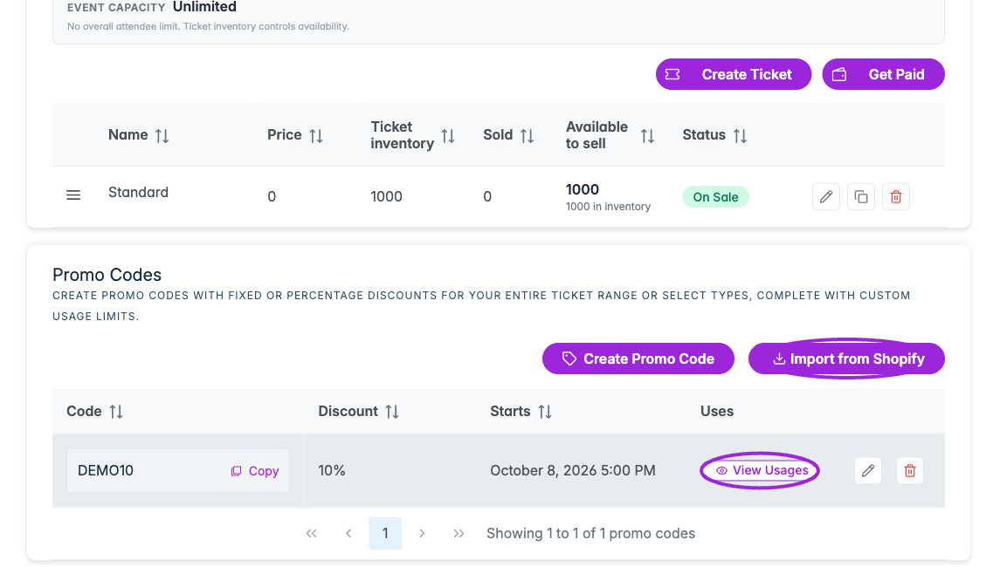
</Frame>

After creating promo codes, you can manage them directly from the **Promo Codes** list.
You can **copy, view usage, edit**, or **delete** any existing promo code — helping you stay organized and monitor how your discounts are performing.

| Action | Description |
|--------|-------------|
| **Copy Promo Code** | Quickly copy the code to your clipboard for sharing. |
| **View Usages** | Check how often the promo has been used. |
| **Edit Promo Code** | Modify any promo code details. |
| **Delete Promo Code** | Permanently delete a promo code (cannot be recovered). |

## Verify the complete ticket flow

After saving the ticket and event, test the public purchase experience. Check the ticket name/image, price and service fee, sales window, min/max quantity, access code, Required Ticket validation, and any membership rules you configured. Then inspect delivery and check-in with a test attendee.

Ticket images accept image files up to 5 MB each. Add multiple images for a rotating display. A disabled field may reflect ticket type or plan eligibility rather than a missing feature.

See [all event creation steps](./create-event-overview), [tracking links](./tracking-links), and [ticket/pass design](../branding-and-design/tickets-and-passes).

## Payment plans

Keep ticket pricing in **Tickets** and configure installment schedules in **Payment Plans**. Assign a reusable equal-split or percentage template in the event’s **Payment Plan** step, then include all supported paid tickets or selected ticket types. Buyers can pay in full or use the eligible plan when its payments finish before the event. See [payment plan setup](/event-management/installment-payments).

## Related workflows

- [Stripe installment setup and collection](/event-management/installment-payments)
- [Seating charts and ticket categories](/seating-charts/create-and-assign)
- [Timed entry and passes](/event-management/timed-entry-and-passes)
- [Registration waivers](/event-management/waivers)

## Shopify customer-tag discounts

<Frame caption="Open a saved promo’s Shopify Tags tab. Enter an exact customer tag, including capitalization, and Add Tag to map that customer group to the promo. This example has not added the tag.">
  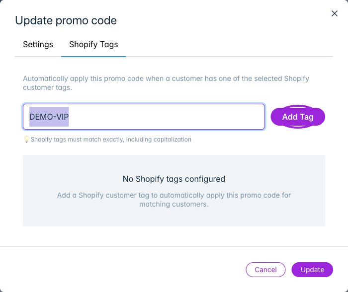
</Frame>

Create and save the promo code first. Edit the saved code, open **Shopify Tags**, enter the exact customer tag and select **Add Tag**. Tags must match capitalization. A matching customer can receive that promo automatically at checkout. Remove a mapping with its tag remove control, and test a signed-in customer with and without the tag. This is a promo rule, separate from event tags and widget filtering.
