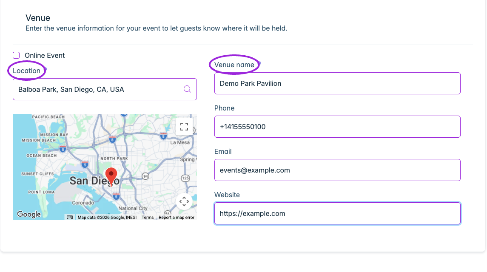
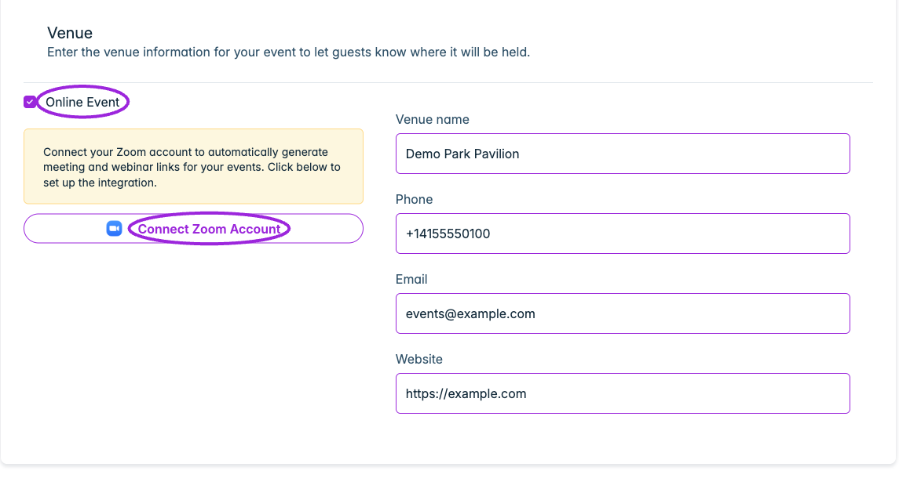

Open **Events → Edit event → Venue & Location** to configure where the event takes place.

## In-person events

Leave **Online Event** unchecked. Search **Location**, select the correct address suggestion, and verify the resulting map pin. Enter the required **Venue name** and add optional **Phone**, **Email**, and **Website** details for attendee support. **Save** the event, then check the location on its public page and ticket.

<Frame caption="Select the venue address from Location suggestions and verify the map. Add the venue name and optional phone, email, and website, then save the event.">
  
</Frame>

Selecting an address suggestion supplies the structured map location; typing a venue name alone does not confirm the map pin.

## Online events

Check **Online Event**. The address and map are replaced by online meeting controls. If Zoom is not connected, use **Connect Zoom Account** to set up the [Zoom integration](../integrations/zoom), then return to configure the meeting or webinar. Venue name and contact fields remain available, but a venue name is not required for an online event.

<Frame caption="Online Event replaces the address/map with Zoom connection controls. Connect a Zoom account to configure an online meeting; the Demo account shown is not connected.">
  
</Frame>

Save the event and verify that attendees receive the intended joining details in their event information and communications. The connection screen above shows the unconnected state; Zoom account screens remain a separate setup step.
