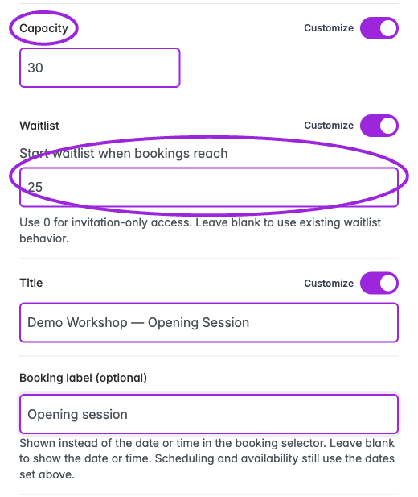

A waitlist collects interested guests and lets you invite selected people to purchase. Joining is not a completed booking or guaranteed admission.

## What the buyer sees

When the configured trigger or invitation-only threshold is reached, an affected ticket offers **Add to Waitlist**. The form collects contact details and applicable questions. **Back** returns without joining; submitting the form adds a waitlist entry rather than a ticket purchase.

<Frame caption="At the invitation-only threshold, the ticket offers Add to Waitlist.">
  
</Frame>

<Frame caption="Contact details are collected before the buyer submits the waitlist form.">
  
</Frame>

## When does the waitlist start?

You can offer a waitlist when tickets sell out, when the event reaches capacity, or when bookings reach a limit you choose. The **Start waitlist when bookings reach** field is the waitlist's “start at” setting: it is a number of attendee places, **not a start date or time**.

For example, an event with capacity **50** can start its waitlist at **40**. Public bookings can use the first 40 places; further purchases require a valid waitlist invitation and must still fit within the total capacity of 50. Set **0** for invitation-only purchasing from the start.

Follow [the threshold setup below](#invitation-only-purchasing-within-event-capacity). For a Shopify product page, use the [Ticket Selector](../plugins/shopify-ticket-selector#waitlists-on-shopify) so customers can join the waitlist and use their invitation links.

## Open and enable a waitlist

1. Open **Events**, edit the ticketed or RSVP event, and select **Waitlist**.
2. Turn on **Enable Waitlist** in **Settings**.
3. Configure the triggers, wording, and capacity behavior below.
4. Save the event. Use **Subscribers** to manage the queue. Shared waitlist email templates are under **Design → Attendee Communication**.

The waitlist step is not used for Display Only or external-registration events. For a series, check the parent configuration and any [date-specific overrides](./day-specific-tickets).

## Settings

<Frame caption="Customize the waitlist button, description, and on-screen confirmation. The confirmation message shown here is separate from an email.">
  
</Frame>

<Frame caption="Enable Waitlist, then choose whether sold-out tickets or event capacity should show the waitlist. Invitation-only capacity controls require an event capacity.">
  
</Frame>

| Option | Effect |
|---|---|
| **Enable Waitlist** | Enables the event's waitlist. |
| **Tickets are sold out** | Offers a waitlist for sold-out tickets. This is not limited to the point when every ticket type has sold out. |
| **Event reaches capacity** | Offers a waitlist when the event's total capacity is exhausted. |
| **Call to Action** | Text for joining, such as “Join Waitlist”. |
| **Description** | Explanation shown to someone considering joining. |
| **Confirmation Message** | On-screen message after joining. This is separate from the confirmation email. |
| **Limit waitlist purchases to event capacity** | Enables invitation-only purchasing with a fixed event-capacity ceiling. Requires a finite event capacity. |
| **Start waitlist when bookings reach** | Number of booked attendees after which further purchases need a valid invitation. Use a whole number from 0 through the event capacity. |

Use the personalization picker where provided instead of guessing token syntax. Registration questions appear on the waitlist unless their **Exclude from Waitlist** setting is enabled under [Additional Info](./additional-information).

## Invitation-only purchasing within event capacity

1. In **Event Details → Event Capacity**, turn off unlimited capacity and set the maximum number of attendees.
2. In **Waitlist → Settings**, turn on **Enable Waitlist** and **Limit waitlist purchases to event capacity**.
3. Set **Start waitlist when bookings reach** to a whole number from **0** through the event capacity. Enabling the capacity switch initially sets this to **0**, so choose the intended value before saving.
4. Save the event, then check the public booking page and an invited checkout.

<Frame caption="Start immediately: 0 requires a waitlist invitation from the first booking. The overall capacity is still 50.">
  
</Frame>

<Frame caption="Start after public bookings: 40 lets the public book 40 places; invited guests can then book within the total capacity of 50.">
  
</Frame>

| Start setting with capacity 50 | Result |
|---|---|
| **0** | A valid waitlist invitation is required from the beginning. |
| **40** | Public bookings can fill the first 40 places. Further purchases need a valid invitation, within the overall capacity of 50. |
| **50** | Public bookings can use the entire capacity. An invitation does not create an extra place beyond 50. |

The threshold counts **places used from event capacity**, not orders or people on the waitlist. Group tickets and tickets configured to use several places count accordingly. A public purchase cannot cross the threshold: with 39 places used and a threshold of 40, only one more place is available without an invitation.

Invitations do not increase event capacity in this mode. Ticket availability and the invitation's ticket/quantity restrictions still apply. Joining the waitlist does not itself reserve a place or send a purchase invitation; manage those invitations under **Subscribers**.

### Set a different start value for a date or time slot

For a repeating event, open the date or time slot's drawer, find **Waitlist**, enable its customization, and set **Start waitlist when bookings reach**. The value must fit that occurrence's effective capacity. **0** means invitation-only from the start; leaving the custom field blank uses the existing waitlist behavior. Turning customization off restores the inherited value.

<Frame caption="This unsaved example gives one date capacity 30 and a waitlist start value of 25.">
  
</Frame>

See [date-specific settings](./day-specific-tickets#date-overrides) for the drawer workflow.

### Turn off the threshold

Turn off **Limit waitlist purchases to event capacity** to remove the start threshold. The other enabled sold-out/capacity waitlist triggers can still apply. Before changing the event to unlimited capacity, turn off this option, then change **Event Details → Unlimited attendee capacity** and save. Reconcile outstanding orders and reservations before reducing an existing capacity; the application can reject a reduction.

Older waitlist release flows can make additional inventory available. Keep the fixed-capacity option enabled when invitations must stay within a firm venue limit.

## Use a waitlist on Shopify

Use the **Ticket Selector** on the Shopify product's assigned template for waitlist signup and invitation-based purchasing. The normal Shopify variant picker does not provide Ticket Spot's waitlist form or invitation flow.

Configure the waitlist and its start threshold in Ticket Spot, then follow [Shopify Ticket Selector setup](../plugins/shopify-ticket-selector#waitlists-on-shopify). When inviting guests to the product page, choose **Purchase from Event Page → Use Shopify Product URL** in **Notify Guests** and keep each guest's full personalized invitation link intact. See the [Shopify waitlist FAQ](../plugins/shopify-ticketing-faq#can-i-use-a-waitlist-for-event-tickets-on-shopify).

## Communications

<Frame caption="Select Waitlist Confirmation in Design → Attendee Communication to configure this template’s wording and display options.">
  
</Frame>

<Frame caption="Choose Waitlist Ticket Released in Design → Attendee Communication to customize this template’s wording and display settings.">
  
</Frame>

The current Waitlist screen has **Settings** and **Subscribers** tabs. Configure shared email appearance and text in **Design → Attendee Communication**:

- **Waitlist Confirmation** supplies the confirmation after joining.
- **Waitlist Ticket Released** supplies the invitation when a spot becomes available.
- **Customize Email Template** in the invitation dialog opens the release template.

The on-screen **Confirmation Message** in Waitlist Settings is separate from an email. For per-language defaults and overrides, see [multilingual emails and tickets](../branding-and-design/multilingual-communications).

The current manual notification flow creates access links valid for **48 hours**. The invitation deadline and a Shopify inventory hold are separate. A queued message is not proof of delivery; review the attendee's email activity when investigating a missing message.

## Subscribers and notification status

<Frame caption="The subscriber filter separates notified and not-notified guests. Inspect each row for the current invitation status.">
  
</Frame>

<Frame caption="Subscribers lists waitlisted guests and their notification status. This synthetic Demo entry is Pending; select it before opening Notify Guests.">
  
</Frame>

Open **Subscribers** to see ticket availability, email, ticket type, waitlist status, and the date added. Search by email or ticket, filter by notification status, and select the guests you want to contact.

**Notify Guests** opens the invitation dialog. You can notify up to **500 selected attendees** in one request. Guests who are no longer waitlisted or have already purchased are skipped. The result reports **queued**, **skipped**, and **failed** counts. A **Notified** state records notification processing; it does not mean the guest purchased or read the email.

Use the row's delete action and confirm only when you intend to remove that subscriber from the waitlist.

## Send an event or product-page invitation

1. Select waitlist guests and click **Notify Guests**.
2. On Shopify, choose **Purchase from Event Page**.
3. Enter **Destination URL**, or use **Use Event Page URL** / **Use Shopify Product URL**. Leaving it blank uses the event page when available. A valid event or product URL is required.
4. Optionally set **Ticket Restriction** to one ticket type. Leave it clear to allow available tickets permitted by the invitation and event.
5. Set **Maximum Quantity Per Person** from **1–100**; the initial value is 1. This is the invitation's ticket quantity limit, not extra event capacity.
6. Review the email with **Customize Email Template**, then return and select **Send Notification** when ready.
7. Review queued/skipped/failed counts, then check a test recipient's complete link and checkout.

<Frame caption="Review the destination, optional ticket restriction, and invitation quantity. This preview has not been sent.">
  
</Frame>

For ticket-restricted invitations spanning different events, notify each event separately. Keep the full personalized access link intact. Do not replace it with a plain event URL, since that removes the invitation information.

## Private Shopify invoices

For Shopify sites, **Private Shopify Invoice** is an alternative to the ordinary page link.

1. Publish the event and ensure the selected ticket is synced to a Shopify variant.
2. Select waitlist guests, open **Notify Guests**, and choose **Private Shopify Invoice**.
3. Select **Ticket Type**; this is required.
4. Set **Quantity Per Invoice** from **1–100**; the initial value is 1.
5. Select **Send Private Invoice Access** and review the result.

<Frame caption="The invoice setup requires a ticket type. This Demo preview has no ticket options, so Send Private Invoice Access remains disabled.">
  
</Frame>

If **Select Ticket** has no available options, do not send an invoice invitation. Confirm the event and ticket synchronization and retry loading the dialog; contact support if a saved, synced ticket is still missing.

In the legacy release flow, the email gives the customer a private access link. Opening it creates the Shopify draft order and redirects to its invoice; the requested inventory hold is **30 minutes from that click**, not from sending the email. This flow can increase inventory for a sold-out ticket and consumes the access token when the invoice is created. If the ticket mapping is missing or draft-order creation fails, the customer may be sent to the product page instead.

**When “Limit waitlist purchases to event capacity” is on, the current flow uses capacity-checked event/product checkout even if Private Shopify Invoice was selected.** It does not create a legacy invoice that increases inventory. Test this path with the [Ticket Selector](../plugins/shopify-ticket-selector) before inviting customers.

## Verify before inviting a large group

Test public access before and after the threshold, a valid invitation, a wrong ticket type, a quantity over the invitation limit, an expired link, and a full event. For a series, test two dates and any overridden day. Verify the completed order and attendee record; selecting a seat or receiving an invitation is not a purchase.

If someone cannot purchase, check capacity, ticket availability and sales windows, the selected date, ticket restriction, invitation quantity, expiration, and Shopify synchronization. Do not assume expired invitations automatically invite the next person.
