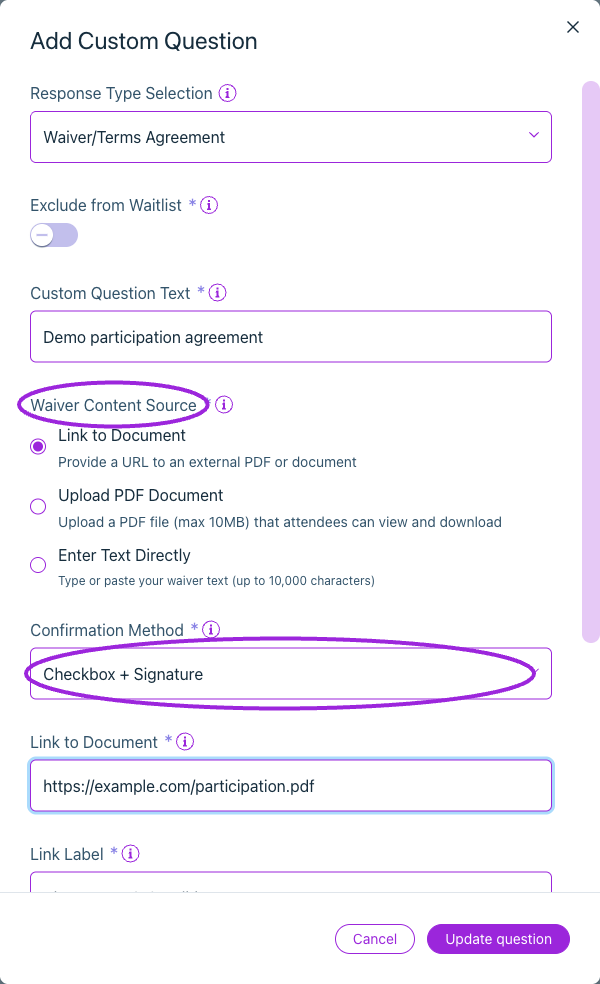
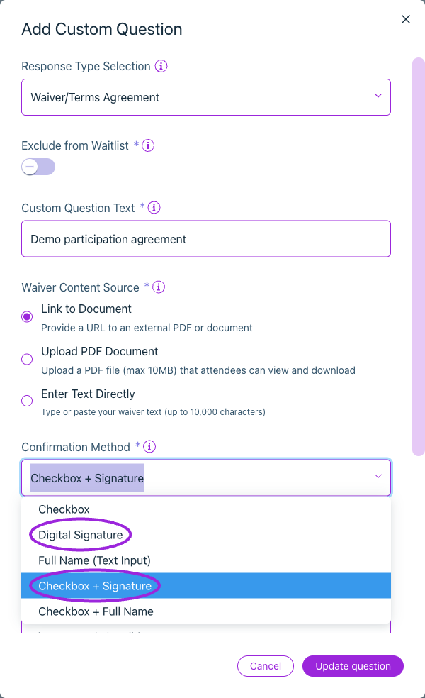
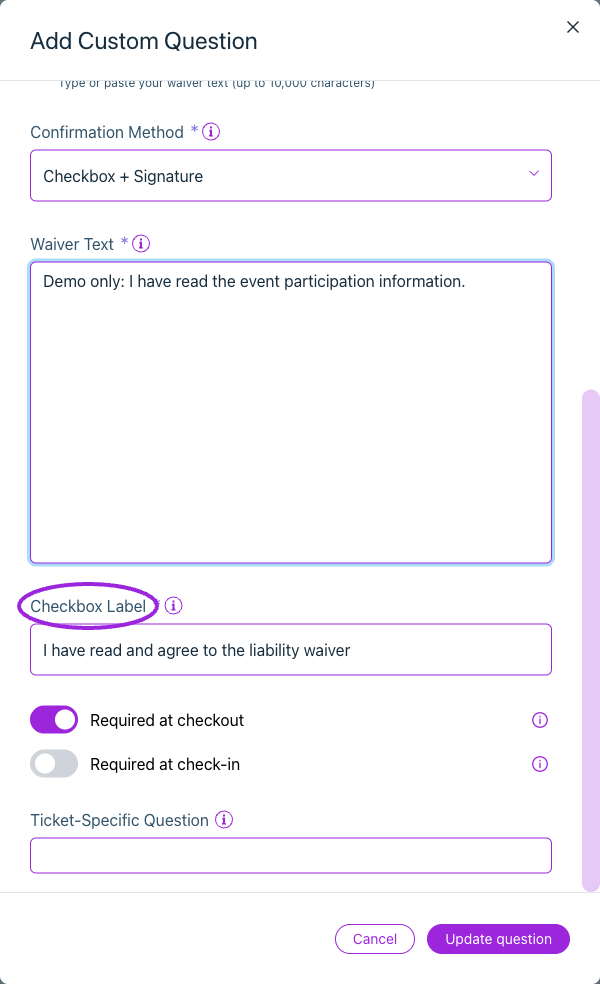
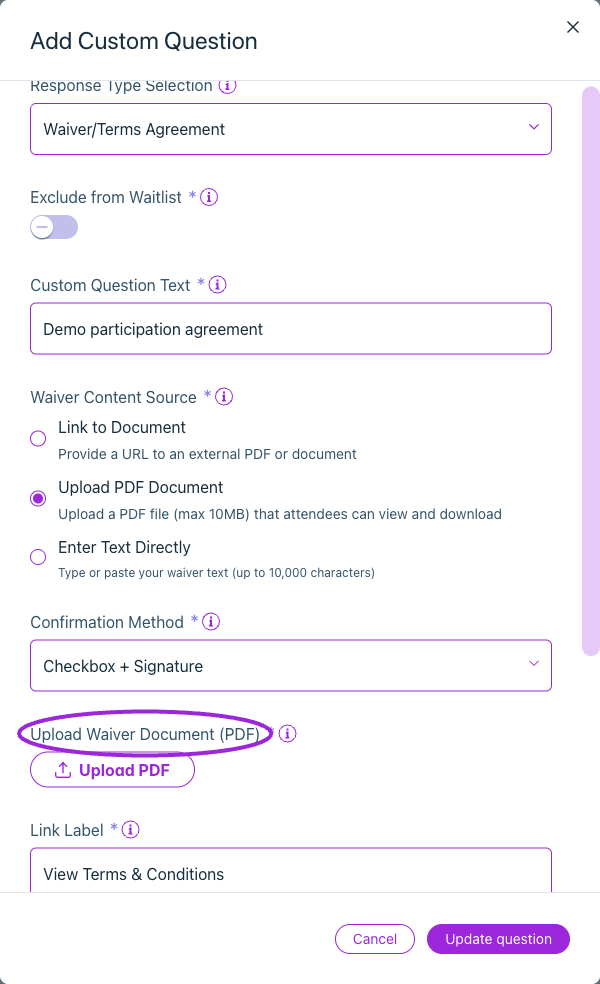

Use **Additional Information** in the event editor to collect an agreement during registration. **Waiver/Terms Agreement** requires **Business or higher**.

## Add the agreement

<Frame caption="Waiver/Terms Agreement supports an external document, an uploaded PDF or entered text, with a separate confirmation method.">
  
</Frame>

1. Edit the event and open **Additional Information**.
2. Add a question and choose **Waiver/Terms Agreement** under **Response Type Selection**, or start with a waiver preset.
3. Enter the **Custom Question Text** attendees will see.
4. Choose a **Waiver Content Source**: link to an external document, upload a PDF, or enter the agreement text.
5. For a link, enter **Link to Document** and a descriptive **Link Label**. For an upload, use a PDF no larger than 10 MB.
6. Choose the **Confirmation Method**, **Required at checkout** and/or **Required at check-in**, and ticket applicability. Leave Required at checkout off when an attendee may complete the agreement later.
7. Save the question and event.

| Confirmation method | Attendee action |
|---|---|
| Checkbox | Select the agreement checkbox. |
| Digital Signature | Draw a signature. |
| Full Name (Text Input) | Enter their full name. |
| Checkbox + Signature | Agree and draw a signature. |
| Checkbox + Full Name | Agree and enter their full name. |

Use **Exclude from Waitlist** when the agreement should be collected during registration rather than waitlist sign-up. Apply the question to specific tickets when only certain activities require it.

<Accordion title="View more current controls">

<Frame caption="Choose Checkbox, Digital Signature, Full Name, Checkbox + Signature, or Checkbox + Full Name. Set required-at-checkout and required-at-check-in separately.">
  
</Frame>

<Frame caption="Enter Text Directly accepts up to 10,000 characters. This example uses demo wording and a configurable checkbox label.">
  
</Frame>

<Frame caption="Upload a PDF up to 10 MB and set the label attendees use to view or download it.">
  
</Frame>

</Accordion>

## Complete an agreement after registration

When **Required at checkout** is off and **Required at check-in** is on, attendees can register first and complete the agreement before entry. They must sign into the attendee portal with an email that has access to the order.

1. Open the ticket and find **Attendee Details**. **Information required** shows how many attendee records still need required details.
2. Choose **Complete Attendee Details**, then select the attendee. For an order collected under one shared attendee record, the form states that it applies to all of that record's tickets.
3. Choose **Review & Sign** beside the waiver. Read its text or open the linked document.
4. Complete the selected confirmation method. For a signature, draw in the signature area; **Clear signature** starts again.
5. Save the attendee details. Opening or drawing in the form alone does not save acceptance.
6. Reopen the attendee and choose **View accepted waiver**. A saved acceptance shows its timestamp and the saved confirmation, including the signature or full name where applicable. The accepted record is read-only.

If the host has disabled attendee edits or the ticket is inactive, contact the host. The organizer login does not automatically grant access to another person's attendee-portal order.

## Check the registration and response

Test the agreement with a ticket to which the question applies. Confirm the document can be read on a phone and a required response prevents an incomplete submission. For per-participant agreements, verify that checkout collects each participant's response rather than one shared purchaser response.

Open [attendee details](/attendee-management/viewing-attendee-details) to review the registration and additional answers. Keep the agreement wording consistent with the activity being booked.

## Related guides

- [All registration question settings](/event-management/additional-information)
- [Attendee exports](/attendee-management/export-attendees-and-check-in-data)
