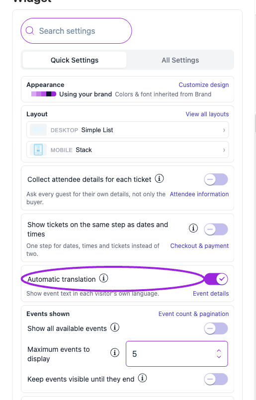
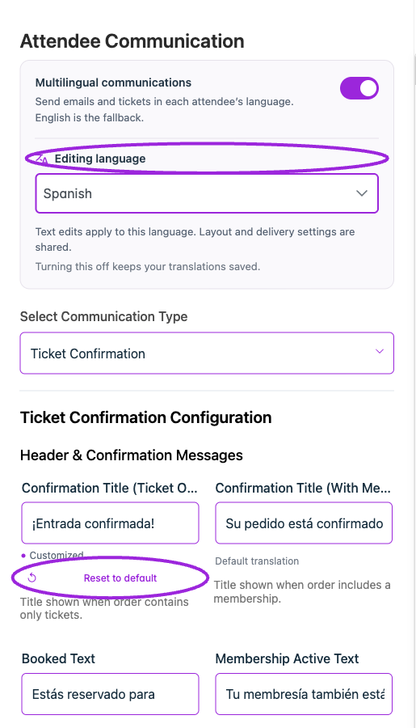

Use the [language and locale setup guide](../branding-and-design/language-and-locale) for the full walkthrough.

## How do I translate my ticket widget?

Open **Design → Widget → Quick Settings** and turn on **Automatic translation**. Use **Preview Language** at the top right to check the result. The same switch is under **All Settings → Text → Event details**.

<Frame caption="In Design → Widget → Quick Settings, Automatic translation enables supported translated labels in the widget and checkout.">
  
</Frame>

## Does Preview Language change the language for all my customers?

No. It changes the dashboard preview. The installed widget uses the language supplied by the integration or embed, or the visitor's browser language when none is supplied. Test the published website to check that context.

## Why does a label stay in English after I enable translation?

Check whether you customized it in **All Settings → Text**. Custom widget wording is retained; supported unchanged defaults use the supplied translations. Also confirm the selected **Editing Widget**, preview language, and automatic-translation switch. Unsupported languages fall back to English.

## Are my event title and description translated automatically?

The setting translates supported built-in widget and checkout labels. Your event title, description, and custom instructions keep their authored text. Review that content separately for the languages you serve.

## How do I send translated confirmation emails and tickets?

Turn on **Multilingual communications** in **Design → Attendee Communication**. Choose the template and **Editing language** to review or override its text. Delivery uses the attendee's saved checkout language, with English as the fallback. Widget automatic translation and multilingual communications are separate switches.

This includes [Membership Order Confirmation](/memberships/sell-without-tickets): its subject, message, membership labels, and action buttons use the buyer's saved checkout language.

## Where can I see the default text for each language?

With multilingual communications on, choose the template and **Editing language**. The field values show the wording currently used. **Default text** or **Default translation** identifies supplied wording; **Customized** identifies an override. **Reset to default** removes the override for that field, so use it when you intend to restore the default.

<Frame caption="A Spanish title override is marked Customized. Reset to default restores the supplied translation for this field; other languages keep their own wording.">
  
</Frame>

## Can I override one language without changing the others?

Yes. Communication text edits apply to the selected **Editing language**. Layout and delivery settings are shared. For an event email's custom subject and body, use **Email translations**, choose the language, and select **Save translation**.

## Will my custom email message be translated automatically?

Ticket Spot supplies translations for supported stock wording. Add language variants for your own subject, instructions, and message in **Email translations**. Custom content without a translation retains the original message. Preserve personalization placeholders when translating.

## Will switching multilingual communications off delete my translations?

No. Saved translations are retained. With the switch off, your existing text is used for every attendee. Turn it on again to use the saved language variants.

## Why is an attendee's email different from my preview?

The preview uses your selected editing language. Actual communications use the attendee's saved checkout language and the applicable defaults or overrides. Check the template language, event campaign translation, and language used during a test checkout. Changing your preview language does not change an existing attendee's language.

## Where are the locale and date/time settings?

<Frame caption="Regional Settings contains SMS Country and the shared Date Display and Time Display formats. Date and time format changes update automatically; save other General fields with Save.">
  
</Frame>

Open **Settings → General → Regional Settings**. **Date Display** and **Time Display** set the shared formats for emails, event pages, tickets, and other attendee-facing surfaces and save automatically. **SMS Country** controls the supported SMS delivery region. Widget-specific formatting remains under **Design → Widget → All Settings → Display → Date & time**.

## Does changing the language change the timezone or ticket currency?

No. Set the event timezone in the event editor. Use **Display → Date & time** for date/time formatting and visitor-timezone conversion. Ticket pricing and payment currency are configured separately from language.

## Which languages can I preview?

English, Bulgarian, Czech, Danish, Dutch, Finnish, French, German, Hungarian, Indonesian, Italian, Japanese, Korean, Norwegian, Polish, Portuguese, Spanish, and Swedish. Regional language preferences use the available base-language translation, with English as the fallback.

## Why does saving say “Keep the template variables from the original message”?

A translated subject or message can use only variables already present in its original field. Keep placeholders such as `{{event_title}}` unchanged. If you need another variable, add it to the original email first, save that email, and then update its translations. Keep a translated subject on one line.
