Ticket Spot is an end-to-end event management platform that helps you create events, manage attendees, customize branding, track analytics, and streamline operations from one unified system. This overview introduces every module inside the platform and summarizes what each area does.

Let's get started 🚀

## Event Management

Everything you need to build, edit, and organize your events—from setup to launch.

| Functions               | Description                                             | Reference |
|------------------------|---------------------------------------------------------|-----------|
| Create Events          | Learn how to create a new event using all event builder steps | [See More](../essentials/create-event-overview)  |
| Event Details          | Add event title, description, categories, and visibility | [See More](../essentials/eventdetails)  |
| Dates & Times          | Set schedule, recurring dates, and timezones            | [See More](../essentials/display-settings)  |
| Venue & Location       | Add venue details, maps, and location visibility        | [See More](../essentials/venuelocation)  |
| Ticket Setup           | Create ticket types, pricing, availability, and rules   | See More  |
| Email Communication    | Configure confirmation and reminder emails              | [See More](../essentials/email-communication)  |
| Waitlist               | Enable and manage event waitlist logic                  | [See More](../essentials/waitlist)  |
| Additional Information | Collect custom attendee information fields              | [See More](../essentials/additional-information)  |
| Checkout Complete      | Customize the confirmation page message                 | [See More](../essentials/checkout-complete-message)  |
| Tags & Custom Fields   | Use tags and custom fields for filtering and automation | [See More](../essentials/tags-and-custom-fields) |
| Hosts                  | Add event hosts and display them on your event page     | [See More](../essentials/hosts)  |
| Display Settings       | Control how events appear publicly                      | [See More](../essentials/display-settings)  |
| Manage Events          | View and edit all your events in one dashboard          | [See More](../essentials/manage-events)  |

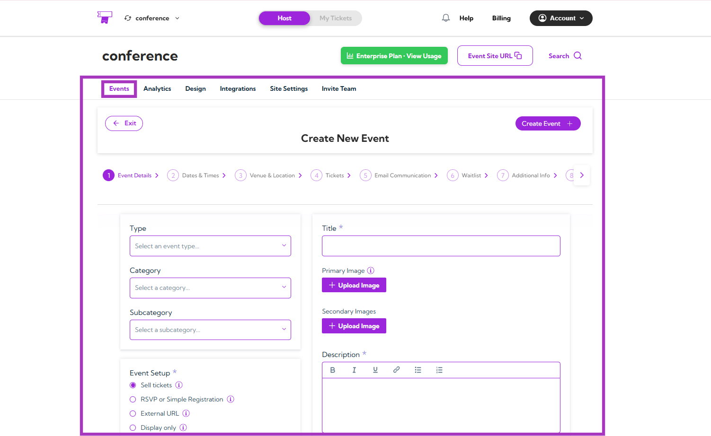

## Analytics

Understand event performance through clear visual insights, revenue breakdowns, and engagement patterns.

| Functions                 | Description                                            | Reference |
|---------------------------|--------------------------------------------------------|-----------|
| Analytics Overview        | Summary of analytics modules and insights             | [See More](../analytics/analytics-overview)  |
| Sales Analytics           | View revenue, orders, ticket sales, and refund stats  | [See More](../analytics/sales-analytics)  |
| Check-in Analytics        | Track check-ins and real-time attendance activity     | [See More](../analytics/check-in-analytics) |
| Abandoned Cart Analytics  | Analyze dropped carts and recovery opportunities      | [See More](../analytics/abandoned-cart-analytics)  |
| Event View Analytics      | Track impressions, page visits, and viewer engagement | [See More](../analytics/event-view-analytics)  |

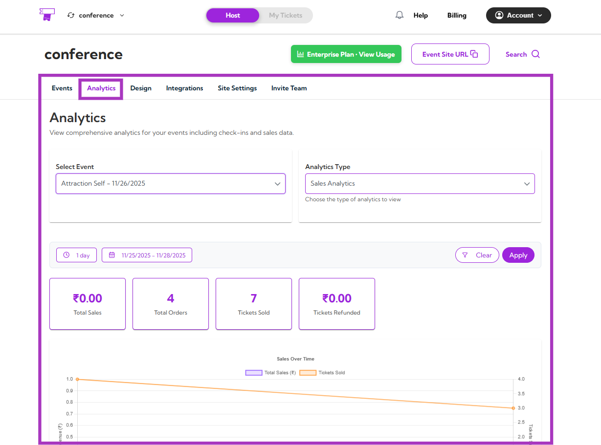

## Attendee Management

Your central place to review attendee records, update information, and keep your event data organized.

| Functions                 | Description                                | Reference |
|---------------------------|--------------------------------------------|-----------|
| Viewing Attendee Details  | View complete attendee information         | [See More](../attendee-management/viewing-attendee-details)  |
| Managing Attendees        | Update attendee details and manage participation | [See More](../attendee-management/managing-attendees)  |
| Adding Attendees Manually | Add attendees without checkout flow        | [See More](../attendee-management/adding-attendees-manually)  |
| Export Attendees & Check-In Data | Export full attendee and check-in reports | [See More](../attendee-management/export-attendees-and-check-in-data)  |

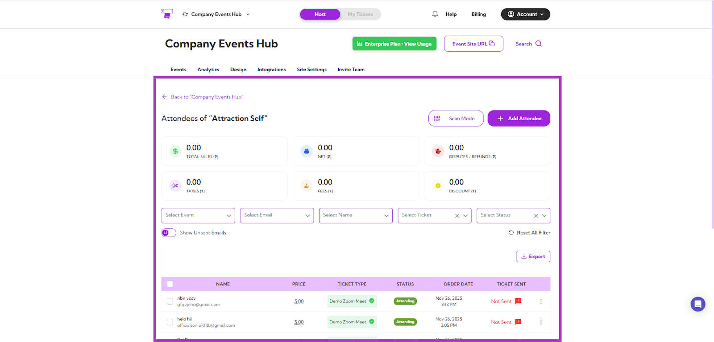

## Attendee Portal

This section explains the tools attendees use to access and manage their tickets and event information.

| Functions                 | Description                                | Reference |
|---------------------------|--------------------------------------------|-----------|
| Viewing Your Tickets      | Access purchased tickets and event info    | [See More](../attendee-portal/viewing-your-tickets)  |
| QR Codes & Digital Wallets| Save tickets to Apple/Google Wallet        | [See More](../attendee-portal/qr-code-digital-wallets)  |
| View Receipt & Download PDF | Download order receipts                  | [See More](../attendee-portal/view-download-receipt)  |
| Cancel or Transfer Event  | Cancel or transfer registrations           | [See More](../attendee-portal/cancel-transfer-event)  |
| Contact Host              | Contact event organizers from portal       | [See More](../attendee-portal/contact-host)  |

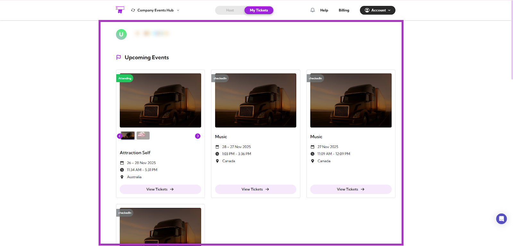

## Mobile App

On-site features that help your team scan tickets, manage check-ins, and track attendees in real time.

| Functions            | Description                               | Reference |
|----------------------|-------------------------------------------|-----------|
| Mobile App Overview  | Overview of mobile Event Hub functionality | [See More](../mobile-app/mobile-app-overview)  |
| Mobile Check-in      | Scan attendee QR codes for entry           | [See More](../mobile-app/mobile-check-in)  |
| Attendee Details     | View attendee details in the app           | [See More](../mobile-app/attendee-details)  |

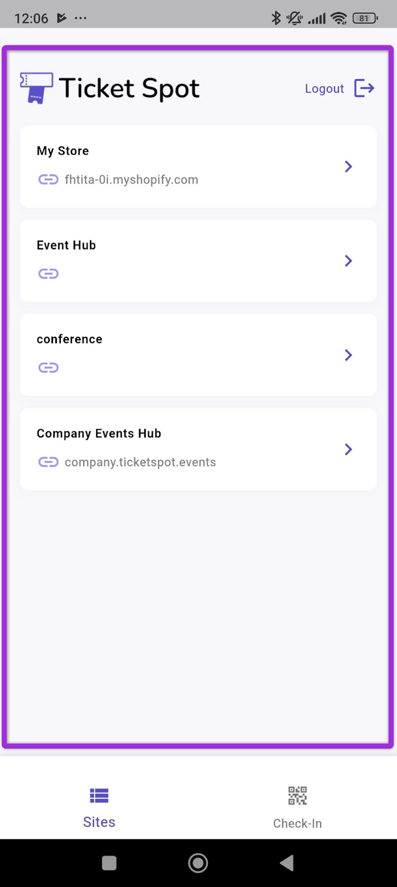

## Branding and Design

Everything you need to customize your Event Hub’s visual identity, layouts, and ticket/receipt designs.

| Functions                 | Description                                | Reference |
|---------------------------|--------------------------------------------|-----------|
| Brand Design              | Upload logos and configure branding        | [See More](../branding-and-design/brand-design)  |
| Site Design               | Customize the layout of your Event Hub site | [See More](../branding-and-design/site-design)  |
| Event Page Design         | Configure event page layout and hero section | [See More](../branding-and-design/event-page-design)  |
| Widget Customization      | Customize ticket widget styles             | See More  |
| Ticket & Receipt Attachment | Customize PDF ticket and receipt templates | [See More](../branding-and-design/ticket-and-receipt-attachment-design)  |
| Attendee Communication    | Customize email templates sent to attendees | See More  |

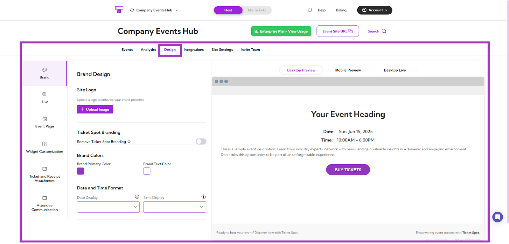

## Integrations

Connect Ticket Spot with other platforms to sync events, automate workflows, and enhance your setup.

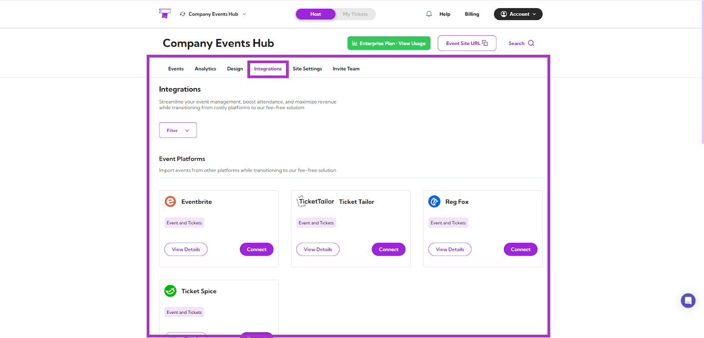

### Event Platform Integrations

| Functions              | Description                                 | Reference |
|------------------------|---------------------------------------------|-----------|
| Eventbrite Integration | Import Eventbrite events and registrations  | [See More](../integrations/eventbrite)  |
| Ticket Tailor Integration | Sync Ticket Tailor events                | [See More](../integrations/tickettailor)  |
| RegFox Integration     | Connect RegFox to import events            | See More  |
| Ticket Spice Integration | Import TicketSpice events                | [See More](../integrations/ticketspice)  |

### Virtual Event Integrations

| Functions           | Description                    | Reference |
|---------------------|--------------------------------|-----------|
| Google Integration  | Sync Google events and data    | See More  |
| Zoom Integration    | Auto-create and sync Zoom meetings | [See More](../integrations/zoom)  |

### Live Streaming Integration

| Functions          | Description                          | Reference |
|--------------------|--------------------------------------|-----------|
| Twitch Integration | Embed Twitch livestreams into event pages | See More |

### Marketing Automation

| Functions           | Description                             | Reference |
|---------------------|-----------------------------------------|-----------|
| Zapier              | Automate workflows and event triggers   | See More  |
| Mailchimp Integration | Sync attendees to Mailchimp lists     | [See More](../integrations/mailchimp)  |

## Site Settings

Controls that let you manage your site’s configuration, domain, tracking, and multi-site operations.

| Functions           | Description                              | Reference |
|---------------------|------------------------------------------|-----------|
| Site Setting        | Configure your Event Hub settings        | [See More](../site-settings/site-settings)  |
| Domain & Analytics  | Add custom domain and tracking scripts   | [See More](../site-settings/domain-and-analytics)  |
| Mobile Check-in     | Configure staff check-in options         | [See More](../site-settings/mobile-check-in)  |
| Event Submissions   | Enable public event submission           | [See More](../site-settings/event-submissions)  |
| Add & Switch Sites  | Manage multiple hubs under one account   | [See More](../site-settings/add-and-switch-sites)  |

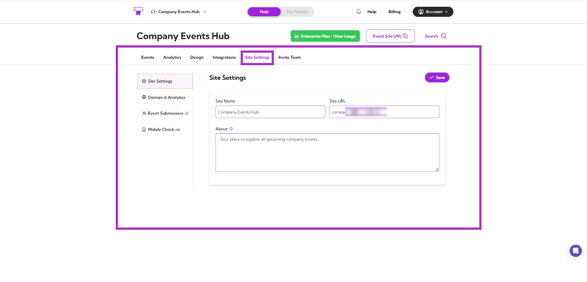

## Plugins

Add Ticket Spot to your website or ecommerce store by connecting with your preferred platform.

| Functions         | Description                              | Reference |
|-------------------|------------------------------------------|-----------|
| Connect Shopify   | Connect Shopify store to sell tickets    | See More  |
| Connect Ecwid     | Integrate Ecwid with Ticket Spot         | See More  |
| Connect WordPress | Embed widgets and pages on WordPress     | See More  |
| Connect Wix       | Integrate Ticket Spot into Wix website   | See More  |

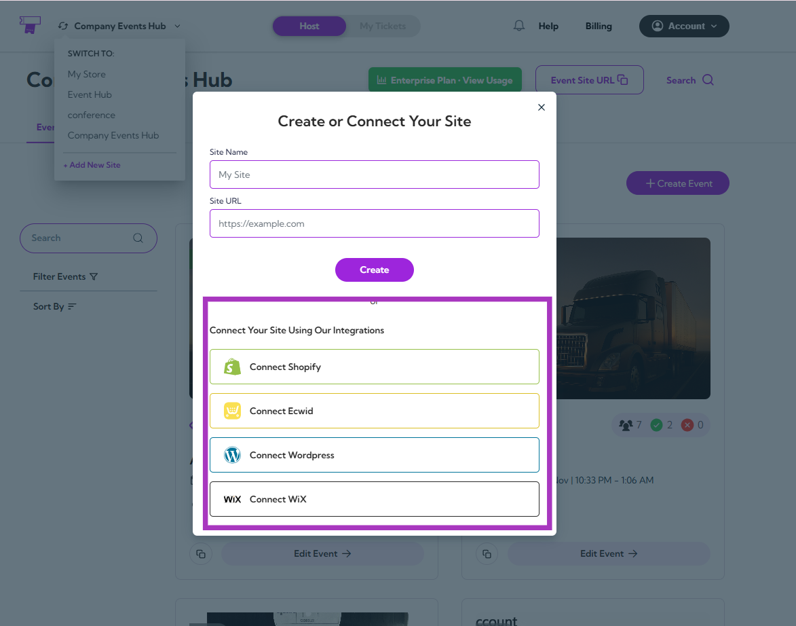

## Team

Invite teammates, assign roles, and collaborate with controlled access and permissions.

| Functions                     | Description                             | Reference |
|-------------------------------|-----------------------------------------|-----------|
| Invite Your Team & Assign Roles | Add team members and assign roles     | [See More](../team/invite-team-roles)  |
| Manage Invitations            | View, remove, or resend invitations     | [See More](../team/manage-invitations)  |

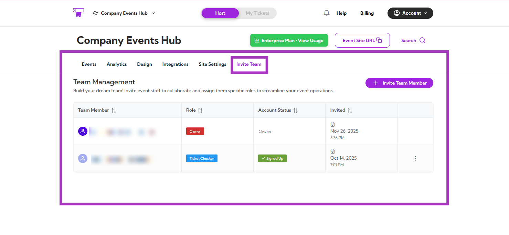

## Account

Manage your personal settings, billing, payouts, and notifications—all in one place.

| Functions        | Description                             | Reference |
|------------------|-----------------------------------------|-----------|
| Account Settings | Update personal profile settings        | [See More](../account/account-settings)  |
| Get Paid         | Configure payout settings               | [See More](../account/get-paid)  |
| Notifications    | Manage email and app notifications      | [See More](../account/notifications)  |
| Billing & Plans  | Manage billing, invoices, and subscription plans | [See More](../account/billing-and-plans)  |

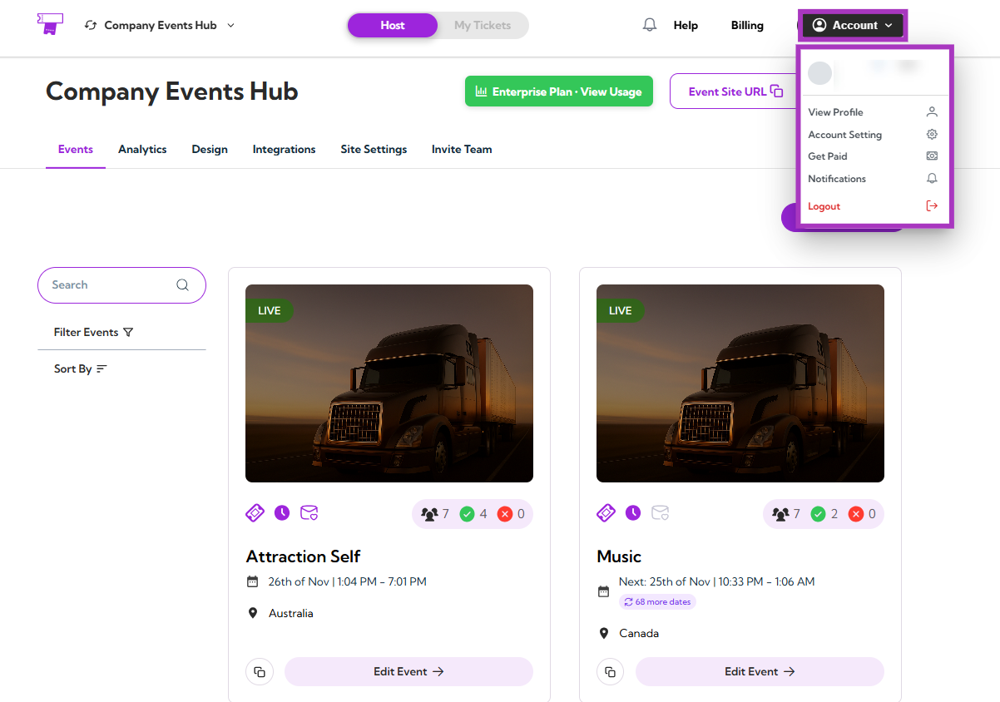