Use this Ticket Spot documentation to set up your site, create events, sell tickets, and manage attendees. This guide introduces the dashboard modules and links to their setup instructions, option references, and reporting guides.

<iframe 
width="100%" 
height="400" 
src="https://www.youtube.com/embed/Rxd7gFCTVpg?si=j4-coC1GeWatVHgE" 
title="YouTube video player" 
frameborder="0" 
allow="accelerometer; autoplay; clipboard-write; encrypted-media; gyroscope; picture-in-picture;" 
allowfullscreen>

</iframe>

Choose the site you want to manage, then use the top navigation to move between Events, Analytics, Memberships, Seat Charts, Design, Integrations, Settings, and Invite Team.

<Frame caption="Choose your site from the top-left menu, then use the navigation tabs to open each area.">
  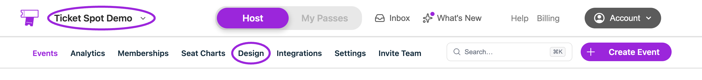
</Frame>

## Start with your brand

Set your [brand colors and logo](../branding-and-design/brand-design) before creating a widget or customizing emails. Basic brand identity is available on **all plans**. Continue through the [Design setup guide](../branding-and-design/design-overview) to review each attendee-facing surface.

<Frame caption="Open Design → Brand to upload a logo and choose your primary color. The preview shows how the selected brand appears.">
  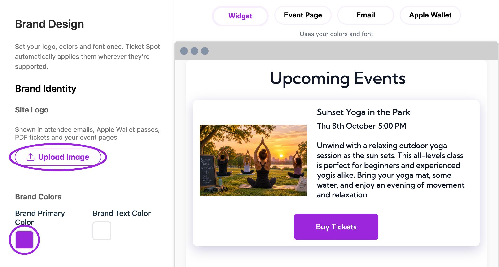
</Frame>

## Memberships

Use [memberships and annual passes](../memberships/overview) for admission across assigned events, class packages, members-only tickets, or special member prices. The Memberships tab also shows the people assigned and their visit/expiry details.

<Frame caption="In Memberships, create a membership and review Pricing, Access Rules, and assigned Events. This example shows a $99 one-year pass.">
  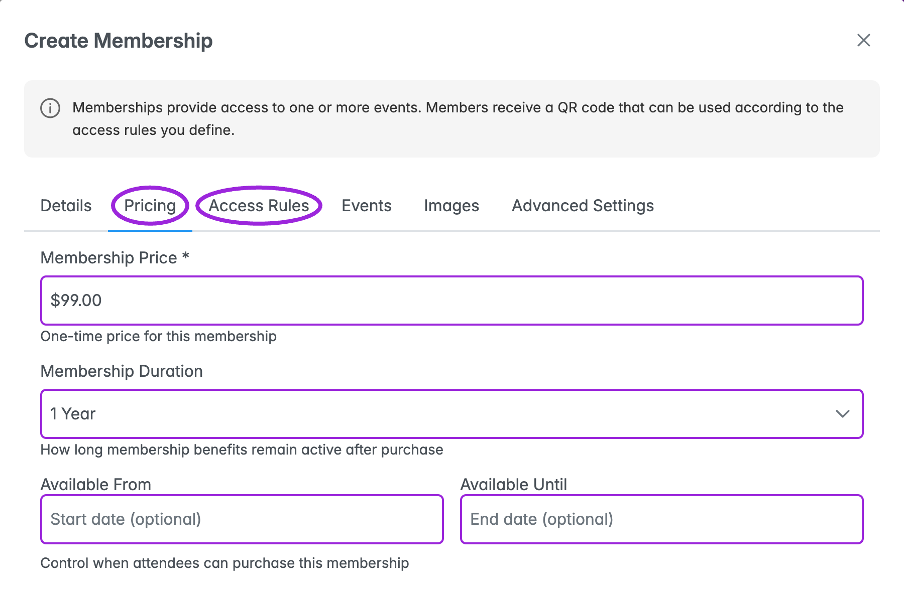
</Frame>

## Event Management

Everything you need to build, edit, and organize your events—from setup to launch.

| Functions               | Description                                             | Reference |
|------------------------|---------------------------------------------------------|-----------|
| **Create Events**          | Learn how to create a new event using all event builder steps | [See More](../event-management/create-event-overview)  |
| **Event Details**          | Add event title, description, categories, and visibility | [See More](../event-management/eventdetails)  |
| **Dates & Times**          | Set schedule, recurring dates, and timezones            | [See More](../event-management/datetime)  |
| **Venue & Location**       | Add venue details, maps, and location visibility        | [See More](../event-management/venuelocation)  |
| **Ticket Setup**           | Create ticket types, pricing, availability, and rules   | [See More](../event-management/ticket-setup)  |
| **Email Communication**    | Configure confirmation and reminder emails              | [See More](../event-management/email-communication)  |
| **Waitlist**               | Enable and manage event waitlist logic                  | [See More](../event-management/waitlist)  |
| **Additional Information** | Collect custom attendee information fields              | [See More](../event-management/additional-information)  |
| **Checkout Complete**      | Customize the confirmation page message                 | [See More](../event-management/checkout-complete-message)  |
| **Tags & Custom Fields**   | Use tags and custom fields for filtering and automation | [See More](../event-management/tags-and-custom-fields) |
| **Hosts**                  | Add event hosts and display them on your event page     | [See More](../event-management/hosts)  |
| **Display Settings**       | Control how events appear publicly                      | [See More](../event-management/display-settings)  |
| **Manage Events**          | View and edit all your events in one dashboard          | [See More](../event-management/manage-events)  |

<Frame caption="Choose Manage event to edit the event, or Open dashboard to manage its attendees.">
  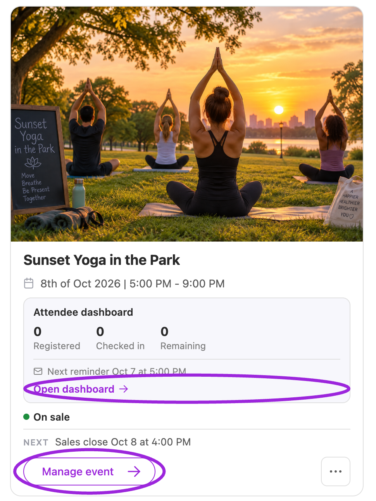
</Frame>

## Analytics

Understand event performance through clear visual insights, revenue breakdowns, and engagement patterns.

| Functions                 | Description                                            | Reference |
|---------------------------|--------------------------------------------------------|-----------|
| **Analytics Overview**        | Summary of analytics modules and insights             | [See More](../analytics/analytics-overview)  |
| **Sales Analytics**           | View revenue, orders, ticket sales, and refund stats  | [See More](../analytics/sales-analytics)  |
| **Check-in Analytics**        | Track check-ins and real-time attendance activity     | [See More](../analytics/check-in-analytics) |
| **Abandoned Cart Analytics**  | Analyze dropped carts and recovery opportunities      | [See More](../analytics/abandoned-cart-analytics)  |
| **Event View Analytics**      | Track impressions, page visits, and viewer engagement | [See More](../analytics/event-view-analytics)  |

<Frame caption="Select an event and date range, then switch between Overview, Sales, Attendance, Traffic, Abandoned Carts, and Email.">
  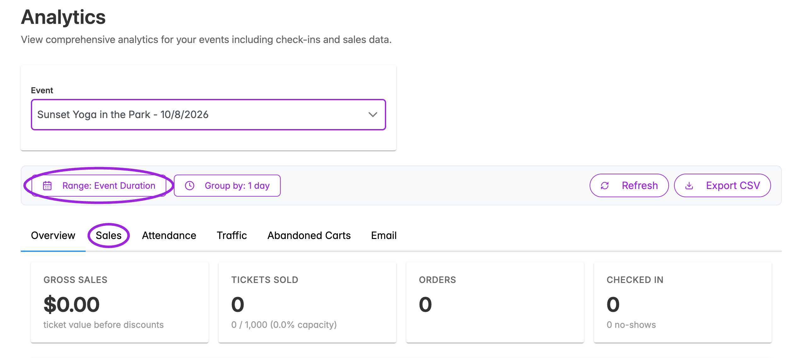
</Frame>

## Attendee Management

Your central place to review attendee records, update information, and keep your event data organized.

| Functions                 | Description                                | Reference |
|---------------------------|--------------------------------------------|-----------|
| **Viewing Attendee Details**  | View complete attendee information         | [See More](../attendee-management/viewing-attendee-details)  |
| **Managing Attendees**        | Update attendee details and manage participation | [See More](../attendee-management/managing-attendees)  |
| **Adding Attendees Manually** | Add attendees without checkout flow        | [See More](../attendee-management/adding-attendees-manually)  |
| **Export Attendees & Check-In Data** | Export full attendee and check-in reports | [See More](../attendee-management/export-attendees-and-check-in-data)  |

<Frame caption="Use Add Attendee for a manual registration, search or filter the list, and use Export for a report. Personal details are concealed in this example.">
  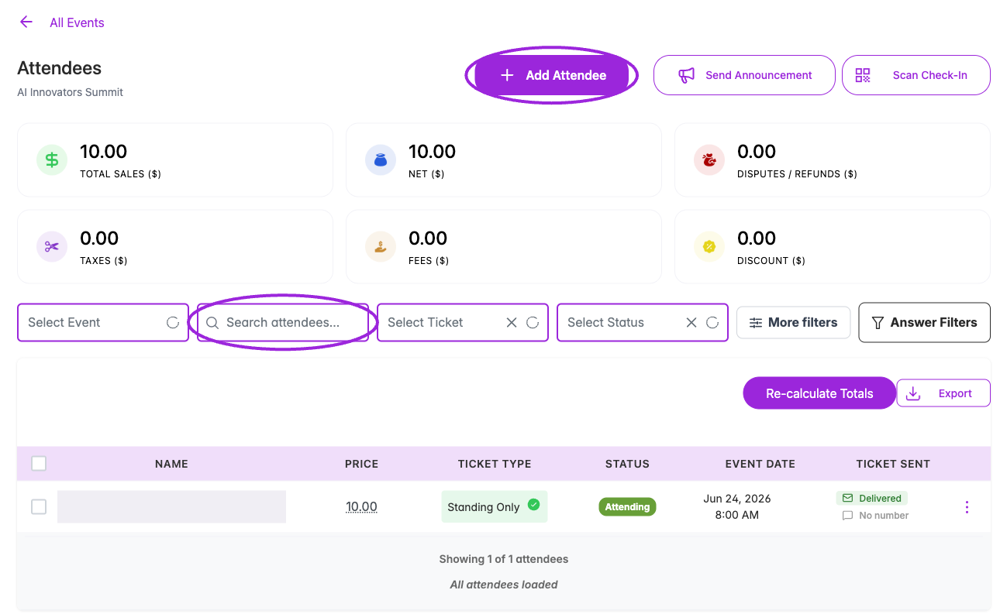
</Frame>

## Attendee Portal

This section explains the tools attendees use to access and manage their tickets and event information.

| Functions                 | Description                                | Reference |
|---------------------------|--------------------------------------------|-----------|
| **Viewing Your Tickets**      | Access purchased tickets and event info    | [See More](../attendee-portal/viewing-your-tickets)  |
| **QR Codes & Digital Wallets**| Save tickets to Apple/Google Wallet        | [See More](../attendee-portal/qr-code-digital-wallets)  |
| **View Receipt & Download PDF** | Download order receipts                  | [See More](../attendee-portal/view-download-receipt)  |
| **Cancel or Transfer Event**  | Cancel or transfer registrations           | [See More](../attendee-portal/cancel-transfer-event)  |
| **Contact Host**              | Contact event organizers from portal       | [See More](../attendee-portal/contact-host)  |

<Frame caption="Attendees can view their QR code, download documents, and contact the host. This built-in preview shows the available sections; hosts control their visibility in Design → Attendee Ticket Page.">
  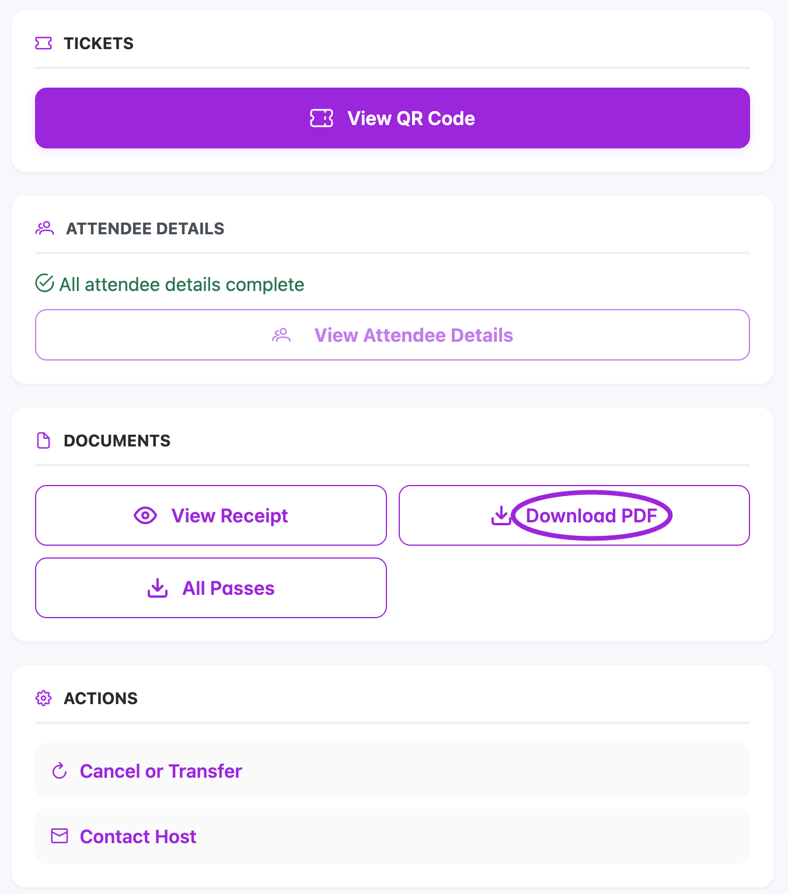
</Frame>

## Mobile App

On-site features that help your team scan tickets, manage check-ins, and track attendees in real time.

| Functions            | Description                               | Reference |
|----------------------|-------------------------------------------|-----------|
| **Mobile App Overview**  | Overview of the Ticket Spot mobile app | [See More](../mobile-app/mobile-app-overview)  |
| **Mobile Check-in**      | Scan attendee QR codes for entry           | [See More](../mobile-app/mobile-check-in)  |
| **Attendee Details**     | View attendee details in the app           | [See More](../mobile-app/attendee-details)  |

<Frame caption="From Events → View activity, choose Check In Attendees. Use the mobile installation QR codes or links for iOS and Android, or start desktop check-in.">
  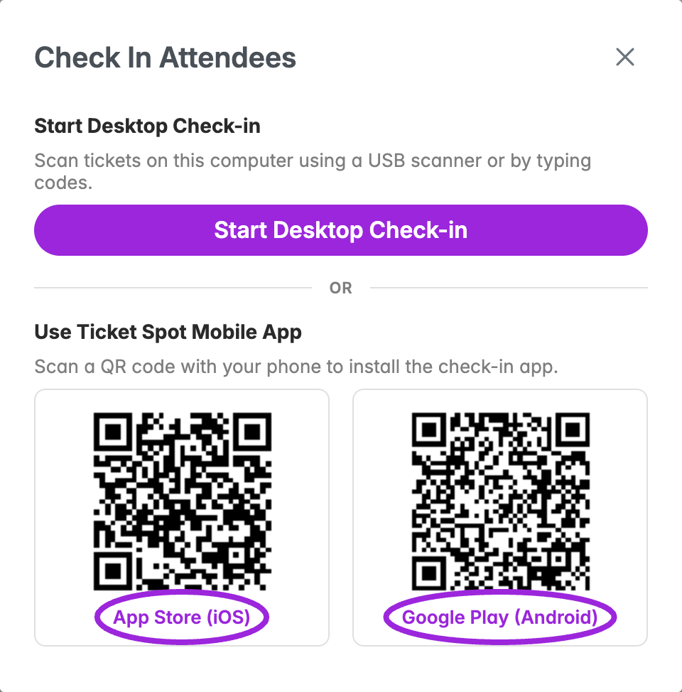
</Frame>

## Branding and Design

Everything you need to customize your Event Hub’s visual identity, layouts, and ticket/receipt designs.

| Functions                 | Description                                | Reference |
|---------------------------|--------------------------------------------|-----------|
| **Brand Design**              | Upload logos and configure branding        | [See More](../branding-and-design/brand-design)  |
| **Site Design**               | Customize the layout of your Event Hub site | [See More](../branding-and-design/site-design)  |
| **Event Page Design**         | Configure event page layout and hero section | [See More](../branding-and-design/event-page-design)  |
| **Widget Customization**      | Customize ticket widget styles             | [See More](../branding-and-design/widget-customization-overview)  |
| **Quick Settings** | Adjust common widget options and open All Settings | [See More](../branding-and-design/quick-settings) |
| **Attendee Ticket Page** | Control ticket, document, and attendee actions | [See More](../branding-and-design/attendee-ticket-page) |
| **Ticket & Receipt Attachment** | Customize PDF ticket and receipt templates | [See More](../branding-and-design/ticket-and-receipt-attachment-design)  |
| **Attendee Communication**    | Customize email templates sent to attendees | [See More](../branding-and-design/attendee-communication-design)  |

<Frame caption="Open Design → Widget. Start in Quick Settings, use View all layouts for layout choices, or open All Settings for the complete set of controls.">
  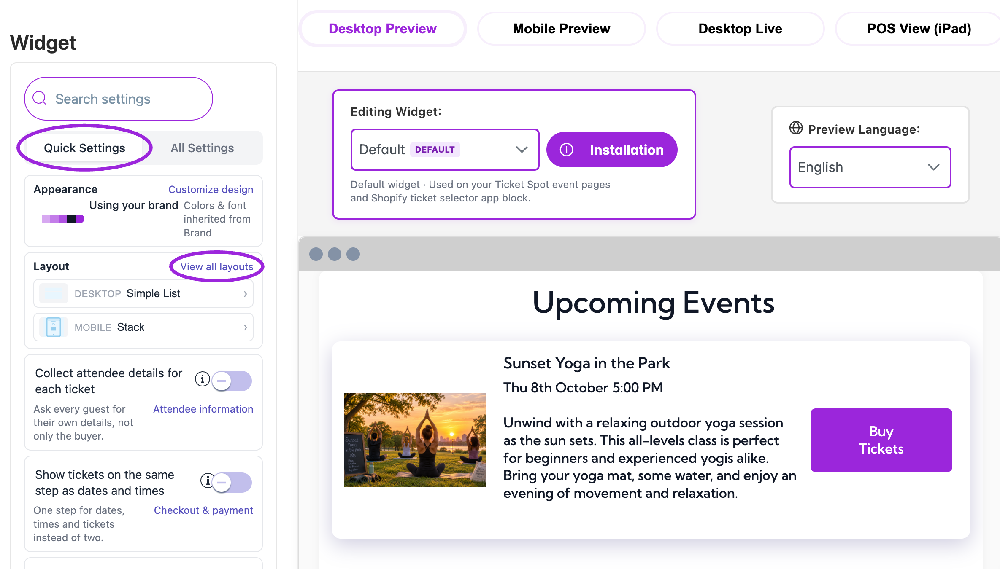
</Frame>

<Accordion title="Watch: open All Settings (7 seconds)">
  <picture>
    <source media="(prefers-reduced-motion: reduce)" srcSet="../assets/refresh/getting-started/platform-widget-tour-poster.png" />
    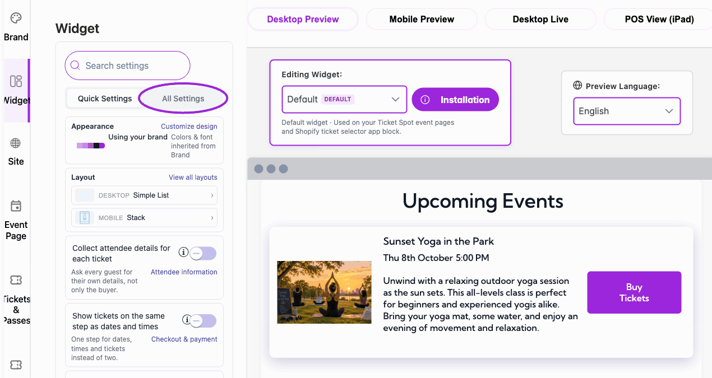
  </picture>

  In **Design → Widget**, choose **All Settings** beside **Quick Settings** to browse every category. [View the static image](../assets/refresh/getting-started/platform-widget-tour-poster.png).
</Accordion>

## Integrations

Connect Ticket Spot with other platforms to sync events, automate workflows, and enhance your setup.

<Frame caption="In Integrations, find Event Platforms and choose View Details or Connect for the service you want to use.">
  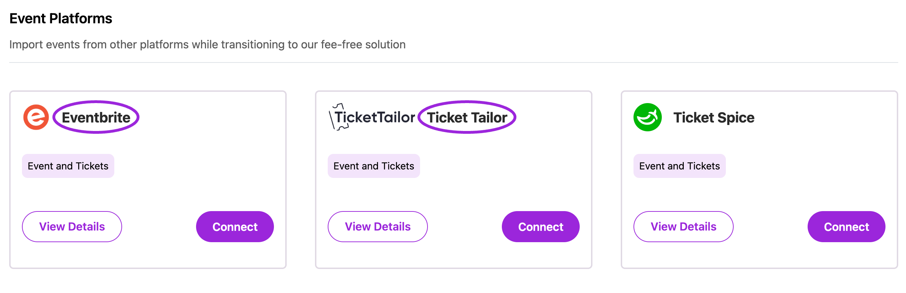
</Frame>

### Event Platform Integrations

| Functions              | Description                                 | Reference |
|------------------------|---------------------------------------------|-----------|
| **Eventbrite Integration** | Import Eventbrite events and registrations  | [See More](../integrations/eventbrite)  |
| **Ticket Tailor Integration** | Sync Ticket Tailor events                | [See More](../integrations/tickettailor)  |
| **Ticket Spice Integration** | Import TicketSpice events                | [See More](../integrations/ticketspice)  |

### Virtual Event Integrations

| Functions           | Description                    | Reference |
|---------------------|--------------------------------|-----------|
| **Google Integration**  | Sync Google events and data    | [See More](../integrations/google)  |
| **Zoom Integration**    | Auto-create and sync Zoom meetings | [See More](../integrations/zoom)  |

### Live Streaming Integration

| Functions          | Description                          | Reference |
|--------------------|--------------------------------------|-----------|
| **Twitch Integration** | Embed Twitch livestreams into event pages | [See More](../integrations/twitch) |

### Marketing Automation

| Functions           | Description                             | Reference |
|---------------------|-----------------------------------------|-----------|
| **Zapier**              | Automate workflows and event triggers   | [See More](../integrations/zapier)  |
| **Mailchimp Integration** | Sync attendees to Mailchimp lists     | [See More](../integrations/mailchimp)  |
| **Klaviyo Integration** | Sync attendee profiles and ticket activity | [See More](../integrations/klaviyo) |

## Site Settings

Controls that let you manage your site’s configuration, domain, tracking, and multi-site operations.

| Functions           | Description                              | Reference |
|---------------------|------------------------------------------|-----------|
| **Site Setting**        | Configure your Event Hub settings        | [See More](../site-settings/site-settings)  |
| **Domain & Analytics**  | Add custom domain and tracking scripts   | [See More](../site-settings/domain-and-analytics)  |
| **Mobile Check-in**     | Configure staff check-in options         | [See More](../site-settings/mobile-check-in)  |
| **Event Submissions**   | Enable public event submission           | [See More](../site-settings/event-submissions)  |
| **Add & Switch Sites**  | Manage multiple hubs under one account   | [See More](../site-settings/add-and-switch-sites)  |

<Frame caption="Open Settings to configure domains, sender identity, analytics, event submissions, mobile check-in, and marketplace options.">
  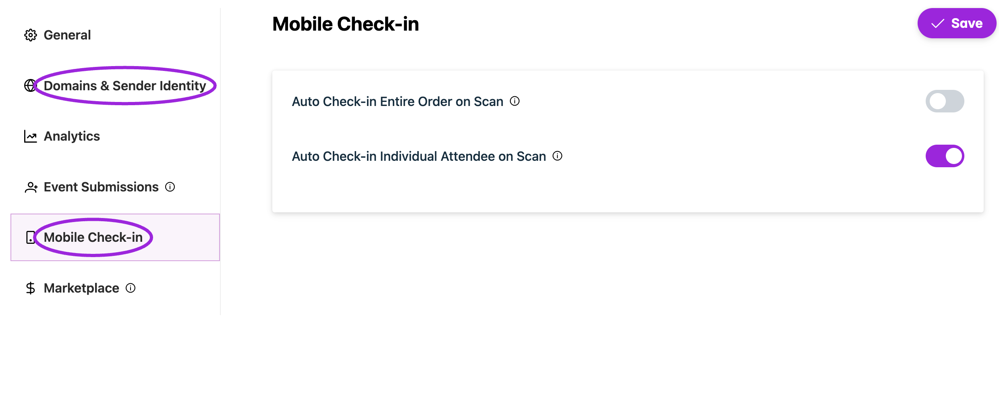
</Frame>

## Plugins

Add Ticket Spot to your website or ecommerce store by connecting with your preferred platform.

| Functions         | Description                              | Reference |
|-------------------|------------------------------------------|-----------|
| **Connect Shopify**   | Connect Shopify store to sell tickets    | [See More](../plugins/connect-shopify)  |
| **Connect Ecwid**     | Integrate Ecwid with Ticket Spot         | See More  |
| **Connect Wix**       | Integrate Ticket Spot into Wix website   | [See More](../plugins/connect-wix)  |
| **Connect Lovable**       | Integrate Lovable with Ticket Spot  | [See More](../plugins/connect-lovable)  |

<Frame caption="Website and ecommerce connections are under Integrations → Platform Integrations. The example shows the Demo Shopify connection alongside Wix and Ecwid.">
  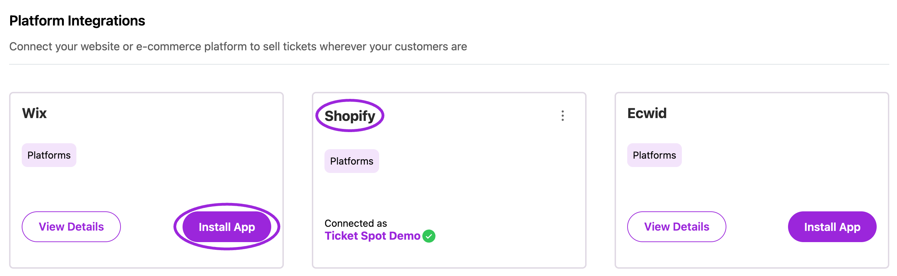
</Frame>

## Team

Invite teammates, assign roles, and collaborate with controlled access and permissions.

| Functions                     | Description                             | Reference |
|-------------------------------|-----------------------------------------|-----------|
| **Invite Your Team & Assign Roles** | Add team members and assign roles     | [See More](../team/invite-team-roles)  |
| **Manage Invitations**            | View, remove, or resend invitations     | [See More](../team/manage-invitations)  |

<Frame caption="Choose Invite Team → Invite Team Member, enter an email address, and select Admin, Ticket Checker, Support Manager, or Event Manager.">
  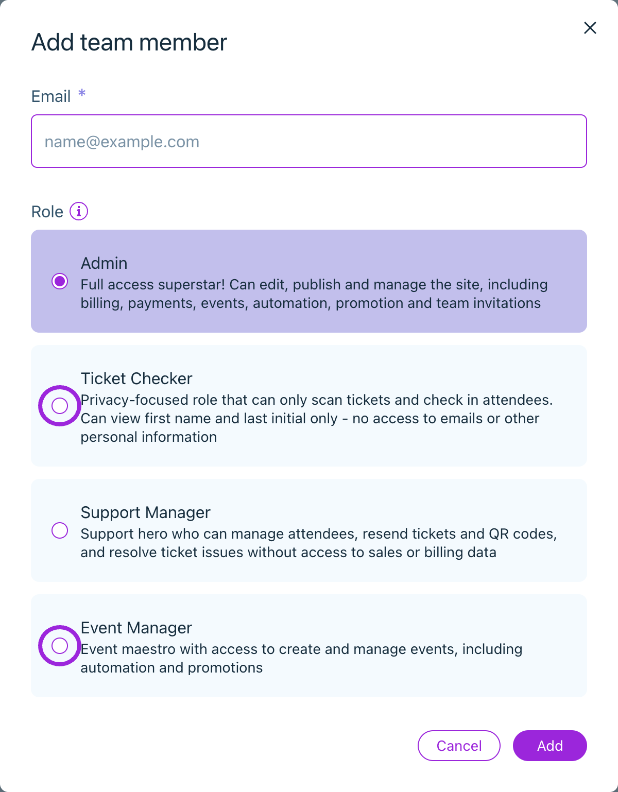
</Frame>

## Account

Manage your profile, payouts, and notifications from Account. Open Billing in the header to manage your plan and invoices.

| Functions        | Description                             | Reference |
|------------------|-----------------------------------------|-----------|
| **Account Settings** | Update personal profile settings        | [See More](../account/account-settings)  |
| **Get Paid**         | Configure payout settings               | [See More](../account/get-paid)  |
| **Notifications**    | Manage email and app notifications      | [See More](../account/notifications)  |
| **Billing & Plans**  | Manage billing, invoices, and subscription plans | [See More](../account/billing-and-plans)  |

<Frame caption="Open Account in the top-right corner for profile settings, payouts, and notifications. Billing is available separately in the header.">
  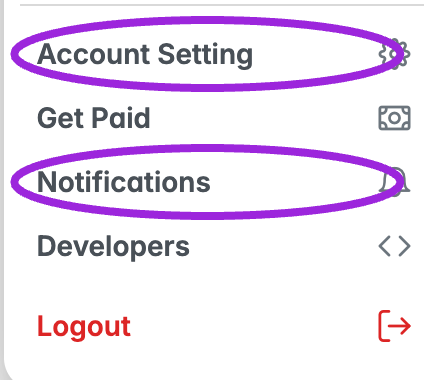
</Frame>