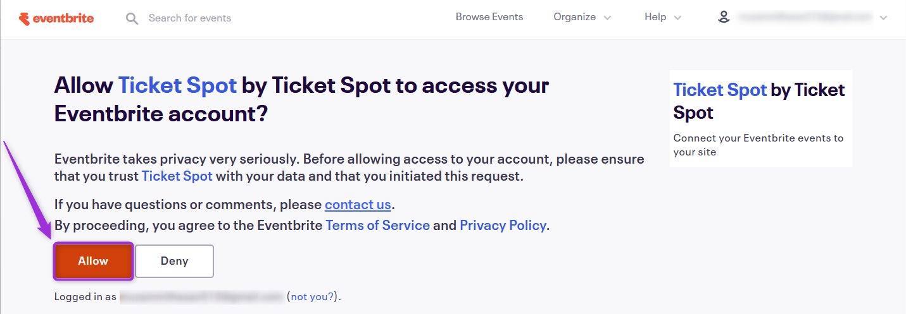

Organizers can easily import their existing **Eventbrite** events and tickets into **Ticket Spot** while transitioning to our fee-free platform. This integration lets you manage all your events in one place, without switching between multiple platforms.

Let’s get started 🚀

## Prerequisites

Before setting up the integration, make sure you have:

- ✅ An active **[Ticket Spot](https://ticketspotapp.com/)** account with access to the **Integrations** page.
- ✅ An active **[Eventbrite](https://www.eventbrite.com/blogquick-start-guide/)** organizer account to authorize and import your events.

## Integration

**Step 1:** Log in to your **Ticket Spot** account and click on the **Integrations** tab from the top navigation bar to open the integrations page.

**Step 2:** Find the **Eventbrite** platform under the **Event Platforms** category and click on the **Connect** button to open the integration setup window.

**Step 3:** Click on the **Connect** button again to proceed.

**Step 4:** Authenticate the connection to your **Eventbrite** account by entering your sign-in credentials.

**Step 5:** Review the required permissions to understand what **Ticket Spot** can access and manage in your **Eventbrite** account. Then, click **Allow** to finish connecting your account.

**Step 6:** Once the integration is successfully connected, a **green check mark** will appear. This confirms that the **Eventbrite integration** is active in **Ticket Spot**.

## View Details

Review the connection details for your **Eventbrite integration**, including the linked organizer account and current status.  
To view details, click the horizontal **ellipsis (⋯)** icon on the **Eventbrite integration** tile and select **View Details** from the dropdown menu.

## Disconnect

Remove the existing connection between your **Eventbrite** account and **Ticket Spot**.  
Once disconnected, **Ticket Spot** will no longer be connected to the **Eventbrite** platform.

Click the horizontal **ellipsis (⋯)** icon on the **Eventbrite integration** tile and select **Disconnect** from the dropdown menu.

Your **Eventbrite integration** will be successfully disconnected from **Ticket Spot**.
