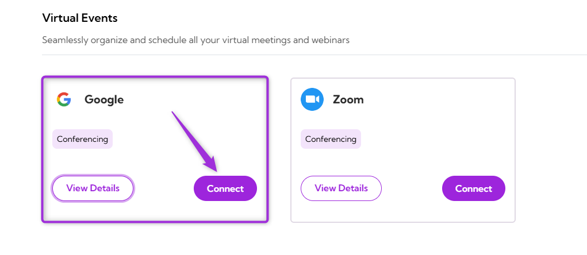
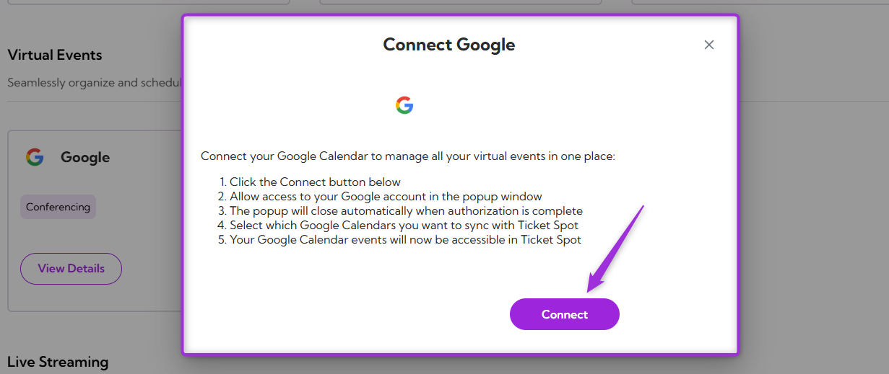
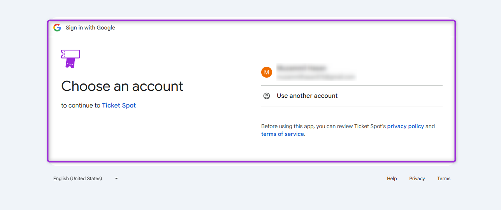
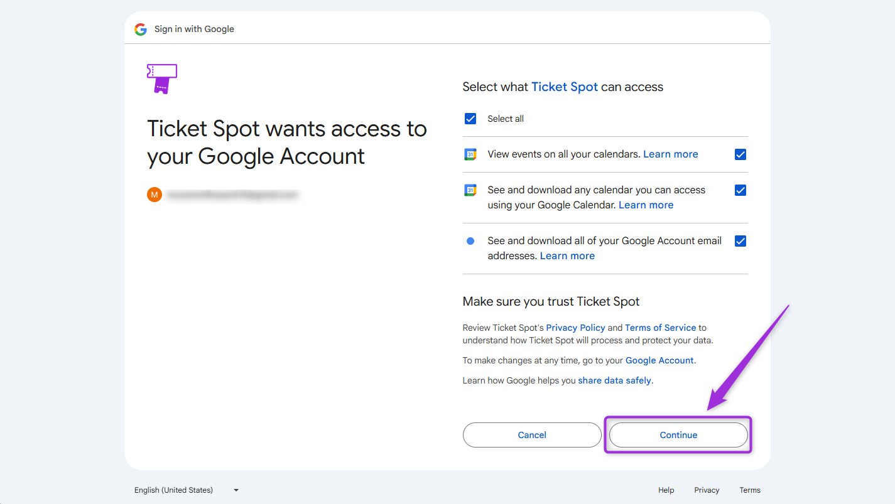
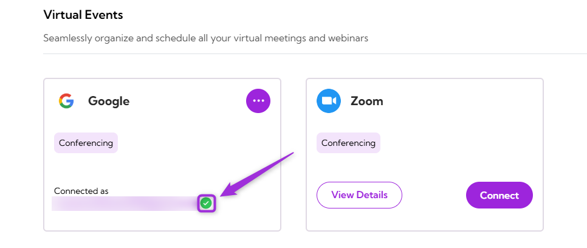
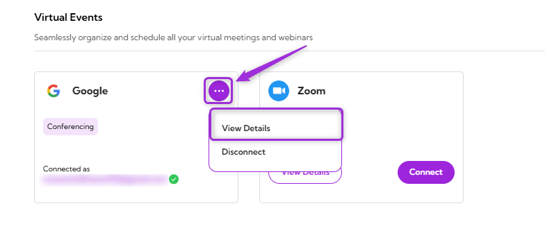
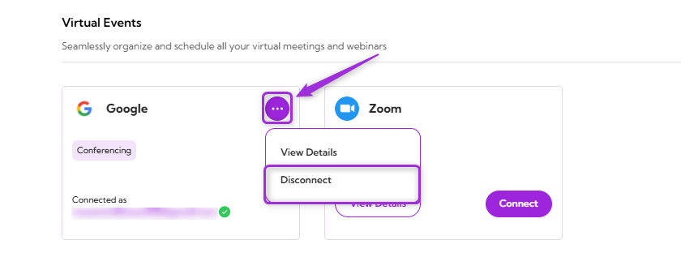

Connect your **Google** Calendar account with **Ticket Spot** to manage your scheduled events and Ticket Spot activities in one place. This integration allows you to link your Google Calendar events with Ticket Spot, ensuring event details stay aligned across both platforms.

Let’s get started 🚀

## Prerequisites

Before setting up the integration, make sure you have:

- An active **[Ticket Spot](https://ticketspotapp.com/)** account with access to the **Integrations** page.
- A valid **Google** account with access to Google Calendar.

## Integration

**Step 1:** Log in to your **Ticket Spot** account and click on the **Integrations** tab from the top navigation bar to open the integrations page.

**Step 2:** Find the **Google** platform under the **Virtual Events** category and click on the **Connect** button to open the integration setup window.

**Step 3:** Click on the **Connect** button again to proceed.

**Step 4:** Sign in using the **Google** account you want to connect with Ticket Spot.

**Step 5:** Review the permissions that **Ticket Spot** is requesting, including access to view and download your **Google Calendar** events. After confirming the selections, click **Continue** to complete the connection.

**Step 6:** Once the integration is successfully connected, a **green check mark** will appear. This confirms that the **Google integration** is active in **Ticket Spot**.

## View Details

Review the connection details for your **Google** Calendar integration, including the linked Google account and current status.  

To view details, click the **horizontal ellipsis (⋯) **icon on the **Google** Calendar integration tile and select **View Details** from the dropdown menu.

## Disconnect

Remove the existing connection between your **Google** Calendar account and **Ticket Spot**. Once disconnected, Ticket Spot will no longer be connected to your Google Calendar.  

Click the** horizontal ellipsis (⋯) **icon on the **Google** Calendar integration tile and select **Disconnect** from the dropdown menu.

Your Google Calendar integration will be successfully disconnected from Ticket Spot.
