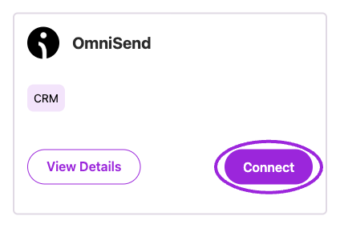
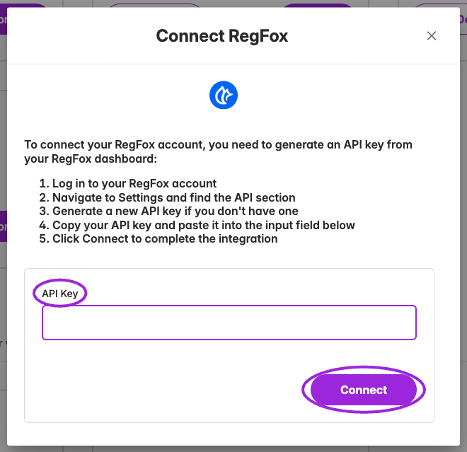
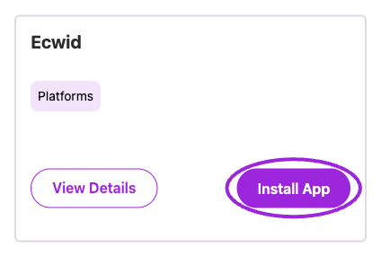
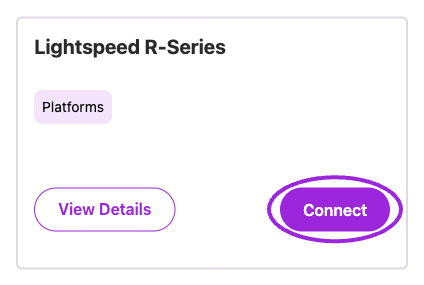

Open **Integrations** in the sidebar for the current site. Use **Filter** to show one or more categories; remove a selected category chip to broaden the list again. **View Details** explains an integration’s capabilities. Its connected-account label identifies the linked account.

## Available integrations

| Category | Integration | Setup in Ticket Spot |
| --- | --- | --- |
| Platform Integrations | [Wix](/plugins/connect-wix) | **Install App** opens the Wix App Market. |
| Platform Integrations | [Shopify](/plugins/connect-shopify) | **Install App** opens the Shopify App Store. The connected card identifies your store. |
| Platform Integrations | Ecwid | **Install App** opens the Ecwid App Market. |
| Platform Integrations | Lightspeed R-Series | **Connect** opens Lightspeed authorization. |
| Event Platforms | [Eventbrite](/integrations/eventbrite) | **Connect**, authorize the account, then select its organization when prompted. |
| Event Platforms | [Ticket Tailor](/integrations/tickettailor) | **Connect**, enter the provider’s API key, then submit the connection form. |
| Event Platforms | [Ticket Spice](/integrations/ticketspice) | **Connect**, enter the provider’s API key, then submit the connection form. |
| Event Platforms | RegFox | **Connect**, enter the provider’s API key, then submit the connection form. |
| Virtual Events | [Google](/integrations/google) | **Connect**, authorize Google, then choose calendars when prompted. |
| Virtual Events | [Zoom](/integrations/zoom) | **Connect** opens Zoom authorization. |
| Live Streaming | [Twitch](/integrations/twitch) | **Connect** opens Twitch authorization. |
| Marketing Automation | [Zapier](/integrations/zapier) | **Show API Key** opens the Ticket Spot key controls. Use the full key to authenticate in Zapier. |
| Marketing Automation | [Mailchimp](/integrations/mailchimp) | **Connect** accepts a **Mailchimp Transactional (Mandrill)** API key for email templates and delivery. |
| Marketing Automation | [Klaviyo](/integrations/klaviyo) | **Connect** opens Klaviyo authorization for order and attendee data. |
| Marketing Automation | OmniSend | **Connect** opens OmniSend authorization for order and attendee data. |

## OmniSend

Under **Marketing Automation**, choose **Connect** on **OmniSend**. Sign in to the account you want to link, review the requested permissions, and complete authorization. After returning to Ticket Spot, check the connected-account label. Configure the desired campaigns and flows in OmniSend.

<Frame caption="Start OmniSend authorization from its Marketing Automation card.">
  
</Frame>

## RegFox

Under **Event Platforms**, choose **Connect** on **RegFox**. In the connection form, paste an API key from the intended RegFox account and choose **Connect**. Check the resulting connection and imported events before relying on them in your listings.

<Frame caption="RegFox uses an API-key connection form.">
  
</Frame>

## Ecwid

Under **Platform Integrations**, choose **Install App** on **Ecwid** to open its app listing. Complete installation for the intended Ecwid store, then return to Ticket Spot and check the selected site. The installation and store configuration happen in Ecwid.

<Frame caption="Install the Ticket Spot app from the Ecwid integration card.">
  
</Frame>

## Lightspeed R-Series

Under **Platform Integrations**, choose **Connect** on **Lightspeed R-Series**. Complete Lightspeed authorization for the intended account, then check the connected account after returning to Ticket Spot. This card is for R-Series; Ecwid has its own separate installation card.

<Frame caption="Lightspeed R-Series has its own authorization entry point.">
  
</Frame>

## Manage a connection

Connected cards can expose **Configure**, **View Details**, and **Disconnect** through the three-dot menu. Available actions depend on the integration. For example, Google can select calendars and Eventbrite can select an organization. Platform cards such as Wix, Shopify, Ecwid, and Lightspeed R-Series do not expose the same Disconnect action here.

If authorization fails, read the return message. A cancelled authorization, expired request, missing email permission, or missing Eventbrite organization requires a different correction. Start again from the integration card after correcting the stated issue.

For the Shopify storefront ticket selector, cart handoff, and customer fields, see [Shopify ticket selector](/plugins/shopify-ticket-selector). For a widget on another website, see [Embed on your website](/plugins/embed-on-your-website).
