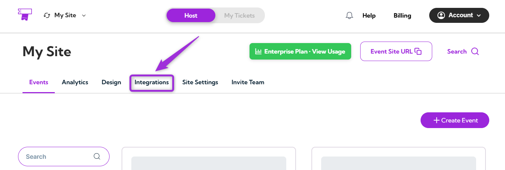
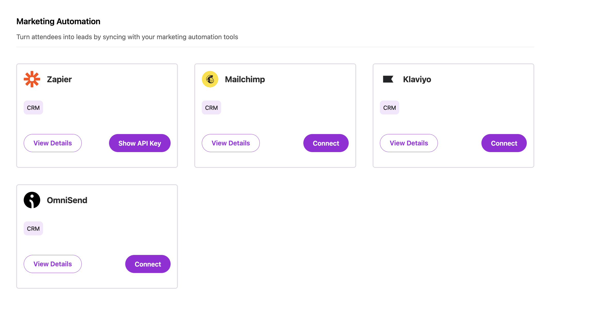
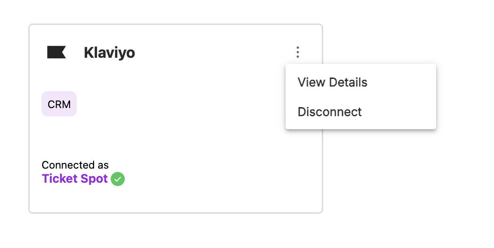

Connect your **Klaviyo** account with **Ticket Spot** to automatically sync attendee and order information to your Klaviyo platform. This integration works seamlessly with Shopify, Wix, or Ticket Spot's own widget — sending event data to Klaviyo whenever a new order with attendees is created.

Let's get started 🚀

## Prerequisites

Before setting up the integration, make sure you have:

- An active **[Ticket Spot](https://ticketspotapp.com/manage)** account with access to the **Integrations** page.
- A valid **[Klaviyo](https://www.klaviyo.com/)** account.

## Integration

**Step 1**: Log in to your **Ticket Spot** account at **[ticketspotapp.com/manage](https://ticketspotapp.com/manage)** and click on the **Integrations** tab from the top navigation bar to open the integrations page.

**Step 2**: Find the **Klaviyo** platform under the **Marketing Automation** category and click the **Connect** button to begin OAuth authentication.

**Step 3**: Sign in to your **Klaviyo** account and authorize Ticket Spot to access your Klaviyo platform.

**Step 4**: Once the integration is successfully connected, a **green check mark** will appear, confirming that the **Klaviyo integration** is active in **Ticket Spot**.

## How It Works

After connecting Klaviyo, the integration automatically syncs data to your Klaviyo platform whenever an attendee purchases tickets to your event:

1. **Create an Event**: Set up a new event in Ticket Spot and make it live.
2. **Preview Your Event**: Go to the Event Page or Widget Customization to preview your event.
3. **Purchase a Ticket**: When a customer selects a ticket and creates an order, all attendee and order information is automatically sent to Klaviyo as events.

This automation works across all platforms: **Shopify**, **Wix**, and **Ticket Spot's own widget**.

## View Details

Review the connection details for your **Klaviyo** integration, including the linked account and current status.

To view details, click the **horizontal ellipsis (⋯)** icon on the **Klaviyo integration** tile and select **View Details** from the dropdown menu.

## Disconnect

Remove the existing connection between your **Klaviyo** account and **Ticket Spot**. Once disconnected, Ticket Spot will no longer send data to Klaviyo.

Click the **horizontal ellipsis (⋯)** icon on the Klaviyo integration tile and select **Disconnect** from the dropdown menu.

Your Klaviyo integration will be successfully disconnected from Ticket Spot.
