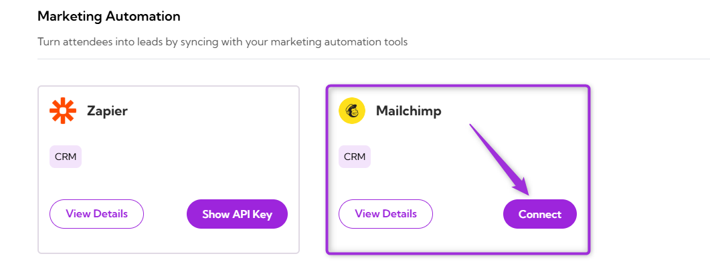

Connect your **Mailchimp** account with **Ticket Spot** to automatically add event attendees to your Mailchimp audience and email marketing campaigns.  
This integration allows you to manage audience lists, automate communications, and track attendee engagement directly from your Mailchimp dashboard.

Let’s get started 🚀

## Prerequisites

Before setting up the integration, make sure you have:

- ✅ An active **[Ticket Spot](https://ticketspotapp.com/)** account with access to the **Integrations** page.  
- ✅ A valid **[Mailchimp](https://login.mailchimp.com/)** account with an API key generated. Follow the guide: **[How to Generate a Mailchimp API Key](https://mailchimp.com/developer/transactional/guides/quick-start/)** to create one.

## Integration

**Step 1**: Log in to your **Ticket Spot** account and click the **Integrations** tab from the top navigation bar to open the integrations page.

**Step 2**: Find the **Mailchimp** platform under the **Marketing Automation** category and click the **Connect** button to open the integration setup window.

**Step 3**: Paste the **API key** you generated from your Mailchimp account and click **Connect** to complete the integration.

**Step 4**: Once the integration is connected successfully, a **green check mark** will appear — confirming that Mailchimp integration is active in Ticket Spot.

## View Details

Review the connection details for your Mailchimp integration, including the linked account and current status. To view details, click the **horizontal ellipsis (⋯)** icon on the **Mailchimp integration** tile and select **View Details** from the dropdown menu.

## Disconnect

Remove the existing connection between your **Mailchimp** account and **Ticket Spot**. Once disconnected, Ticket Spot will no longer be connected to the Mailchimp platform.
Click the **horizontal ellipsis (⋯)** icon on the Mailchimp integration tile and select **Disconnect** from the dropdown menu.

Your Mailchimp integration will be successfully disconnected from Ticket Spot.
