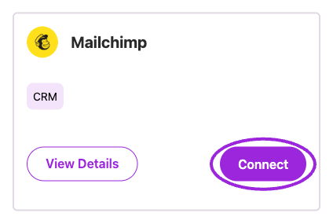
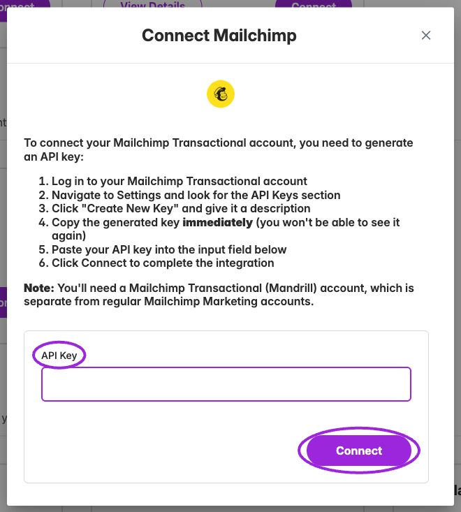

The **Mailchimp** integration connects **Mailchimp Transactional (Mandrill)** for event-email templates. It requires a Transactional account and API key; a regular Mailchimp Marketing audience is a separate product.

## Connect the account

1. Open **Integrations → Marketing Automation**.
2. Find **Mailchimp** and choose **Connect**.
3. Paste the API key from your Mailchimp Transactional account into **API Key**.
4. Choose **Connect** and wait for the connection result.

<Frame caption="Open Integrations and choose Connect on the Mailchimp card. External authorization is a separate step.">
  
</Frame>

<Frame caption="Paste a Mailchimp Transactional (Mandrill) API key in the connection form. This capture uses an empty field and does not connect an account.">
  
</Frame>

## Use a template in an event

In the event's [Email Communication](../event-management/email-communication) settings, choose Mailchimp where the email-provider option is available. Mailchimp delivery requires Business Plus. Select an available template and sender configuration, keep personalization fields intact, and test delivery to a demo recipient before using the campaign for attendees.

Connecting the account alone does not create an attendee audience-sync workflow. Ticket Spot's Mailchimp flow validates the Transactional key and uses its template-email delivery API.

## Review or disconnect

**View Details** explains the integration's capabilities. On a connected card, use its **three-dot menu** for the available actions. **Disconnect** removes the Ticket Spot connection; review any event campaigns that still select Mailchimp before disconnecting.
