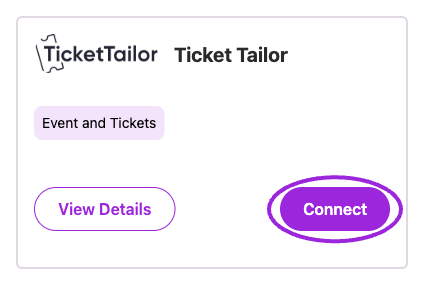
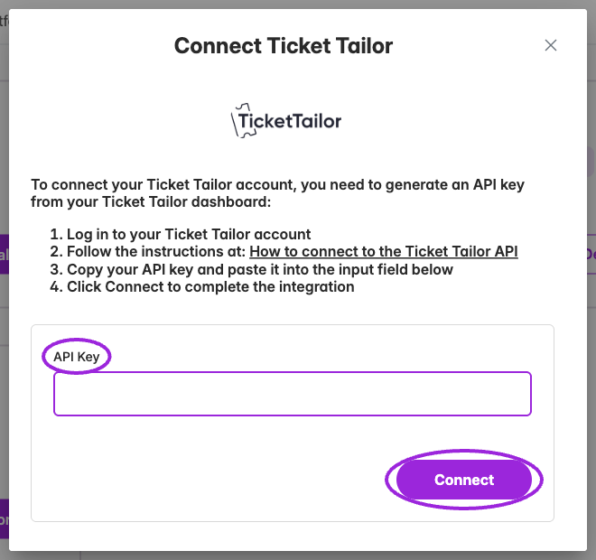
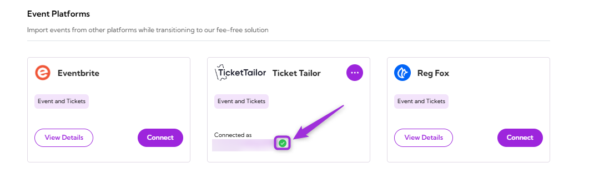
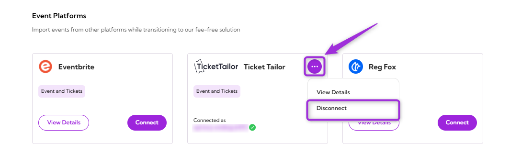

Connect your **Ticket Tailor** account with **Ticket Spot** to bring your existing events into one unified platform. This integration makes it easy to manage your Ticket Tailor events directly in Ticket Spot, helping you transition smoothly without switching between tools.

## Prerequisites

Before setting up the integration, make sure you have:

- ✅ An active **[Ticket Spot](https://ticketspotapp.com/)** account with access to the **Integrations** page.  
- ✅ A valid **tickettailor** account with an API key generated. Follow the guide: **[How to Generate a tickettailor API Key](https://help.tickettailor.com/en/articles/4593218-how-do-i-connect-to-the-ticket-tailor-api)** to create one.

## Integration

**Step 1**: Log in to your **Ticket Spot** account and click the **Integrations** tab from the top navigation bar to open the integrations page.

**Step 2**: Find the **tickettailor** platform under the **Event Platforms** category and click the **Connect** button to open the integration setup window.

<Frame caption="Open Integrations and choose Connect on the Ticket Tailor card. External authorization is a separate step.">
  
</Frame>

**Step 3**: Paste the **API key** you generated from your tickettailor account and click **Connect** to complete the integration.

<Frame caption="Paste a Ticket Tailor API key in the connection form. This capture uses an empty field and does not connect an account.">
  
</Frame>

**Step 4**: Once the integration is connected successfully, a **green check mark** will appear — confirming that tickettailor integration is active in Ticket Spot.

## View Details

Choose **View Details** on an unconnected card, or from the **three-dot menu** on a connected card, to read what the integration supports. Check the card's connected-account label to confirm which account is linked.

## Disconnect

Remove the existing connection between your Ticket Tailor account and Ticket Spot. Once disconnected, Ticket Spot will no longer be connected to the tickettailor platform.
Click the **three-dot menu** icon on the tickettailor integration tile and select **Disconnect** from the dropdown menu.

Your Ticket Tailor integration will be successfully disconnected from Ticket Spot.
