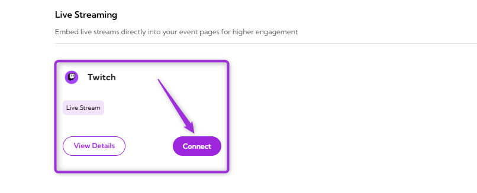
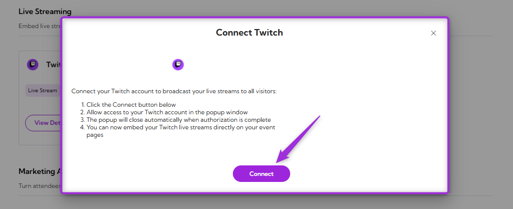
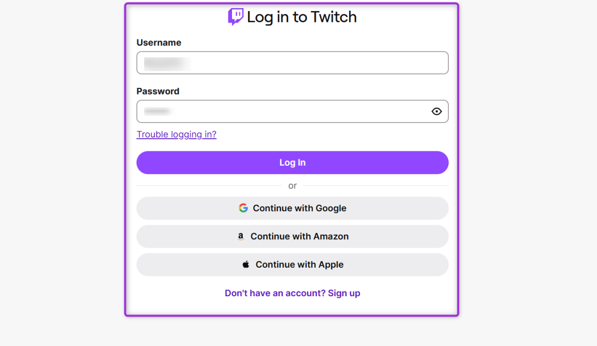
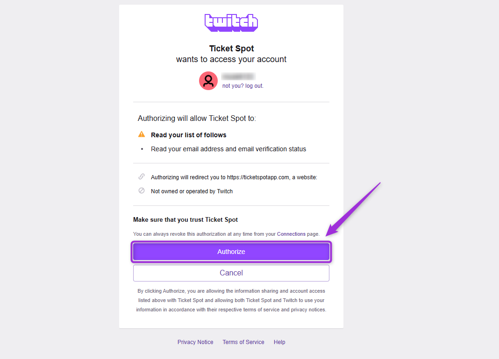
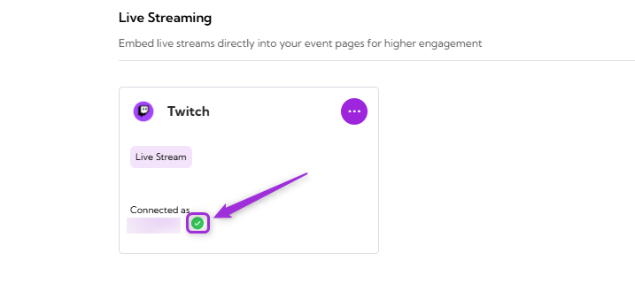
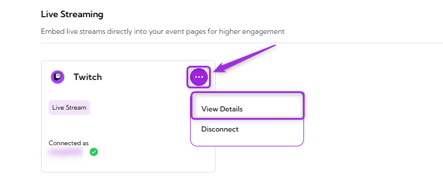
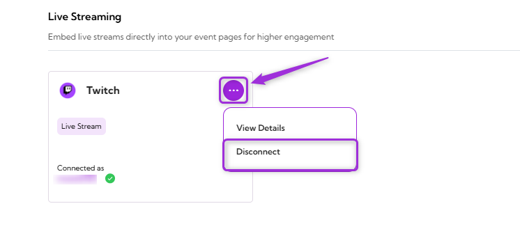

Connect your **Twitch** account with **Ticket Spot** to embed your live streams directly on your event pages. This integration makes it easy to display your Twitch broadcasts within Ticket Spot, helping you increase visibility and engagement for live events.

Let’s get started 🚀

## Prerequisites

Before setting up the integration, make sure you have:

- An active **[Ticket Spot](https://ticketspotapp.com/)** account with access to the **Integrations** page.
- A valid **[Twitch](https://www.twitch.tv/signup)** account with permission to manage your channel and streaming settings.

## Integration

**Step 1**: Log in to your **Ticket Spot** account and click on the **Integrations** tab from the top navigation bar to open the integrations page.

**Step 2**: Find the **Twitch** platform under the **Live Streaming** category and click on the **Connect** button to open the integration setup window.

**Step 3**: Click on the **Connect** button again to proceed.

**Step 4**: Authenticate the connection by signing in with your preferred method (**email**, **Google**, **Amazon**, **Apple**, or any available option). If you’re a new user, complete the **signup** process before continuing.

**Step 5**: Review the permissions requested by Twitch to understand what Ticket Spot can access and manage. Then, click **Authorize** to complete the connection.

**Step 6**: Once the integration is successfully connected, a **green check mark** will appear. This confirms that the **Twitch** integration is active in Ticket Spot.

## View Details

Review the connection details for your **Twitch** integration, including the linked account and current status.  
To view details, click the **horizontal ellipsis (⋯)** icon on the Twitch integration tile and select **View Details** from the dropdown menu.

## Disconnect

Remove the existing connection between your **Twitch** account and **Ticket Spot**. Once disconnected, Ticket Spot will no longer be linked to your Twitch account.  
Click the **horizontal ellipsis (⋯)** icon on the Twitch integration tile and select **Disconnect** from the dropdown menu.

Your Twitch integration will be successfully disconnected from Ticket Spot.
