With **Zapier** integration, you can automate workflows between **Ticket Spot** and other applications without writing any code. It enables triggering actions such as **New Attendee**, which occurs when a new attendee is created, and **New Ticket Order**, which happens when a new ticket order is placed. 

Once the event is **triggered**, you can automate the flow, like sending a customized email through Gmail or other actions, to ensure smooth communication and streamlined operations.

Let’s get started 🚀

## Prerequisites

Before setting up the integration, make sure you have:

- An active **[Ticket Spot](https://ticketspotapp.com/)** account with access to the **Integrations** page.
- A **[Zapier](https://zapier.com/)** account to create and manage your Zaps.

## Integration

**Step 1**: Log in to your **Ticket Spot** account and click on the **Integrations** tab from the top navigation bar to open the integrations page.

**Step 2**: Find the **Zapier** platform under the **Marketing Automation** category and click the **Show API Key** button to open the connection details.

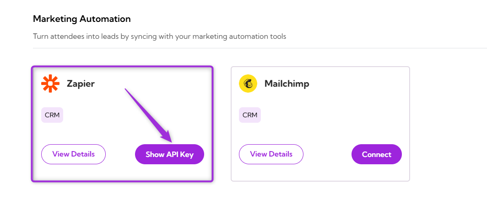

**Step 3**: Click **Generate Zapier API Key** to create your API key.

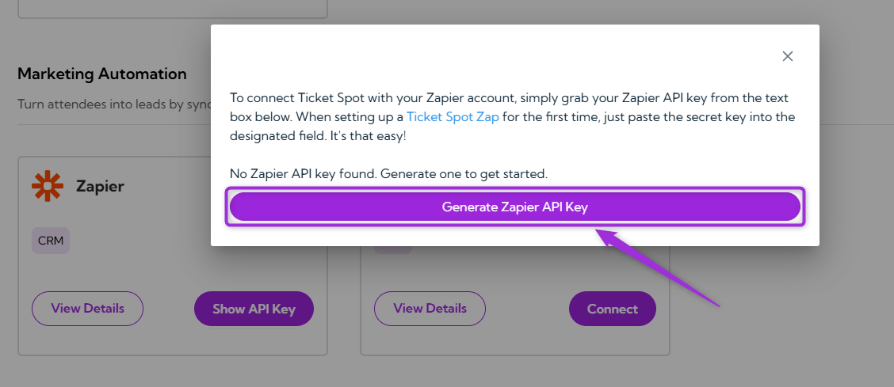

**Step 4**: Copy the **Zapier API Key** displayed in the modal window. You’ll use this key when creating your Ticket Spot Zap for the first time.

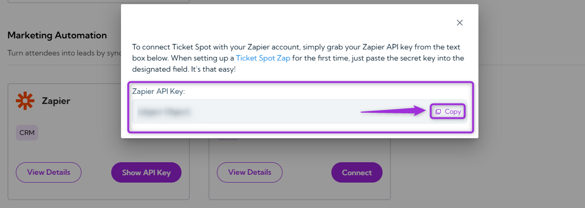

**Step 5**: Open the **[Ticket Spot Zap](https://zapier.com/apps/ticket-spot/integrations)** page on Zapier to set up your first Zap and authenticate it using your Zapier account credentials.

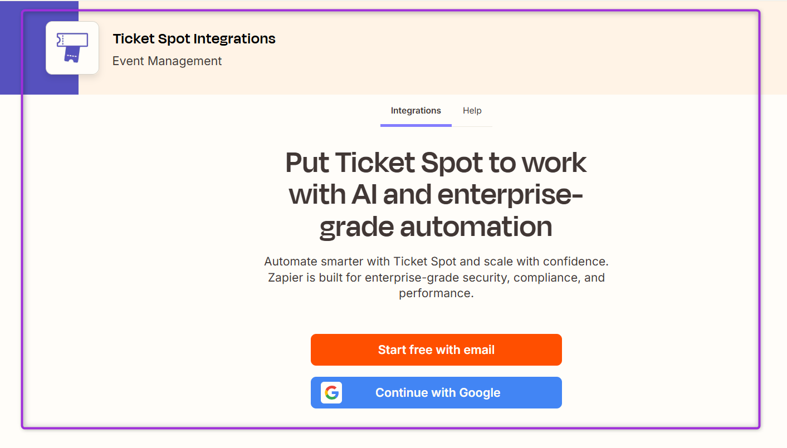

**Step 6**: In Zapier, select **Ticket Spot** as the app and choose a Trigger event, such as **New Attendee** or **New Ticket Order**.

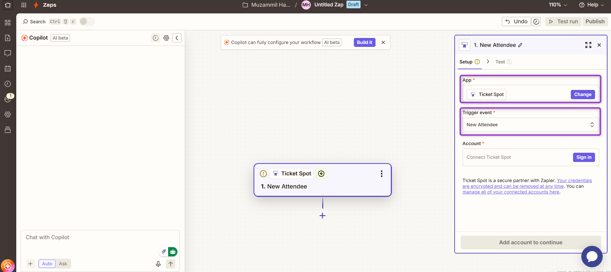

**Step 7**: Click **Sign in** under the **Account** section to start connecting your Ticket Spot account.

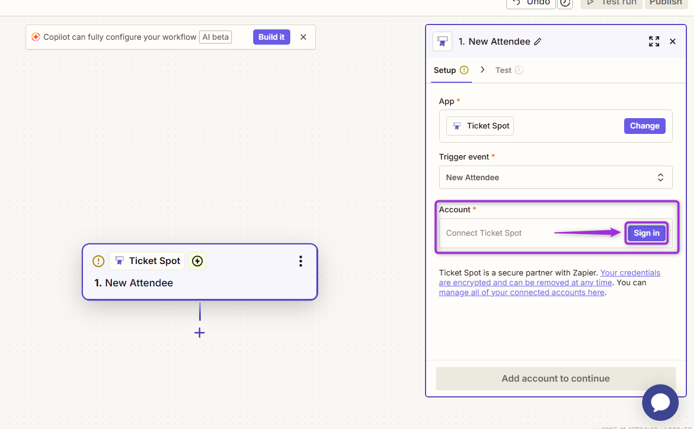

**Step 8**: Paste the **API key** you copied from your Ticket Spot dashboard into the authentication field and click on the **Yes, Continue to Ticket Spot** button to complete the connection.

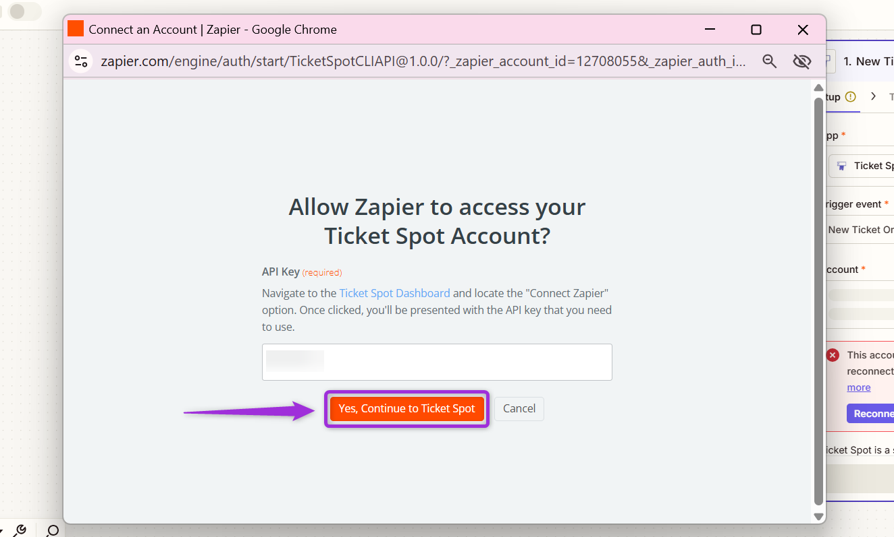

**Step 9**: Click on the **Continue** button to proceed and test the connection.

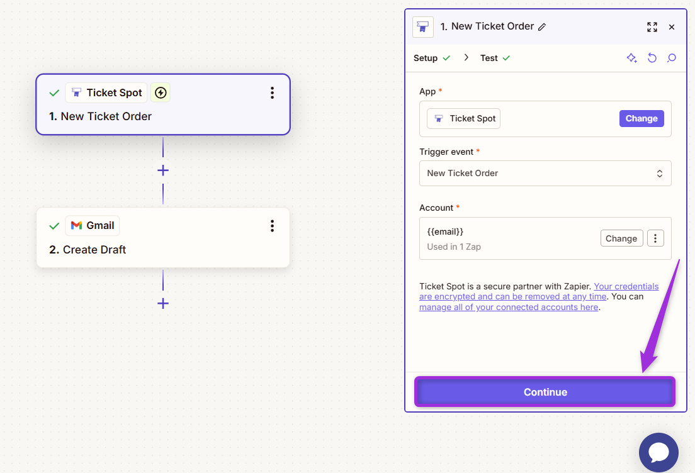

**Step 10**: You will see the available records pulled from Ticket Spot. Select the appropriate record (e.g., **Ticket A…**) and click on the **Continue with selected record** button to proceed with setting up the trigger event.

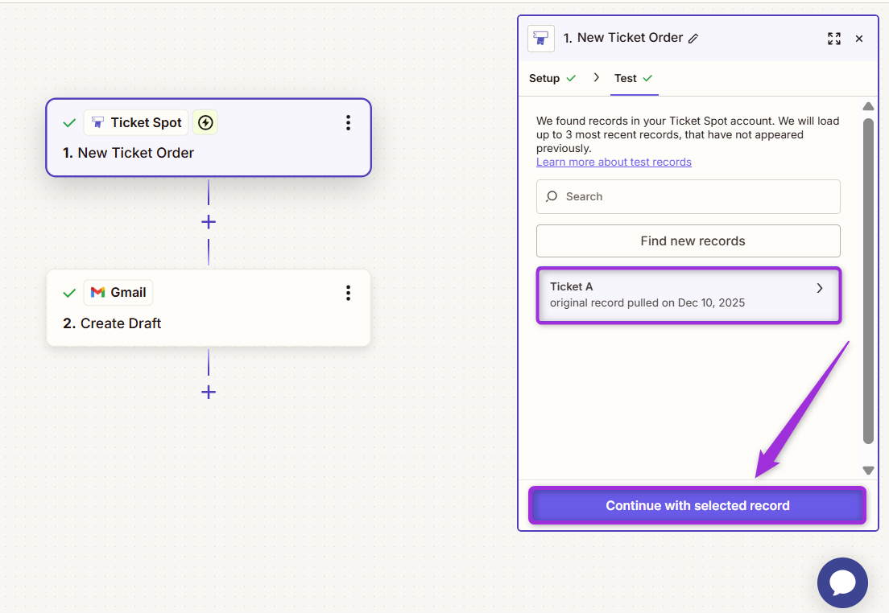

**Step 11**: Once the **New Ticket Order** trigger event is set up, choose the **action app** where you want to send the data. For example, if you want to send an email, select **Gmail** as the app.

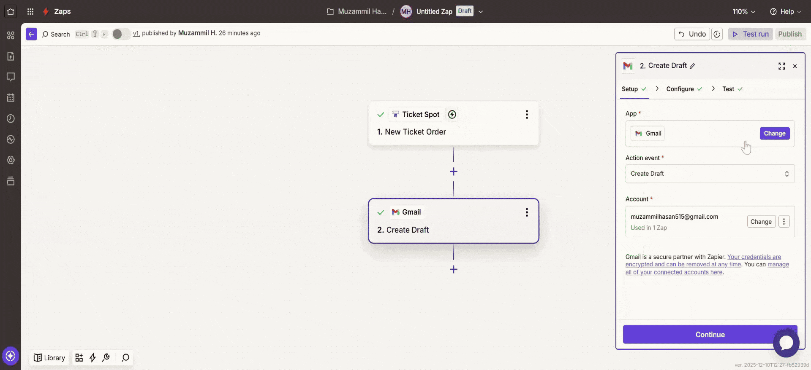

**Step 12**: Select the **action event** you need (e.g., **Create Draft**, **Add Label to Email**, **Archive Email**, **etc**.), and sign in to your **Google account** to authenticate it.

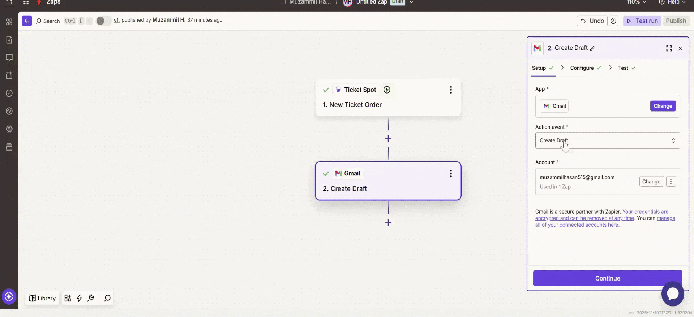

**Step 13**: After setting up all the details, click on the **Continue** button to configure the next steps.

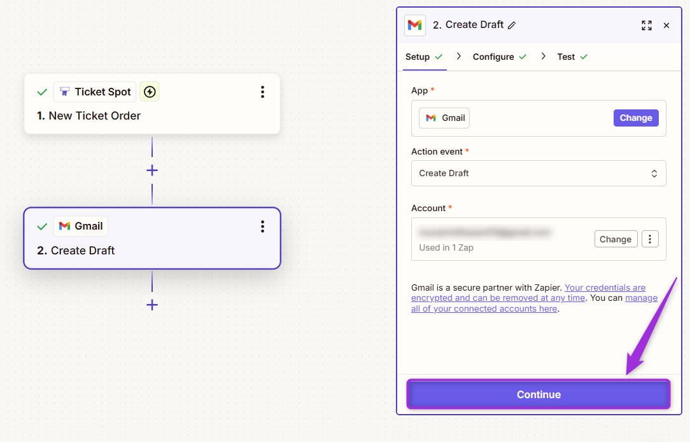

**Step 14**: To create a **draft email**, ensure that you complete at least one of the following fields: **To**, **Cc**, or **Bcc**. You can also add other details such as **Subject**, **From**, **Body**, and **more**.

Here’s a breakdown of the fields you'll configure:

| Field            | Description |
|------------------|-------------|
| **To**           | Enter the email addresses of the primary recipients. You can add multiple recipients separated by commas. |
| **Cc**           | Enter the email addresses of recipients to be carbon-copied. Multiple addresses are allowed. |
| **Bcc**          | Enter the email addresses of recipients to be blind carbon-copied. Multiple addresses are allowed. |
| **Subject**      | Define the subject line of the email (e.g., "Ticket Spot Test Run"). |
| **From**         | This will be auto-filled with your account’s email address (e.g., example@gmail.com). |
| **From Name**    | Specify the name you want the email to appear from (e.g., Muze). |
| **Body Type**    | Choose between Plain Text or HTML for the email body format. |
| **Body**         | Write the main content of the email (e.g., "Hello there"). |
| **Add Signature**| Select to add the default signature to the email. |
| **Label or Mailbox** | Choose the labels you want to apply to the email (e.g., Inbox and all labels). |
| **Attachments**  | Optionally attach files to the email if needed. |

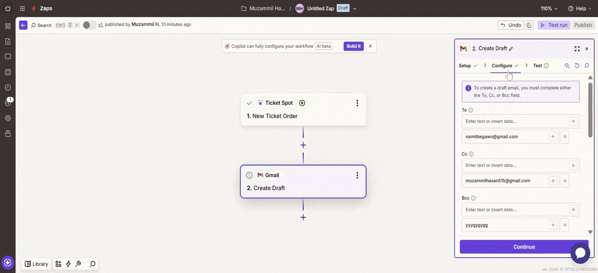

**Step 15**: Test your Zap by confirming that the data from Ticket Spot triggers the desired action (e.g., sending a draft email in Gmail), then click **Publish** to activate the Zap and automate the workflow.

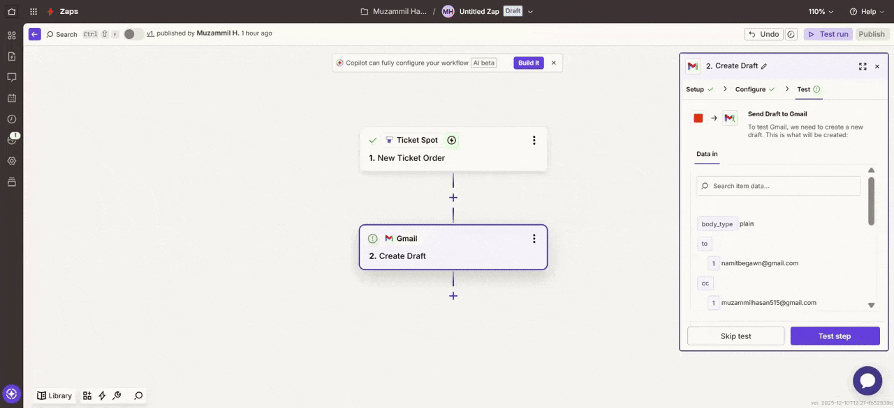

## Trigger the Action: Ticket Purchase

As we’ve set up, when a new **ticket is purchased**, the **trigger event** activates, and the corresponding action (e.g., sending a draft email) will occur.

- **Ticket Purchase:** When a user buys a ticket, it triggers the Zap.
- **Action:** A draft email is automatically sent to the recipient (as configured earlier in Gmail).

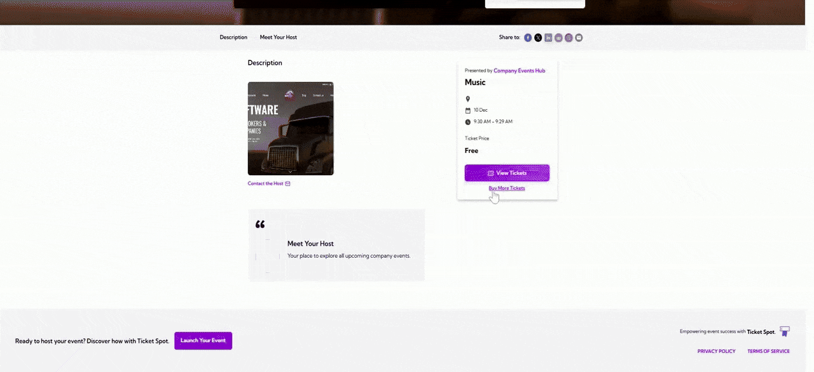

## View the Draft Email in Gmail

After triggering the Zap, open **Gmail** and check for the **draft email**. You’ll see that the draft email was automatically created and sent after a new ticket purchase in Ticket Spot.

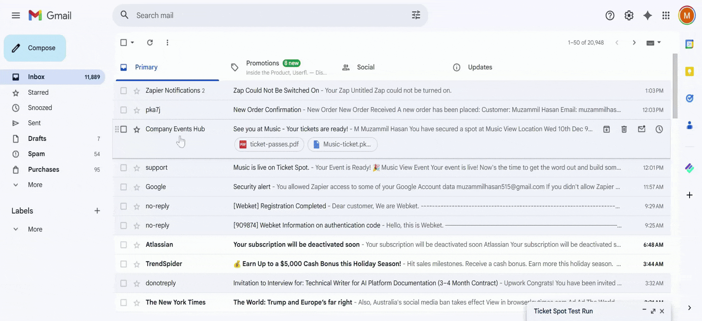

Your **Zap** is fully set up and tested successfully; the workflow will run automatically each time a ticket is purchased.
