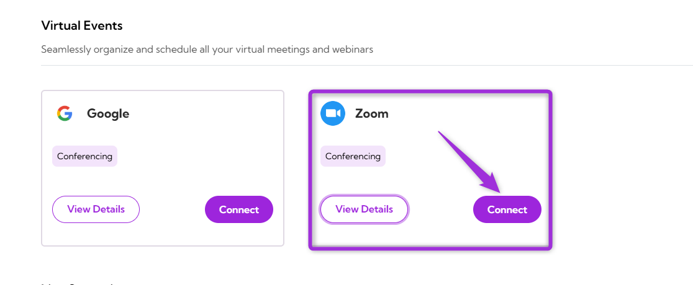
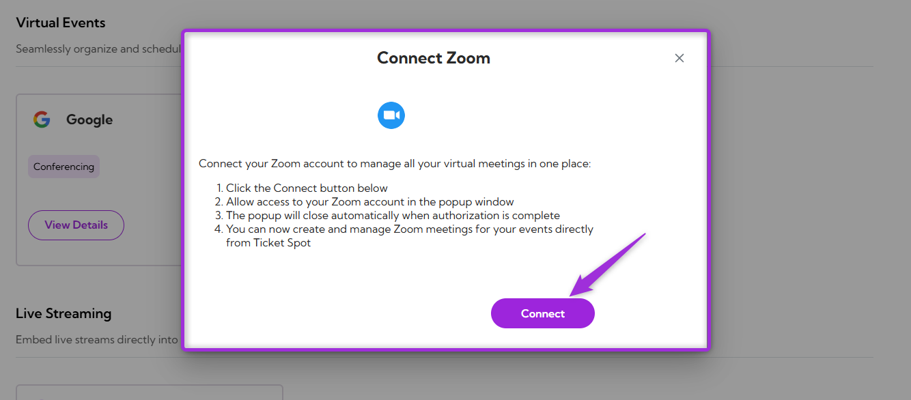
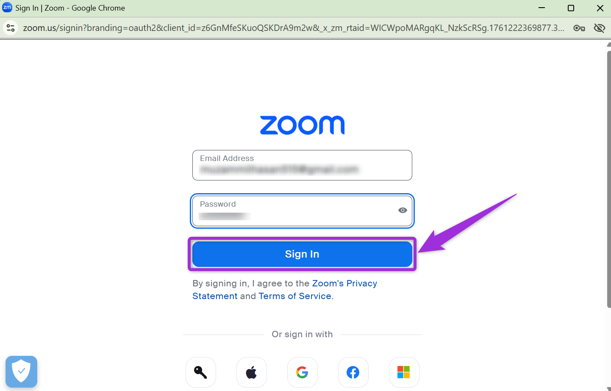
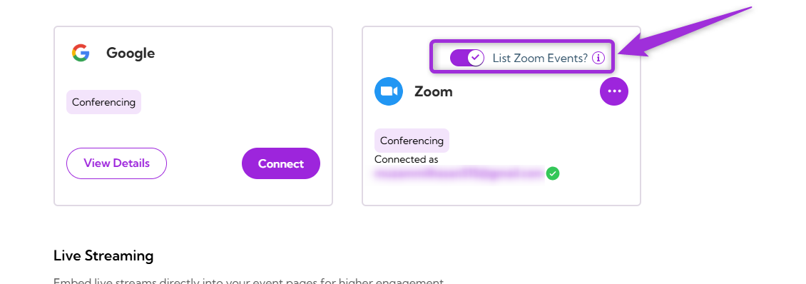
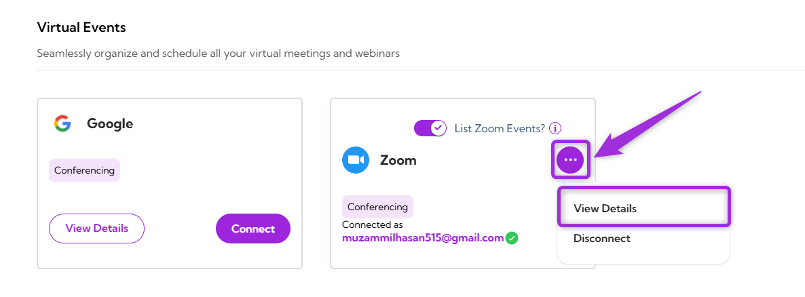
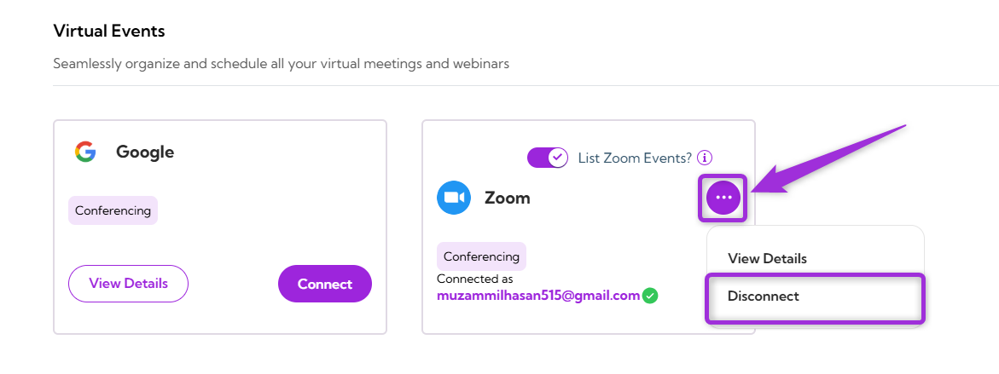

Organizers can host and manage virtual **Zoom** events directly from their **Ticket Spot** dashboard. After successful integration between Zoom and Ticket Spot, you can automatically create Zoom meetings for your events, eliminating the need to switch between multiple platforms.

Let's get started🚀

## Prerequisites

Before setting up the integration, make sure you have:

- ✅ An active **[Ticket Spot](https://ticketspotapp.com/)** account with access to the **Integrations** page.
- ✅ An active **[Zoom](https://support.zoom.com/hc/en/article?id=zm_kb&sysparm_article=KB0061316)** account to authorize and manage your virtual meetings.

## Integration

**Step 1:** Log in to your **Ticket Spot** account and click on the **Integrations** tab from the top navigation bar to open the integrations page.

**Step 2:** Find the **Zoom** platform under the **Virtual Events** category and click on the **Connect** button to open the integration setup window.

**Step 3:** Click on the **Connect** button again to proceed.

**Step 4:** Authenticate the connection to your **Zoom** account by entering your sign-in credentials.

**Step 5:** Review the required permissions to understand what **Ticket Spot** can access and manage in your **Zoom** account. Then, select the checkmark button and click **Allow** to finish connecting your account.

> 💡 **Note:** If you need to use a different Zoom account, click **Switch Account**, then repeat Steps 4 and 5 to complete the connection.

**Step 6:** Once the integration is successfully connected, a **green check mark** will appear. This confirms that the **Zoom integration** is active in **Ticket Spot**.

## List Zoom Events

When enabled, **Ticket Spot** displays your upcoming Zoom meetings and webinars so you can link or use them directly for your events. When disabled, Ticket Spot does not show your existing Zoom meetings, but you can still add new Zoom links manually if needed.

## View Details

Review the connection details for your **Zoom integration**, including the linked account and current status.  
To view details, click the horizontal **ellipsis (⋯)** icon on the **Zoom integration** tile and select **View Details** from the dropdown menu.

## Disconnect

Remove the existing connection between your **Zoom** account and **Ticket Spot**. Once disconnected, **Ticket Spot** will no longer be connected to the **Zoom** platform.  
Click on the horizontal **ellipsis (⋯)** icon on the **Zoom integration** tile and select **Disconnect** from the dropdown menu.

Your **Zoom integration** will be successfully disconnected from **Ticket Spot**.