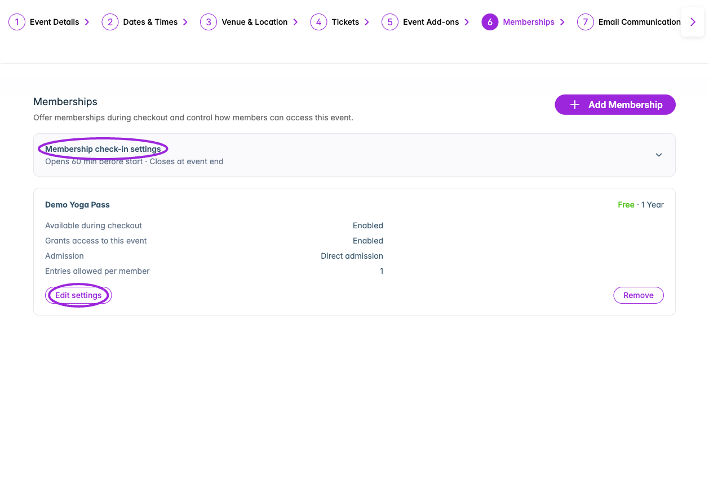
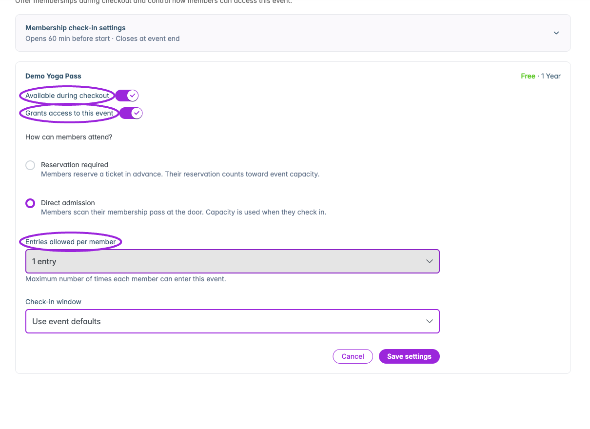
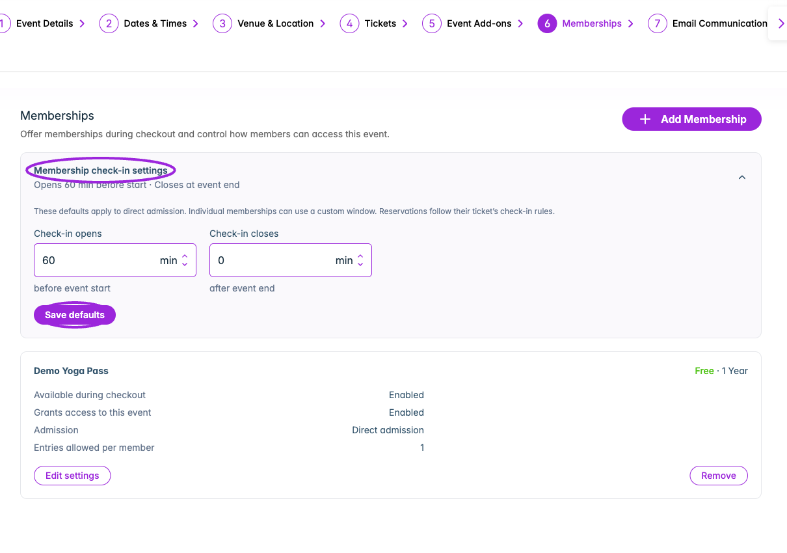
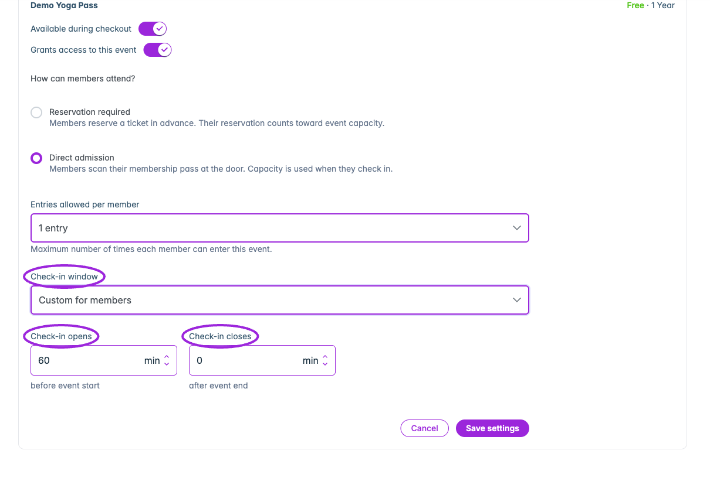

Assign memberships to an event, then choose whether holders enter with a membership pass or reserve a ticket. Checkout availability, event admission, and ticket-specific discounts have separate controls.

## Assign from Memberships

<Frame caption="Select included events for the membership. Event-level Memberships settings decide whether holders enter directly or reserve a ticket.">
  
</Frame>

1. Open **Memberships** in the top navigation.
2. Click **Edit** beside the membership.
3. Open the **Events** tab.
4. Choose the eligible events under **Select Events** and review the selected names.
5. Click **Update Membership**.

## Assign from an event

<Frame caption="Each event membership has separate checkout availability, event access, admission mode, and per-member entry limits.">
  
</Frame>

1. Open **Events** and edit a saved event.
2. Open the **Memberships** step.
3. Click **Add Membership**.
4. Choose an existing active membership under **Select Membership**.
5. Review its price, duration, and default entries per event. Choose **Available during checkout** and **Grants access to this event** independently.
6. Click **Add Membership**. The event shows a membership card with its current settings.
7. Select **Edit settings** to configure admission and entry limits, then **Save settings**.

Only memberships not already assigned are offered. If none are available, create a membership first or check that the intended membership is active.

The Memberships step appears after the event has been saved. It is hidden for external-link/no-ticket setups and individual child events in a series; use the parent event where applicable.

## Admission and checkout settings

<Frame caption="Edit settings separates selling the membership at checkout from granting event access. Choose direct admission or a required reservation and set entries per member.">
  
</Frame>

| Control | Effect |
|---|---|
| **Available during checkout** | Offers the membership during this event's checkout. |
| **Grants access to this event** | Allows the membership to provide admission to this event. This is separate from offering it for sale. |
| **Reservation required** | Members reserve a ticket in advance. The reservation counts toward event capacity. |
| **Direct admission** | Members scan their membership pass at the door. Capacity is used at check-in. |
| **Entries allowed per member** | Choose one entry, a custom number, or unlimited. This sets the event-specific limit. |
| **Check-in window** | For direct admission, use the event defaults or **Custom for members**. |

If both checkout availability and event access are off, the membership is neither offered during checkout nor accepted for admission to this event.

## Membership check-in settings

<Frame caption="Membership check-in settings sets the event defaults for direct admission. Reservations follow the ticket’s check-in rules.">
  
</Frame>

<Frame caption="Direct admission can use a custom window: minutes before event start for opening, and minutes after event end for closing.">
  
</Frame>

Expand **Membership check-in settings** to review the event's direct-admission defaults. **Check-in opens** is measured in minutes **before event start**; **Check-in closes** is measured in minutes **after event end**. A closing offset of 0 closes at event end. Select **Save defaults** to apply changes.

An individual membership can choose **Custom for members** and use its own window. Ticket reservations follow the ticket's check-in rules instead. This is different from a ticket's late cutoff, which is measured after event **start**.

## Remove an assignment

Use the membership card's **Remove** action and confirm **Remove Membership** to remove that membership's event assignment. This is different from deleting the membership program or removing a particular holder.

## Check the attendee experience

Use a test holder to verify admission to an assigned event and rejection at an unassigned event. Check the holder's visits afterward in [member management](./manage-members). For ticket reservations or discounted ticket purchases, configure [ticket access and pricing](./ticket-access-and-pricing) too.
