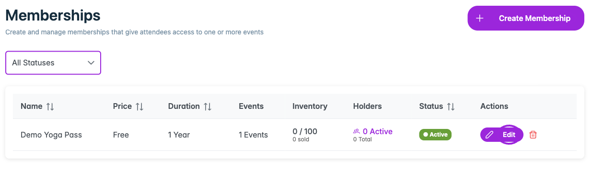
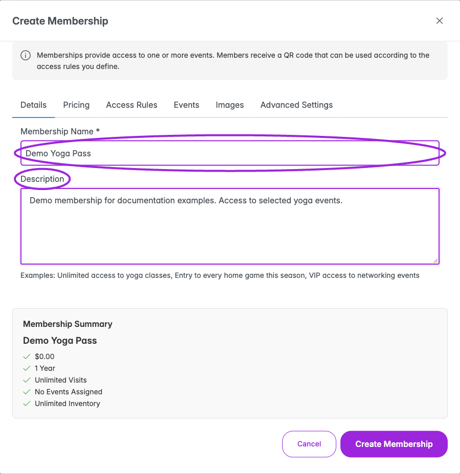
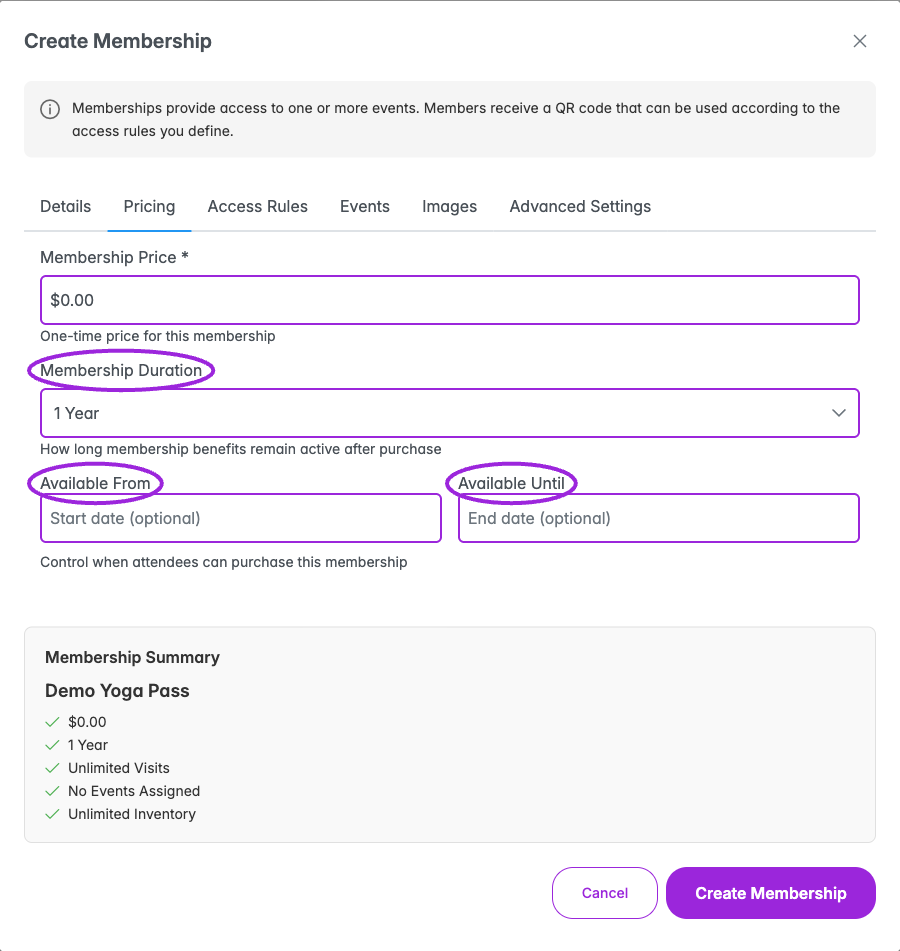
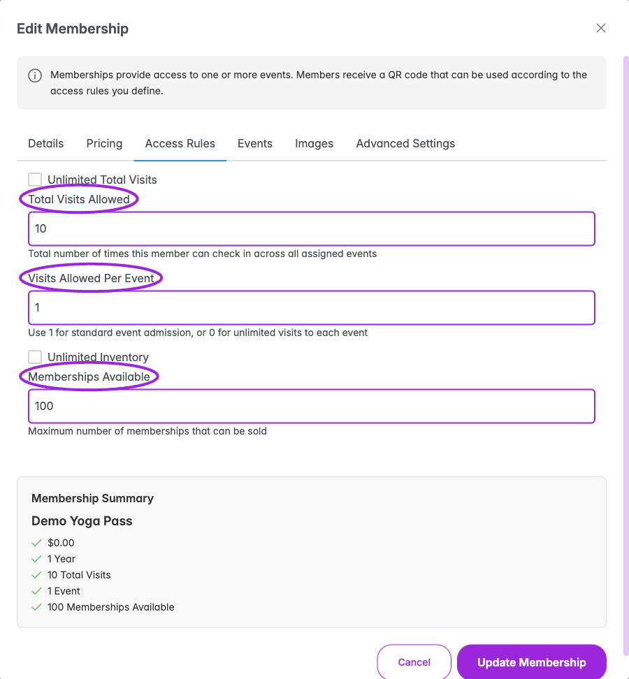
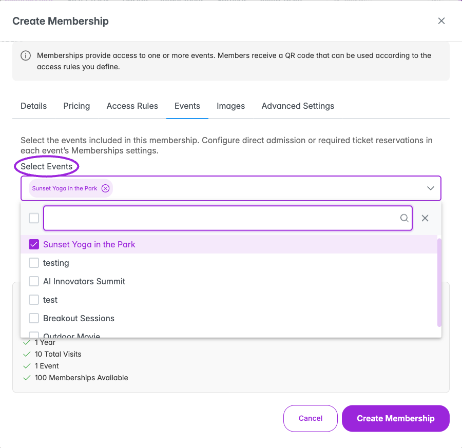
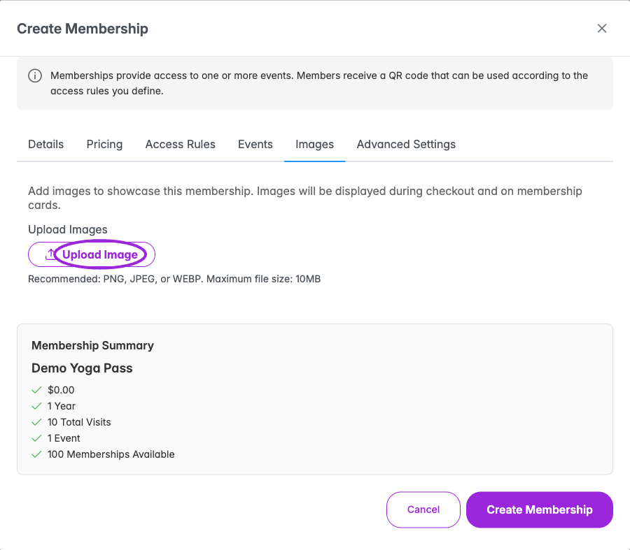
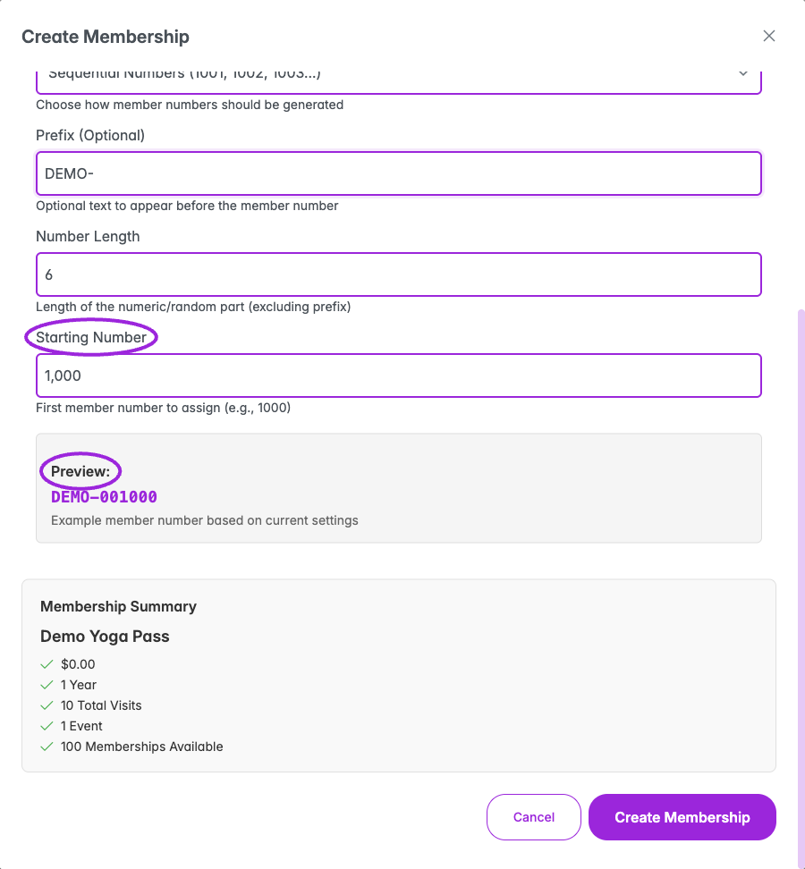
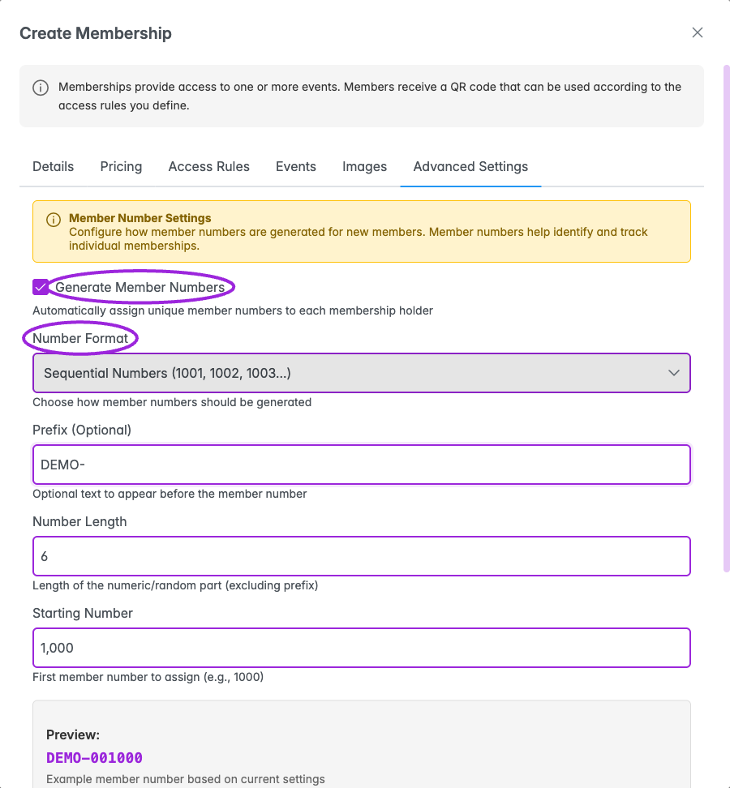

Create the membership before applying it to tickets or adding it to an event.

## Navigation

<Frame caption="The membership list shows price, duration, event assignments, inventory, holders, and status. Edit reopens the program settings.">
  
</Frame>

1. Select the correct site in your dashboard.
2. Open **Memberships** in the top navigation.
3. Click **Create Membership**, or **Get Started** if the site has no memberships yet.

The editor contains **Details**, **Pricing**, **Access Rules**, **Events**, **Images**, and **Advanced Settings** tabs.

## Details

<Frame caption="Name the membership and describe its benefits. This Demo Yoga Pass is a documentation example.">
  
</Frame>

| Field | What to set |
|---|---|
| **Membership Name** | Required. Use a name attendees recognize, such as Annual Pass or Ten-Class Package. |
| **Description** | Explain included benefits, eligible events, and visit limits. |
| **Status** | When editing an existing membership, choose Active or Inactive. |

## Pricing

<Frame caption="Set the one-time price, benefit duration, and optional membership sales window. The summary keeps these separate from visit limits.">
  
</Frame>

| Field | What to set |
|---|---|
| **Membership Price** | The one-time membership price. Enter the amount shown in the editor's currency. |
| **Membership Duration** | How long benefits remain active after purchase: 30 Days, 90 Days, 6 Months, 1 Year, or Lifetime Access. |
| **Available From** | Optional date and time when purchases can begin. |
| **Available Until** | Optional date and time when purchases end. |

The sales window controls when someone can buy. The duration controls their benefits after purchase; these are different settings.

## Access Rules

<Frame caption="Set total visits, visits per event, and memberships available independently. This saved example allows ten visits, one per event, with 100 memberships for sale.">
  
</Frame>

| Field | What to set |
|---|---|
| **Unlimited Total Visits** | Enable for no overall visit limit across assigned events. |
| **Total Visits Allowed** | With unlimited visits off, enter the total permitted check-ins across all assigned events, such as 10. |
| **Visits Allowed Per Event** | Enter 1 for one admission per event, or 0 for unlimited visits to each event. |
| **Unlimited Inventory** | Enable if there is no limit on the number of memberships sold. |
| **Memberships Available** | With unlimited inventory off, enter the maximum number of memberships for sale. |

A limited number of memberships for sale is not the same as a holder's allowed visits. Set each independently.

## Events

<Frame caption="Select included events for the membership. Event-level Memberships settings decide whether holders enter directly or reserve a ticket.">
  
</Frame>

Open **Events**, then use **Select Events** to choose the events the membership admits holders to. Search the list if needed and review the selected event names. Review each event's **Memberships → Edit settings** to choose direct QR admission or a required ticket reservation, checkout availability, entry limits, and check-in windows.

If no events are assigned, members cannot use the membership for event admission. You can also [assign it from an existing event](./assign-to-events).

## Images

<Frame caption="Images appear during checkout and on membership cards. Upload PNG, JPEG, or WEBP files within the displayed size limit.">
  
</Frame>

Open **Images** and upload images to represent the membership. They appear during checkout and on membership cards. Remove an unwanted image using its remove control.

## Advanced Settings: member numbers

<Frame caption="The preview combines the prefix with the selected number format. Number length applies to the generated portion, excluding the prefix.">
  
</Frame>

<Frame caption="Enable member numbers and choose a format, prefix, length, and starting number. Review the preview before creating the membership.">
  
</Frame>

Enable **Generate Member Numbers** to assign an identifying number to new holders.

| Field | Options or meaning |
|---|---|
| **Number Format** | Sequential Numbers, Random Numbers, Random Alphabetical (no vowels), or Random Alpha-Numeric. |
| **Prefix (Optional)** | Text before the number, such as M- or MEMBER-; up to 10 characters. |
| **Number Length** | Length of the numeric/random portion, excluding the prefix; 4–12 characters. |
| **Starting Number** | For sequential numbers, the first number to assign, such as 1000. |
| **Preview** | Check the example number before saving. |

## Save and verify

1. Click **Create Membership**, or **Update Membership** when editing.
2. Wait for completion, then check the row on the Memberships page.
3. Reopen **Edit** and verify duration, visit limits, and assigned events.
4. Continue with [event assignment](./assign-to-events) and [ticket access/pricing](./ticket-access-and-pricing) as needed.
