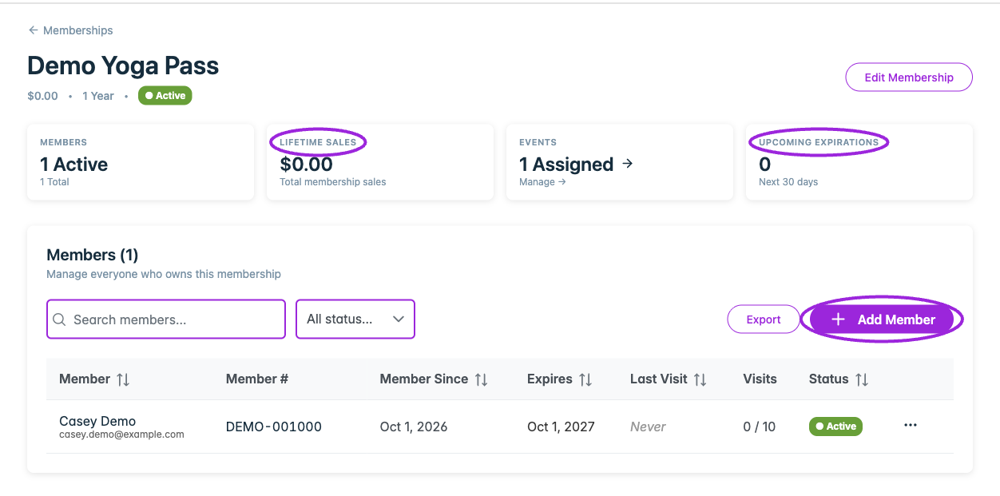
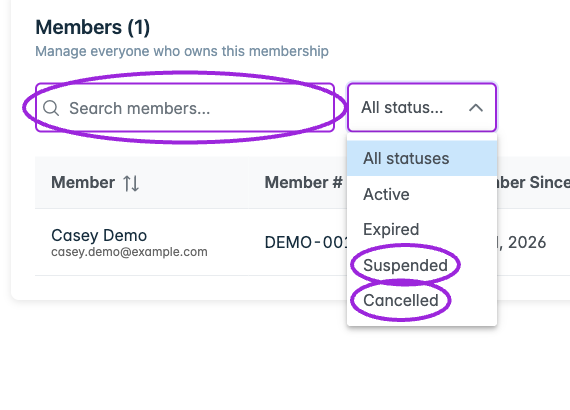
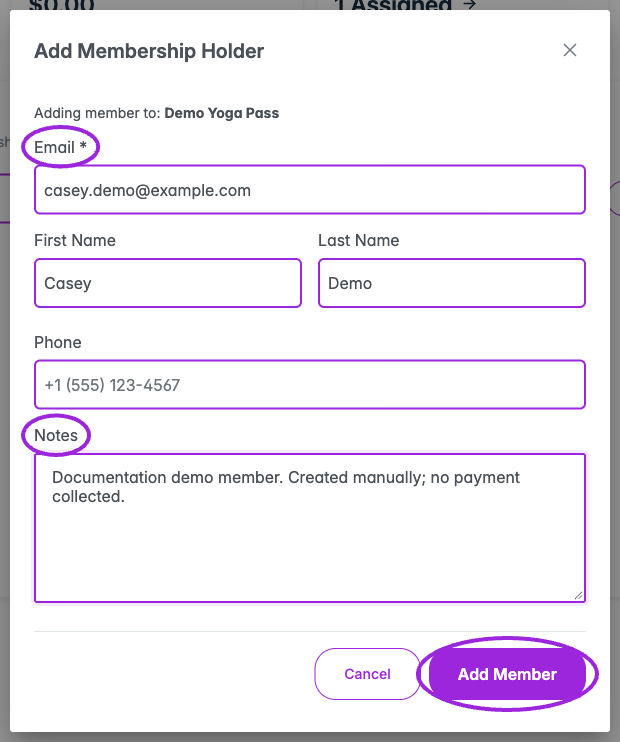
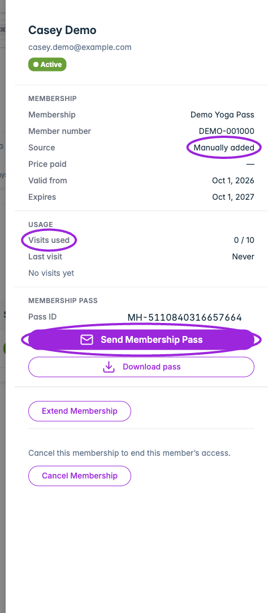
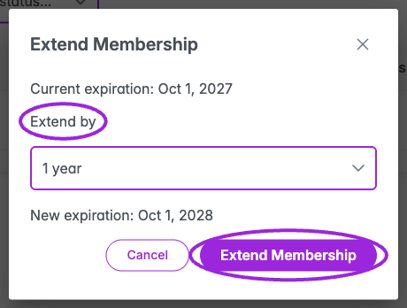
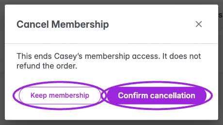

Open **Memberships** and select the active/total count in a program's **Holders** column. This opens that program's members page. **Edit Membership** changes the program itself; selecting a member opens that person's record.

## Read the overview

| Card | Meaning |
| --- | --- |
| **Members** | Active holders and total holders for this program. |
| **Lifetime Sales** | Recorded membership purchase revenue. Manually assigned holders do not add purchase revenue. |
| **Events** | Number of assigned events. Select the card to edit the program's event assignments. |
| **Upcoming Expirations** | Active holders whose expiry falls within the next 30 days. |

These cards describe the whole membership program. Searching or filtering the holder list does not turn them into totals for the visible rows.

<Frame caption="The overview cards describe the membership program; the list below shows matching holders.">
  
</Frame>

## Find a member

Use **Search members...** to search names, email addresses, or member numbers. The **Status** filter offers **All statuses**, **Active**, **Expired**, **Suspended**, and **Cancelled**.

<Frame caption="Search member identity or number, then choose a status filter.">
  
</Frame>

| Column | What it shows |
| --- | --- |
| **Member** | Name and email. Select the name to open details. |
| **Member #** | Assigned member number, with a copy control when present. |
| **Member Since** | Activation date, including manually added memberships. |
| **Expires** | Expiry date, **Expired**, or **Never**. |
| **Last Visit** | Most recent recorded visit, or **Never**. |
| **Visits** | Visits used against the program's limit, or **Unlimited**. |
| **Status** | Stored membership status. |

Select a sortable column header to change the order. Lists longer than 25 members offer pages of **25**, **50**, or **100**. Select a row or its three-dot action control to open details.

## Add a holder manually

1. Select **Add Member**.
2. In **Add Membership Holder**, enter **Email**. First name, last name, phone, and internal notes are optional.
3. Select **Add Member** and wait for the new member to appear.
4. Open the member record and verify the program, member number, activation date, and expiry.

Manual assignment starts an active membership using the program's standard duration and increments its issued quantity. It does not collect card payment or automatically send a pass email. Send the pass separately when ready. The form's notes are saved, but the current detail drawer does not display a notes editor.

<Frame caption="Add a synthetic Demo member with an email address and optional contact information or notes.">
  
</Frame>

## Read a member's record

The detail drawer shows:

- **Membership**: program, member number, source (**Manually added** or **Purchased**), price paid, valid-from date, and expiry. Manual assignment shows a dash for price paid.
- **Usage**: visits used, last visit, and recorded check-in history. Entries distinguish a consuming **Visit** from **Re-entry** where applicable.
- **Membership pass**: the pass ID with a copy control, **Send Membership Pass**, and **Download pass**.

A member number and pass ID serve different purposes. Use the member number where checkout asks for membership verification; use the membership pass for scanning at entry.

<Frame caption="The member drawer shows source, validity, usage, and pass actions.">
  
</Frame>

## Send or download a pass

**Send Membership Pass** immediately sends an email to the holder's saved address. Check that address first. The email links to the member's account, where they sign in with that email to view or download the pass.

**Download pass** downloads the selected holder's PDF without sending an email. Handle the pass and its QR code as access credentials.

## Extend access

1. Select **Extend Membership** in the member drawer.
2. Choose **1 month**, **3 months**, **6 months**, or **1 year**.
3. Compare **Current expiration** with **New expiration**.
4. Select **Extend Membership** to save, or **Cancel** to leave it unchanged.

The extension starts from the later of today or the existing expiry. An expired membership becomes active when extended. A cancelled membership or a membership with no expiry cannot be extended using this control. Changing the program's duration is a separate action and does not replace this holder-specific workflow.

<Frame caption="Compare the current and new expiration before saving an extension.">
  
</Frame>

## Cancel access

Select **Cancel Membership**, review the confirmation, then select **Confirm cancellation**. **Keep membership** closes it without a change. Cancellation ends this holder's access and does not refund an order. Handle any refund through the relevant payment workflow.

<Frame caption="The cancellation confirmation explains that ending access does not refund an order.">
  
</Frame>

## Export members

Select **Export** to download a CSV for this program. The export respects the **Status** filter. **The search box does not restrict the export**, so a searched list and the downloaded file can contain different numbers of people.

The CSV includes first and last name, email, phone, membership, member number, price paid, status, activation and expiration dates, total scans, and QR code. Price Paid is stored in the currency's minor units; for USD, 1000 represents $10.00. Treat the file as private because it includes contact details and pass credentials.

## Related guides

- [Create a membership](./create-membership)
- [Assign memberships to events](./assign-to-events)
- [Members-only tickets and member pricing](./ticket-access-and-pricing)
