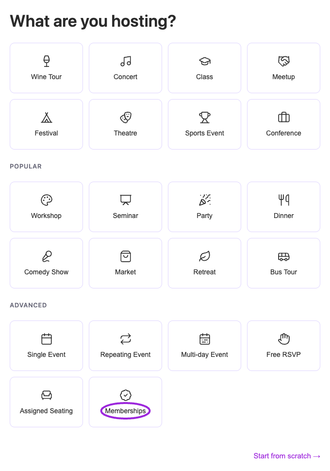
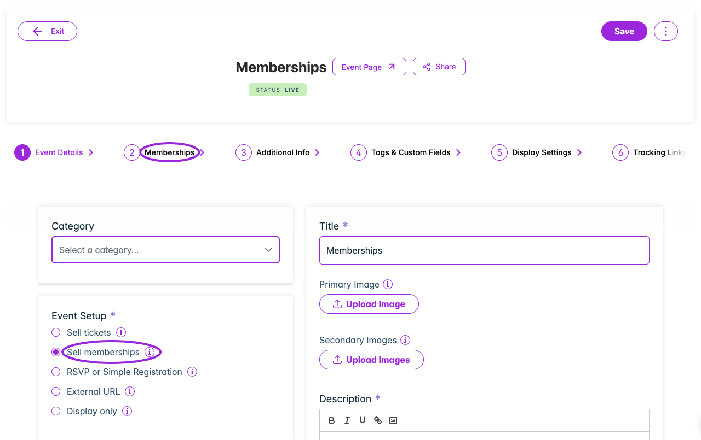
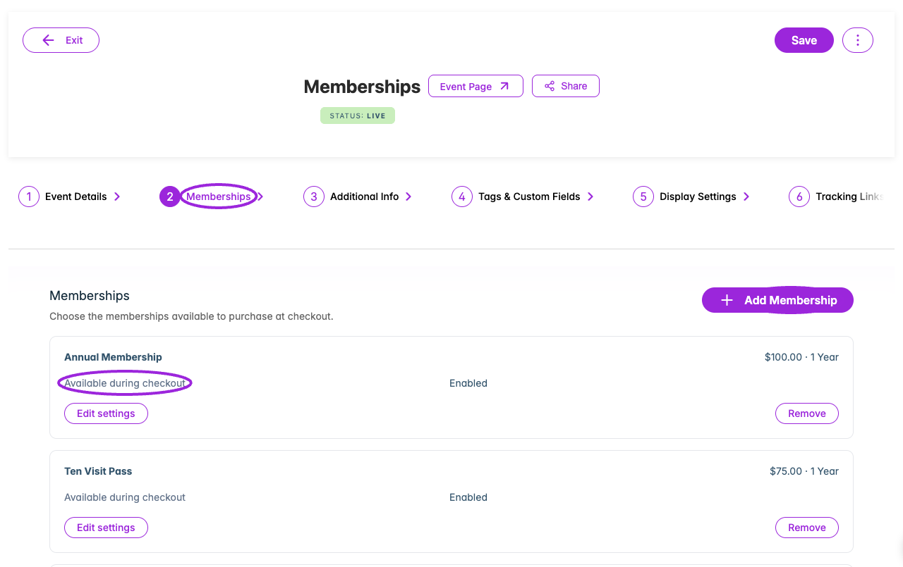
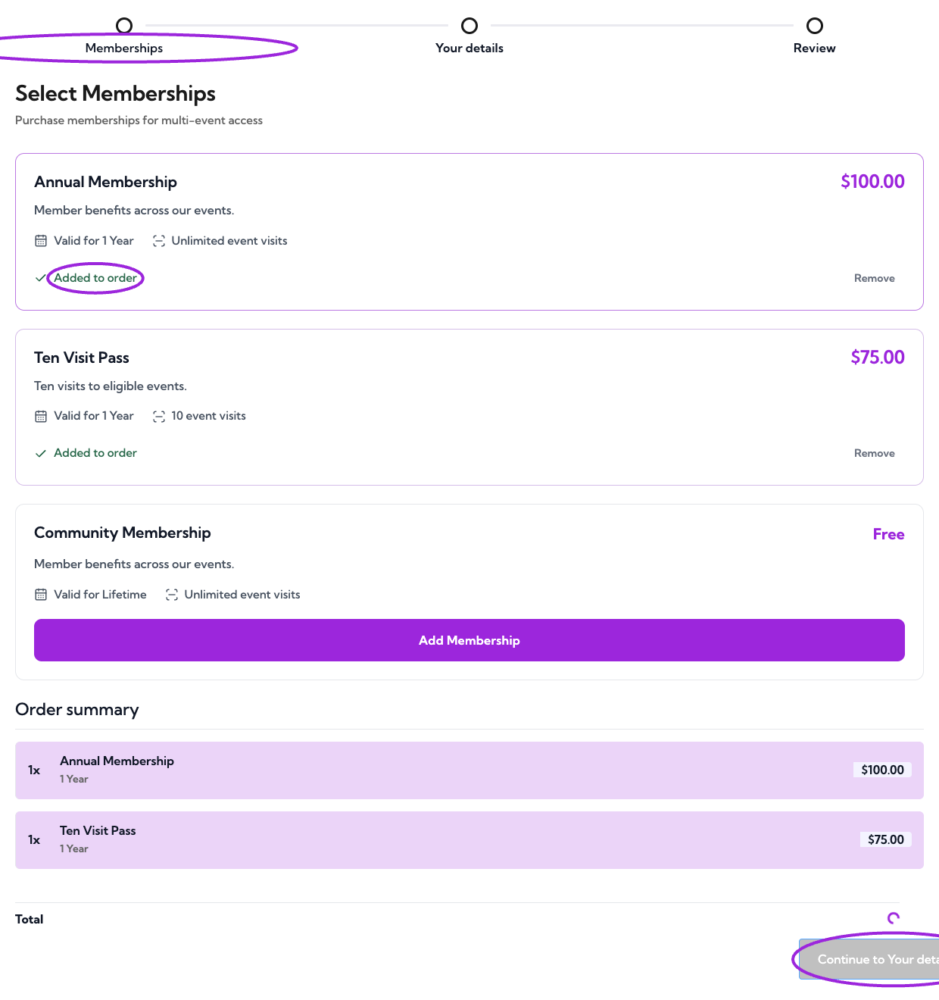
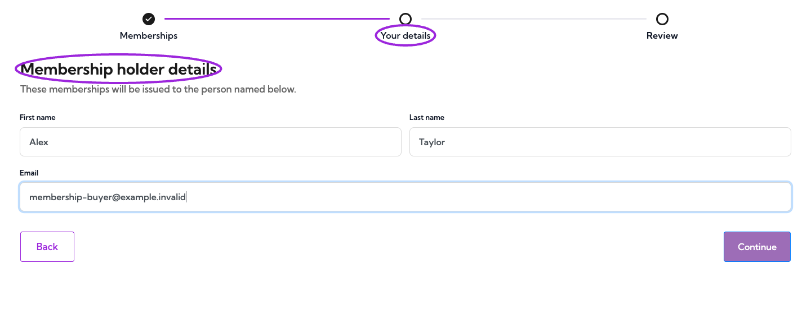
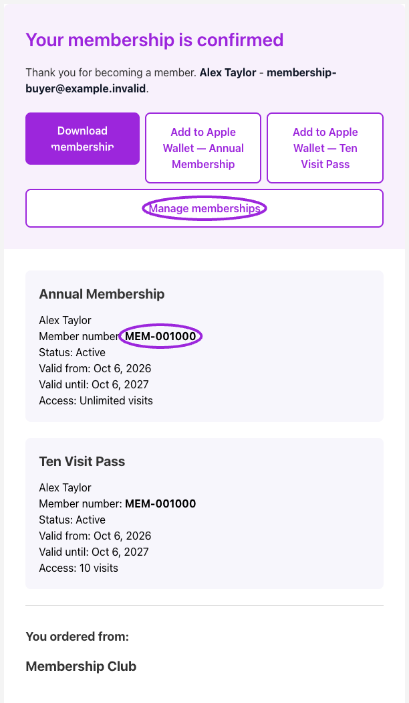
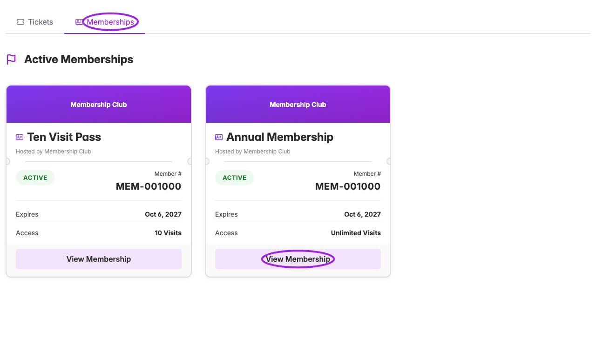
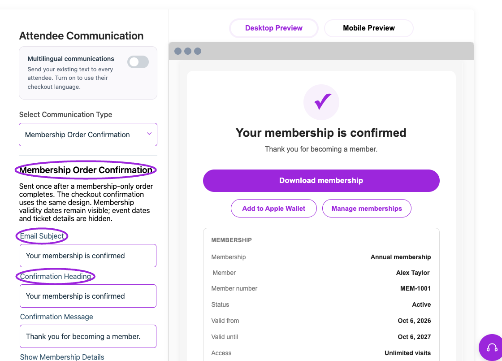
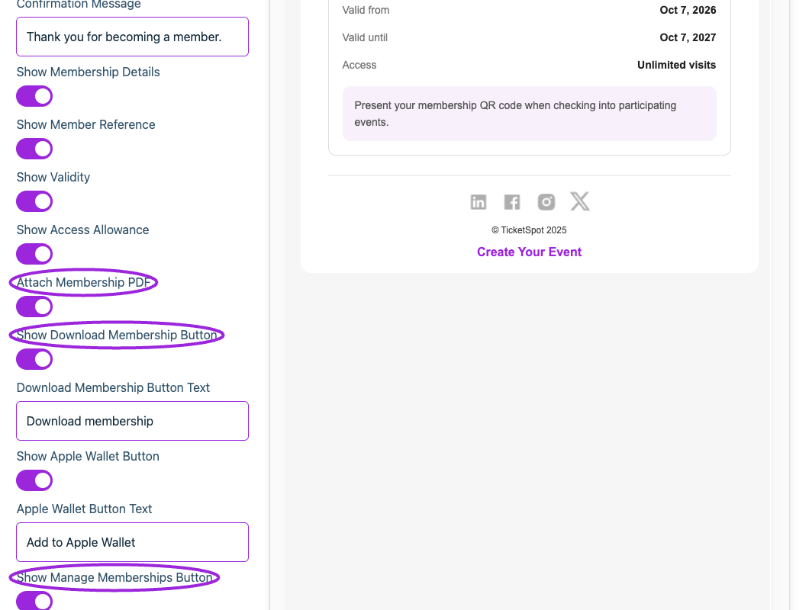
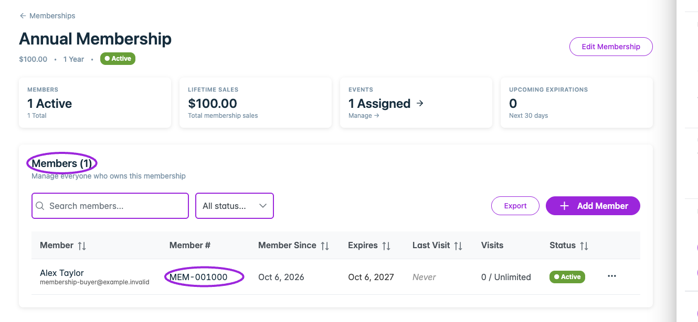

Use **Sell memberships** to offer annual passes, visit packages, or club memberships on their own. Buyers choose a membership, enter their details, and complete payment without choosing an event ticket.

You need **Business or higher** and an active [membership program](./create-membership). Membership prices are one-time prices; a one-year validity period does not create an automatically renewing subscription.

## Create the membership sales event

1. Open **Events → Create Event**.
2. In onboarding, choose **Browse more templates → Advanced → Memberships**. This opens the membership sales editor directly, without date or ticket questions. If you already have the full editor open, choose **Sell memberships** under **Event Setup**.
3. Enter a title, description, and any images you want buyers to see.
4. Save the event. Its **Memberships** tab opens automatically so you can choose what to sell.

<Frame caption="Choose Memberships under Advanced to open an evergreen membership sales page. No event is created until you save the editor.">
  
</Frame>

<Frame caption="Sell memberships creates an evergreen checkout. Its event editor keeps Memberships and purchaser questions, while hiding ticket, date, reminder, and SMS setup.">
  
</Frame>

There is no event date or time for buyers to choose. The event remains available while it is published. Each membership still follows its own inventory, active status, and optional sales start/end dates.

Create a separate sales event if the existing event is recurring or already has attendees. This keeps its reservations and admission settings intact.

## Choose the memberships to sell

1. Open the saved event's **Memberships** tab.
2. Select **Add Membership** and choose an active membership.
3. Enable **Available during checkout**, then add it.
4. Repeat for other memberships you want to offer.
5. Publish the event and use **Share** or your event widget to open its checkout.

<Frame caption="The Memberships tab lists the plans offered at checkout. Admission controls are hidden because this event is a sales page.">
  
</Frame>

Offering a membership here does not grant admission to this sales event. Separately [assign the membership to the real events](./assign-to-events) where its benefits should apply.

## Check the buyer experience

The checkout has three steps: **Memberships → Your details → Review**. The review includes payment for paid memberships, or **Confirm membership** for a free membership. A ticket selection is never required.

<Frame caption="Buyers can choose one or several membership plans. Each card shows its price, validity period, and visit allowance.">
  
</Frame>

The person entered under **Your details** becomes the holder of every membership in this order. Use **Additional Info** in the event editor for any extra purchaser questions you need.

<Frame caption="Your details collects the membership holder's name and email once for the order.">
  
</Frame>

After completion, the confirmation shows each purchased membership, its holder, member reference, validity dates, and allowance. Event dates, venue information, calendar links, and ticket details are hidden.

<Frame caption="The confirmation identifies each membership and offers Download membership, Apple Wallet passes, and Manage memberships.">
  
</Frame>

**Download membership** downloads the order's membership PDF. Several memberships are combined into one PDF. Apple Wallet provides a separate pass for each membership where Wallet is available on your plan. **Manage memberships** opens the member portal after sign-in; an order with several memberships opens the Memberships tab.

<Frame caption="Manage memberships opens the buyer's Memberships tab. View Membership shows the individual pass, status, expiry, and remaining access.">
  
</Frame>

## Customize the confirmation

Open **Design → Attendee Communication → Membership Order Confirmation**. This controls both the dedicated confirmation email and the checkout confirmation.

<Frame caption="Membership Order Confirmation has its own subject, heading, message, detail toggles, PDF attachment, and action buttons.">
  
</Frame>

- Set the email subject, confirmation heading, and message.
- Choose whether to show membership details, member references, validity, and access allowances.
- Enable **Attach Membership PDF** to include the actual membership PDF in the email.
- Choose the Download membership, Apple Wallet, and Manage memberships buttons and their labels.

<Frame caption="Use the attachment and action switches to choose how members receive and manage their passes.">
  
</Frame>

The member reference uses the holder's member number, or its membership-holder reference when numbering is disabled. It identifies the issued membership, rather than the program's catalogue ID.

### Send confirmations in the buyer's language

Turn on **Multilingual communications**, select **Membership Order Confirmation**, and choose an **Editing language**. The subject, heading, message, button text, and membership labels have supplied translations in all 18 supported languages. You can override the text for each language using the same controls as other confirmations.

Delivery and the checkout confirmation use the buyer's saved checkout language. Regional preferences use the base language where needed; English is the fallback. Turning multilingual communications off keeps your saved translations and uses your default text. Membership plan names and custom text are not automatically translated.

The dedicated email is sent after a completed membership-only order. These sales events have no Email Communication or SMS Communication tabs and do not schedule event reminders. Orders containing event tickets and memberships keep the regular ticket order confirmation.

For the PDF itself, use **Design → Tickets & Passes → Membership PDF**. Your [brand colors and logo](../branding-and-design/brand-design) also apply to membership confirmations.

## Manage the issued memberships

Open **Memberships**, select **View Members** for a program, and review the holder's details. Purchases create membership holders without adding event attendees or consuming admission capacity.

<Frame caption="View Members lists issued memberships with their member number, holder, status, validity, and visit usage.">
  
</Frame>

See [Manage members](./manage-members) for holder actions and [Ticket access and pricing](./ticket-access-and-pricing) for using a membership when reserving real event tickets.
