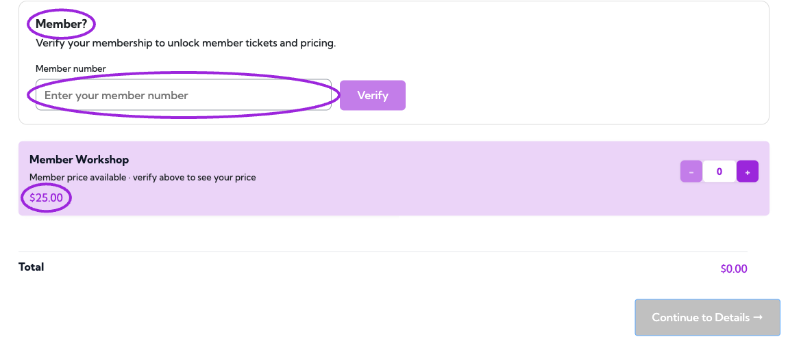
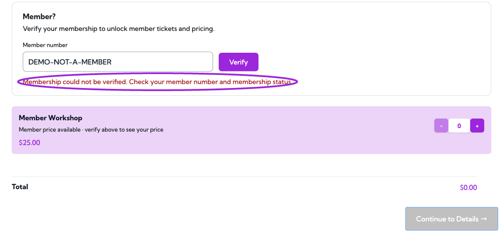
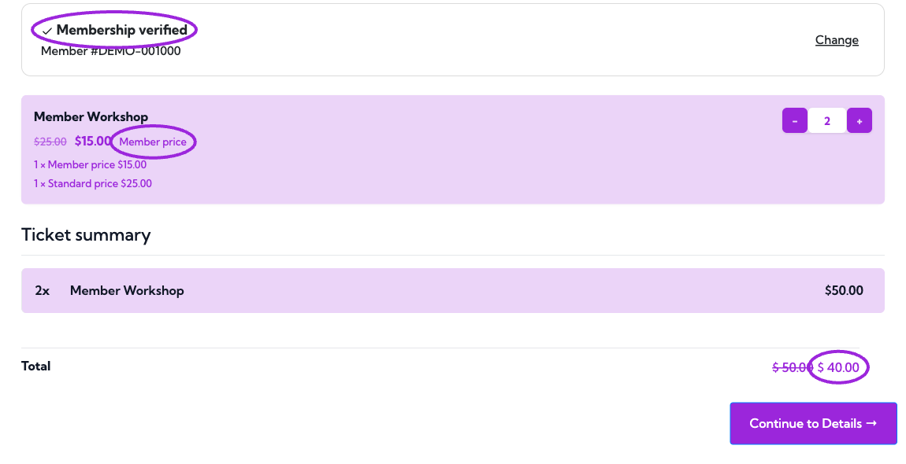

Use ticket-level membership rules when attendees need to buy or reserve a specific ticket. These rules are separate from [membership QR admission to assigned events](./assign-to-events).

## Before you start

Create the membership first and use Business or higher. Open **Events**, edit your event, select **Tickets**, then create or edit a ticket.

## Restrict ticket purchases to members

<Frame caption="Members only restricts ticket purchase to the selected active membership programs. Choose at least one eligible membership, then save the ticket and event.">
  
</Frame>

1. Find **Who can purchase this ticket?** in the ticket's access controls.
2. Choose **Members only**.
3. Under **Eligible memberships**, select at least one membership.
4. Save the ticket and save/update the event.

A holder with any of the selected active memberships qualifies for this access rule. Choose **Everyone** to remove the membership-only restriction. An access code and a membership rule are separate controls; do not use one as a substitute for the other.

## Offer a member price

<Frame caption="Enable Member pricing, select eligible programs, and enter a member price. This example offers a $15 member ticket against the $25 regular price.">
  
</Frame>

1. Set the ticket's regular price.
2. In **Pricing & Access**, enable **Member pricing**.
3. Select the **Eligible memberships** for that price.
4. Enter the **Member price**. Enter **0** for a free member ticket.
5. Save the ticket and save/update the event.

Member pricing applies to **one ticket per verified membership per order**. If a promo code also applies, the lowest eligible price is used. This does not mean a member discount and promo discount are added together.

For a public event with a member discount, keep access set to **Everyone** and configure only Member Pricing. For a members-only event, configure access as well as any special price you want.

## Verify membership during checkout

When a ticket has member access or pricing rules, the buyer sees **Member?** and a **Member number** field above the ticket list.

1. Enter the number from the membership pass and select **Verify**.
2. Wait for **Membership verified** and the updated prices. An invalid or ineligible number shows an error and does not unlock benefits.
3. Choose ticket quantities and check the total. One eligible ticket per verified membership per order receives the member price.
4. Use **Change** to clear the verification and enter a different number. Recheck the ticket selection and total afterward.

<Frame caption="Before verification, this ticket shows its $25 public price.">
  
</Frame>

<Frame caption="An unrecognized membership number cannot unlock member benefits.">
  
</Frame>

<Frame caption="Two tickets total $40: one at the $15 member price and one at the $25 public price.">
  
</Frame>

## Verify the rules

Test with an active eligible membership, a non-member, and an expired or ineligible membership. Confirm the displayed price and purchase eligibility. Test an order with more than one ticket so the one-ticket member-price limit is clear before you advertise the offer.

If the selector says no memberships are available, create the membership first. If loading fails, choose **Retry** and confirm you are in the correct site.
