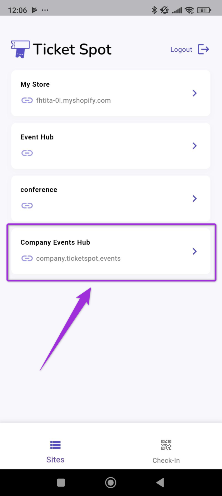
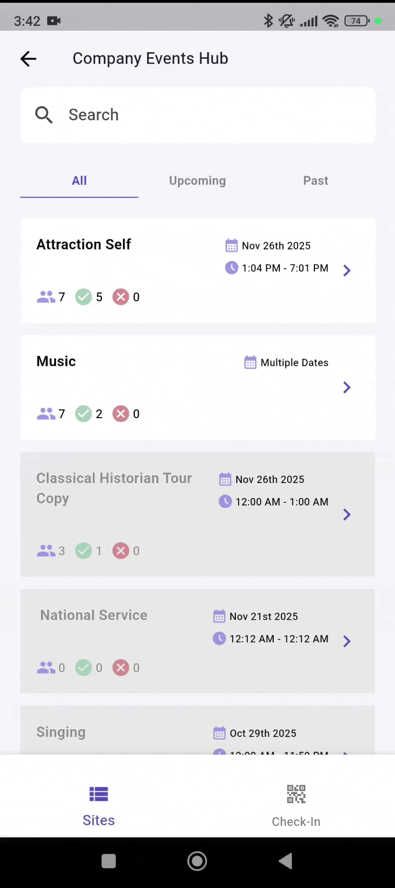
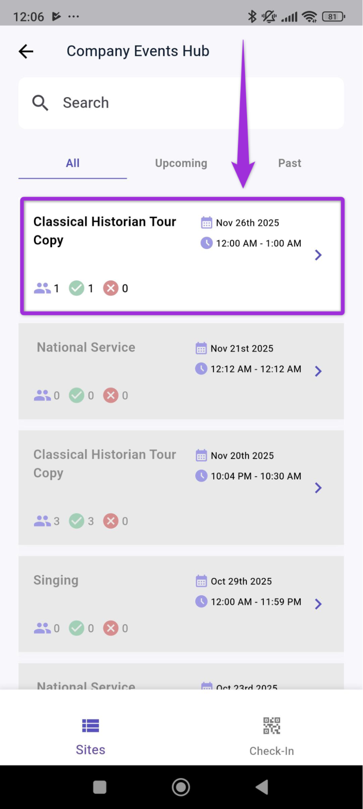
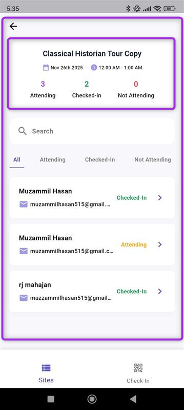
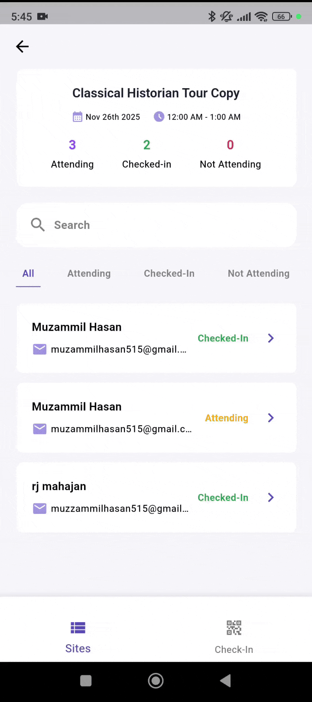
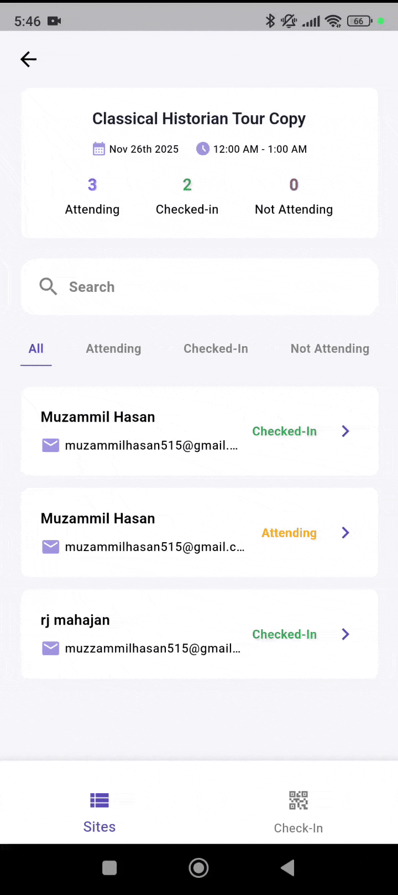
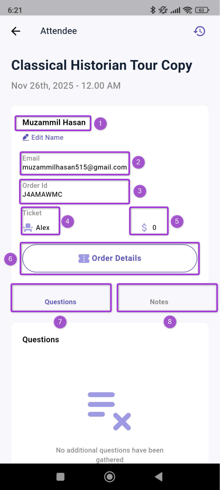
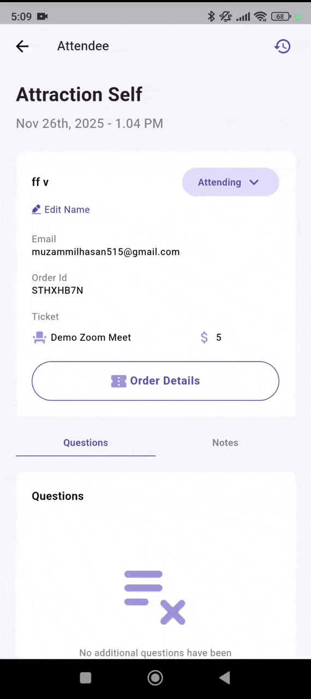
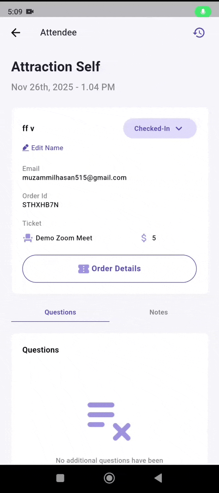

**Attendee Details** provides a quick way to view and manage information for each attendee during an event. Here, you can review their registration details, update their check-in status, access order information, and add internal notes as needed. 

This guide explains how to navigate the attendee information view and use each option effectively while managing event check-ins.

Let’s get started. 🚀

**Step 1**: Log in to your **Ticket Spot** account and select the **Site** where you want to view attendee details for an event.

**Step 2**:A dashboard will open where you can view events under the **All**, **Upcoming**, and **Past** tabs.

**Step 3**: Select the **event** (e.g., Classical Historian) to view its attendee list and access detailed information for each attendee.

**Step 4**: The Event dashboard displays key details such as date, time, and attendee counts. You can quickly see how many attendees are Attending, Checked in, or Not Attending.

Use the tabs to filter and view specific groups of attendees.

- **All** - View the complete attendee list for the event, including every registration.
- **Attending** - See attendees who have confirmed they will attend the event.
- **Checked-In** - View attendees who have already checked in at the event.
- **Not Attending** - See attendees who have declined or are marked as not attending.

**Step 6**: Click on any attendee from the list to view more details about that particular attendee.

**Step 7**: Review the attendee details to see all the information associated with that attendee.

| Ref. | Field            | Description                                                                 |
|------|------------------|-----------------------------------------------------------------------------|
| 1    | **Name**         | Displays the attendee’s full name as entered during registration.           |
| 2    | **Email Address**| Shows the email used during purchase or signup.                             |
| 3    | **Order ID**     | Unique identifier for the attendee’s order.                                 |
| 4    | **Ticket Type**  | The ticket category assigned to the attendee.                               |
| 5    | **Ticket Price** | The price of the ticket purchased.                                          |
| 6    | **Order Details**| Shows a summary of the attendee’s order, including their tickets and check-in options. |
| 7    | **Questions Tab**| Contains responses the attendee provided during checkout.                   |
| 8    | **Notes Tab**    | Allows you to view or add internal notes related to the attendee.           |

## Manage Attendee Actions

You can manage attendees directly from the attendee details view. This includes editing the attendee’s name and updating their attendance status based on their check-in activity during the event.

### Edit Name
Use the Edit Name option if you need to correct or update the attendee’s name. This helps ensure that attendee records remain accurate for reporting and check-in tracking.

### Change Attendee Status
You can update the attendee’s status using the dropdown options:

- **Attending** – The attendee is expected to attend.
- **Checked-In** – The attendee has arrived and successfully checked in.
- **Not Attending** – The attendee is marked as not attending.

These options allow you to keep the attendee list updated throughout the event.

> **Note:** The **Status changes** feature is only available for **live** events, and the options will **not** be visible once an event has **ended**.
