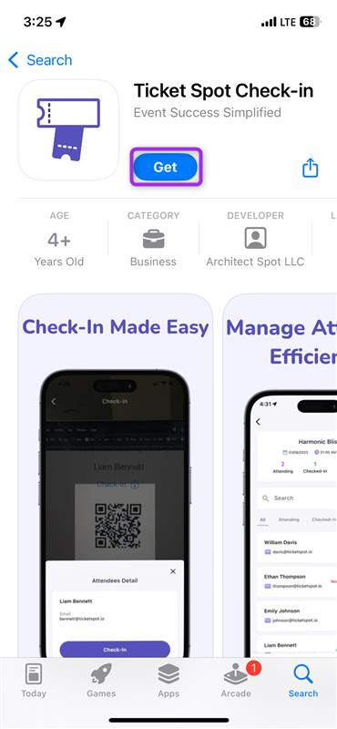
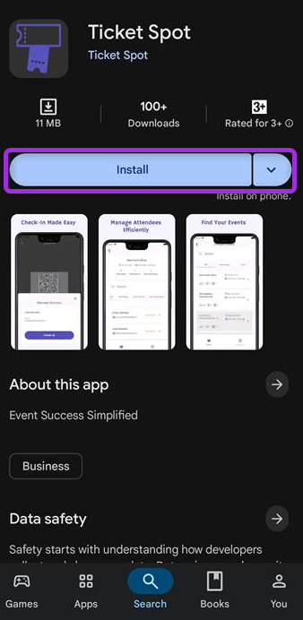
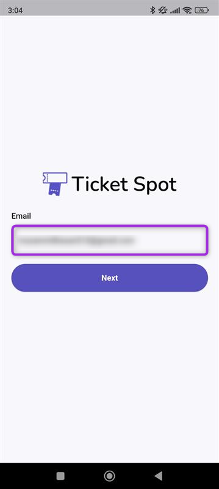
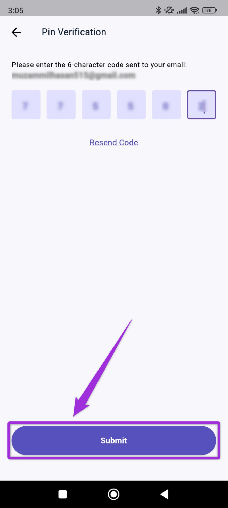
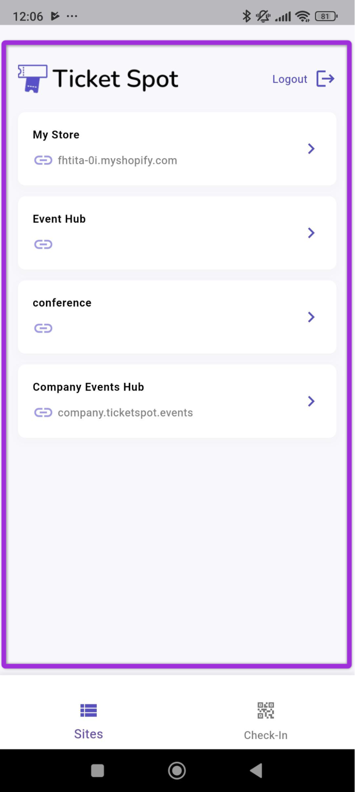
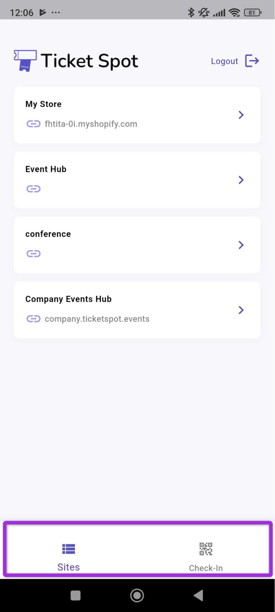
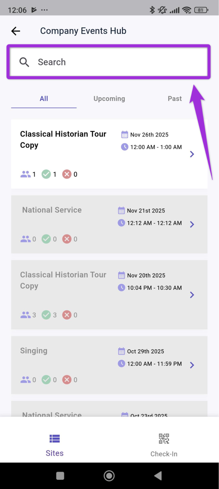

The **Ticket Spot** Mobile App is designed to help event staff manage on-site operations directly from their phones. With the app, you can access your Sites, review event details, view attendee lists, and complete check-ins without needing a laptop or desktop dashboard. 

This guide provides a clear overview of the main screens and navigation structure, so you know where to find each option and how to move through the app during event day activities.

Let’s get started 🚀

## Installing the App

TicketSpot supports both **iOS** and **Android** environments, allowing you to install the Mobile App on any device you use for on-site event management.

### iOS

To install the app on an iPhone, open the **App Store**, search for **Ticket Spot**, and tap **Get** to download it.

### Android

To install the app on an Android device, open the **Google Play Store**, search for **Ticket Spot**, and tap **Install** to add it to your device.

## Log In to the Mobile App

**Step 1**:Open the **Ticket Spot** Mobile App and enter your **email address** to proceed with the login process.

**Step 2**: Enter the **one-time password** (OTP) received in your registered email and click **Submit**.

You will be redirected to the Ticket Spot home dashboard, where you can view all your sites, check their details, and manage attendee check-ins.

## App Navigation

There are two main tabs at the bottom of the mobile app: **Sites** and **Check-In**, which help you move between your event list and your on-site check-in tools.

## Sites

The **Sites** tab shows all the sites linked to your TicketSpot account. Each site contains its own events, and you can **select** any site to view the events created under it.

A dashboard will open showing all the events inside the selected site. Events are grouped into three tabs, making it easy to find the one you want.

- **All** - Displays every event created under the site.  
- **Upcoming** - Shows events that are scheduled for a future date.  
- **Past** - Lists events that have already been completed.

You can also use the **search bar** at the top to quickly locate a specific event by typing its name, even if you have many events listed under your site.

You can also view check-in information and attendee details from the event dashboard. For more information on attendee records, refer to the **[Attendee Details](../mobile-app/attendee-details.mdx)** documentation.

## Check-In

The **Check-In** tab provides quick access to all tools used during on-site entry. This screen allows you to scan attendee QR codes, search for attendees manually, and update their check-in status in real time.

You can switch to this tab at any time from the bottom navigation bar to begin scanning tickets or verifying attendees.

For more detailed instructions on scanning and check-in workflows, refer to the **[Mobile Check-In](../mobile-app/mobile-check-in)** documentation.
