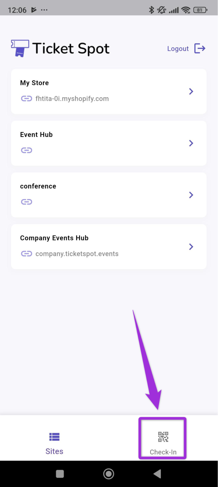
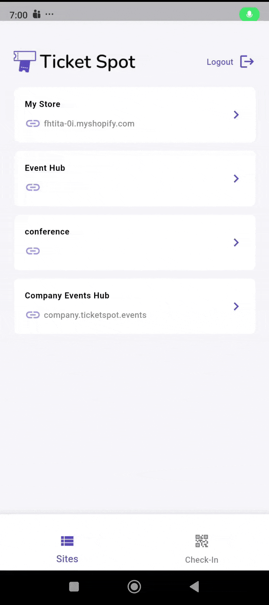
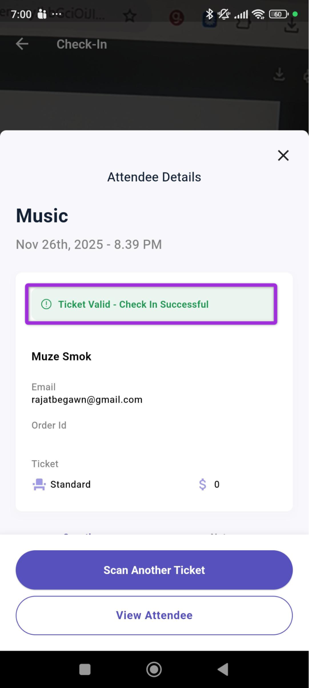
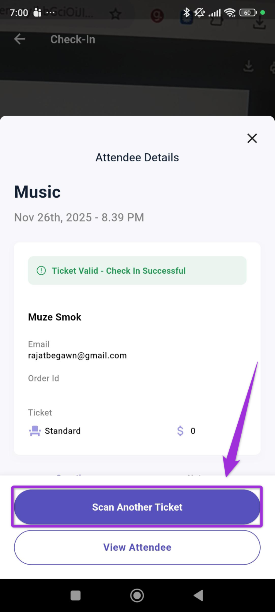

**Mobile Check-In** allows you to check in attendees quickly using your phone. By scanning the QR code on their ticket, you can instantly see their details, confirm their attendance, and keep your event entry process running smoothly. This feature helps you manage lines faster and ensures every attendee is verified before entering.

Let’s get started 🚀

**Step 1**: Log in to your **Ticket Spot** account and click on the **Check-In** tab to sacn your ticket.

**Step 2**:Use the **mobile scanner** to point your camera at the **QR code** on the attendee’s ticket and complete the check-in once the code is detected.

**Step 3**: Once the scan is complete, a confirmation message will appear showing that the ticket is valid and the **Check-In Successful**.

To continue checking in more attendees, click the **Scan Another Ticket** button to start a new scan.

You can also view the attendee’s full details by clicking on the **Attendee details** button. For more information, check the *[Attendee details](../mobile-app/attendee-details)** documentation.
