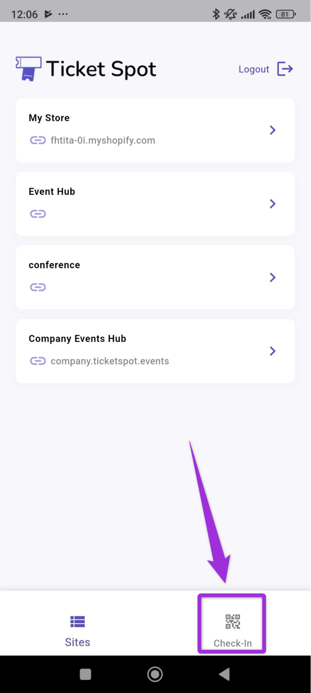
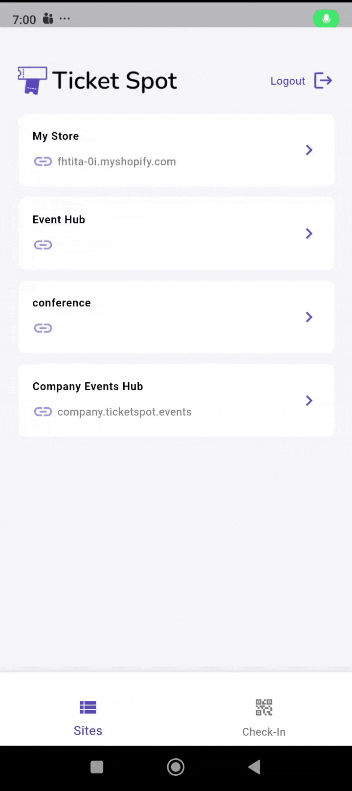
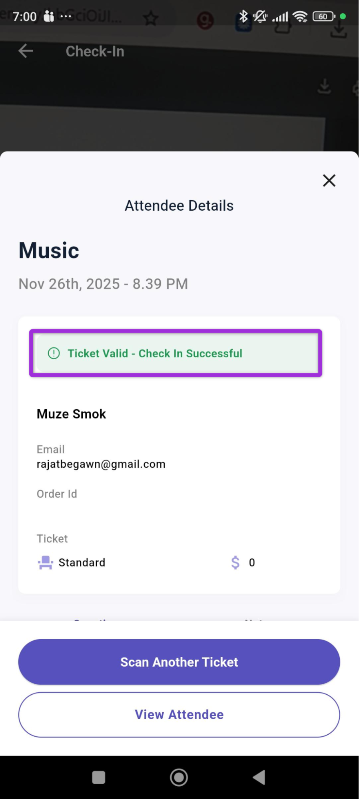
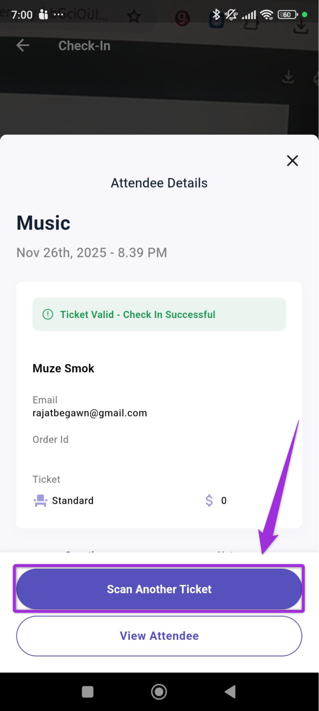

Use the Ticket Spot mobile app for QR code event check-in. Scan the attendee's ticket with your phone, review the admission result, and open their record when you need more details. Start with [mobile app setup](/mobile-app/mobile-app-overview) if you have not installed the app or selected your event.

**Step 1**: Log in to your **Ticket Spot** account and click on the **Check-In** tab to scan your ticket.

**Step 2**:Use the **mobile scanner** to point your camera at the **QR code** on the attendee’s ticket and complete the check-in once the code is detected.

**Step 3**: Once the scan is complete, a confirmation message will appear showing that the ticket is valid and the **Check-In Successful**.

To continue checking in more attendees, click the **Scan Another Ticket** button to start a new scan.

You can also view the attendee’s full details by clicking on the **Attendee details** button. For more information, check the [Attendee details](../mobile-app/attendee-details) documentation.

## Check the result before admission

A readable QR code is not by itself a successful check-in. Review the displayed ticket, event, date, and status. Resolve used tickets, canceled registrations, or check-in-window errors with an authorized host. Prepare [offline scanning](/mobile-app/offline-check-in) before losing connectivity.

Use [event attendance reports](/analytics/check-in-analytics) to compare unique arrivals and repeat scans, or [export attendee and check-in data](/attendee-management/export-attendees-and-check-in-data) for an attendance file.

## Use an external scanner

On the app's site list, enable **External Scanner** for a connected scanner; leave it off for the phone camera. Open the scanner and scan tickets. Rapid external scans queue while earlier scans are processed, so wait for each result before admitting guests.

After reviewing attendee details, **Scan Another Ticket** returns to the saved scanner mode. If a scan or camera session is interrupted, return to scanning and check the displayed result before repeating it. A timeout alone does not prove a ticket was checked in.

See [group check-in](/mobile-app/attendee-details#check-in-everyone-in-an-order) for a booking with several guests.
