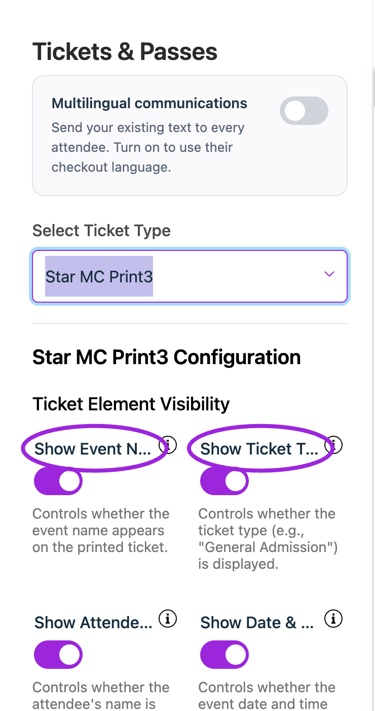
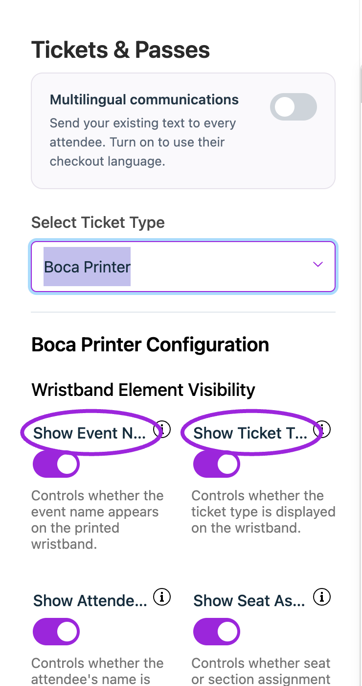

Ticket Spot POS offers **Star MC Print3** and **Boca Printer** ticket output over **Network (TCP/IP)**.

## Dashboard ticket designs

<AccordionGroup>
<Accordion title="Star ticket settings">
<Frame caption="In Design → Tickets &amp; Passes, choose Star MC Print3 to configure its labels, visibility, and appearance. This is the current configuration panel.">
  
</Frame>
</Accordion>
<Accordion title="Boca ticket settings">
<Frame caption="In Design → Tickets &amp; Passes, choose Boca Printer to configure its labels, visibility, and appearance. This is the current configuration panel.">
  
</Frame>
</Accordion>
</AccordionGroup>

These are the dashboard design controls. Complete the physical printer test below after connecting your printer.

## Configure and test

1. Open **Design → Tickets & Passes** in the dashboard and choose the matching Star or Boca design. Set its text, dimensions, and QR placement for your ticket stock.
2. Connect the POS device and printer to a network where the device can reach the printer.
3. Open POS settings and find **Printer Configuration**.
4. Select the **Ticket Printer Model**, choose **Network (TCP/IP)**, and enter the printer's network address and port.
5. Save the configuration and send a test print. Verify the paper feed, alignment, text, and QR code physically.
6. Print a ticket from a completed test order and scan its QR code using the check-in app.

A **Test sent** status means the command was sent; inspect the printer output to confirm the printer actually produced a usable ticket. Use the network connection offered by these settings; a USB or Bluetooth connection is not interchangeable with its network address.

## Recover a failed print

Check power, paper, network reachability, address, and port. If the sale already succeeded, print the existing ticket again. Reprinting does not create a second admission entitlement, and two copies of the same QR code refer to the same ticket.

## Related guides

- [Ticket and pass design](/branding-and-design/tickets-and-passes)
- [Complete design options](/branding-and-design/design-options-reference)
- [Box-office sales](/on-site/box-office-pos)
- [Mobile check-in](/mobile-app/mobile-check-in)
