**Lovable** makes it easy to generate and customize your website using simple prompts. By integrating **Ticket Spot** into your **Lovable** site, you can add fully functional ticketing—including sales, attendee management, payments, and confirmation emails—directly into the pages Lovable creates for you.

This guide walks you through generating your site in Lovable, installing the Ticket Spot widget, and enabling ticket purchasing and attendee management within your Lovable website.

<iframe
  width="100%"
  height="400"
  src="https://www.youtube.com/embed/dmWbe77wXZE"
  title="YouTube video"
  frameBorder="0"
  allow="accelerometer; autoplay; clipboard-write; encrypted-media; gyroscope; picture-in-picture"
  allowFullScreen
/>

Let’s get started 🚀

## Navigation

**Step 1:** Log in to your **Ticket Spot** account and click on the **Design** tab at the top navigation bar.

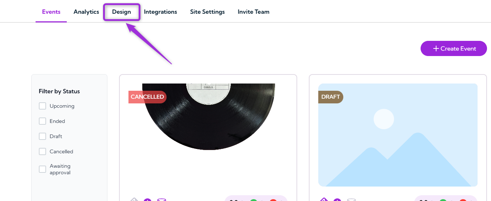

**Step 2:** Click on the **Widget Customization** tab from the left-side menu.

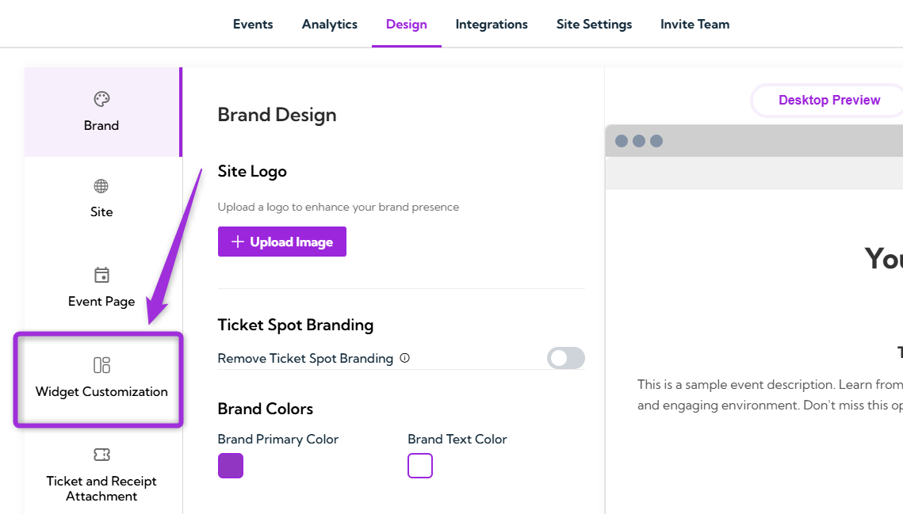

**Step 3:** Click on the **Installation** button in the top-right corner of the Widget Customization panel.

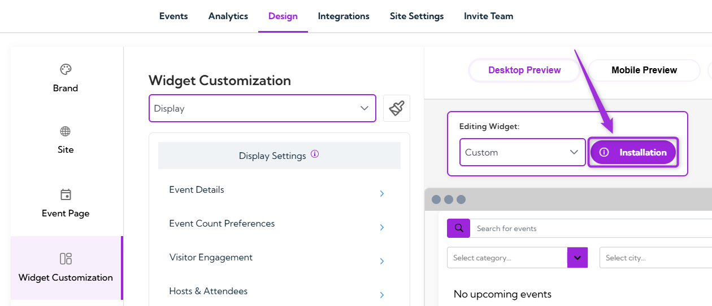

**Step 4:** A modal window titled “How to Add Widget” will appear. Select the **Lovable** tab to view the integration prompt.

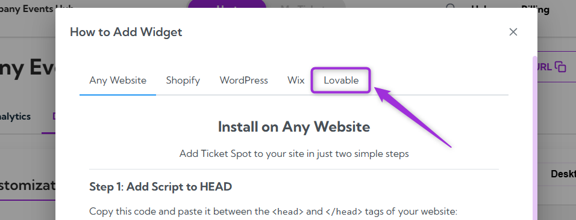

**Step 5:** You will see the full **AI Prompt** for adding the Ticket Spot event widget. Click the **copy** icon to copy the prompt exactly as shown—this is the text you will paste into Lovable.

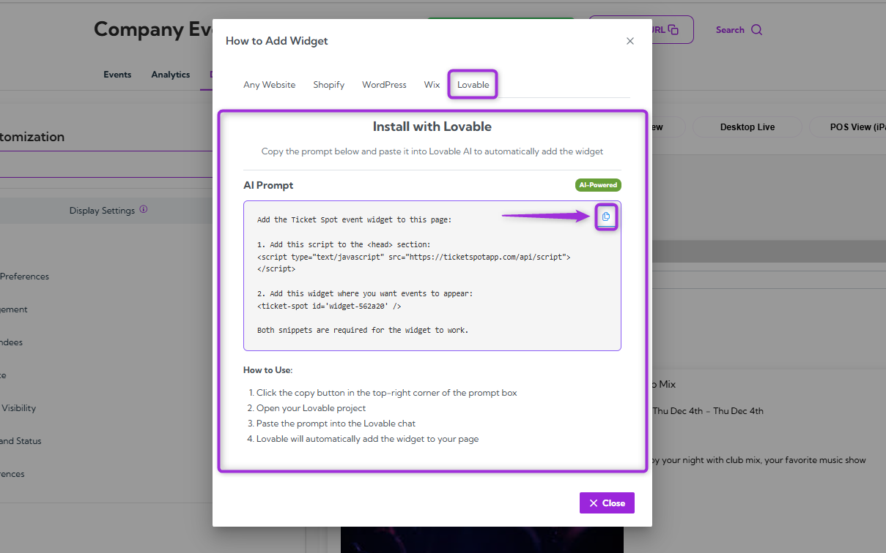

> **Note**: Make sure you copy the prompt exactly as it appears. Do not edit or change anything, as Lovable relies on the full prompt to embed the widget correctly.

**Step 6:** Log in to your **Lovable** account and open the project where you want to add the Ticket Spot widget.

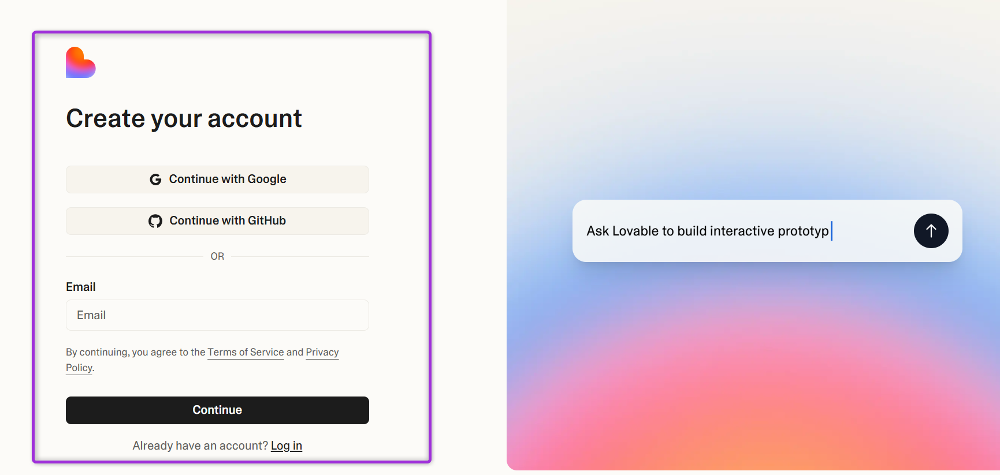

> **Note**: If you don’t have a **[Lovable account](https://lovable.dev/signup)** yet, you’ll need to create one first. You can sign up directly on the Lovable website and follow their onboarding steps to start a new project.

**Step 7:** Start a **new chat** in Lovable and describe the type of event page you want to create.  
For example: `Create a landing page for an outdoor movie event.`

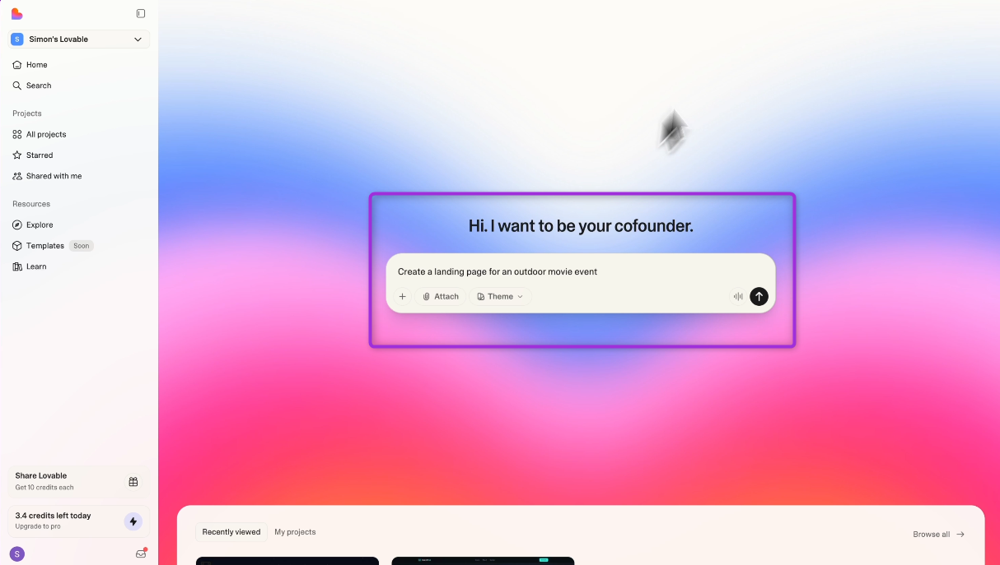

After describing the page, paste the Ticket Spot AI prompt into the chat to embed the widget.

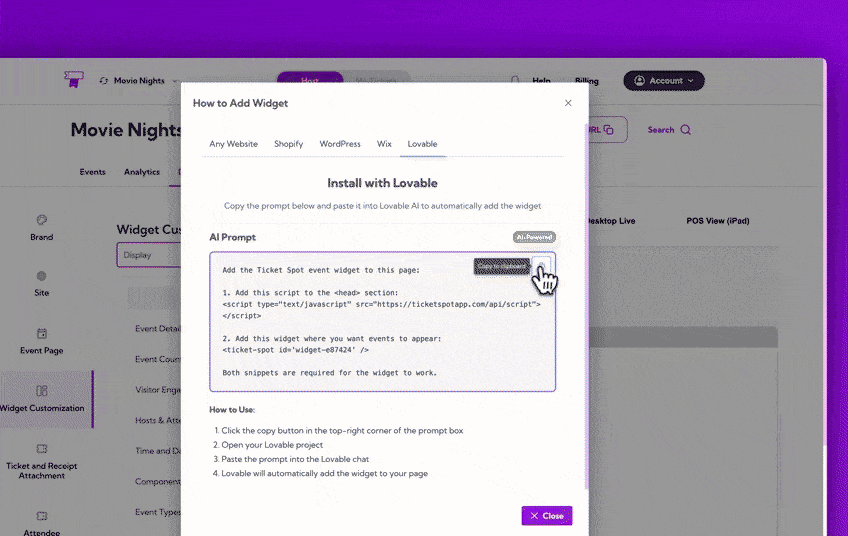

Press Enter to run the prompt. Lovable will generate your event page and automatically embed the Ticket Spot widget based on the AI prompt you provided.  
Scroll down to your generated page to see the Ticket Spot widget embedded automatically.

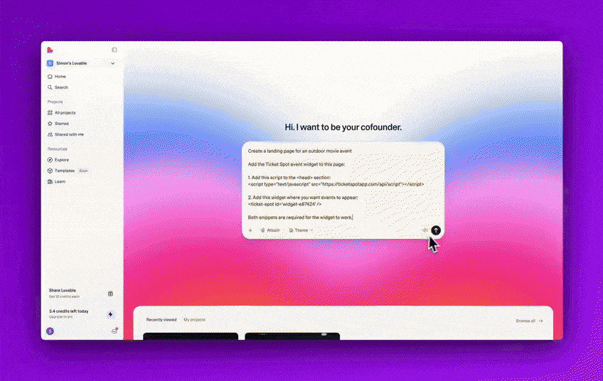

## Checkout

Let’s go ahead and **checkout** the event by **purchasing** a ticket directly through the embedded Ticket Spot widget. Select your ticket, enter the required buyer details, and complete the checkout process.

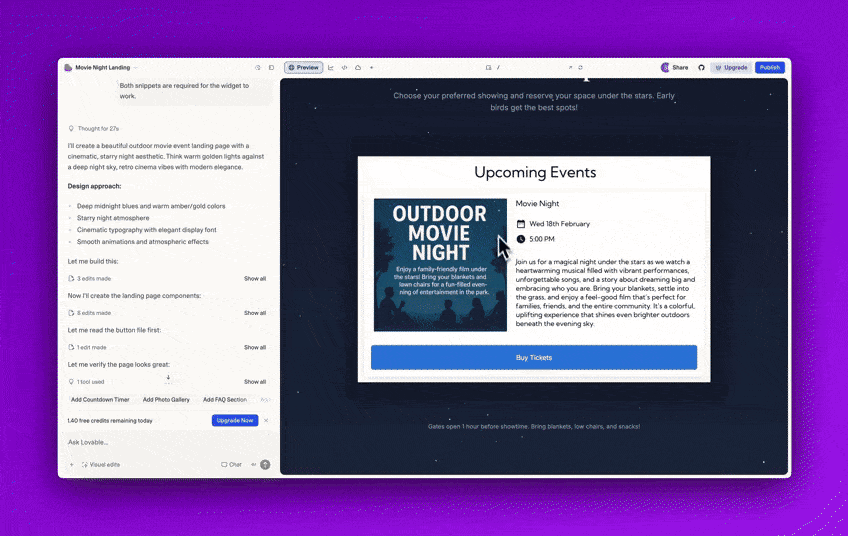

After the purchase is complete, you can **view** and **download** your ticket and receipt and even add the ticket to your **Apple Wallet** for quick access at the event.

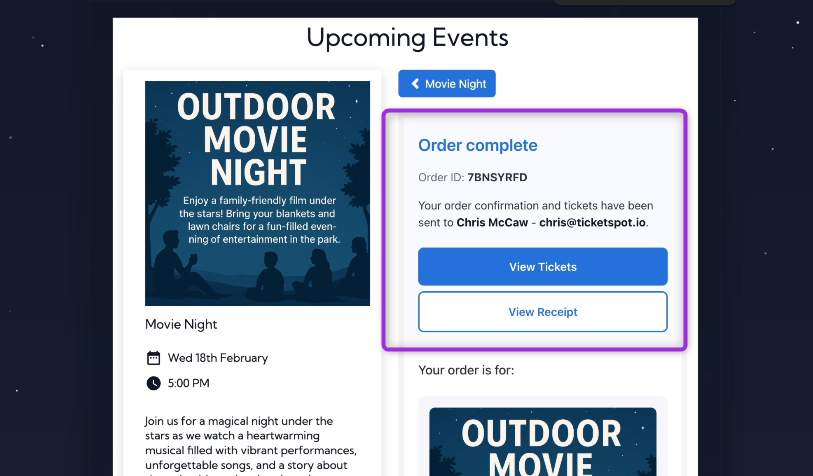

## Explore Ticket Spot Features

**Ticket Spot** provides a complete set of tools to help you manage every part of your event—from attendee tracking to branding and analytics. Below is a quick overview of the key features you can access from your Ticket Spot dashboard:

### Attendee Dashboard

View all attendees, monitor ticket sales, update attendee statuses, export attendee data, and resend confirmation emails if needed.  
Learn more about [Managing Attendees →](../attendee-management/managing-attendees)

### Design & Branding Customization

Customize ticket receipts, ticket passes, colors, labels, and email layouts. You can also remove Ticket Spot branding for a fully white-labeled experience.  
Learn more about:

[Brand Design →](../branding-and-design/brand-design)  

[Ticket & Receipt Design →](../branding-and-design/ticket-and-receipt-attachment-design)

[Attendee Communication Design →](../branding-and-design/attendee-communication-design)

### Analytics Dashboard

Track ticket sales performance, check-in activity, arrival patterns, and see overall event trends in real time.  
Learn more about [Analytics Overview →](../analytics/analytics-overview)

These tools ensure you have everything you need to run smooth, efficient, and well-designed events directly from your Lovable website.
