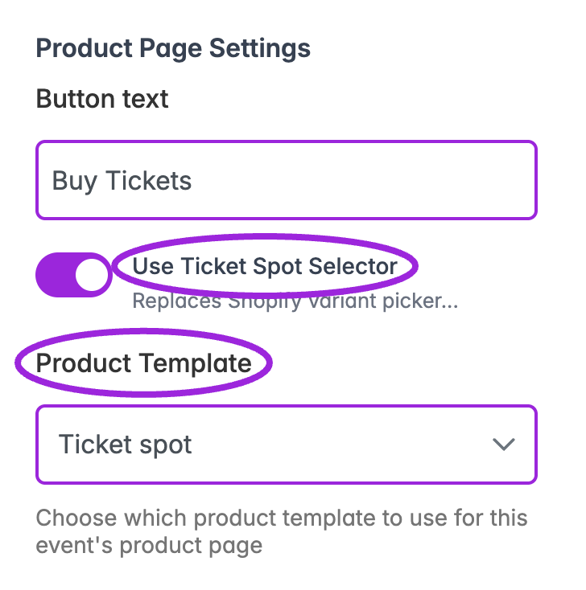

Connecting **Ticket Spot** to your **Shopify** store makes it easy to publish events as products and sell tickets directly through Shopify Checkout. Once connected, you can send any Ticket Spot event to Shopify, add the Ticket Selector to your product page, and allow guests to receive their tickets immediately after purchase.

This guide shows how to install the app and enable optional Shopify features so you can start selling tickets on Shopify quickly and easily.

<iframe
  width="100%"
  height="400"
  src="https://www.youtube.com/embed/xIv6NPcxX4s"
  title="YouTube video"
  frameBorder="0"
  allow="accelerometer; autoplay; clipboard-write; encrypted-media; gyroscope; picture-in-picture"
  allowFullScreen
/>

## Navigation

**Step 1:** Click on the site name in the top-left corner, open the dropdown menu, and select **+ Add New Site** to start adding a new site.

A modal window will appear where you can **Create or Connect Your Site**.

**Step 2:** Click **Connect Shopify** to start linking your store.

## Install the Ticket Spot App

1. You’ll be redirected to the Ticket Spot page in the **Shopify** App Store. Click **Install** to proceed.

2. Shopify authorization screen will appear, where you can authenticate yourself using your store credentials to complete the connection.

Click **Install** to authorize Ticket Spot and grant access to view personal data and manage store data.

Your **Shopify** store is now **connected**, and you will be redirected back to the **Ticket Spot** web app, where you can create your first event.

## Create Your Event

To create your event, enter the basic details, such as the event name, date, time, and venue. These fields help set up your event in Ticket Spot and prepare it for publishing.

For a full step-by-step walkthrough, please refer to our guide: **[How to Create an Event with Ticket Spot](../event-management/create-event-overview)**.

## Publish Your Event to Shopify

1. Click on the **Publish** button at the top of your event page.

2. Click on the **Publish to Shopify** to publish your event and updates to your Shopify store. This creates or updates the Shopify product that customers can purchase.

3. Click on the **Share** button to post your event on social media or copy the event link, allowing shoppers to view your event and purchase tickets directly.

## Check Out the Event

1. Click on the **Event Page** or open the event link to open your event page, where your event is listed.

2. Click on **Buy Tickets** to purchase a ticket for the event and complete the checkout.

## View Attendees in Your Dashboard

Once the purchase is completed, Shopify automatically sends attendee and order details to Ticket Spot.

Open your event in Ticket Spot and click on the **Manage Attendees** to view attendees of your event.

From here, you can see the full attendee list, update their status, view their details, send tickets, and manage all attendee actions in one place.

## Configure the Ticket Selector for advanced ticketing

Use the **Ticket Selector** for seating charts, calendar and time-slot selection, capacity shared across ticket types, waitlists, access codes, tracking links, and attendee questions on Shopify.

1. In **Shopify Admin → Online Store → Edit theme**, choose or create a product template for event tickets.
2. In its product section, choose **Add block → Apps → Ticket Selector**. Set **Display Mode** to **Embed inline** or **Modal** and save the template.
3. Return to the Ticket Spot event and open **Shopify · Product linked**.
4. Enable **Use Ticket Spot Selector**, choose the **Product Template** containing the block, and click **Save Settings**.
5. Open the actual Shopify product and test the date, time, seat, ticket quantities, and checkout path it needs.

<Frame caption="Choose the template containing the Ticket Selector app block, then save the linked-product settings.">
  
</Frame>

Adding the block and assigning the template are separate steps. The template list in Ticket Spot comes from the published Shopify theme. A template selected only for the editor preview has not yet been assigned to the product.

Follow the [complete Ticket Selector setup guide](./shopify-ticket-selector) for the Shopify Admin walkthrough and [setup video](https://www.youtube.com/watch?v=grq-oS9AFgI&t=5s). Find answers about dates, seating, inventory, and template problems in the [Shopify ticketing FAQ](./shopify-ticketing-faq).

For waitlists on Shopify, the selector provides signup and invitation-based purchases. Set **Start waitlist when bookings reach** in Ticket Spot to control when public booking ends; see the [Shopify waitlist FAQ](./shopify-ticketing-faq#when-does-my-shopify-waitlist-start).

## Existing product configuration controls

Open **Shopify · Product linked → Product Page Settings** in the event editor. Older screens may call this **Shopify Setup**.

- **Button text** sets the launch-button label.
- **Use Ticket Spot Selector** enables the Ticket Spot selection experience.
- **Product Template** assigns the template containing the selector block.
- **Enable Direct Checkout** skips Shopify's cart page and continues to checkout.
- **Skip Attendee Details Form** uses the Shopify purchaser's contact information. Leave it off when collecting guest names, event questions, or waivers.
- **Show ticket status on button** displays availability such as sold out or ended.

Click **Save Settings** to apply these options. See the [full linked-product settings reference](./shopify-ticket-selector#product-settings-and-attendee-details), including unlinking the product. Collection and Shopify inventory location are separate publishing settings; the inventory location does not change the event venue.

## Enable the Ticket Block on the Thank You Page

Ticket Spot gives customers instant access to their tickets—QR code, PDF, and Apple Wallet—directly on Shopify’s Thank You page, making the post-checkout experience faster and more convenient.

1. In Shopify, go to **Settings** and select **Checkout**. Then click on **Customize** to open the Checkout editor.

2. In the **Apps** section, select the **Ticket Spot – Ticket Access** block.

3. Select the **Thank You Page** and click **Save** to apply the changes.

## Access Tickets on the Thank You Page

1. Complete your **ticket purchase** through the **Shopify** checkout page.

2. Once checkout is completed, the **Thank You** page will display your order details, including **View Tickets** and **Add to Wallet**.

3. Click **View Tickets** or **Add to Wallet** to instantly download and access your ticket.

These features streamline your entire ticketing flow—helping you sell more, simplifying checkout, and giving guests a smoother, more enjoyable experience.

## Verify advanced ticket controls

Test an available and sold-out seat, the correct event date/time, ticket minimum/maximum quantities, a hidden ticket with an access code, and any [Required Ticket](../event-management/ticket-setup#required-ticket) dependency you configured. Confirm that the selected event/ticket data survives checkout and appears in Ticket Spot's attendee records. Test ticket access on the thank-you page separately.

## Complete selector and block reference

See [Shopify Ticket Selector setup and options](./shopify-ticket-selector) for every block setting, inline/modal behavior, product controls, the difference between Event Widget / Additional Questions / Ticket Access, and end-to-end verification. For invitation-only sales and private invoices, use the [waitlist guide](/event-management/waitlist).

## Keep products synchronized

Republish the event after changing its ticket offer, then check the linked product and [Ticket Selector](./shopify-ticket-selector). When a corresponding setting is omitted from an update, Ticket Spot preserves the product's existing type, theme template, vendor, variant tax settings, collections, and publication channels. Explicit changes to those settings still apply.

Import an existing Shopify product through the connected-store import flow. Ticket Spot checks for an existing link to prevent duplicate event creation; inspect the linked event when an import is rejected rather than creating a second copy to bypass it.

Deleting a linked event archives its Shopify product. Review the [Delete Event confirmation](/event-management/manage-events#delete-event) before proceeding; this is separate from canceling one event date or refunding an order.

<Frame caption="Ticket Spot asks for confirmation before deleting an event. For a linked Shopify event, deletion also archives its product; this image shows the Ticket Spot confirmation, not Shopify admin.">
  
</Frame>

These protections apply when you perform a new import, update, or deletion. They do not automatically repair an old duplicate link or restore settings that were overwritten earlier.
