Connect **Ticket Spot** to your **Wix** website to publish your events, sell tickets, and manage attendees directly from your site. Once installed, Ticket Spot lets you create events, customize ticket layouts, track sales, check in attendees at your venue, and communicate with guests at every stage of your event.

This guide walks you through installing the Ticket Spot app on Wix, setting up your event, and enabling core features so you can start selling tickets on your website.

Let’s get started 🚀

## Navigation

**Step 1**: Click on the site name in the top-left corner, open the dropdown menu, and select **+ Add New Site** to start adding a new site.

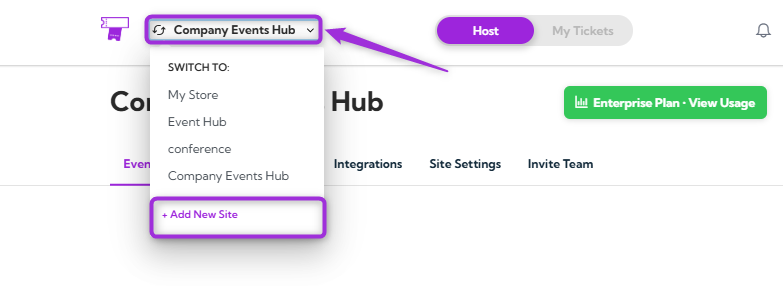

A modal window will appear where you can **Create or Connect Your Site**.

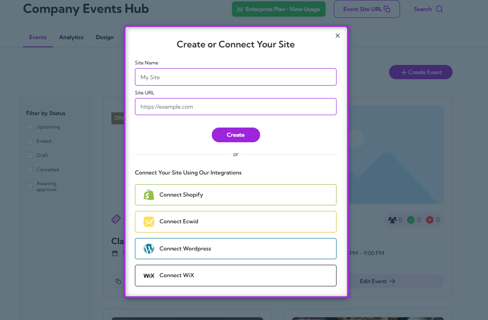

**Step 2**: Click **Connect Wix** to start linking your website.

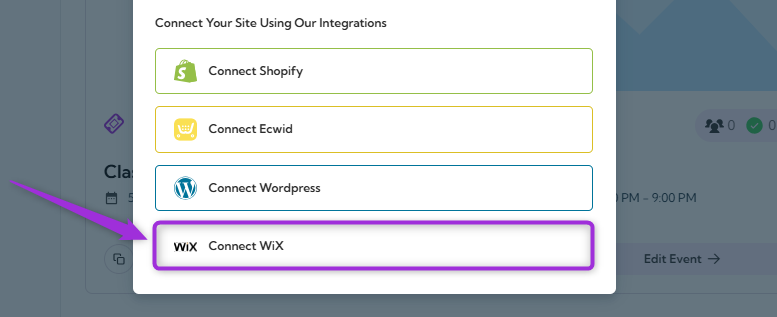

## Install the Ticket Spot App

You can install Ticket Spot on Wix using either method below:

### Option 1: Install Directly from Ticket Spot

From the Ticket Spot app, click **Connect with Wix**. You’ll be redirected to the Wix App Market—then click **Add to Site**.

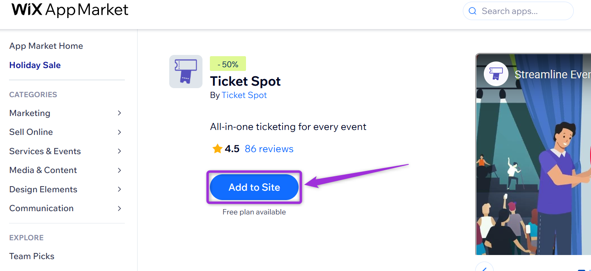

### Option 2: Install from the Wix App Market

From your Wix dashboard, open the **App Market**, search for **Ticket Spot** and click **Add to Site** to install the app.

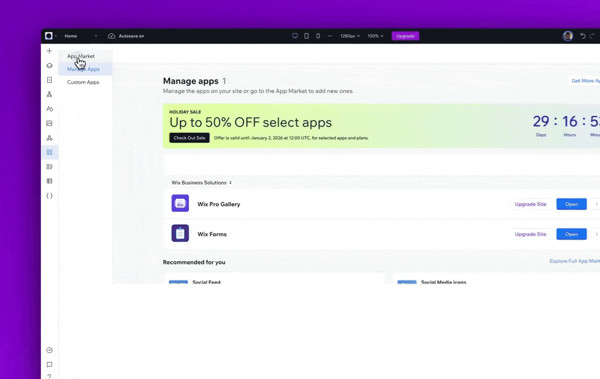

Review the permissions shown and click **Agree & Add** to complete the Ticket Spot installation on Wix.

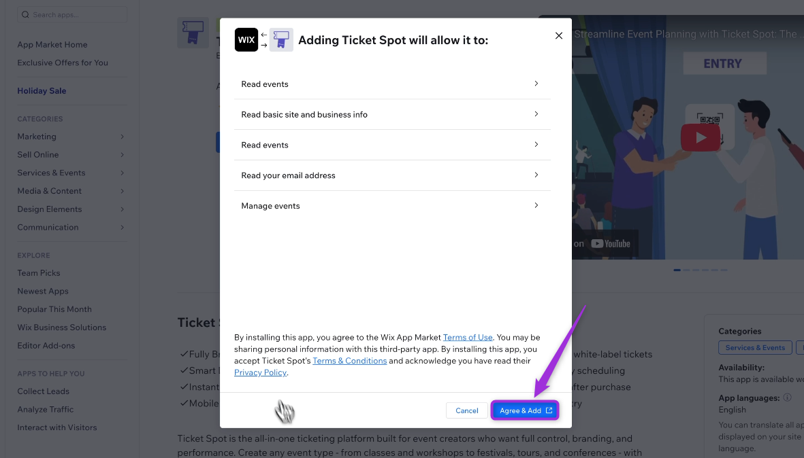

Both methods follow the same installation flow and connect your Wix site to Ticket Spot.

## Open Event Management in Wix

After installing Ticket Spot, Wix displays a few sample events by default. To access your event dashboard, go to **Settings** and then click on **Event Management**.

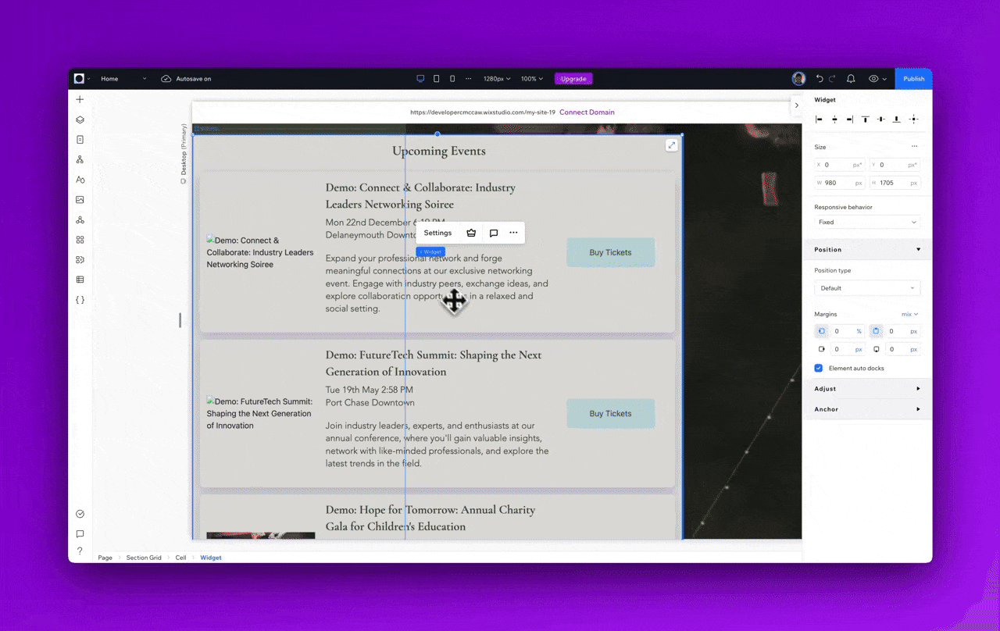

**Wix** will redirect you to the **Ticket Spot** web app, where you can create your own event.

### Create Your Event
To create your event, enter the basic details, such as the event name, date, time, and venue. These fields help set up your event in Ticket Spot and prepare it for publishing.

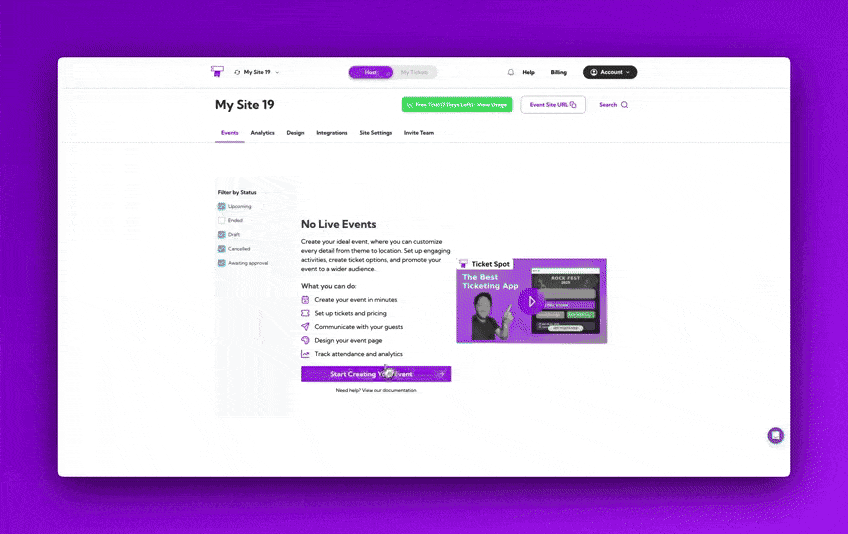

> For a full step-by-step walkthrough, please refer to our guide: **[How to Create an Event with Ticket Spot](../event-management/create-event-overview)**.

### Publish Your Event
Once your event details are configured—such as the title, date, tickets, and venue—you need to publish the event so it becomes active on your Wix site.

1. Click on the **Publish** button to make your event live.  
2. You can view your event on the Ticket Spot event page or directly inside the Wix Editor.
3. Your newly created event will appear automatically and will be ready for customers to view and purchase tickets.

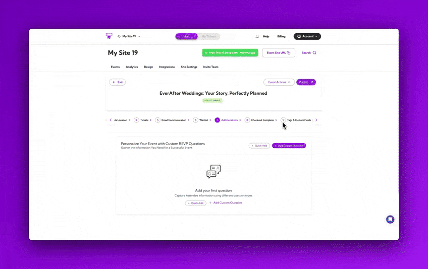

## Check Out the Event
Open your event on your Wix site and purchase a ticket directly from the event page to complete the process.

1. Click on the **Buy Tickets** button to complete the ticket purchase.

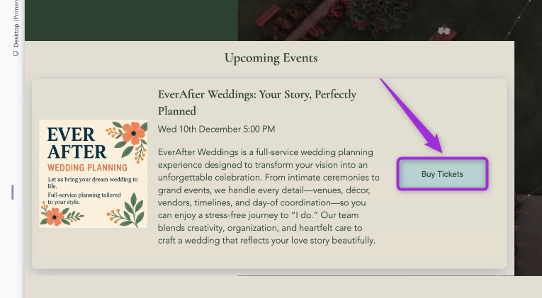

2. Select the ticket you want to purchase, enter the required attendee details, proceed with the payment, and complete your ticket order.

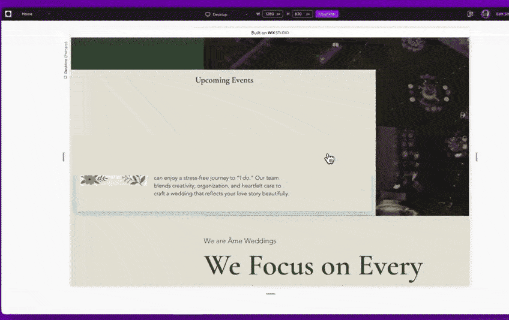

## View Your Tickets After Purchase

After completing your order, the confirmation page displays **View Tickets** and **View Receipt**. You can also click **Add to Calendar** to save the event to your personal calendar.

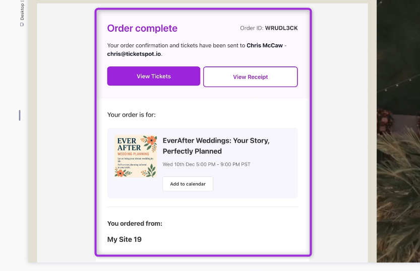

## View Attendees in Your Dashboard

Once the purchase was completed, Wix automatically sent the attendee and order details to Ticket Spot.

Click on the Manage Attendees buttonto view attendees of your event.

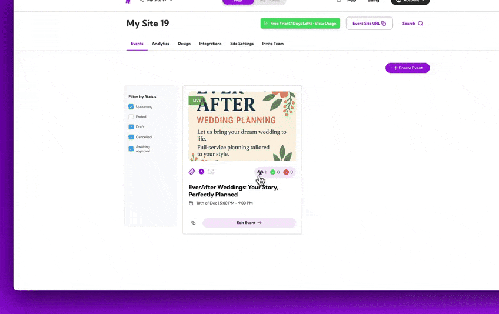

From this dashboard, you can review the full attendee list, update attendee statuses, filter records, export attendee data, resend ticket confirmations, and access detailed order information—all in one place.

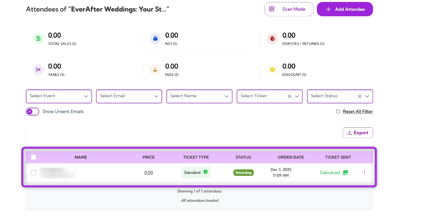

> Learn more: Explore the full **[Attendee Management](../attendee-management/viewing-attendee-details)** guide for detailed steps.

## Customize Ticket & Email Design

Ticket Spot gives you full control over the look and feel of the tickets, receipts, and attendee emails your customers receive. In the **Design** section, you can update the ticket receipt layout, customize the ticket pass with its QR code, and change text, labels, and colors to match your brand.

You can also customize attendee-facing emails—show or hide specific components, adjust wording, and tune the overall appearance to create a consistent experience across your event communications.

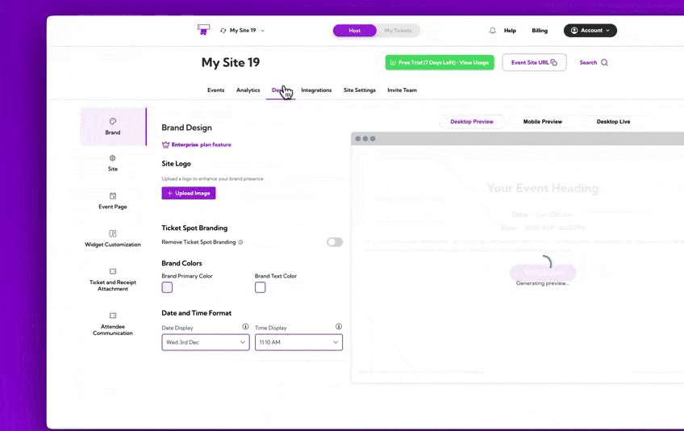

> **Learn more:**  
**[Ticket & Receipt Design](../branding-and-design/ticket-and-receipt-attachment-design)** →  
**[Attendee Communication Design](../branding-and-design/attendee-communication-design)** →

## Track Event Performance with Analytics

**Analytics** dashboard helps you understand how your event is performing. You can view ticket sales trends, monitor check-in activity, and identify any abandoned carts so you can follow up with potential attendees.

This gives you a clear picture of engagement throughout your event lifecycle and helps you take action where needed.

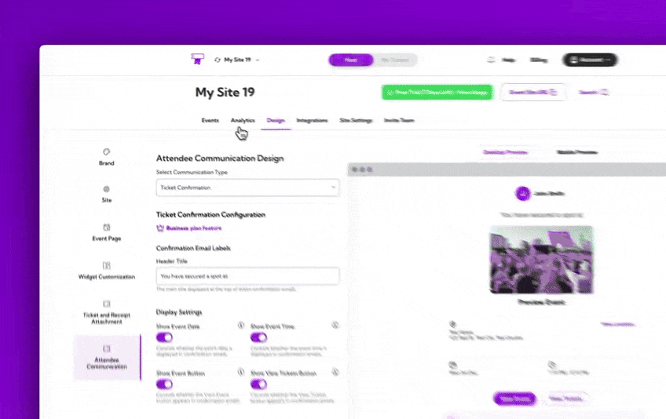

> Learn more: **[Analytics Overview](../analytics/analytics-overview)** →

Together, **Wix** and **Ticket Spot** give you a complete ticketing solution—making it easy to create events, sell tickets, manage attendees, and deliver a smooth experience to your customers, all from your website.