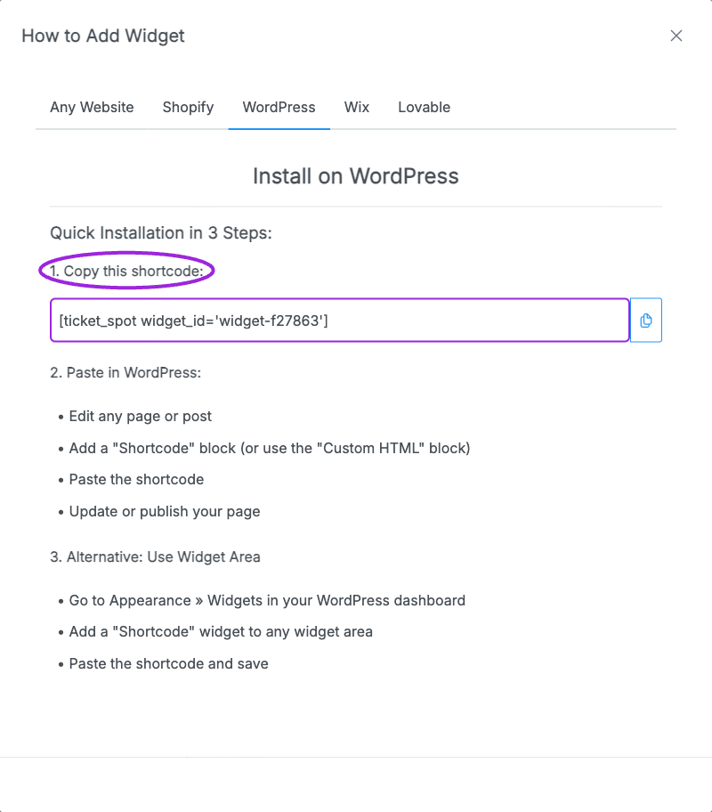

The Ticket Spot WordPress plugin displays your event widget inside a WordPress page or post.

<Steps>
<Step title="Install and activate">
Install the Ticket Spot plugin in WordPress, then activate it. If installing from a supplied ZIP, use **Plugins → Add New → Upload Plugin**, upload the package, and activate it.
</Step>
<Step title="Connect your site">
Open **Settings → Ticket Spot**, sign in, and choose or create the Ticket Spot site for this website. In Ticket Spot, open **Design → Widget**, choose the widget in **Editing Widget**, then open **Installation → WordPress** and copy its generated shortcode.
</Step>
<Step title="Add the shortcode">
Edit the WordPress page and add a **Shortcode** block. Paste the generated shortcode. Its format is:

```text
[ticket_spot widget_id="YOUR_WIDGET_ID"]
```

Use your actual widget ID, not an event ID or site ID.
</Step>
<Step title="Publish and test">
Update or publish the page and open it as a visitor. Verify the event list loads, an event opens, and ticket selection reaches the expected checkout. Check desktop and mobile views.
</Step>
</Steps>

<Frame caption="The WordPress installation tab gives the shortcode for the selected widget. Copy it into a Shortcode block on a site with the Ticket Spot plugin active.">
  
</Frame>

Set your [Brand colors and logo](/branding-and-design/brand-design) first, then adjust [Widget design](/branding-and-design/widget-customization-overview). Update events in Ticket Spot without replacing the shortcode each time.

If the page shows literal shortcode text, check that the plugin is active and the shortcode is in a Shortcode block. If no events appear, verify the widget ID, event visibility, and widget filters. After changes, refresh any WordPress page cache.
