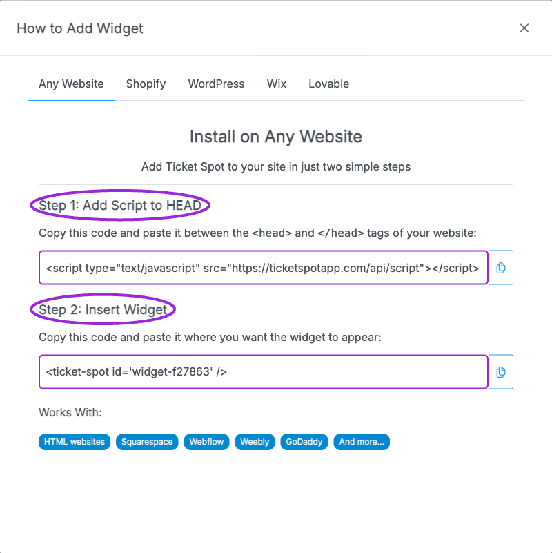

Use the widget installation code generated for your Ticket Spot site to display events on your website.

## Install the widget

1. Create or select the Ticket Spot site for the website.
2. Set up [Brand identity](/branding-and-design/brand-design) and [Widget design](/branding-and-design/widget-customization-overview).
3. In **Design → Widget**, select the widget in **Editing Widget** and click **Installation**. Choose **Any Website**. It supplies two code snippets for the selected widget.
4. Under **Step 1: Add Script to HEAD**, copy the script into the website’s `<head>` section or its custom head-code setting. Under **Step 2: Insert Widget**, copy the widget container into the HTML or embed area where the event list should appear. Both snippets are required, and the builder must permit custom scripts.
5. Publish the page and open the published URL. Some editors do not run scripts in their editing canvas.
6. Check the event list, calendar filters, ticket selection, checkout, and confirmation on desktop and mobile.

<Frame caption="Any Website supplies two pieces: the script for the page head, then the widget container where the event list should appear.">
  
</Frame>

Use the platform-specific instructions for [Shopify](/plugins/connect-shopify), [Wix](/plugins/connect-wix), [WordPress](/plugins/connect-wordpress), or [Lovable](/plugins/connect-lovable).

## Choose the checkout route

The widget is the event-selection surface. The payment route depends on your integration and selected payment provider. Shopify product purchases use the Shopify integration; a hosted Ticket Spot event page is a separate shareable destination. A custom domain controls the supported hosted pages and does not change which payment provider processes the order.

If the widget is blank, confirm the complete script is allowed, the correct widget was selected, and its filters include a visible event. Compare with the event's public page to separate a listing filter problem from an event configuration problem.

## Related guides

- [Hosted domains and analytics](/site-settings/domain-and-analytics)
- [Connect payment providers](/account/get-paid)
- [Tracking links](/event-management/tracking-links)
