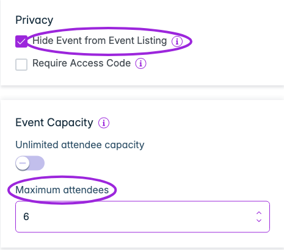
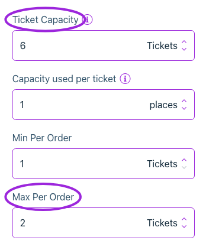
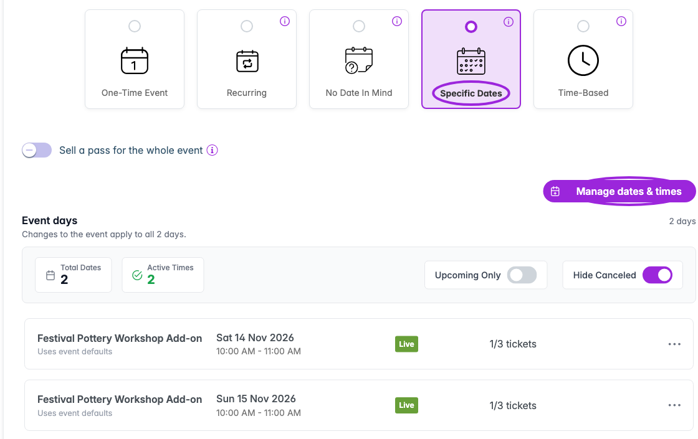
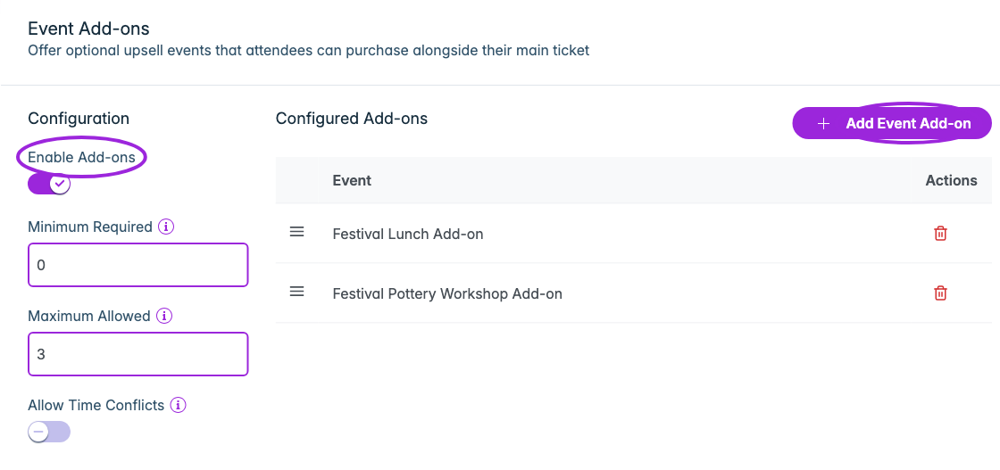
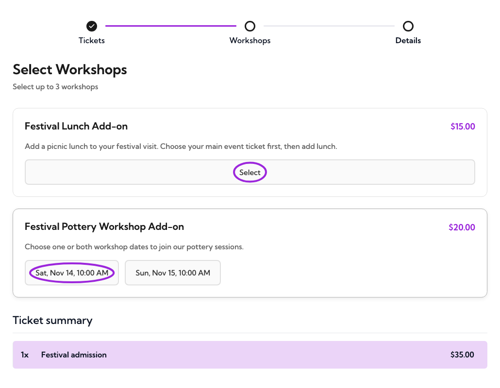
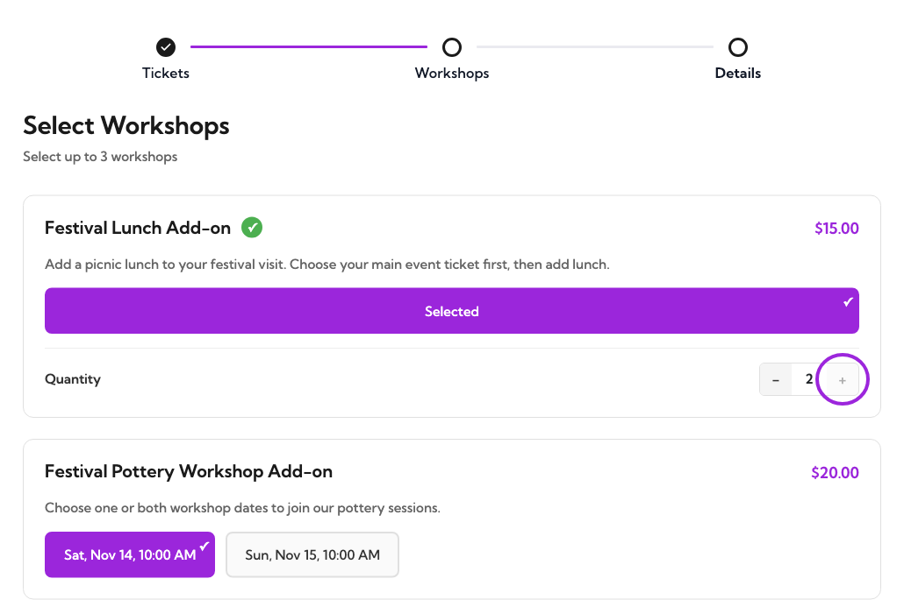
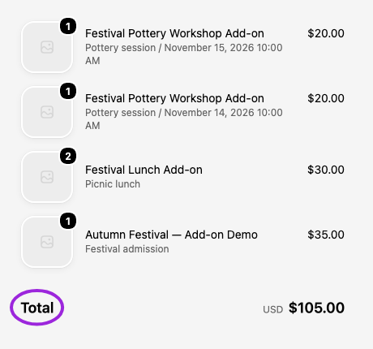

Let customers choose their main event tickets, then add a workshop, meal, or extra experience before Shopify checkout. Each add-on is a **separate Ticket Spot event** with its own dates, tickets, and capacity.

**Publish the main event and every add-on to Shopify.** For each add-on, enable **Event Details → Privacy → Hide Event from Event Listing** before publishing. This hides it from Ticket Spot listings and publishes its Shopify product as **Unlisted**, while keeping it available to purchase through the main event.

Event Add-ons requires Business or higher. The main event's Shopify product must use the [Ticket Selector app block and its assigned product template](./shopify-ticket-selector#install-the-product-block). Follow that setup to hide competing purchase buttons so buyers go through the add-on step.

## 1. Create a separate, hidden event for each add-on

1. Create an event for the extra, such as **Festival Lunch Add-on**. Choose **Sell tickets** and give it a clear title and description; customers see these during add-on selection.
2. In **Event Details → Privacy**, enable **Hide Event from Event Listing**. Keep this on whenever you publish updates.
3. Set **Event Capacity** for the extra. Turn off **Unlimited attendee capacity** and enter the maximum number of places when availability is limited.
4. Set its dates, then create/save the event before editing its tickets.

<Frame caption="Hide the separate add-on event and set its own attendee capacity.">
  
</Frame>

Use the event's privacy setting to hide it. **Hidden ticket** is a different option: it restricts access to that ticket and is not how you hide the add-on's Shopify product.

## 2. Set the first ticket's price and limits

Open **Tickets** and edit the **first ticket** in the list. The add-on selector uses that ticket and its price; it does not offer a separate choice of every ticket type on the add-on event. If the event already has a **Standard** ticket, edit that ticket or put the intended ticket first.

Set the price in **Pricing & Access**. Under **Sales & Capacity**, set **Ticket Capacity**, **Min Per Order**, and **Max Per Order**. Keep the ticket on sale for the booking period.

<Frame caption="This lunch add-on has a ticket capacity of six, with one to two tickets allowed per order.">
  
</Frame>

The add-on keeps its own ticket and event capacity rules. For example, buying two main tickets does not automatically select two lunches: the customer chooses the lunch quantity separately. Availability can limit that quantity below **Max Per Order**. The quantity control appears only when more than one ticket is allowed.

For different extras or prices that customers should choose separately, create separate add-on events. See [ticket setup](../event-management/ticket-setup) for ticket settings.

## 3. Choose one date or several dates

| Add-on schedule | Set up in Dates & Times |
|---|---|
| One workshop or meal | Choose **One-Time Event** and set its start and end. |
| A choice of dates | Choose **Specific Dates**, open **Manage dates & times**, and add each date. |
| Repeating sessions or timed entry | Use **Recurring** or **Time-Based** and configure the bookable sessions. |

For a series, attach the **parent add-on event** to the main event. Customers choose an available date or time during add-on selection. Check each date's capacity and availability before publishing; use [date-specific settings](../event-management/day-specific-tickets) where needed.

<Frame caption="This workshop offers two dates, each with three places. One place on each date is booked in this example.">
  
</Frame>

## 4. Publish every add-on to Shopify

Click **Publish → Publish to Shopify** on each add-on event. Review the fulfillment location and publishing settings, and confirm publishing. Check that the event shows **Live** and **Shopify · Product linked**.

With **Hide Event from Event Listing** enabled, Ticket Spot sets the linked product's Shopify status to **Unlisted**. A saved draft is not enough: Shopify needs the published product and ticket variants to add the extra to checkout. After changing dates, prices, or ticket inventory, publish the changes again.

Unlisted products remain purchasable through a direct link, but are excluded from Shopify-powered collections, search, and product recommendations. Hiding a listing does not make it password-protected. See [Shopify's explanation of Unlisted products](https://help.shopify.com/en/manual/products/details/product-details-page).

## 5. Attach the add-ons to your main event

1. Open the saved main event and choose **Event Add-ons**.
2. Turn on **Enable Add-ons**.
3. Set **Minimum Required** to **0** for optional extras, or a higher number to require a selection. Set **Maximum Allowed** to the most selections a customer can make.
4. Leave **Allow Time Conflicts** off to prevent overlapping add-on sessions. Turn it on only if overlapping selections make sense for your event.
5. Click **Add Event Add-on**, select the separate add-on event, and click **Add**. Repeat for each extra.
6. Check **Configured Add-ons**, then save and publish the main event. Use the drag handles to change the display order.

<Frame caption="The main event offers lunch and workshop add-ons. A minimum of zero makes them optional.">
  
</Frame>

The minimum and maximum count **selections**, not ticket quantities. Two places in one workshop selection count as one selection; choosing two workshop dates counts as two. Each selection still follows its first ticket's quantity limits and available capacity.

## 6. Check the customer flow

Open the main event's Shopify product using its **Ticket Selector** template:

1. Choose the main ticket and quantity, then continue to the add-on step.
2. Select an extra. For a multi-date add-on, choose the date or time too.
3. Adjust each add-on's quantity and check the order summary.
4. Continue through attendee details, when enabled, to Shopify. Confirm that the main ticket **and every selected add-on** appear with the right dates, quantities, and prices before paying.

<Frame caption="Customers choose their extras after selecting the main event ticket.">
  
</Frame>

<Frame caption="The lunch add-on stops at its maximum of two tickets per order.">
  
</Frame>

<Frame caption="Check that the main ticket and every selected add-on reach Shopify with the correct dates and quantities. This example uses a Shopify test order.">
  
</Frame>

Test optional skipping, required selections, the maximum number of selections, overlapping times, and a date with limited places. Test on mobile too. A successful selection screen alone does not confirm a completed booking.

## Troubleshooting

| Problem | What to check |
|---|---|
| Add-on appears as a separate listing | Enable **Hide Event from Event Listing** on the add-on and publish it again. Check the Shopify product is **Unlisted**. Attaching an add-on alone does not replace this step. |
| Add-on is shown but missing from Shopify checkout | Publish the add-on and all intended dates to Shopify. Check the product connection, ticket mappings, and any **Out of sync** warning. |
| Wrong price or ticket is used | Check the first ticket on the add-on event, its price and visibility, then publish the update. |
| Buyer cannot select another extra | Check **Maximum Allowed** and whether its time overlaps an existing selection. |
| Buyer cannot increase quantity | Check the first ticket's **Max Per Order**, remaining ticket inventory, and the add-on event/date capacity. |
| No add-on step on the product page | Check **Enable Add-ons**, attached events, and the main product's saved Ticket Selector template assignment. |

Pay What You Want on Shopify does not currently support add-ons. See [Shopify ticketing FAQs](./shopify-ticketing-faq) and [all event add-on settings](../event-management/event-add-ons).
