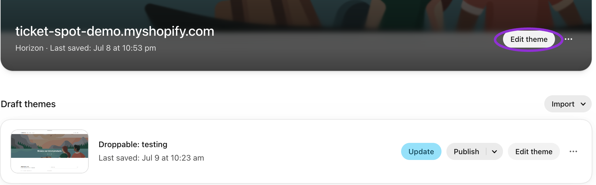
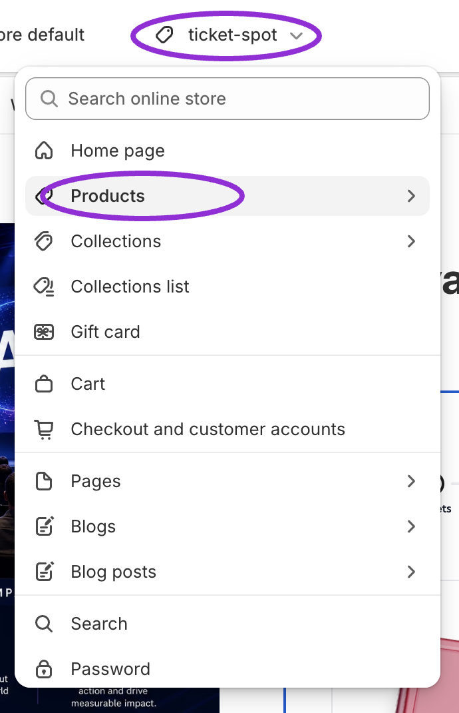
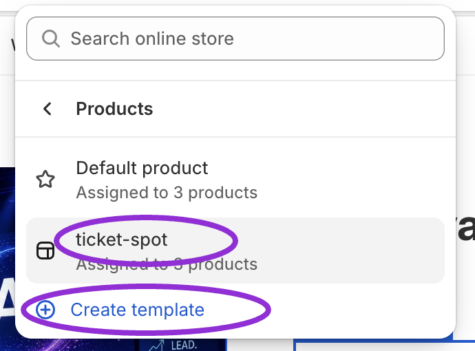
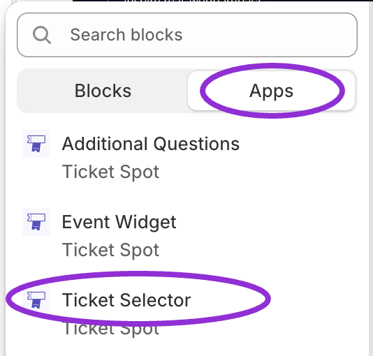
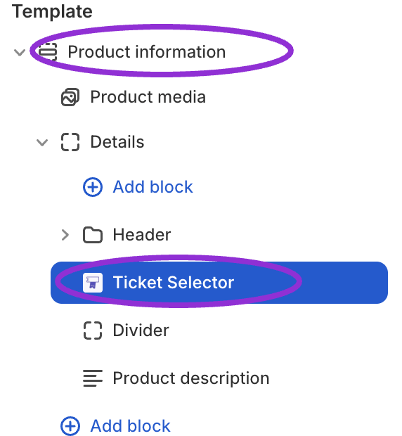
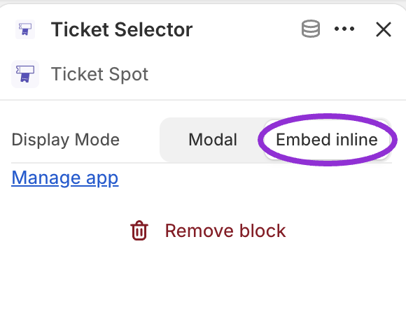
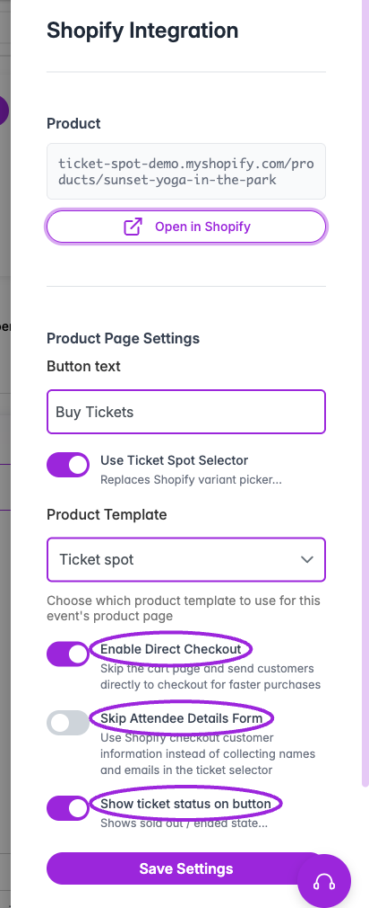

Use the **Ticket Selector** to let customers choose dates, time slots, ticket types, and seats on your Shopify product page. Ticket Spot handles the event selection and booking rules; customers pay through Shopify checkout.

There are two parts to setup: **add the Ticket Selector app block to a Shopify product template**, then **assign that template to the linked event product**. Turning on the selector setting alone does not add the block to your theme.

## When to use the Ticket Selector

| Your event needs | What the selector provides |
|---|---|
| **Reserved seating** | A seating chart where customers choose available seats and the applicable ticket price. Required for Ticket Spot seat selection on Shopify. |
| **Dates and time slots** | A booking flow for recurring events, classes, tours, and timed entry, including a calendar layout. |
| **Capacity across ticket types** | Ticket Spot checks the event or selected occurrence's shared attendee limit alongside individual ticket availability. |
| **Event add-ons** | Offer separately published, hidden events after the main ticket selection, including date choices and each add-on’s ticket capacity. |
| **Waitlists** | Waitlist signup when tickets or public capacity run out, plus invitation-based access for eligible guests. Required for Ticket Spot waitlist use on a Shopify product page. |
| **Access codes** | Entry of event or hidden-ticket access codes before selecting eligible tickets. |
| **Tracking links** | Ticket Spot campaign information follows the customer into the selector from the generated Shopify product link. |
| **Attendee details and questions** | Collect the information configured for your event before Shopify checkout. |

Use the selector for these Ticket Spot features. Shopify's ordinary variant picker does not provide the seating map, calendar booking flow, or Ticket Spot access-code form.

## Before you start

[Connect your Shopify store](./connect-shopify), create the event, and publish it to Shopify. Use a Shopify theme with app-block support and an account that can edit themes. For reserved seating, [publish a seating chart and assign its categories](/seating-charts/create-and-assign) first.

For a store that also sells merchandise, create a dedicated product template such as **ticket-spot**. Editing a shared template changes every product using it.

## Install the product block

### 1. Open the Shopify theme editor

In **Shopify Admin → Online Store**, find the theme you want to use and click **Edit theme**. Some Shopify layouts show this under **Online Store → Themes**, with **Customize** as the button label.

<Frame caption="Choose Edit theme for the theme you want to configure. Draft themes appear below the published theme.">
  
</Frame>

### 2. Choose or create a product template

Open the page selector at the top of the editor, choose **Products**, then select your event template. If you need a new one, choose **Create template**, enter a name such as `ticket-spot`, and base it on your existing product template.

<Frame caption="Open the template picker and choose Products.">
  
</Frame>

<Frame caption="Choose the existing event template or create one for your event products.">
  
</Frame>

Use the editor's product preview to choose a product already linked to a Ticket Spot event. A preview selection does not assign the template to that product; you will do that below.

### 3. Add the Ticket Selector app block

Open **Product information**. In themes with nested groups, expand **Details** or the group where you want the selector. Choose **Add block → Apps → Ticket Selector** from Ticket Spot, then position it where customers should choose their tickets.

<Frame caption="Choose Apps, then Ticket Selector from Ticket Spot.">
  
</Frame>

<Frame caption="Position Ticket Selector inside the product information area.">
  
</Frame>

Review the template's ordinary **Variant picker**, **Quantity selector**, **Buy buttons**, and accelerated checkout controls. Hide or remove competing purchase controls on this event template so customers follow the selector and provide the required date, seat, or access information. Leave unrelated merchandise templates as they are.

### 4. Choose how it appears

Select the **Ticket Selector** block and set **Display Mode**:

| Mode | Customer experience |
|---|---|
| **Embed inline** | The selector is visible inside the product page. This is the app block's default. |
| **Modal** | A button opens the selector in a dialog. Customers close the dialog to return to the product page. |

<Frame caption="Use Embed inline for a selector within the page, or Modal for a button that opens it.">
  
</Frame>

Click **Save** in Shopify. The block's theme setting controls presentation; event dates, tickets, capacity, and questions are configured in Ticket Spot.

### 5. Assign the template to the linked event product

1. Return to the event in Ticket Spot and click **Shopify · Product linked** near the top. If the badge says **Out of sync**, open it and resolve the mapping warning first.
2. Under **Product Page Settings**, enable **Use Ticket Spot Selector**.
3. In **Product Template**, select the template containing the app block, such as **Ticket spot**.
4. Choose the remaining product options below and click **Save Settings**. Saving applies the template to the linked Shopify product.
5. Open the product on the storefront and confirm the selector appears.

The template list comes from your **published Shopify theme**. A template that exists only in a draft theme will not appear in this list. After saving a new template, reload the Ticket Spot event to refresh the choices. Selecting a template does not create its app block.

You can also check the assignment in **Shopify Admin → Products → your event product → Theme template**. The template assigned to the product must match the one you edited.

<Frame caption="Enable the selector and choose the Shopify product template that contains its app block.">
  
</Frame>

## Product settings and attendee details

The **Shopify · Product linked** badge opens the current **Shopify Integration** panel. Older screens may call it **Shopify Setup**.

| Control | What it does |
|---|---|
| **Open in Shopify** | Opens the linked product page so you can inspect the customer experience. |
| **Button text** | Sets the selector's launch-button wording, such as **Buy Tickets**. Most relevant in Modal mode. |
| **Use Ticket Spot Selector** | Enables the Ticket Spot selection experience and exposes the template and checkout options below. Install its app block as described above. |
| **Product Template** | Assigns a product template from the published theme. Choose one containing **Ticket Selector**. Visible when the selector is enabled. |
| **Enable Direct Checkout** | Skips Shopify's cart page and continues to Shopify checkout. It does not skip seat selection or automatically complete payment. Off keeps the cart step. |
| **Skip Attendee Details Form** | Uses the Shopify purchaser's contact information instead of collecting it in the selector. Leave this off if you need individual guest names, event-question answers, or waivers. Waitlist signup still collects contact details. |
| **Show ticket status on button** | Shows availability such as sold out or ended on the product button. This is separate from the inventory and capacity settings. |
| **Save Settings** | Applies the linked-product configuration. Saving the Shopify theme is a separate step. |
| **Disconnect Shopify** | Opens an unlink confirmation for this event/product connection. It is not a refund or event-cancellation action. |

**Product Template**, **Enable Direct Checkout**, and **Skip Attendee Details Form** appear when **Use Ticket Spot Selector** is enabled. For separate details per ticket, leave the skip option off and enable **Design → Widget → All Settings → Checkout → Collect attendee details for each ticket**. Configure questions under the event's **Additional Info**.

<Frame caption="Choose the checkout and attendee-information behavior, then click Save Settings.">
  
</Frame>

Collection and Shopify inventory location are separate publishing settings. A Shopify inventory location is not the attendee-facing event venue.

## Dates, seats, and access

### Time slots and calendar selection on Shopify

1. In the event's **Dates & Times**, create the recurring dates or **Time Based** sessions customers can book.
2. Set ticket quantities and the appropriate event or occurrence capacity. Use [day-specific tickets](/event-management/day-specific-tickets) for dates with different offers.
3. In **Design → Widget**, choose the date/time selection layout, including calendar presentation, using the [checkout layout options](/branding-and-design/widget-checkout-reference).
4. Publish/update the Shopify product, then open it through the template containing the selector.
5. Check two dates and time slots, including an unavailable session. Confirm the chosen occurrence stays correct through checkout.

A calendar for choosing a date within one event is different from the **Event Widget** block that lists multiple events. See [timed-entry setup](/event-management/timed-entry-and-passes).

### Seating charts on Shopify

Create and publish the chart, assign it to the event, and connect its seating categories to ticket types. Customers select available seats in the **Ticket Selector**, then continue to Shopify checkout. If a category offers several prices, they choose the applicable ticket type too.

<Frame caption="The Ticket Selector displays your seating chart on the Shopify product page. Customers can enlarge the map.">
  
</Frame>

Check the selected seats, ticket quantities, and total before payment, including on mobile. A temporary seat hold is not a completed booking. See [seat selection](/seating-charts/seat-selection).

### Shared inventory across ticket variants

Shopify tracks inventory for individual variants. Ticket Spot also provides a shared **Event Capacity** limit across ticket types, with occurrence-specific capacity where configured.

For example, a workshop can offer **Adult** and **Child** tickets while allowing only **30 attendees in total**. Configure that shared capacity in Ticket Spot and use the Ticket Selector for the booking flow. Giving each Shopify variant stock of 30 does not, by itself, create one shared limit of 30.

Keep ticket quantities and event/date capacities consistent, publish updates, and test a mixed-ticket selection near the limit. Review **Out of sync** warnings before selling. Do not assume a third-party buy button, POS flow, or direct Shopify variant link runs the Ticket Spot selector's booking checks.

### Event add-ons on Shopify

Create a separate event for each extra, enable **Event Details → Hide Event from Event Listing**, and **publish every add-on to Shopify**. The hide flag makes the linked product **Unlisted**. Attach these events under the main event’s **Event Add-ons**. Customers select main tickets first, then extras and any dates or times. Each add-on uses its first ticket and keeps its own quantity and capacity settings.

Follow [Shopify event add-on setup](./shopify-event-add-ons) for screenshots, publishing steps, and a checkout checklist.

### Waitlists on Shopify

Use the **Ticket Selector** for waitlists on Shopify, including invitation-only access from the start or after a chosen number of bookings. It displays the waitlist signup form and carries the guest's invitation into the booking flow. Shopify's standard variant picker does not provide those controls.

1. Open the event's **Waitlist → Settings** and enable the waitlist. Choose the sold-out or event-capacity triggers you need.
2. To choose when public booking ends, set a finite **Event Capacity**, enable **Limit waitlist purchases to event capacity**, and set **Start waitlist when bookings reach**. This is a count of attendee places, not a date. **0** requires an invitation from the beginning; **40** with capacity **50** allows 40 public places before invitation-based access.
3. Save the event. Confirm its Shopify product uses the template containing **Ticket Selector**, with **Use Ticket Spot Selector** enabled.
4. In **Waitlist → Subscribers → Notify Guests**, select **Purchase from Event Page** and **Use Shopify Product URL**. Review any ticket restriction and maximum quantity, then send when ready.
5. Test the public product page and the complete personalized invitation link. Keep its invitation parameters intact. An invitation cannot exceed the event capacity or its allowed ticket quantity.

<Frame caption="Configure the waitlist start value in Ticket Spot. This example starts it at 40 places within a total capacity of 50.">
  
</Frame>

Waitlist signup still collects contact information when **Skip Attendee Details Form** is enabled. Joining the list does not purchase or reserve a ticket. See [waitlist setup, invitations, and Shopify invoice behavior](/event-management/waitlist) or the [Shopify waitlist FAQ](./shopify-ticketing-faq#can-i-use-a-waitlist-for-event-tickets-on-shopify).

### Access codes

An **event access code** controls access to the event; a **hidden-ticket access code** reveals an eligible ticket type. Configure the rule in Ticket Spot. For hidden tickets, enable **Show access code field** in **Design → Widget → All Settings → Checkout**.

Test both an accepted and rejected code on the Shopify product. Access codes are different from discount codes. Keep personalized [waitlist invitation links](/event-management/waitlist) intact so the invited ticket and quantity remain available.

### Tracking links to Shopify products

Open the event's **Tracking Links**, create a campaign, and choose **Use Shopify Product URL** for its destination. Share the generated **Tracking URL**, keeping its tracking parameter intact. The app block passes Ticket Spot tracking parameters into the selector.

Test the copied link and check attribution under **Tracking Links**. A normal product URL without that parameter does not identify the campaign. See [tracking-link setup](/event-management/tracking-links).

## Choose the correct Shopify block

| Block or feature | Purpose |
|---|---|
| **Ticket Selector** | Dates, tickets, seats, and booking rules on a product template, inline or modal. |
| **Event Widget** | A listing of events embedded in a theme section. Set **Widget Id** to the widget created in Ticket Spot. |
| **Additional Questions** | A separate product-page block for Ticket Spot questions. Check the purchase flow to avoid duplicate forms. |
| **Event Controls / Ticket Spot Controls** | Legacy app embed/product controls, separate from the current Ticket Selector app block. |
| **Ticket Spot – Ticket Access** | Post-purchase ticket access on the Thank You page, configured separately in the checkout editor. |

## Setup video

<iframe
  width="100%"
  height="400"
  src="https://www.youtube.com/embed/grq-oS9AFgI?start=5"
  title="Set up the Ticket Spot Ticket Selector in Shopify"
  frameBorder="0"
  allow="accelerometer; autoplay; clipboard-write; encrypted-media; gyroscope; picture-in-picture"
  allowFullScreen
/>

[Watch the Ticket Selector setup video](https://www.youtube.com/watch?v=grq-oS9AFgI&t=5s). Theme layouts can differ; follow the template and block names shown in your store.

## Pay-what-you-want tickets on Shopify

1. In the event's **Tickets** editor, choose **Pay What You Want** and set the suggested price and **Minimum Price**. Your plan must include this ticket type.
2. Save and publish/update the linked Shopify product. The event and store must use the same currency.
3. Have customers choose their amount in the Ticket Spot selector, then continue to Shopify to pay. Shopify's ordinary product form does not gain its own price input.
4. After a test payment is confirmed, verify the order, Ticket Spot attendee records, and ticket delivery. Reaching Shopify checkout alone does not issue tickets.

<Frame caption="Configure Pay What You Want and Minimum Price in Ticket Spot. This shows ticket setup; the subsequent payment takes place in Shopify.">
  
</Frame>

This flow supports ordinary tickets for one event or selected date, including several ticket types and a mix of fixed-price and pay-what-you-want tickets. It accepts up to 50 ticket types and 100 tickets per checkout, subject to each ticket's own quantity rules. Mandatory fixed booking fees and Shopify-calculated taxes still apply.

It cannot combine pay-what-you-want checkout with reserved seating, group tickets, passes, waitlist invitations, installments, pay-later, memberships, add-ons, volume pricing, optional booking fees, marketplace host payouts, or promotions. Automatic discounts and checkout discount codes are disabled for these orders. These restrictions concern the Shopify pay-what-you-want flow, not every Ticket Spot checkout.

## Verify the complete purchase

Test each feature the event uses:

- Two dates/time slots, including one with different custom tickets or sold-out inventory.
- Each seating category and price choice, plus an unavailable seat and mobile full-screen selection.
- A valid and invalid access code; a dependent ticket with and without its Required Ticket.
- Minimum/maximum quantities, per-attendee details, and required questions.
- A waitlist invitation, its ticket restriction, and its quantity limit.
- The handoff to Shopify cart or checkout, completed order, Ticket Spot attendee records, ticket delivery, and Thank You page access.

## Troubleshooting

| Problem | Check |
|---|---|
| Selector missing | The event is published to the linked product, the app block is saved, and that product uses the edited template. |
| A date/ticket is missing | Event status, sales window, capacity, day ticket source, hidden/member access, and Shopify synchronization. |
| Wrong ticket or outdated price | Update the linked product after changing the ticket offer, then test the published product again. |
| Seating map unavailable | Published chart, category assignments, occurrence setup, and reserved-seating quota. |
| Duplicate buy controls or question forms | Review the product template's native controls, legacy embed, and installed app blocks together. |
| Tickets missing after payment | Confirm the Shopify order completed and reached the correct event's attendee list. Thank You block installation and email delivery are separate checks. |

Continue with the [Shopify ticketing FAQ](./shopify-ticketing-faq), [Shopify connection and Thank You setup](./connect-shopify), or [seat selection](/seating-charts/seat-selection).

Shopify reference: [app blocks](https://help.shopify.com/en/manual/online-store/themes/customizing-themes/apps) and [product templates](https://help.shopify.com/en/manual/online-store/themes/theme-structure/templates).
