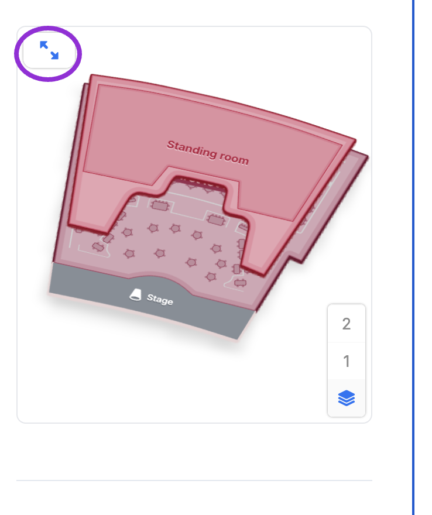
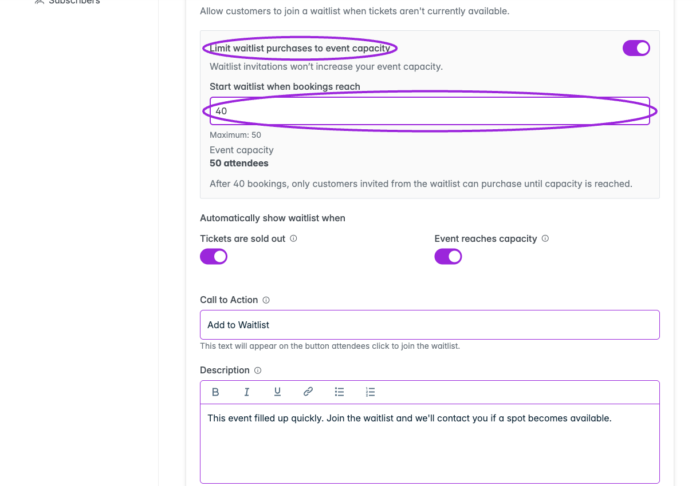

Selling event tickets on Shopify involves both the event's booking rules and the Shopify product page. Use the [Ticket Selector setup guide](./shopify-ticket-selector) for the full walkthrough.

## How do I add time slots to a Shopify product?

Create the event's sessions under **Dates & Times → Time Based** in Ticket Spot, configure tickets and capacity, then publish/update its Shopify product. Add the **Ticket Selector** app block to the product's theme template and select that template under **Shopify · Product linked → Product Template**.

Customers choose a date, time, and ticket through the selector before paying with Shopify. Use **Recurring** instead for a repeating schedule such as a weekly class. See [Shopify time-slot setup](./shopify-ticket-selector#time-slots-and-calendar-selection-on-shopify).

## Can customers choose a date from a calendar on Shopify?

Yes. Set up your event dates and choose a calendar presentation in **Design → Widget**. The **Ticket Selector** displays that booking flow on the linked product page.

The **Event Widget** app block serves a different purpose: it lists events on a Shopify page. Use **Ticket Selector** when the customer is already on an event product and needs to choose a date or time.

## Can I sell tickets with a seating chart on Shopify?

Yes. Create and publish the seating chart in Ticket Spot, assign it to the event, and map its categories to ticket types. Install **Ticket Selector** on the product's assigned template so customers can choose seats. Shopify's standard variant dropdown does not provide Ticket Spot seat selection.

Customers choose their seats before Shopify checkout. Check availability, price options, and the enlarged map on mobile. See [Shopify seating setup](./shopify-ticket-selector#seating-charts-on-shopify).

<Frame caption="Ticket Selector displays the seating chart on the Shopify product page.">
  
</Frame>

## Can ticket variants share one inventory limit?

Use Ticket Spot's **Event Capacity** for a shared attendee limit, alongside individual ticket quantities. For example, Adult and Child tickets can share a room capacity of 30. Apply the right limit to each date or time slot when the event has separate occurrences.

Shopify tracks stock per variant; setting both variants to 30 does not create a combined limit of 30. Use the Ticket Selector booking flow and keep the event and linked product synchronized. See [shared inventory across ticket variants](./shopify-ticket-selector#shared-inventory-across-ticket-variants).

## Can I sell event add-ons with my Shopify tickets?

Yes. Create a **separate event** for each extra and enable **Event Details → Privacy → Hide Event from Event Listing**. **Publish every add-on to Shopify**: the hide flag makes its Shopify product **Unlisted**, while the published ticket variants remain available for checkout. Leaving the add-on as a draft is not enough.

Attach these events under the main event's **Event Add-ons** and use **Ticket Selector** on the main product. Customers choose their main ticket first, then add-ons. An add-on can have one date or several; it uses its **first ticket**, with its own price, per-order limits, and available capacity. For multiple dates, attach the parent event so customers can choose their date.

Follow [Shopify event add-on setup](./shopify-event-add-ons) for the complete steps and screenshots.

## Can I use a waitlist for event tickets on Shopify?

Yes. Use the **Ticket Selector** app block on the Shopify product's assigned template for Ticket Spot waitlist signup and invitation-based purchases. The normal Shopify variant picker does not display the Ticket Spot waitlist form or handle that invitation flow.

Enable the waitlist in **Ticket Spot → event → Waitlist → Settings**, then [install and assign the selector](./shopify-ticket-selector#install-the-product-block). When inviting guests from **Subscribers → Notify Guests**, choose **Purchase from Event Page → Use Shopify Product URL** and keep the full personalized link intact. It carries the guest's invitation and any ticket or quantity restrictions.

See [Shopify waitlist setup](./shopify-ticket-selector#waitlists-on-shopify) and the [complete waitlist guide](../event-management/waitlist).

## When does my Shopify waitlist start?

The **Start waitlist when bookings reach** setting is a number of attendee places, not a date or time. Set a finite **Event Capacity**, enable **Limit waitlist purchases to event capacity**, and choose the start value in **Waitlist → Settings**.

With capacity **50** and start value **40**, the public can book 40 places. Further purchases need an invitation and must fit within the total capacity of 50. **0** makes purchasing invitation-only from the beginning. Invitations do not increase that capacity.

<Frame caption="Start the waitlist at 40 booked places while keeping the event's total capacity at 50.">
  
</Frame>

Sold-out and event-capacity triggers are also available. Follow [waitlist start settings](../event-management/waitlist#invitation-only-purchasing-within-event-capacity), including date/time overrides.

## Which product template should I select in Ticket Spot?

Choose the template that contains the **Ticket Selector** app block. Its name is up to you; **Ticket spot** is an example, not a required name. Create and save it in Shopify, then select it under **Shopify · Product linked → Use Ticket Spot Selector → Product Template** and click **Save Settings**.

Ticket Spot lists templates from the **published theme**. If yours is missing, confirm it exists there and reload the event. Choosing a product in the theme editor's preview does not assign the template. See [template assignment](./shopify-ticket-selector#5-assign-the-template-to-the-linked-event-product).

## Why is the Ticket Selector missing or the normal buy button still showing?

Check that the product is linked to the correct Ticket Spot event, its assigned template contains the saved **Ticket Selector** block, and the template belongs to the storefront's published theme. Then confirm **Use Ticket Spot Selector** is enabled and saved in Ticket Spot.

Review native variant, quantity, and buy-button blocks on that event template. Remove competing purchase paths that bypass the selector's required date, seat, or access-code selection. If you changed themes, add the app block to the new theme too.

## Can I restrict Shopify event tickets with an access code?

Yes. Set the event or hidden-ticket access rule in Ticket Spot and use the selector on Shopify. For hidden tickets, turn on **Show access code field** in **Design → Widget → All Settings → Checkout**.

An access code unlocks access; a promo code changes price. Test a valid and invalid code before sharing the product. See [access-code setup](./shopify-ticket-selector#access-codes).

## Can I track ticket sales from Shopify campaign links?

Create a link under the event's **Tracking Links**, choose **Use Shopify Product URL**, and share the generated **Tracking URL**. Keep the full URL intact so its Ticket Spot tracking information reaches the selector.

Review views, tickets, and sales under **Tracking Links**. Sharing the plain product URL does not identify the campaign. See [tracking links to Shopify products](./shopify-ticket-selector#tracking-links-to-shopify-products).

## Can customers skip the Shopify cart page?

Enable **Direct Checkout** in the linked-product panel and save. Customers still complete ticket selection and any required attendee form, then continue to Shopify checkout. This setting skips the cart page, not payment.

## Can I use the buyer's Shopify details instead of asking for every guest?

Enable **Skip Attendee Details Form** to use the Shopify purchaser's contact information. Leave it off when you need each guest's name, event-question answers, or waivers. Waitlist signup still collects contact details.

For individual guest information, leave the skip option off and enable **Collect attendee details for each ticket** in widget Checkout settings. See [linked-product options](./shopify-ticket-selector#product-settings-and-attendee-details).

## Does the Ticket Selector also display tickets after payment?

The selector handles booking before payment. Add **Ticket Spot – Ticket Access** separately to Shopify's **Thank You** page for post-purchase ticket access. Follow [Thank You page setup](./connect-shopify#enable-the-ticket-block-on-the-thank-you-page).
