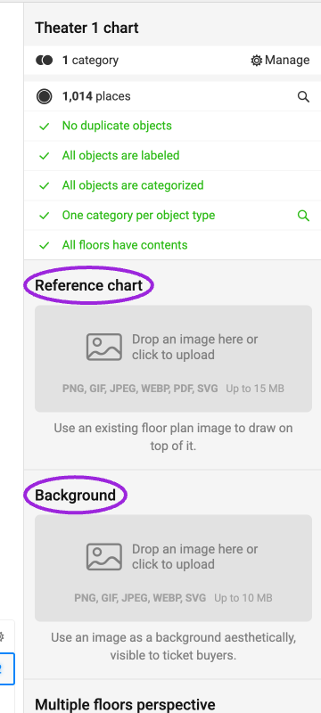
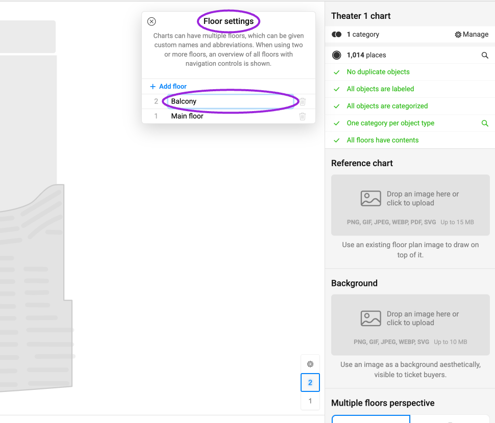
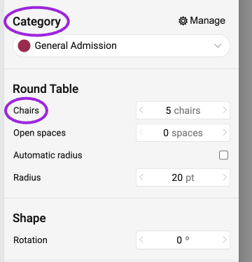
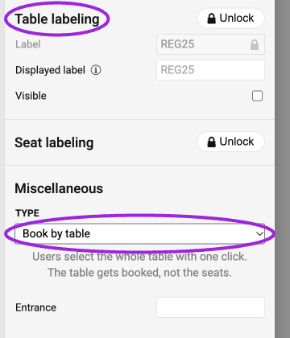

**Business+ and Platform** add advanced venue layouts to the [seating chart workflow](/seating-charts/create-and-assign).

| Option | Use case | What to verify |
|---|---|---|
| Venue floor-plan upload | Trace the venue using an image as the design reference. | Seat positions, entrances, and labels remain readable; the image itself does not create bookable seats. |
| Whole-table sales | Sell a dinner or hospitality table as one bookable unit. | Select and price the intended table unit, and verify the resulting quantity at checkout. |
| Booth layouts | Offer booths or grouped spaces with distinct labels. | Each offered booth has a category and the intended capacity. |
| Multiple floors | Separate balcony and main-floor inventory. | Every floor is named and accessible in the attendee selector. |
| Multiple zones | Organize a large venue into clearly identified areas. | Zone labels and category assignments correspond to the ticket offer. |

## Reference floor plans and buyer-visible backgrounds

<Frame caption="A Reference chart is a guide for drawing the venue. A Background image is decorative and visible to buyers; neither upload creates seats.">
  
</Frame>

**Reference chart** uploads a drawing guide for the designer: PNG, GIF, JPEG, WEBP, PDF, or SVG, up to 15 MB. **Background** uploads a decorative image visible to ticket buyers: PNG, GIF, JPEG, WEBP, or SVG, up to 10 MB. Add and categorize actual bookable objects over the image.

## Floors and sections

<Frame caption="Floor settings gives each level a clear name and abbreviation. Multiple floors add navigation controls to the buyer’s seating map.">
  
</Frame>

In a chart with floors, use **Edit floors** beside the floor selector to name levels and choose abbreviations. Two or more floors add an overview and navigation controls for buyers. Enter a section to edit the seats inside it; confirm every floor contains the intended objects before publishing.

## Sell individual chairs or an entire table

Select a table in the designer. Its properties include **Category**, **Chairs**, **Open spaces**, radius or dimensions, rotation, and **Table labeling**. Set the category that you will map to a ticket, and give every bookable table a unique label. **Displayed label** changes what visitors see; keep the underlying label suitable for identifying the booking.

<Frame caption="The selected table has a category and five chairs. Layout properties do not determine whether the table or individual chairs are sold.">
  
</Frame>

Under **Miscellaneous → Type**, choose:

- **Book by seat** to let customers select individual chairs.
- **Book by table** to let a customer select and book the entire table with one click. The table is the bookable object, so do not assume its chair count creates that many individual ticket records.

<Frame caption="Table labeling identifies the unit; Book by table reserves the whole table instead of its chairs.">
  
</Frame>

Publish the chart, assign the table category to the intended ticket, and inspect the buyer's selected unit, quantity, and price. Keep the ticket description clear about how many people the table admits. For individual-chair booking, also check seat labels. Do not change the booking unit on an already sold layout without reviewing existing reservations.

## Configure the layout

1. Open **Seat Charts** and edit or duplicate the venue chart.
2. In the designer, configure the background, tables, booths, floors, or zones needed for your venue.
3. Label bookable objects and assign categories. Keep a clear distinction between background decoration and sellable inventory.
4. Save and publish the chart. Resolve validation errors before attaching it to an event.
5. Follow [event assignment](/seating-charts/create-and-assign) to connect ticket categories and prices.
6. Preview the map on desktop and mobile. Test each floor or zone and inspect the purchase summary, especially for whole tables.

Use a chart copy when developing a substantially different layout. A visual change to a sold venue should preserve the meaning of seats attendees have already booked.
