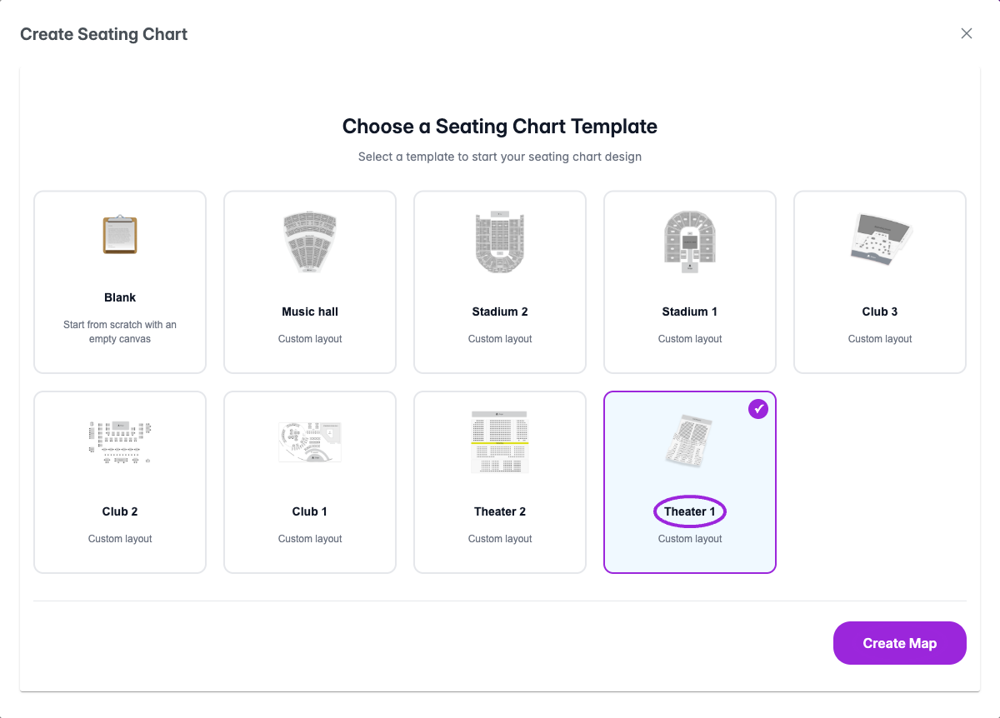
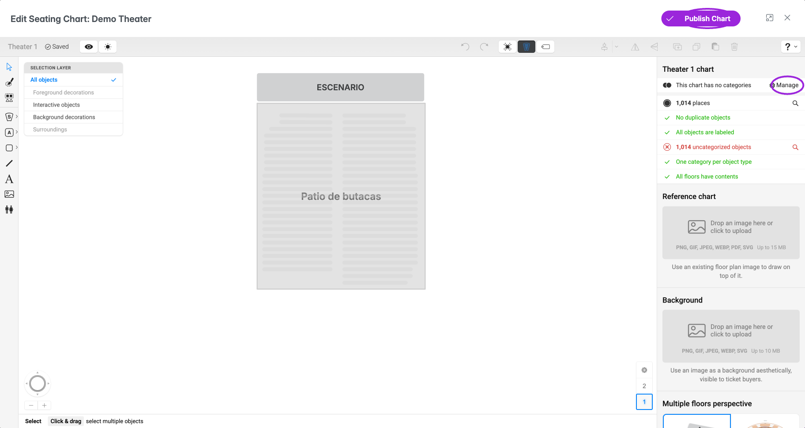
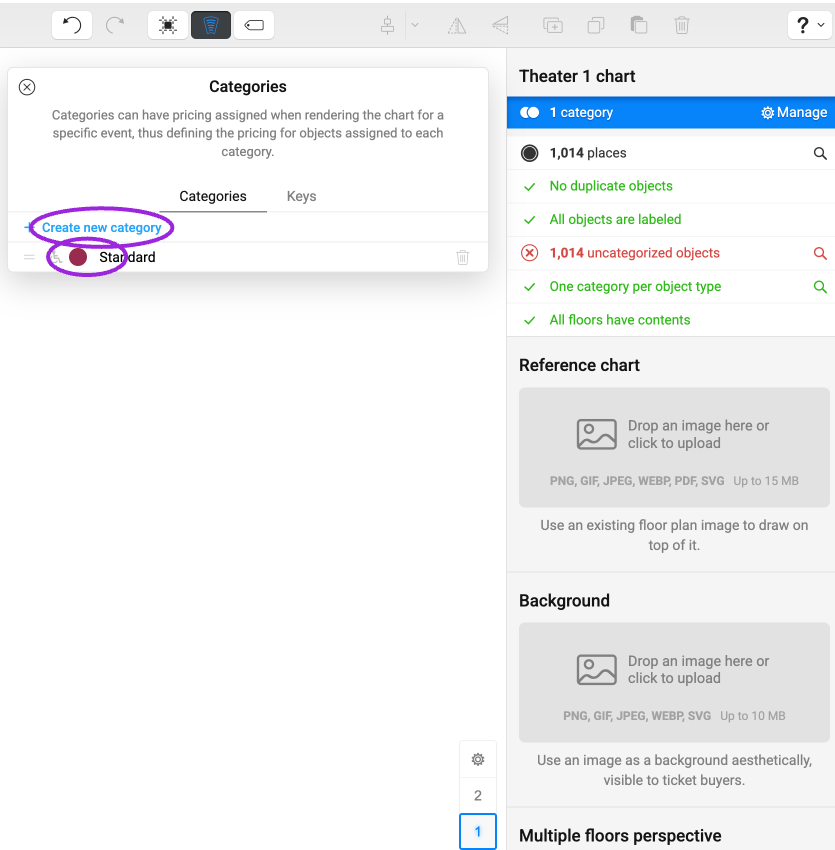
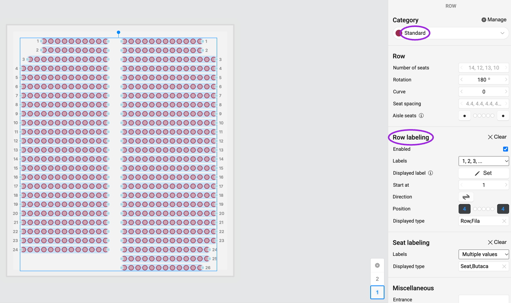
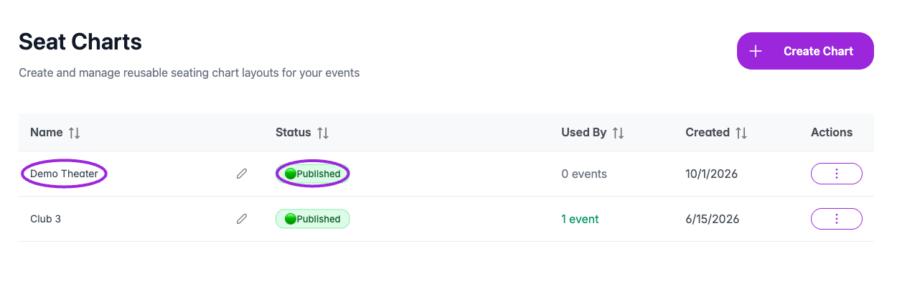
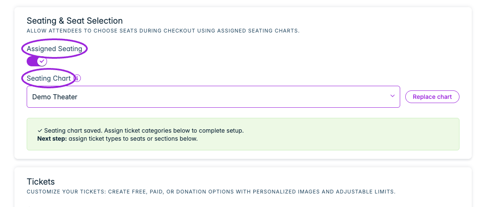

Use **Seat Charts** to create a reusable venue map and assign it to a ticketed event. Interactive charts, rows, tables, sections, general admission areas, and category pricing are available on **Business and higher**.

## Build and publish a chart

<Frame caption="Choose Blank or a venue template, then select Create Map. If the designer does not open automatically, use the new chart’s actions menu → Edit.">
  
</Frame>

<Steps>
<Step title="Create the venue map">
Open **Seat Charts** in the top navigation and click **Create Chart** or **Create Your First Chart**. Choose **Blank** or a venue template, then **Create Map**. If the designer does not open automatically, open the new chart’s actions menu and choose **Edit**. Use the pencil beside its name in the chart list to give it a recognizable venue name.
</Step>
<Step title="Lay out the venue">
Use the designer to add rows, tables, sections, or general admission areas. Label seats and areas so staff and attendees can identify them. Check the number of bookable places against the venue's intended capacity.
</Step>
<Step title="Create seat categories">
Use **Manage → Create new category** to add categories such as Standard or VIP. Select rows or seats, then assign a **Category** in their properties panel. In a chart with sections, enter each section to categorize the seats inside. Every bookable object needs a category; the ticket price is configured on the event.
</Step>
<Step title="Publish">
Save the chart and choose **Publish Chart** in the editor or **Publish** in the chart list. Resolve the issues shown in **Cannot Publish Chart**, then publish again. Confirm the chart is marked **Published**.
</Step>
</Steps>

<Accordion title="See the designer, categories, and published result">

<Frame caption="The designer reports uncategorized seats before publishing. Use Manage to create categories, assign every bookable object, then Publish Chart.">
  
</Frame>

<Frame caption="Create named seat categories in the designer. Ticket prices are assigned later on the event.">
  
</Frame>

<Frame caption="Select rows or seats and choose a Category. The same properties panel controls row and seat labels, spacing and orientation.">
  
</Frame>

<Frame caption="Confirm the chart is Published in Seat Charts before assigning it to an event. Rename with the pencil; the actions menu contains Edit, Duplicate and Delete.">
  
</Frame>

</Accordion>

## Assign the chart to an event

<Frame caption="Enable Assigned Seating in Tickets and choose a published chart. Wait for the saved confirmation, then assign seat categories to tickets below.">
  
</Frame>

1. Open or create your ticketed event and save it.
2. In **Tickets**, find **Seating & Seat Selection** and enable **Assigned Seating**.
3. Choose a published **Seating Chart**. Draft charts are not selectable.
4. Create or edit each ticket type. In its **Seat Categories** settings, select the categories that this ticket can book, and set its price and applicable ticket controls.
5. Save the ticket and event. Check that every category offered for sale has an appropriate ticket assignment.

For a series, **Seating for all dates** confirms that the chart applies automatically to occurrences using event defaults, including dates you add later. Each date/time has separate seat availability. If setup is incomplete, use **Retry seating setup** and review any reported failed dates before selling.

## Verify the attendee experience

Open the public event checkout, choose the correct occurrence, and select a seat in each category. Check the label, ticket type, price, quantity, and order summary. Confirm a completed booking records the selected seat and removes that place from the available inventory for the same occurrence.

On Shopify, install the [Ticket Selector app block](/plugins/connect-shopify). The standard product variant selector does not provide the interactive seating map.

## Reuse and maintain charts

Use **Duplicate** in **Seat Charts** to start a new layout from an existing chart. Name versions clearly so the event uses the intended map. Before changing a chart attached to an event with sales, inspect existing bookings and their seat assignments. Recheck the public map after publishing any change.

If a selected chart is invalid, follow **Fix in Designer**, correct the reported issues, and publish it before returning to the event.

## Related guides

- [Advanced venue layouts](/seating-charts/advanced-layouts)
- [Ticket controls and category pricing](/event-management/ticket-setup)
- [On-site ticket sales](/on-site/box-office-pos)

## Seat selection, date overrides, and reassignment

Follow [Seat selection and attendee assignment](./seat-selection) to offer multiple ticket prices in one category, verify per-date seating, replace or inherit charts, inspect seating allowance, and assign existing orders to seats. Test both the buyer's map and the attendee-management result.
