Start with a [published seating chart](./create-and-assign), a saved ticketed event, and enough reserved-seating allowance for your expected bookings.

## Connect categories and ticket prices

<Frame caption="In each ticket’s Seat Categories tab, select every category that ticket can book. Multiple ticket types can share one category; prices are set in Pricing &amp; Access.">
  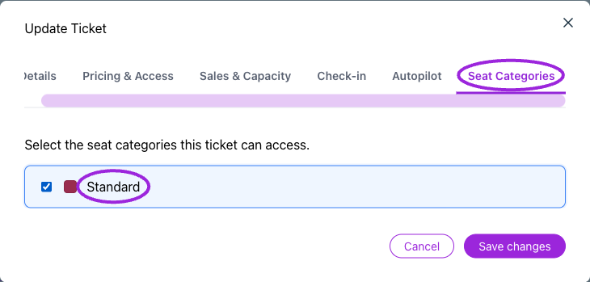
</Frame>

1. In the event's **Tickets** step, enable **Assigned Seating** and choose the chart.
2. Open each ticket's **Seat Categories** and select the categories it can book.
3. Set the ticket price, inventory, sales window, and order limits.
4. Save the ticket and event, then inspect the public map.

A category groups bookable seats; it is not itself a ticket price. You can assign more than one ticket type to a category, such as Adult and Child. The buyer chooses the appropriate ticket for each selected seat. An **Accessible** category label identifies that category in the assignment picker; check that your venue labels explain the actual accommodation.

The buyer's **Ticket summary** lists each selected seat and the ticket prices assigned to its category. Choose a price for each seat. The category name in the seat heading stays the same when the ticket changes; verify the selected ticket and updated total below it.

<Accordion title="Choose between prices for the same seat">
<Frame caption="Standard and Child share the Standard seat category. The buyer chooses the ticket price for this seat.">
  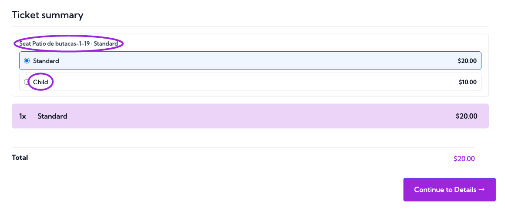
</Frame>
<Frame caption="Choosing Child updates the ticket summary and total to $10 while keeping the same seat.">
  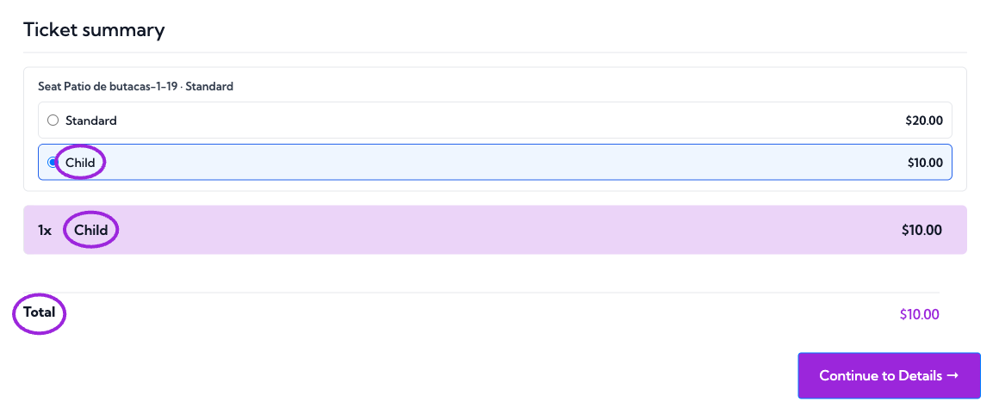
</Frame>
</Accordion>

For tables, booths, floors, and zones, see [advanced layouts](./advanced-layouts). Whole-table selection must match the unit you intend to sell.

## Buyer selection

The buyer chooses the occurrence, opens its seating map, selects available seats or other bookable objects, and reviews the ticket type and price. The map can expand for easier selection. Closing the expanded map returns to the surrounding checkout.

<Accordion title="See the buyer map and selected-seat summary">
<Frame caption="Choose a floor and use the expand control to navigate the venue.">
  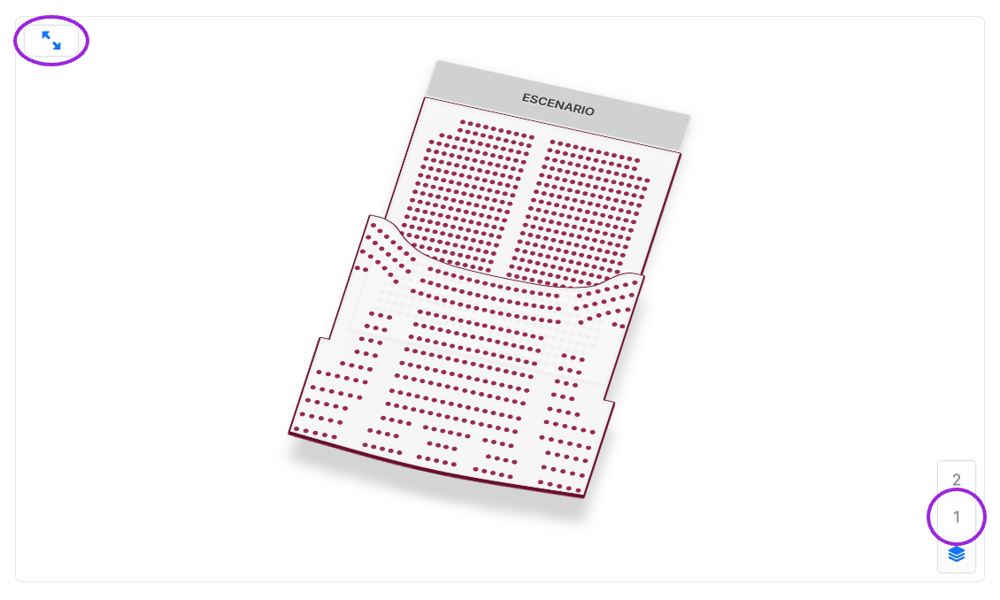
</Frame>
<Frame caption="A check mark and Selected identify the seat held for this checkout.">
  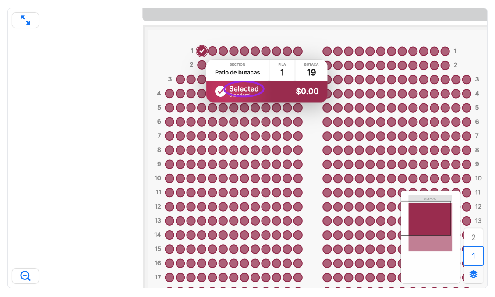
</Frame>
<Frame caption="Review the ticket type, exact seat label, and total before entering attendee details.">
  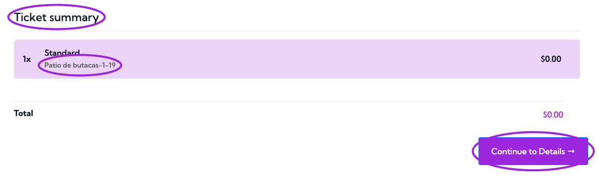
</Frame>
</Accordion>

Selected seats are held temporarily during checkout. A completed purchase is required to confirm admission. If a selection expires or becomes unavailable, refresh availability and choose again; do not treat an old cart as a booking.

Check the summary before payment: occurrence, section/row/seat labels, category, ticket type, quantity, and price. On Shopify, use the [Ticket Selector](/plugins/shopify-ticket-selector) and confirm that the seat assignment survives the Shopify checkout handoff.

### Expand the map on mobile

Use the expand control in the map's top-left corner. Choose a floor, then pan and zoom to individual seats. The top-left close control returns to checkout; check the summary and Continue button after returning.

<Accordion title="Compare the embedded and expanded mobile map">
<Frame caption="The expand control opens the map across the available screen.">
  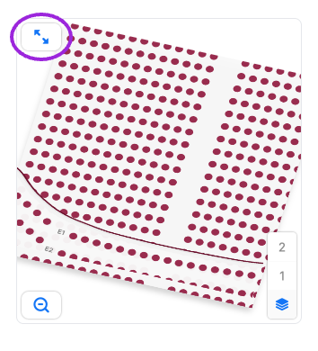
</Frame>
<Frame caption="The expanded view retains floor navigation and zoom. Close it using the top-left control to return to checkout.">
  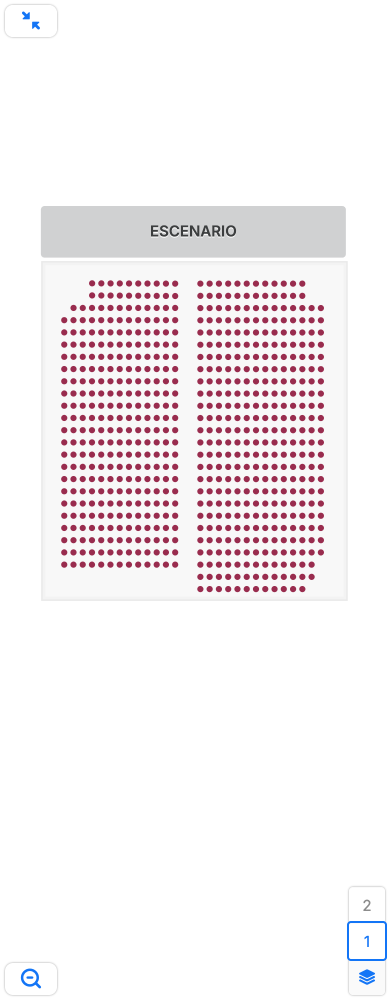
</Frame>
</Accordion>

### Availability and selection limits

The map applies available ticket inventory, order limits, and the site's remaining seating allowance. With ticket-first selection, the chosen ticket quantity also limits the number of seats. The checkout still checks each ticket's rules when several ticket types share one category.

The widget can show low-stock and sold-out notices, unmet minimum-order quantities, or a seating selection limit. Resolve the notice before continuing. If reserved seating is temporarily unavailable because the site has no seating allowance, the map is read-only and shows an explanatory message. The organizer can review [usage and seating credits](/account/billing-and-plans).

Configure the seat-hold duration under **Settings → General**; the allowed range is 1–120 minutes. Expired holds require the buyer to refresh and choose seats again. Deselecting a seat removes it from the current selection. An unavailable seat might be sold, blocked, or held by another checkout; its appearance alone does not identify an attendee.

## Series and date-specific seating

A series chart automatically applies to dates and times using event defaults, including new dates. Each occurrence keeps separate seat availability. **Retry seating setup** appears when setup needs attention; resolve the reported dates before selling.

<Frame caption="The series chart applies automatically to dates and times using event defaults. Each occurrence has separate availability.">
  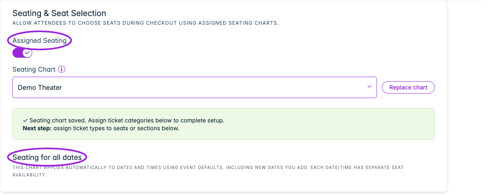
</Frame>

At date level, review **Uses event seating** versus **Custom seating for this date**. **Use event seating** restores the parent chart. Read the confirmation: it clears that date’s category mappings, and dates with booked seats cannot switch through this action.

<Accordion title="Compare inherited and custom date seating">

<Frame caption="An occurrence using the parent chart is labeled Uses event seating.">
  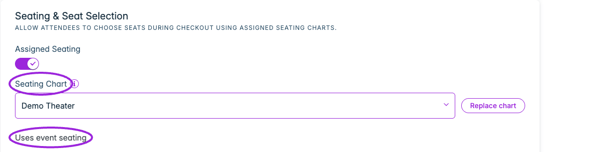
</Frame>

<Frame caption="A custom date chart exposes Use event seating. Read its confirmation before returning to inheritance.">
  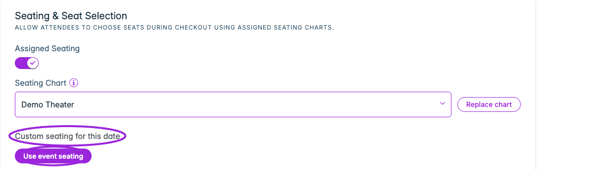
</Frame>

</Accordion>

## Replace a chart with existing bookings

<Frame caption="Replace chart opens a preview workflow. Choose a published replacement and preview the seat matches before booking or activating it.">
  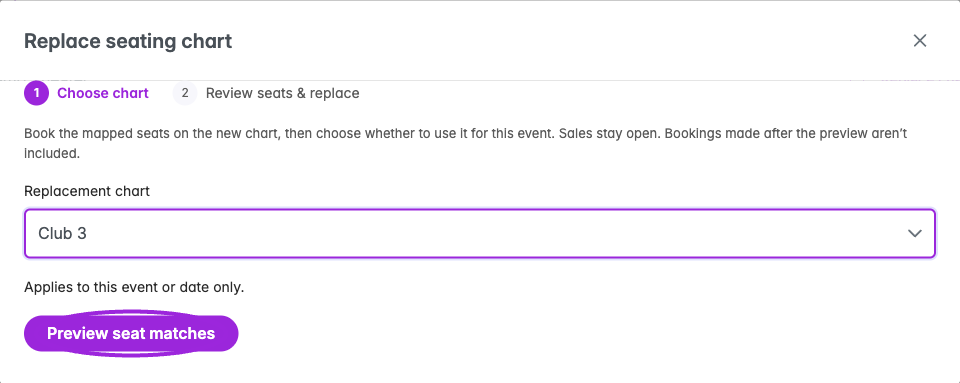
</Frame>

1. In **Tickets → Seating & Seat Selection**, choose **Replace chart**.
2. Choose another published chart containing individually assigned seats and select **Preview seat matches**. Whole-table and general-admission layouts need separate handling; the preview reports this restriction. A series replacement includes dates using event seating; dates with custom seating keep their own charts.
3. Review **Review the new seats**. Seats with the same label are matched automatically. Resolve unmatched seats, inspect changed labels and any attendee records that will not move, and check every affected occurrence.
4. Under **Match ticket categories**, map each current category to a category on the replacement chart. Ticket prices stay the same. Review any move into a different ticket category.
5. Read the credit total and confirmation. Every booked seat moved uses a seating credit, including booked blocks and seats without an attendee. Retrying does not charge the same replacement seat twice; restoring the original chart does not refund used credits.
6. **Book mapped seats** reserves the reviewed seats on the replacement chart. The event still uses the original chart until you choose **Use new chart**.
7. Inspect the final result and chart history. Verify affected attendee seat labels and the public map.

Sales remain open during this workflow. Bookings made after the preview are not copied automatically. No emails are sent by chart replacement; notify affected attendees separately when appropriate. Restoring the original checks for newer bookings before it can proceed.

<Accordion title="See the replacement review and layout restriction">

<Frame caption="The replacement review shows matched seats and category mapping before any booking. This empty demo event has no seats to move; a sold event lists its existing bookings here.">
  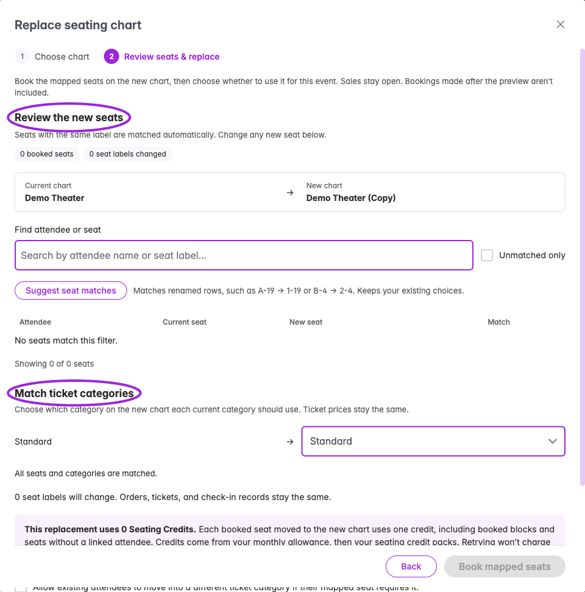
</Frame>

<Frame caption="The replacement preview checks the target layout. Whole-table and general-admission layouts need separate handling; choose a chart containing individually assigned seats.">
  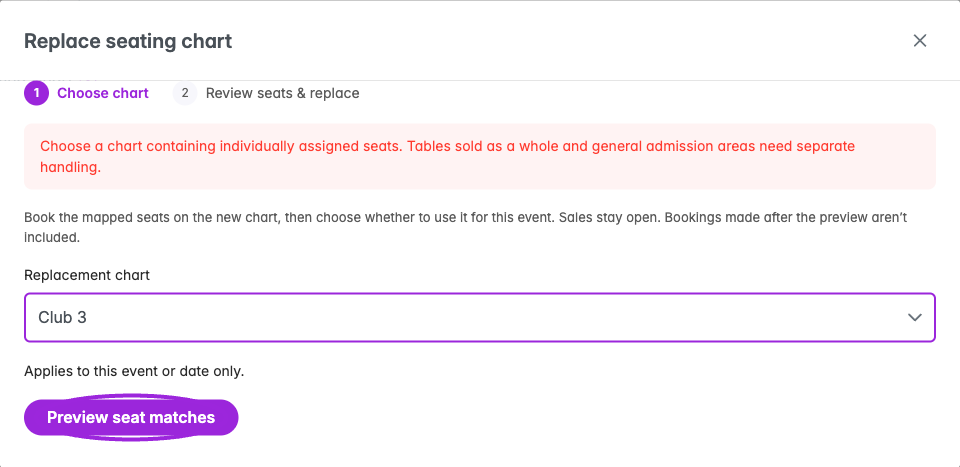
</Frame>

</Accordion>

## Attendee seating dashboard

Open the event's **Attendees** page and choose **Seating Chart**. For a series, select **Event Date** and **Time Slot** when offered; each occurrence has its own seat availability. The left panel shows **Seat Summary** with total **Seats**, **Booked**, and **Available**. A blocked seat without an attendee still affects availability.

Use the map's zoom and floor controls to reach the seats you need. The label menu can show seat and row labels. Click a floor or section to enter it, then zoom far enough to select individual seats. **Seat Details** on the right identifies the selected seat and its current state:

| State | Meaning |
| --- | --- |
| **Available** | No booked seat or assigned attendee is associated with this selection. |
| **Assigned** | An attendee record is linked to the seat. Review their name and ticket before changing it. |
| **Blocked** | The seat is booked on the map but has no linked attendee record. It may be reserved without an attendee. |

<Frame caption="The event seating view combines map availability, occurrence selection, and attendee assignment controls.">
  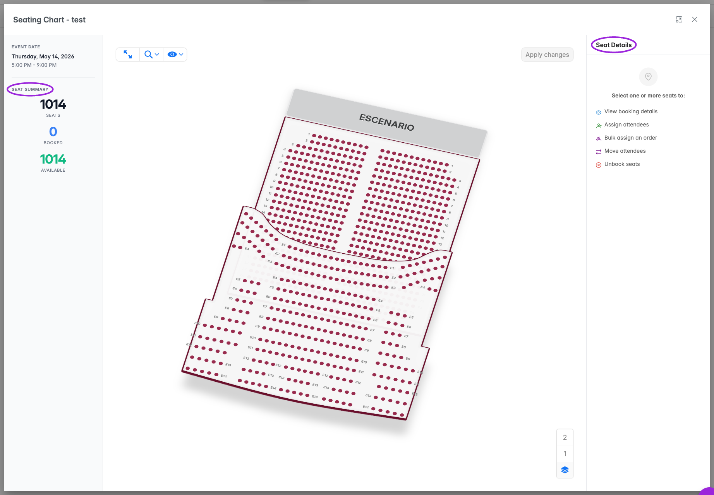
</Frame>

<Frame caption="A completed two-seat assignment updates the Demo event to 2 booked and 1,012 available seats.">
  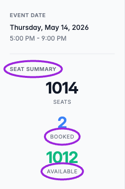
</Frame>

## Assign seats to existing attendees

For one selected seat, choose **Assign Attendee** and type at least two characters of a name or email. Enable **Only unassigned** to restrict the search to attendees without seats. Choose the attendee and **Assign**. If they already have a seat, review **Confirm Reassignment** before moving them.

<Frame caption="Search for an individual attendee, optionally restricting the list to people without seats.">
  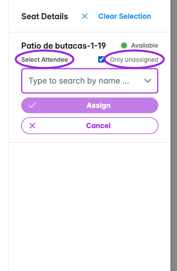
</Frame>

For several seats:

1. Select the seats on the chart.
2. Use **Assign … Seats to Order** and search by attendee/buyer name or email.
3. Choose the order and inspect **Review Seat Assignment**.
4. Check **Currently seated**, **After assignment**, **Still unseated**, and the proposed attendee-to-seat pairings. Seats are paired in row order with attendees in purchase order; existing seat holders can be moved.
5. Review **Moving seat**, **Ticket mismatch**, **Conflict**, and **Stays empty** rows. A ticket-category mismatch requires acknowledgement before confirming. Not-attending and waitlisted attendees are excluded unless you explicitly include them. Confirming a conflict can unseat people currently occupying the selected seats.
6. Confirm the assignment and inspect **Seats Assigned**. If some attendees remain unseated, select more seats and use **Assign Remaining**.

For a multiple-seat selection, **Assign Individual Seats** expands the per-seat controls. **Clear Selection** clears the selection without changing bookings.

<Frame caption="Multiple-seat selection exposes order assignment, blocking, and unblocking controls.">
  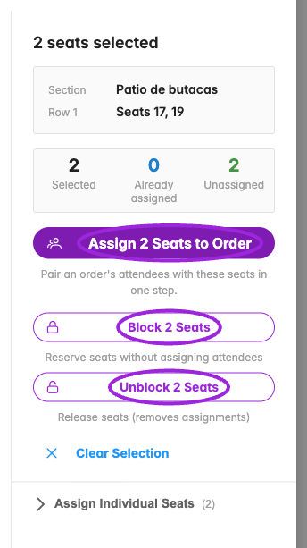
</Frame>

<Accordion title="Review an order and verify the saved result">

<Frame caption="Search by attendee or buyer name or email, then choose the order and review its ticket count.">
  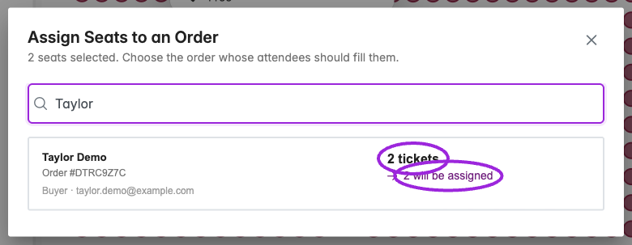
</Frame>

<Frame caption="Review the attendee-to-seat pairings and the before/after totals before confirming.">
  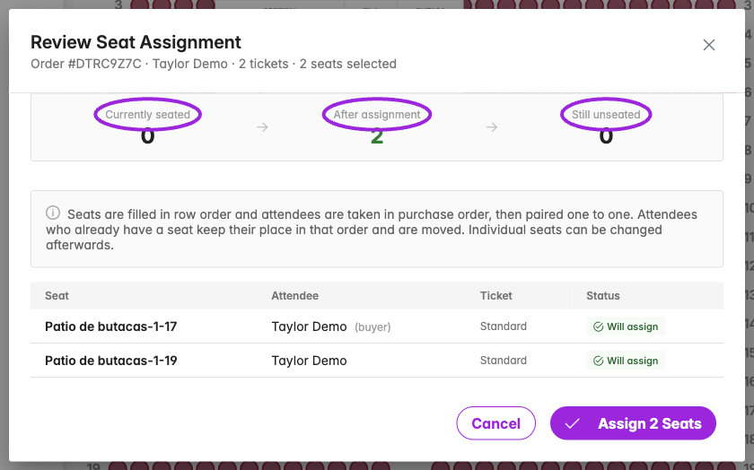
</Frame>

<Frame caption="The saved result confirms both seats were assigned and nobody in this order remains unseated.">
  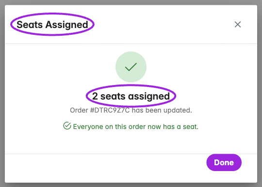
</Frame>

</Accordion>

<Frame caption="A partial assignment can leave attendees unseated. A Conflict row also warns when confirmation would unseat somebody from another order. This preview was canceled.">
  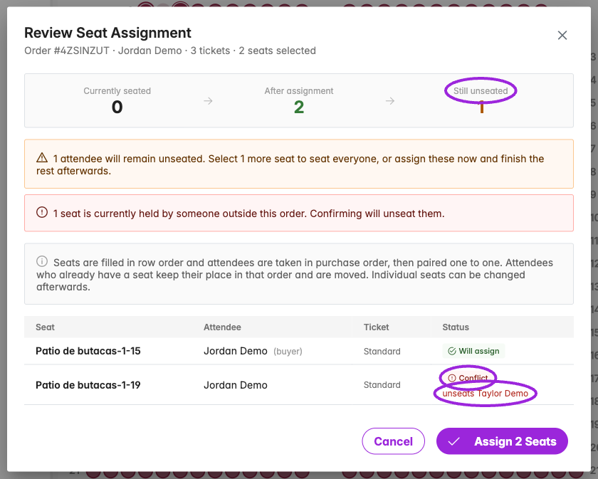
</Frame>

### Block, unblock, and unbook

The multiple-seat summary also offers **Block … Seats** to reserve seats without assigning attendees, and **Unblock … Seats** to release the selection. **Unblock** can remove attendee assignments; review the selection before clicking because these bulk controls submit immediately.

For an assigned seat, **Unbook Seat** opens **Confirm Unbook**. Confirm only when you intend to release that person's seat. Unbooking a seat is separate from canceling or refunding the attendee's order.

<Accordion title="See assigned-seat and confirmation screens">

<Frame caption="The selected seat shows its attendee and ticket before any change.">
  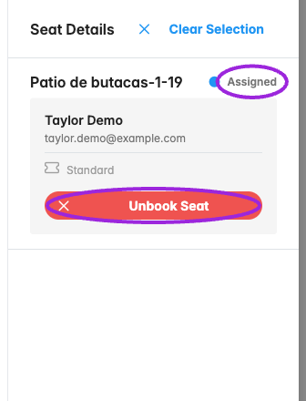
</Frame>

<Frame caption="Unbook Seat requires confirmation. This example was canceled, leaving the original assignment in place.">
  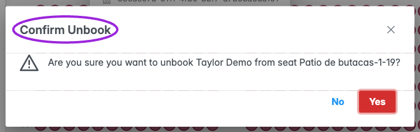
</Frame>

<Frame caption="Moving an attendee who already has a seat shows both the original and proposed seat labels.">
  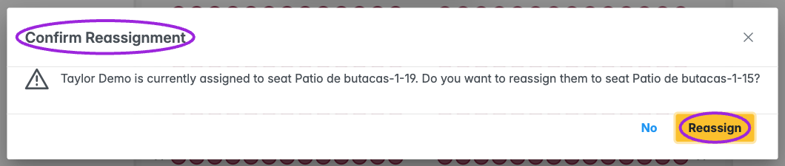
</Frame>

</Accordion>

Assigning, moving, blocking, or releasing seats changes inventory. Verify the resulting map and attendee records before closing the view.

## Capacity and unavailable maps

Reserved-seating allowance is separate from event capacity and ticket inventory. A site can have tickets left but be unable to accept more seat reservations because its seating allowance is exhausted. The map can become view-only or show a seat-limit/unavailable message.

Review the account's reserved-seat usage and any **Add Reserved Seating Pack** action. Do not increase ticket inventory to solve a seating-allowance problem. The attendee-facing messages can be customized in **Design → Widget → Text → Checkout → Seating**.

## Check before selling

Test one seat in every category, multiple ticket prices in the same category, a sold/held seat, order limits, two occurrences, and the mobile expanded map. Confirm an actual completed booking shows its seat in attendee records and ticket output. For a reassignment, verify both the moved attendee and anyone displaced.

### Review credits before booking

<Frame caption="Review category matching, Seating Credit usage, and the acknowledgement before Book mapped seats. This empty Demo event requires 0 credits; the replacement has not been booked or activated.">
  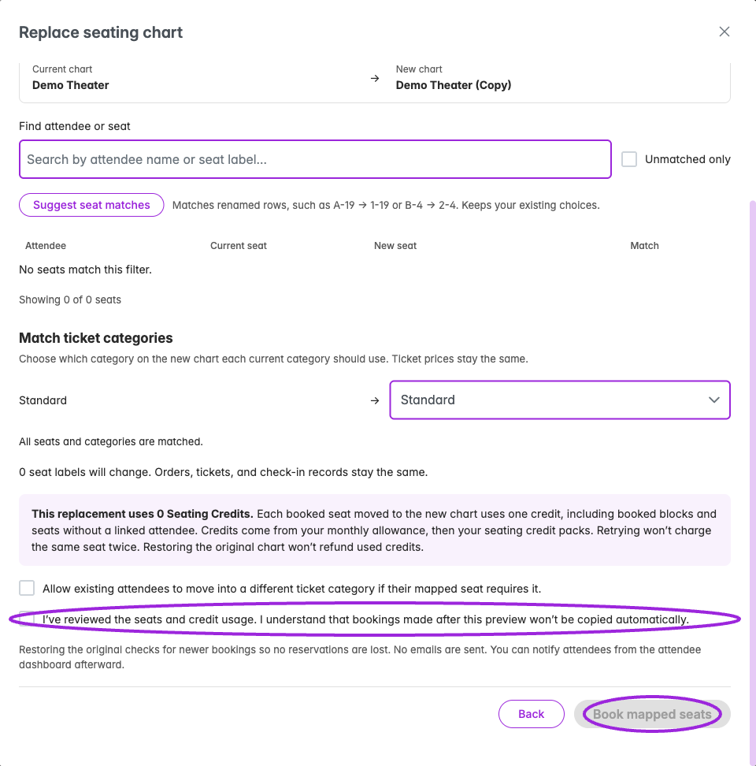
</Frame>
