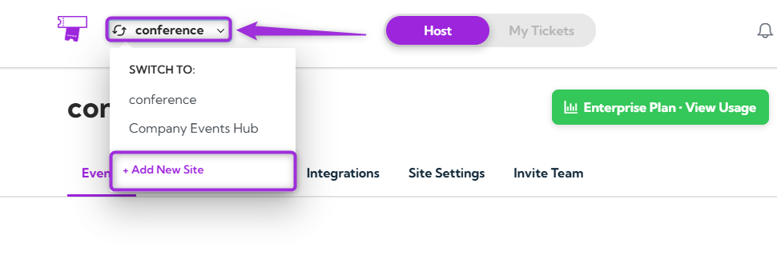
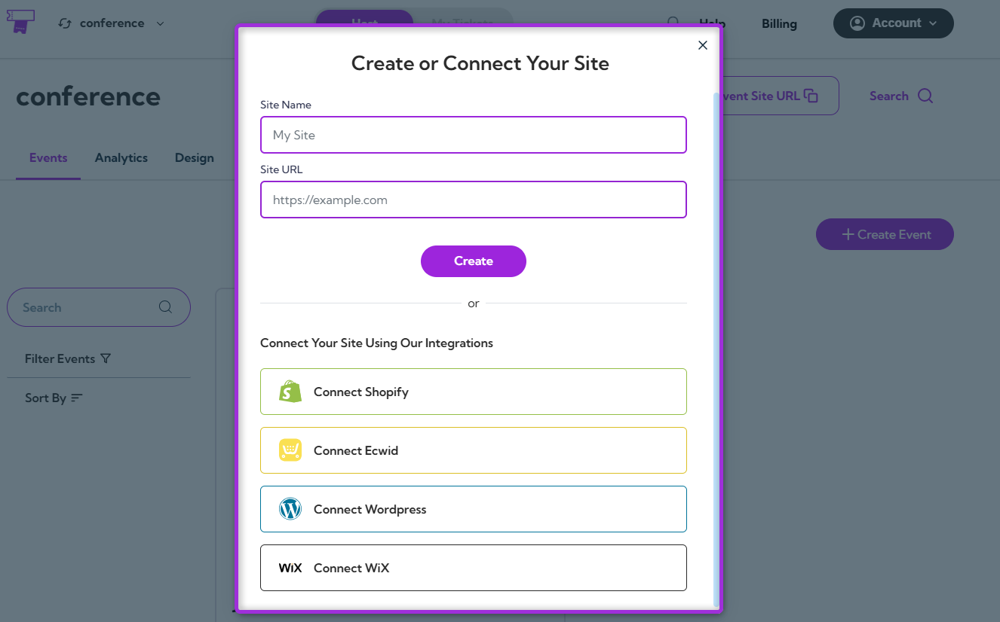
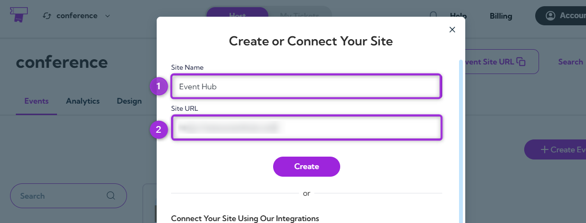
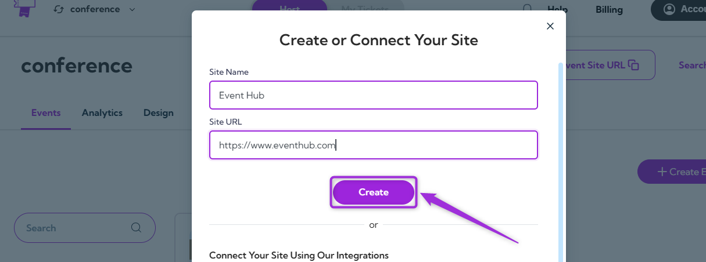
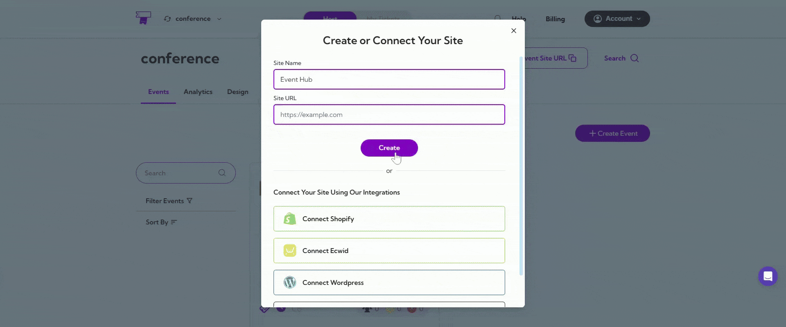
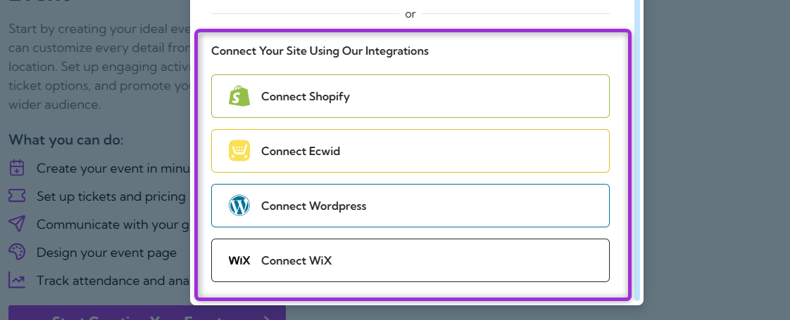
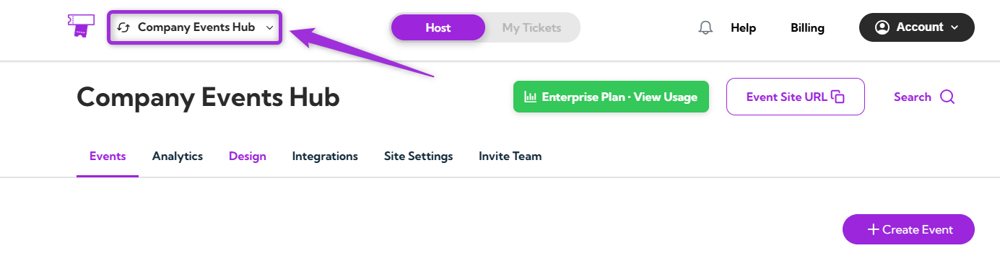
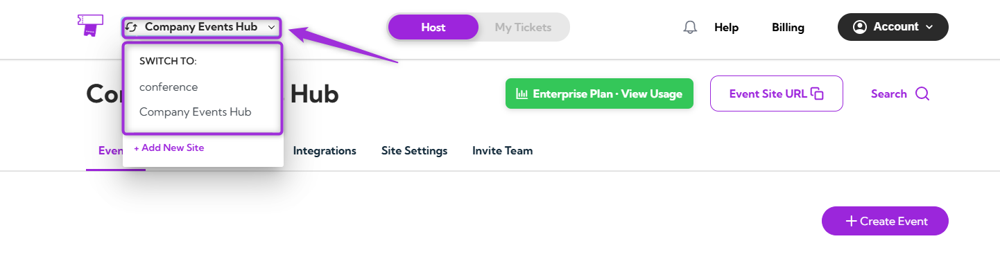
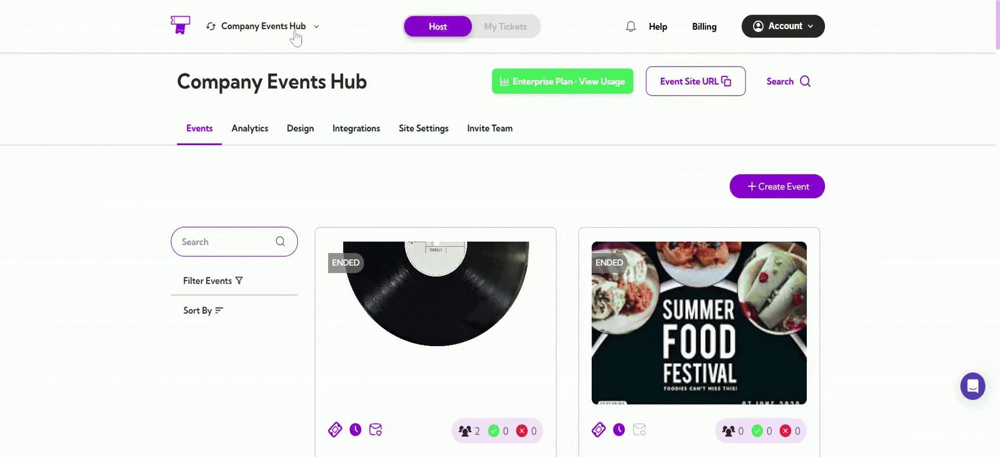

If you manage multiple sites, switching between them—or creating a new one—keeps your workspace organized and helps you move quickly between different event setups. From the site dropdown menu, you can jump to another site or add a brand-new one in just a few clicks. This guide walks you through how to do it smoothly.

Let’s get started 🚀

## Add a New Site

Creating a new site allows you to manage additional event pages within your TicketSpot account. Whether you're hosting a new event or setting up a different site, this process ensures seamless organization.

**Step 1:** Click on the **site name** in the top-left corner, open the dropdown menu, and select **+ Add New Site** to start adding a new site.

A modal window will appear where you can **Create or Connect Your Site.**

### Create Your Site

1. Enter your **Site Name** and **Site URL** — this will define the name and web address for your new site.

2. Click the **Create** button to finalize the setup of your new site.

Your new site will now appear in the dropdown list. Select it anytime to switch between sites.

### Connect Your Site

If you want to connect your site using one of our integrations, follow these steps for each platform:

- **Shopify Integration:** If you're using Shopify, click **Connect Shopify** to link your Shopify store with TicketSpot.
- **Ecwid Integration:** For Ecwid users, click **Connect Ecwid** to sync your Ecwid store with your TicketSpot account.
- **WordPress Integration:** To connect a WordPress site, click **Connect WordPress** and follow the instructions to link your WordPress site with TicketSpot.
- **WiX Integration:** If you have a site on WiX, click **Connect WiX** to integrate it with TicketSpot.

For each integration, a modal window will appear where you can enter the necessary credentials to link your site. Once connected, your site will be available for selection in the dropdown menu.

## Switch Site

**Step 1:** Log in to your Ticket Spot account and click on the **Site Name** (e.g., My Site or company event hub) in the top-left corner of the page.

**Step 2:** Select the site you want to switch to from the dropdown menu, which lists all the sites you’ve created for your events.

**Step 3:** Click on the site you want to switch to, and the page will refresh, automatically directing you to the selected site.

Once you've added a new site or connected an existing one, it will appear in the dropdown menu, and you can easily switch between sites as needed.
