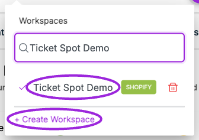
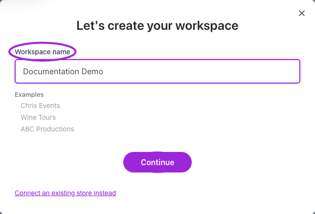
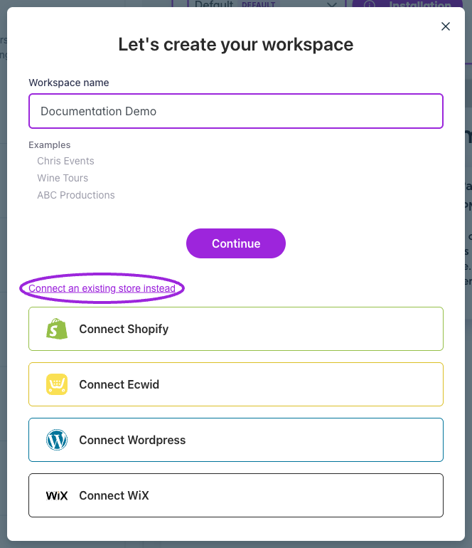

A workspace groups a site's events, settings, and design. Open the current site name at the top of the dashboard to see **Workspaces**. Choose the correct workspace before editing events or settings.

## Switch workspaces

1. Click the current site name.
2. Use **Search sites...** to filter by workspace name or platform.
3. Select a workspace. Ticket Spot reloads the dashboard for that workspace.

<Frame caption="Open the site name to show Workspaces. Search by site name or platform type, then select the workspace you want; Create Workspace starts a separate setup.">
  
</Frame>

## Create a workspace

1. Open the workspace menu and select **+ Create Workspace**.
2. Enter a **Workspace name**, up to 60 characters. A website URL is not required in this form.
3. Select **Continue**. Ticket Spot creates the workspace and opens its Events page.

<Frame caption="Create Workspace asks for a workspace name, then Continue creates it and switches to its Events page. This example was left as a draft.">
  
</Frame>

You can close the dialog before continuing to leave without creating a workspace. After creation, configure its [general site settings](/site-settings/site-settings) and [brand](/branding-and-design/brand-design), then [create an event](/event-management/create-event-overview).

## Connect an existing store

<Frame caption="Expand Connect an existing store instead to see Shopify, Ecwid, WordPress, and Wix. Shopify, Ecwid, and Wix open platform-specific connection or installation pages.">
  
</Frame>

In the creation dialog, expand **Connect an existing store instead** to view the platform choices.

- **Connect Shopify** starts the Shopify connection flow.
- **Connect Ecwid** opens the Ticket Spot listing in Ecwid's app marketplace.
- **Connect WiX** opens the Wix App Market listing.
- For **WordPress**, follow the [WordPress installation guide](/plugins/connect-wordpress) to install the plugin and add your widget shortcode.

The external platform completes its own installation or authorization steps. See the [Shopify](/plugins/connect-shopify) and [Wix](/plugins/connect-wix) guides for the steps specific to those platforms.

To embed Ticket Spot in another website, create a workspace and use the [website embed instructions](/plugins/embed-on-your-website).
