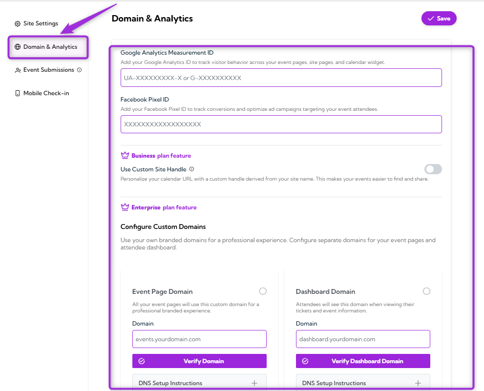
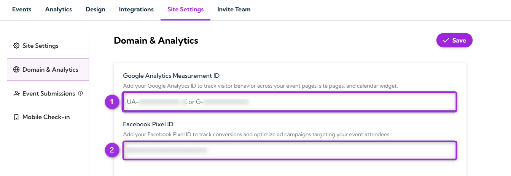
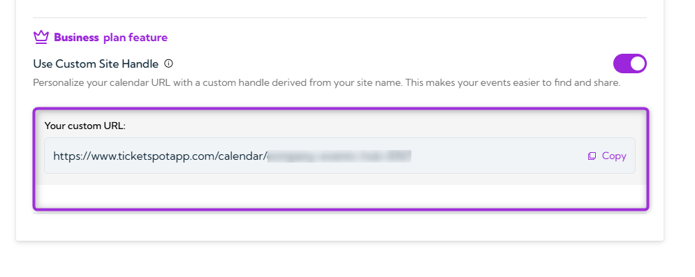
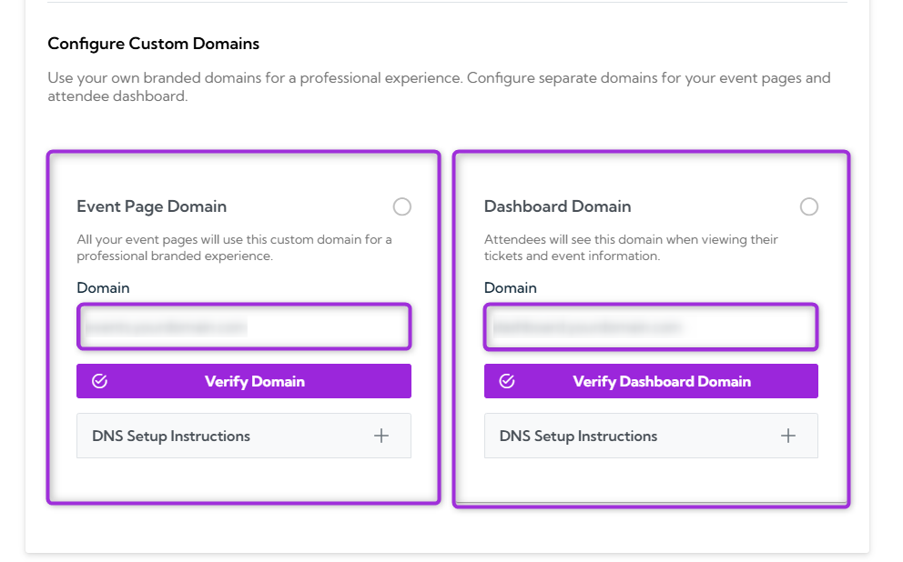
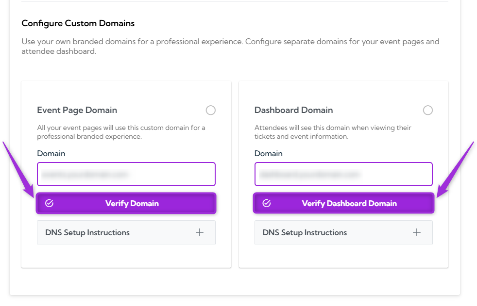
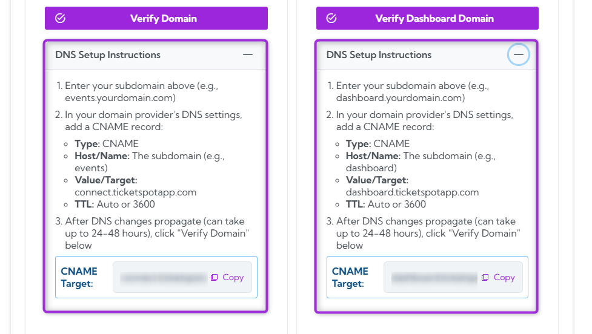

The **Domain & Analytics** section allows you to set up tracking tools and custom domains for your event site. By adding your Google Analytics ID and Facebook Pixel ID, you can track visitor activity and improve your ad campaigns. You can also customize your event URLs with a personalized site handle and set up branded domains for a more professional and consistent experience.

Let’s get started 🚀

**Step 1**:Log in to your **Ticket Spot** account and click on the **Site Settings** option from the top navigation bar.

**Step 2**: Select the **Domain & Analytics** option from the left sidebar.

## Google Analytics and Facebook Pixel Configuration

Add your Google Analytics ID and Facebook Pixel ID to track visitor behavior and improve your ad campaigns. These tools help you measure engagement and optimize marketing for your event site.

| Field | Description | Example |
|-------|-------------|---------|
| **Google Analytics Measurement ID** | Track visitor behavior on your event pages and site using **Google Analytics**. | UA-XXXXXXXXX-X or G-XXXXXXXXXX |
| **Facebook Pixel ID** | Track conversions and optimize ad campaigns targeting event attendees with **Facebook Pixel**. | XXXXXXXXXXXXXXXX |

## Use Custom Site Handle

When you toggle on the **Use Custom Site Handle** option, you personalize your event calendar URL with a custom handle derived from your site name. This makes it easier for visitors to find and share your events. 

For example, instead of a generic URL, you will have a custom URL like:  
`https://www.ticketspotapp.com/calendar/your-site-name`

You can copy your custom URL and easily share it with others, making it simple for attendees to access your event calendar.

> **Note:** This feature is available with the Business plan and helps enhance your branding by creating a unique and memorable URL for your event calendar.

## Configure Custom Domain

If you're on the **Enterprise plan**, you can configure a **Custom Domain** for your event pages and attendee dashboard. This allows you to completely remove the TicketSpot branding and use your own domain (e.g., `events.yourcompany.com`), providing a fully branded and professional experience for your event site.

### Domain Setup Details

| Domain Type | Description | Steps |
|-------------|-------------|-------|
| **Event Page Domain** | This is the domain your attendees will see for all your event pages. | 1. Enter your subdomain (e.g., 1events.yourdomain.com1). 2. Add a CNAME record to your DNS settings: `Host/Name: events` `Target: connect.ticketspotapp.com` 3. Verify the domain after DNS changes propagate (`up to 24–48 hours`). |
| **Dashboard Domain** | This is the domain where attendees will view their tickets and event information. | 1. Enter your subdomain (e.g., dashboard.yourdomain.com). 2. Add a CNAME record to your DNS settings: `Host/Name: dashboard` `Target: dashboard.ticketspotapp.com` 3. Verify the domain after DNS changes propagate (`up to 24–48 hours`). |

After completing the DNS setup, click **Verify Domain** to ensure everything is properly configured.

#### DNS Setup Instructions

To set up your custom domain, enter your subdomain and add the required CNAME record in your DNS settings. Once the DNS changes have propagated, click **Verify Domain** to complete the setup.

> **Note:** To configure a custom domain, keep **Use Custom Site Handle** toggled off. This option, available with the **Enterprise plan**, allows you to set up your own branded domain (e.g., `events.yourcompany.com`) for a fully personalized event site experience.

Once everything is verified, your custom domain will be successfully configured.
