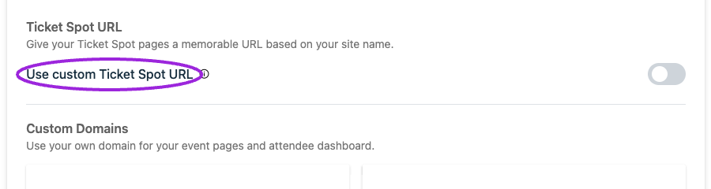
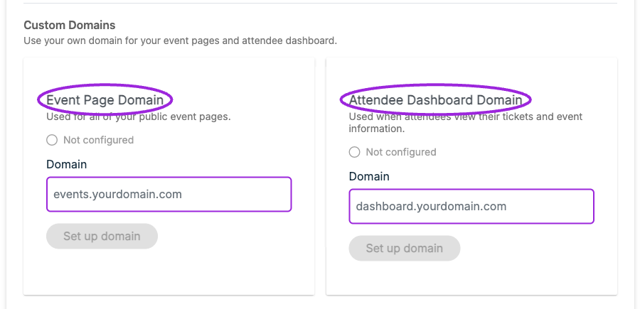
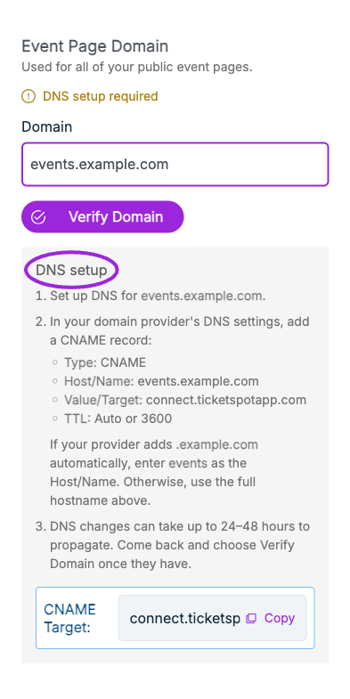
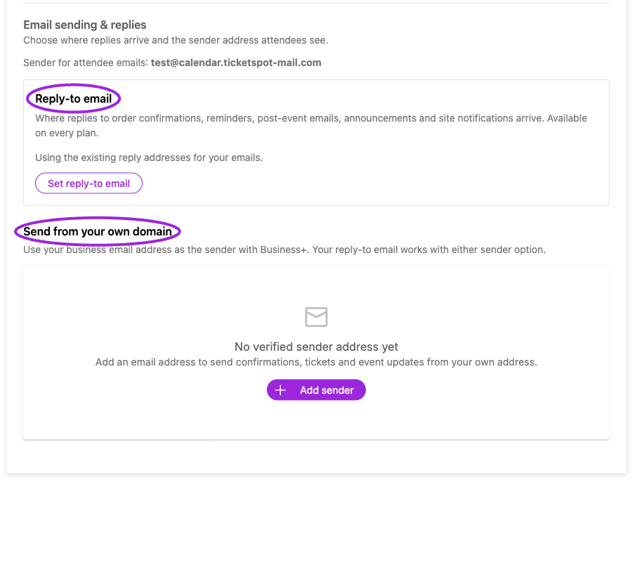
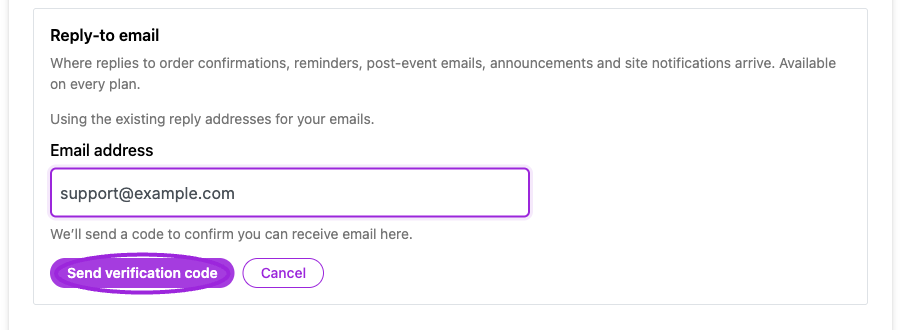
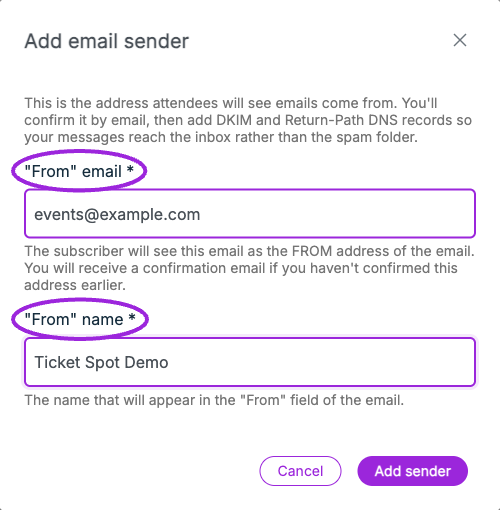
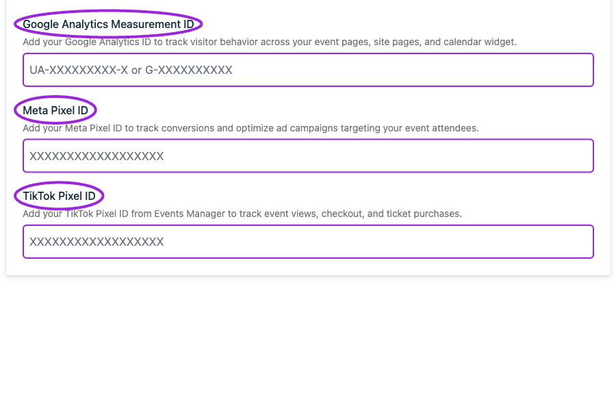

Open **Settings** in the top navigation. Domain settings are in **Domains & Sender Identity**; tracking IDs are in the separate **Analytics** tab.

## Use a custom Ticket Spot URL

On Business and higher, enable **Use custom Ticket Spot URL** to use a URL based on your site name. Copy **Your Ticket Spot URL** after saving. This is a Ticket Spot-hosted address, not a domain you own.

<Frame caption="Use custom Ticket Spot URL creates a Ticket Spot-hosted address based on the site name. It is separate from using a domain you own.">
  
</Frame>

## Connect your own domains

Custom domains require **Business+ or Platform**.

<Frame caption="Custom Domains separates the public Event Page Domain from the Attendee Dashboard Domain used to view tickets. Set up each hostname independently.">
  
</Frame>

<Steps>
<Step title="Choose the domain type">
Open **Settings → Domains & Sender Identity → Custom Domains**. If custom Ticket Spot URLs are enabled, choose **Switch to custom domains** or turn off **Use custom Ticket Spot URL**.
</Step>
<Step title="Enter your subdomain">
Select **Set up domain** after entering a hostname to reveal its DNS instructions. Use **Event Page Domain** for public event pages and **Attendee Dashboard Domain** for the pages where attendees view their tickets. Enter a hostname without a path, such as `events.example.com` or `tickets.example.com`.
</Step>
<Step title="Create the DNS record">
At your DNS provider, create a CNAME for the chosen subdomain:

| Purpose | Example host/name | CNAME target |
|---|---|---|
| Event pages | `events` | `connect.ticketspotapp.com` |
| Attendee dashboard | `tickets` | `connect.ticketspotapp.com` |

Use the instructions shown for your domain. Both domain types use the same target. Remove a conflicting record only for the subdomain you are configuring.
</Step>
<Step title="Save and verify">
Save the settings, allow the DNS change to become available, and use **Verify Domain**. Confirm the verified state, then open an event or attendee ticket link on the correct domain using HTTPS.
</Step>
</Steps>

<Accordion title="Example CNAME setup">
<Frame caption="Set up domain reveals the CNAME instructions. This unsaved example uses events.example.com; configure your own DNS record, then verify the domain.">
  
</Frame>
</Accordion>

If verification fails, check the hostname, CNAME target, and any conflicting DNS records. An event domain and attendee dashboard domain are separate settings. A custom domain does not by itself remove branding from templates.

## Email sender identity and reply-to address

Open **Domains & Sender Identity → Email sending & replies**. **Sender for attendee emails** shows the current sender. The reply-to address and the From address have separate setup flows.

<Frame caption="Email sending &amp; replies distinguishes the verified reply-to address available on every plan from the custom sender address available with Business+.">
  
</Frame>

### Reply-to email

Available on every plan, this is where replies to confirmations, reminders, post-event emails, announcements, and site notifications arrive.

1. Select **Set reply-to email**, or **Change reply-to email** for an existing address.
2. Enter an email address you control and select **Send verification code**.
3. Enter the six-digit code. It expires after ten minutes; use the resend option after its cooldown if needed.
4. Verify the address and confirm the **Verified** status. New emails use it for replies.

The previous reply addresses remain active until the new address is verified. The site-wide **Save** button does not complete this verification flow.

<Frame caption="Set reply-to email opens the address form. Send verification code starts verification; previous reply addresses remain active until verification succeeds. This draft was not submitted.">
  
</Frame>

### Send from your own domain

With Business+ or higher, choose **Add sender** and enter **"From" email** and **"From" name**. Adding the sender can send a confirmation email. Confirm the address and follow the provided DKIM and Return-Path DNS records, then use **Verify** to check its status.

<Frame caption="Add email sender asks for the From email and From name. Adding it starts verification; this example is an unsaved draft and no verification message was sent.">
  
</Frame>

Your verified reply-to address works with either the default Ticket Spot sender or your custom sender. Verify the From and Reply-To fields in a delivered test email after completing setup.

## Add analytics IDs

Open **Settings → Analytics** and enter the **Google Analytics Measurement ID**, **Meta Pixel ID**, or **TikTok Pixel ID** for the providers you use. The TikTok field accepts letters and numbers only. Use a GA4 measurement ID such as `G-XXXXXXXXXX` for Google Analytics. Save, then verify a visit using the provider's own reporting tools.

<Frame caption="Settings → Analytics stores Google Analytics, Meta Pixel, and TikTok Pixel IDs for site tracking. These are separate from the main Analytics reporting tab.">
  
</Frame>

Analytics integrations require Business access. For TikTok, verify event views, checkout starts, and supported completed purchases in Events Manager. Pending payments, waitlist signups, and deferred Shopify checkout are not reported as completed purchases by the browser purchase tracker.

Use [event tracking links](/event-management/tracking-links) to compare individual campaigns inside Ticket Spot. A page view, a ticket sale, and payment-provider revenue are different measurements and should be compared over the same period.

## Related guides

- [Brand-first setup](/branding-and-design/brand-design)
- [White-label setup](/branding-and-design/white-label-setup)
- [Website embedding](/plugins/embed-on-your-website)
