The **Event Submissions** feature allows users to submit events for your approval, enabling you to create a marketplace for event organizers. Once submitted, events undergo a review process before being published, giving you control over the content on your platform.  

By enabling **Public Event Submissions**, users can create and submit events, and you can review and approve them before they go live, ensuring only approved events are published.

Let’s get started 🚀

**Step 1**: Log in to your **Ticket Spot** account and click on the **Event Submissions** option from the top navigation bar.

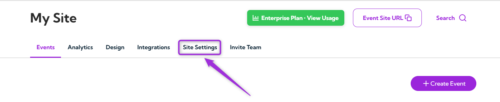

**Step 2**: Select the **Event Submissions** option from the left sidebar.

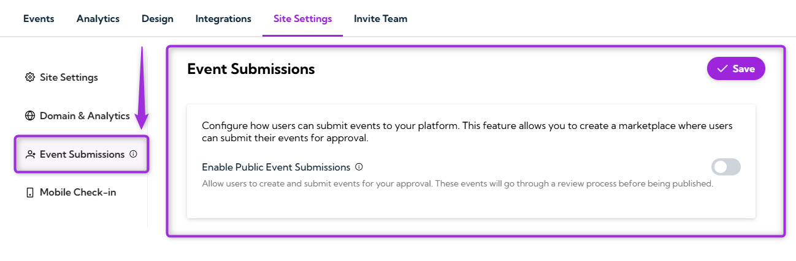

To use **Public Event Submissions**, toggle it on to allow users to submit their events for approval. This will enable a marketplace where event organizers can submit their events, which you can review and approve before publication.

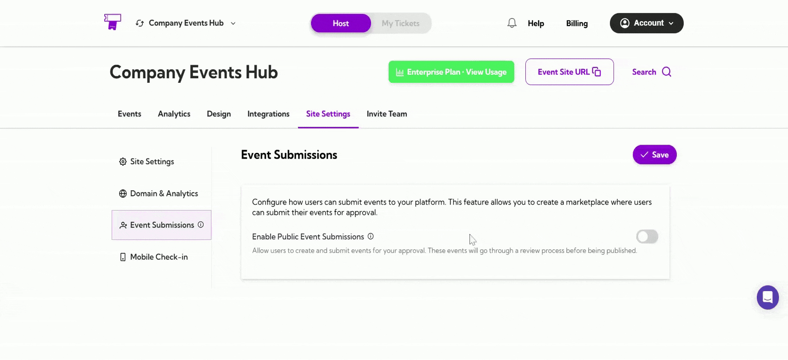

## Personalization Tokens

You can use **Personalization Tokens** in your email templates to personalize your messages. For example, you can use tokens like the **Event Title** to dynamically insert event-specific information into your emails.

**How to Use Personalization Tokens**

- **Select the Token:** From the **Property** dropdown, choose the token you want to use (e.g., **Event Title**, **Event Summary**).
- **Copy the Token:** After selecting the token, click the **Copy** button to copy it to your clipboard.
- **Use in Emails:** Paste the copied token (e.g., `event_title`) into your email template where you want to display the personalized event information.

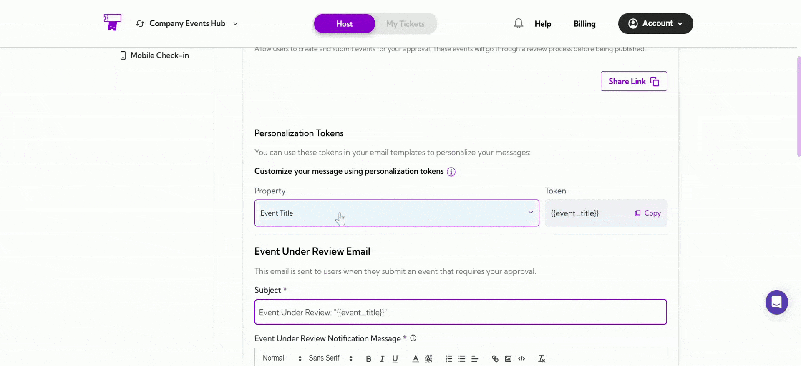

## Event Under Review Email

This email is sent to users when they submit an event that requires your approval. You can customize the subject and message of this email using personalization tokens for dynamic content, such as the event title. You can also customize this template if you'd like to change the message or use a different tone.

1. **Email Subject:** Use the personalization token for the event title:  

_**Example:**_ Event Under Review: `event_title`

2. **Email Message:** Customize the notification message that informs users their event is under review: 

**Example:**_ "Your event, `event_title`, is currently under review. We will notify you once it's been approved."

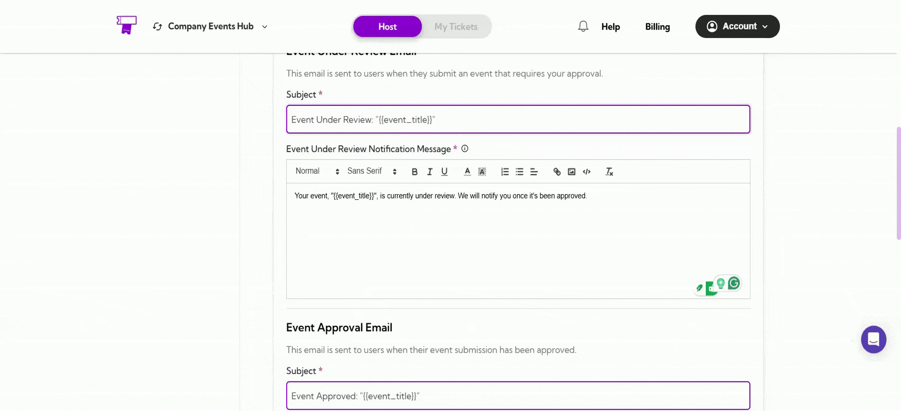

## Event Approval Email

This email is sent to users once their event submission is approved. It notifies them that their event is live, allowing users to start purchasing tickets. You can customize the notification message to suit your needs:

1. **Email Subject:** Use the personalization token for the event title and customize the subject:  
_
**Example:**_ Event Approved: `event_title`

2. *Email Message:** Customize the notification message that informs users their event has been approved:  

**Example:**_ "Congratulations! Your event, `event_title`, has been approved and is now live. Your users can start purchasing tickets. We wish you a successful event!"

> **Tip:** You can modify this template to better suit your communication style or include additional information for your users.

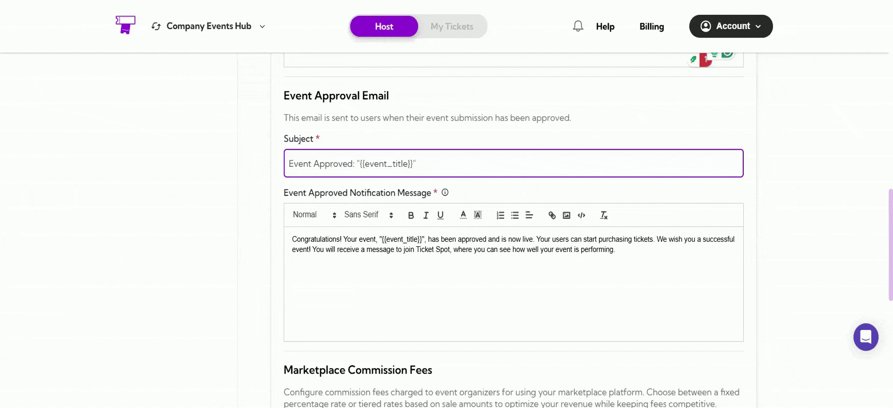

## Marketplace Commission Fees

This section allows you to configure commission fees charged to event organizers using your marketplace platform. You can choose between a Fixed Percentage Rate or Tiered Percentage Rates based on sale amounts, helping you optimize your revenue while keeping fees competitive.

### Fixed Percentage Rate

The **Fixed Percentage Rate** option charges a consistent commission rate on all sales. This rate will be applied to every sale, regardless of the amount.

**Commission Percentage:**  
Enter the desired percentage (e.g., 8%). For example, with an 8% commission, you earn $8 on every $100 sale.

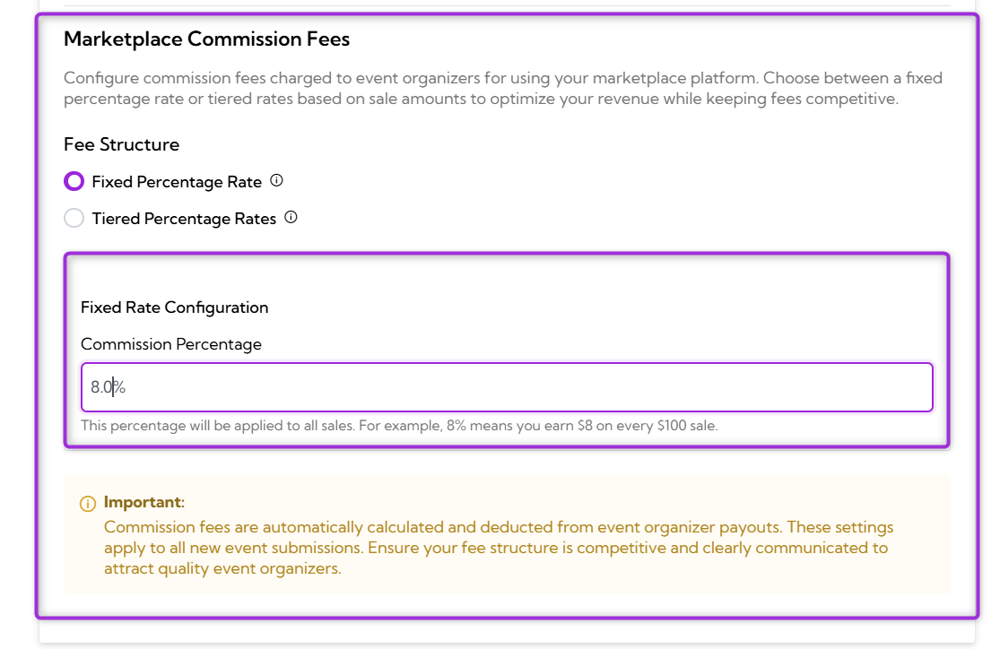

### Tiered Percentage Rates

The **Tiered Percentage Rates** option allows you to set different commission rates based on the sale amount. Higher tiers typically have lower rates to encourage larger transactions. This feature gives you flexibility in charging event organizers depending on how much they sell.

**Setting up tiers:**  

1. Click the **Add Tier** button to add additional tiers as needed, each with its own sale range and commission rate.

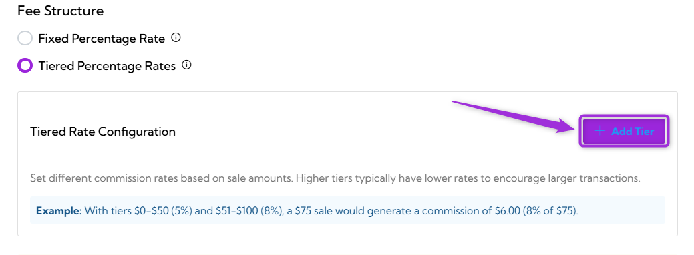

Set different commission rates based on sale amounts. Typically, higher tiers have lower rates to encourage larger transactions.

- **Min Amount ($):** The minimum sale amount for this tier.
- **Max Amount ($):** The maximum sale amount for this tier.

Once you enter these values, the **Commission (%)** is automatically calculated based on the Max Amount ($).

**Example:**_ If you set tiers like **$0–$50 (5%)** and **$51–$100 (8%)**, a $75 sale would generate a $6.00 commission (8% of $75).

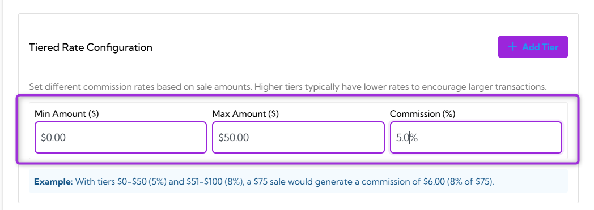

Click the **Add Tier** button to add more tiers with different sale ranges and commission rates as needed.

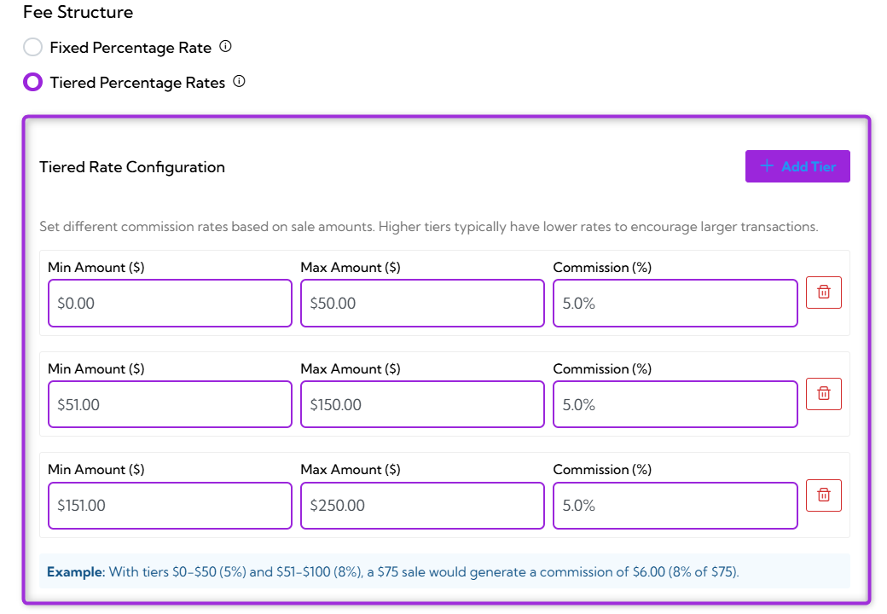

> **Important:** **Commission fees** are **automatically calculated** and **deducted** from event **organizer payouts**. These settings apply to all new event submissions. Ensure your fee structure is competitive and clearly communicated to attract quality event organizers.

## Share Link

The **Share Link** button allows you to easily copy and share the event submission page link with users. This helps guide them directly to the page where they can submit their events for approval.

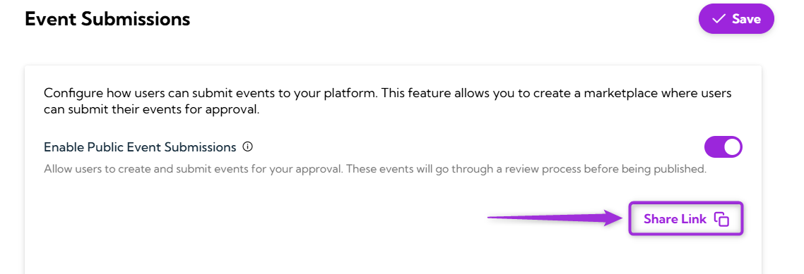