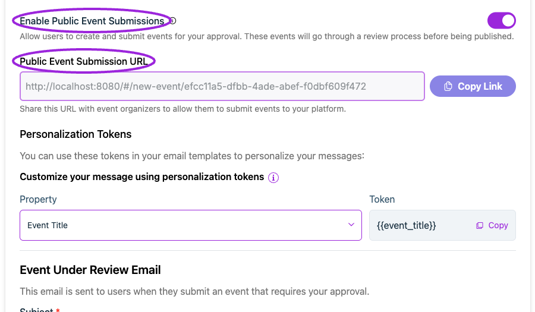
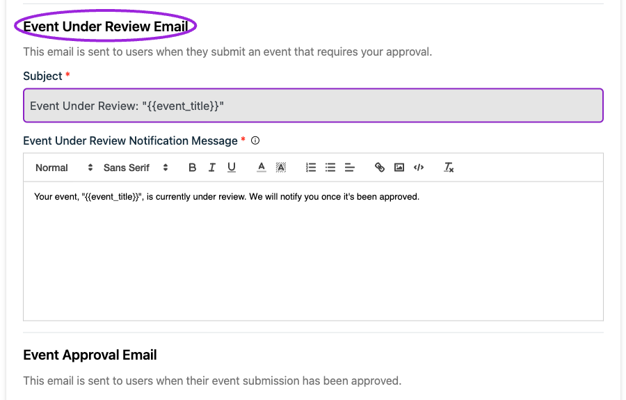
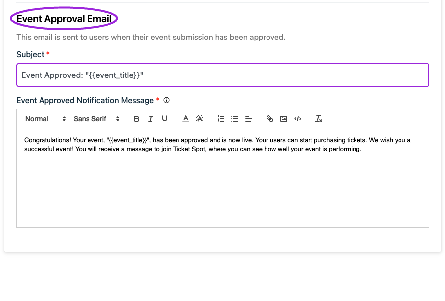

On Business or higher, open **Settings → Event Submissions** and turn on **Enable Public Event Submissions**. Review the email templates and select **Save**. Organizers use the public form to submit events for your review.

## Share the submission form

Copy the **Public Event Submission URL** with **Copy Link** after saving. This is the organizer submission form, separate from a public event page or checkout link.

<Frame caption="Enable Public Event Submissions reveals the submission URL and the review/approval email settings. Save the settings before sharing the link. This capture uses an unsaved enabled draft.">
  
</Frame>

## Personalization tokens

In **Personalization Tokens**, choose a **Property**, then select **Copy** next to its **Token**. Paste the complete token into the subject or message, including its braces—for example, `{{event_title}}`.

## Event Under Review Email

Set the required **Subject** and **Event Under Review Notification Message**. This message goes to the submitting organizer when an event needs review. The rich-text editor supports formatting and links.

<Frame caption="Event Under Review Email has a required subject and rich-text message sent when an organizer submits an event for review.">
  
</Frame>

## Event Approval Email

Set the required **Subject** and **Event Approved Notification Message**. This is sent after an event submission is approved. Keep the wording consistent with what the organizer can do next, and save your changes.

<Frame caption="Event Approval Email supplies the subject and message sent after a submitted event is approved. Preserve complete tokens such as {{event_title}} when customizing the text.">
  
</Frame>

## Review a submitted event

Open the submitted event from **Events** and review its details, date, venue, tickets, and organizer. Select **Approve and Publish** when ready. Confirm that the event is visible on the public site. Keep an event unpublished if it still needs corrections.

## Marketplace commissions

Public event submissions and commission collection are separate features. **Settings → Marketplace** requires **Platform**. It offers fixed percentage, tiered percentage, and per-ticket booking-fee controls. See [Marketplace and organizations](./marketplace-and-organizations).
