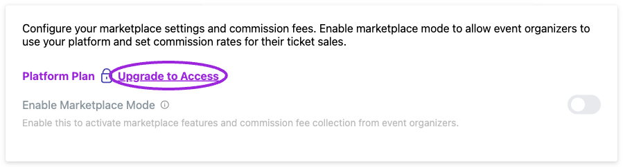

A marketplace combines listings from multiple organizers under your site. **Business and higher** include public event submissions; **Platform** provides the multi-organizer structure and revenue-sharing capabilities.

## Prepare the marketplace

1. Configure the marketplace site's [Brand](/branding-and-design/brand-design), [Site page](/branding-and-design/site-design), and [custom domains](/site-settings/domain-and-analytics).
2. Enable [Event Submissions](/site-settings/event-submissions) and customize the under-review and approval messages.
3. On your Platform site, open **Settings → Marketplace** and enable marketplace functionality.
4. Configure and save the commission model. Verify the model and expected calculation before organizers start selling.
5. Share the submission link with organizers. Complete organization setup and payment onboarding for an organizer before accepting paid events.

<Frame caption="Marketplace commission controls require the Platform plan. The Demo account shows the plan requirement; public event submissions are configured separately.">
  
</Frame>

## Organization setup and access

In **Create Your Organization**, enter the **Organization Name**, description, contact email, logo, and brand colors, then choose **Create Organization**. Organizers can manage their events and team within their organization. Platform administrators can use the organization filter in **Events** to review an organizer's listings.

Organization membership, [team roles](/team/invite-team-roles), and [event hosts](/event-management/hosts) serve different purposes. A host displayed on an event is not automatically an account administrator. Verify a new organizer can see the intended events and invite only the people who need access.

## Commission settings

| Model | Configuration |
|---|---|
| Fixed Percentage Rate | Enter the percentage to apply. |
| Tiered Percentage Rates | Enter each tier's minimum amount, maximum amount, and commission percentage. Use **Add Tier** or the tier’s remove action as needed. |
| Ticket Booking Fee | Enter **Booking Fee per Ticket**, a fixed USD amount for each ticket. |

The percentage for a tier is entered by you; setting a maximum amount does not calculate the percentage. For a sale in an 8% tier, a $75 commission base produces $6 commission. Review which charges form the commission base and how payment fees are handled in your marketplace agreement.

These controls do not configure recurring organizer subscriptions or every possible hybrid business model. Arrange custom commercial requirements through your Platform account manager.

## Review events and reconcile sales

Review submitted details, schedule, venue, prices, and organizer identity before publishing. In the event editor, use **Approve and Publish** for a submission awaiting approval. If changes are needed, keep it unpublished and ask the organizer to correct it before approving.

After an initial sale, compare the attendee order, commission configuration, payment-provider transaction, and organizer settlement. A sales total is not the same as an available payout balance. Confirm payout onboarding and settlement timing with the connected payment provider.

## Related guides

- [Submission form and emails](/site-settings/event-submissions)
- [Plans and allowances](/account/billing-and-plans)
- [Public API](/api-reference/introduction)
