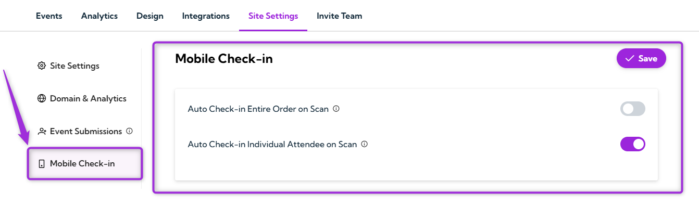
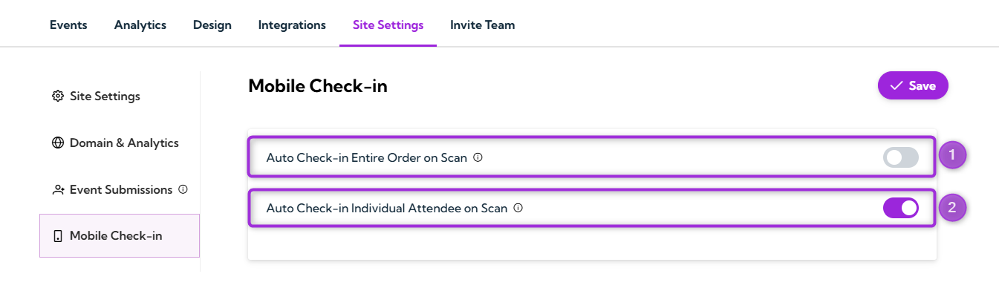
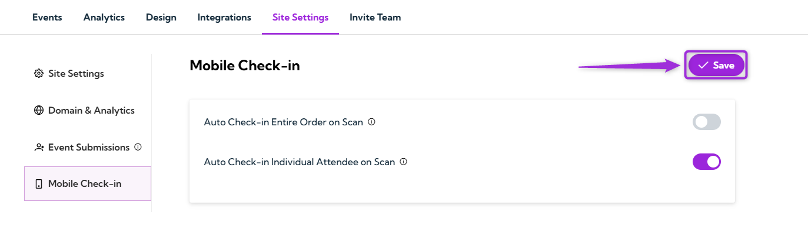
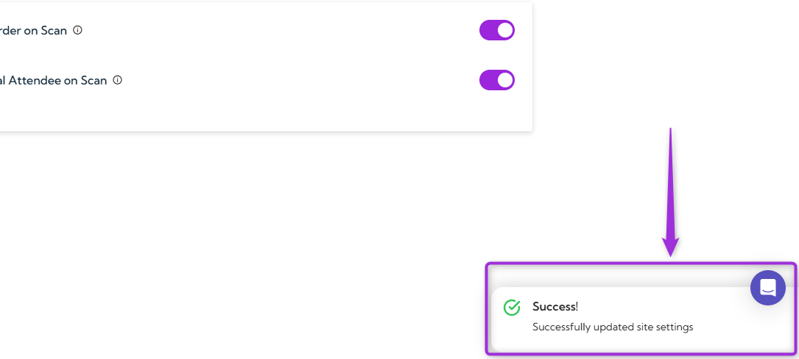

The **Mobile Check-in** settings help you manage how attendees are checked in when their tickets are scanned at the event. You can choose to check in an entire order with a single scan or check in each attendee individually. These options give you flexibility to match your check-in process with the size of your event and how your guests typically arrive.

Let’s get started 🚀

**Step 1**: Log in to your Ticket Spot account and click on the **Site Settings** tab from the top navigation bar.

**Step 2**: Select **Mobile Check-in** from the left sidebar to open the check-in settings page.

**Step 3**: Select your preferred check-in method. You can choose to check in an entire order with one scan or check in each attendee individually.

| **Option** | **Description** | **Example** |
|-----------|------------------|-------------|
| **Auto Check-in Entire Order on Scan** | Checks all the tickets in order when you scan any one ticket. | A family or group arrives together. One scan checks everyone in. |
| **Auto Check-in Individual Attendee on Scan** | Checks in one attendee at a time. Each ticket must be scanned separately. | Helpful when you need to verify each attendee individually. |

**Step 4**: After choosing your check-in method, click the **Save** button in the top-right corner to apply your changes.

After saving, a confirmation message will appear to show that your check-in site settings have been successfully updated.

## Best Practices

- **Choose the right mode** based on how your attendees typically arrive (groups vs. individuals).
- **Test your check-in method** before the event using a sample ticket.
- **Train your staff** so they understand whether you’re using group check-in or individual check-in.
- **Use a device with a reliable camera** for faster and smoother scanning during entry.
