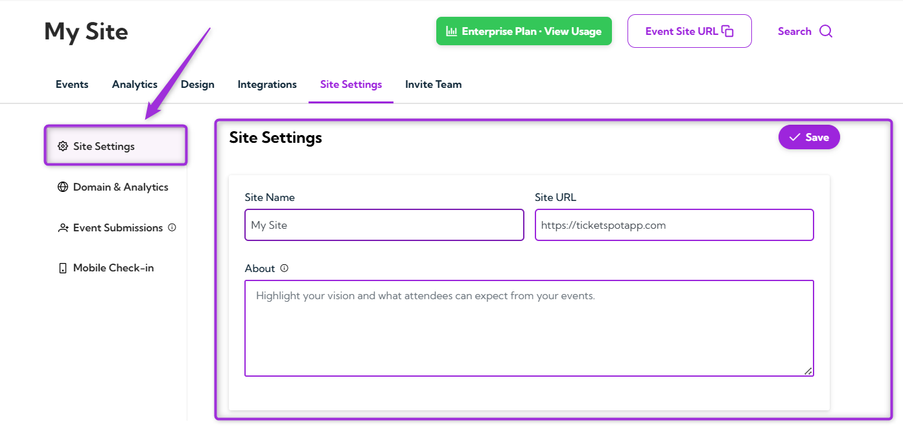
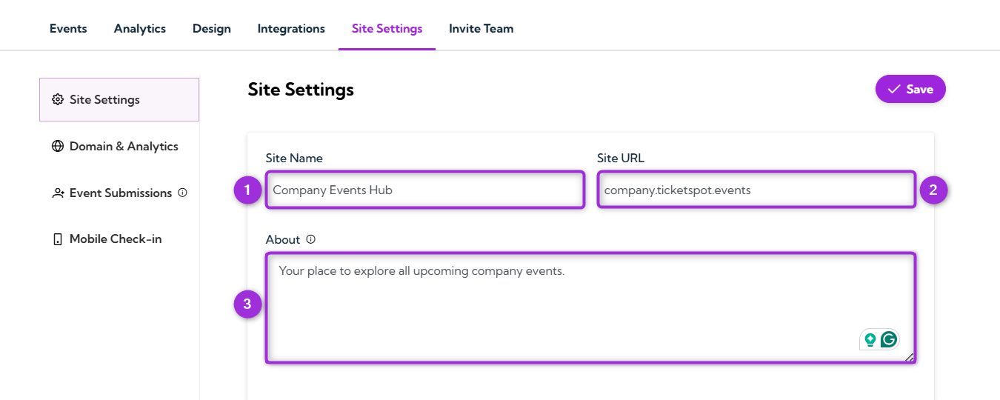
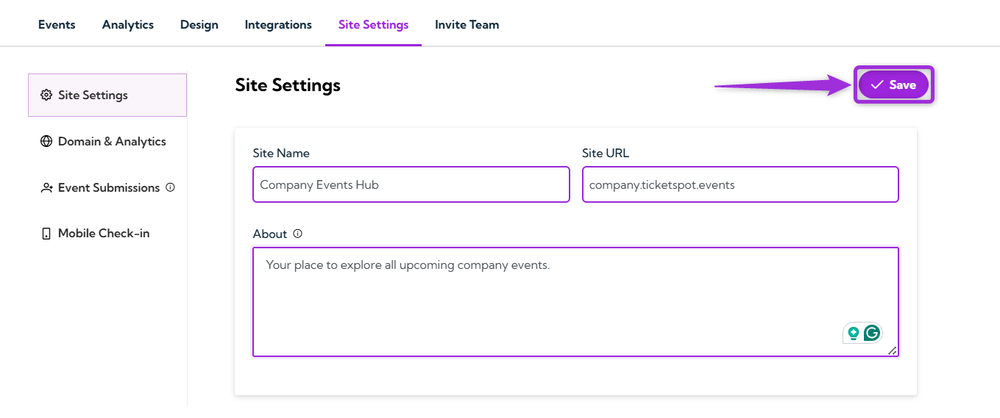
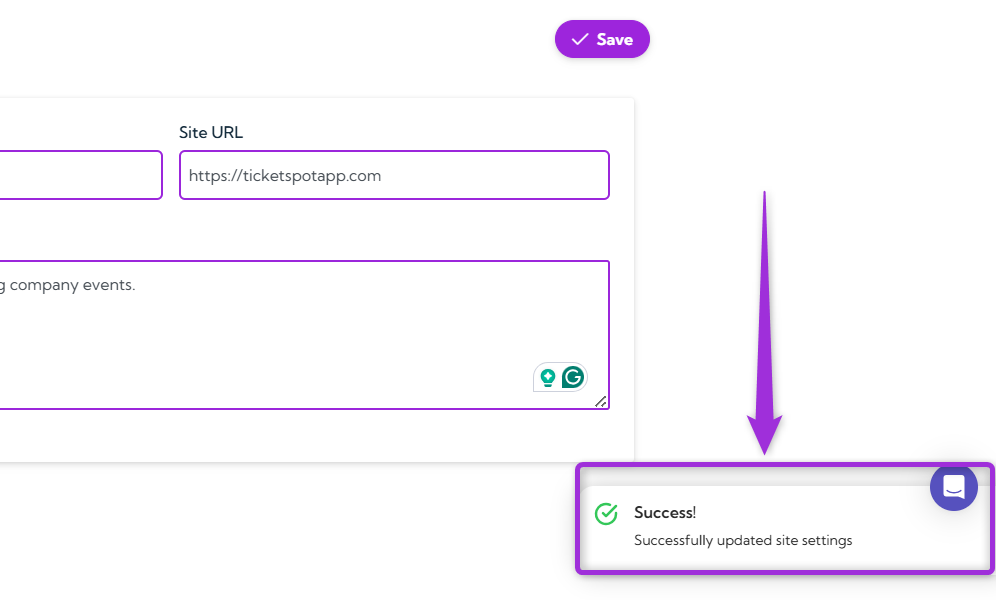

The **Site Settings** page is where you set the main details of your event site. Here, you can update your site name, site URL, and a short description that appears on your public pages. These settings help visitors quickly understand who you are and what your event site is about.

Let’s get started 🚀

**Step 1**: Log in to your **Ticket Spot** account and click on the **Site Settings** tab from the top navigation bar.

**Step 2**: Select the **Site Settings** option from the left sidebar to view and edit your site name, URL, and description fields.

**Step 3**: When the Site Settings page opens, you’ll see three fields you can update. Here’s what each field does:

| **Field**   | **Description**                                                                 | **Example**                         |
|-------------|---------------------------------------------------------------------------------|-------------------------------------|
| **Site Name** | The name displayed on your event site. It appears in the header and public pages. | Company Events Hub                  |
| **Site URL**  | The link visitors use to access your event site.                               | company.ticketspot.events           |
| **About**     | A short description that explains what your site or organization is about. This appears on public pages. | Your place to explore all upcoming company events. |

**Step 4**: Review your site details and click the **Save** button in the top-right corner to apply your changes.

After saving, a confirmation message will appear to show that your site settings have been successfully updated.

## Best Practices

- **Use a clear site name** so visitors can quickly understand what your event site represents.
- **Keep your About section short and helpful** to give visitors a quick overview of your site or organization.
- **Review your URL** before sharing it publicly to make sure it’s correct.
- **Update your information regularly** to keep your event site accurate and up to date.
