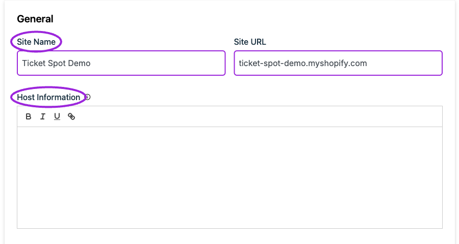
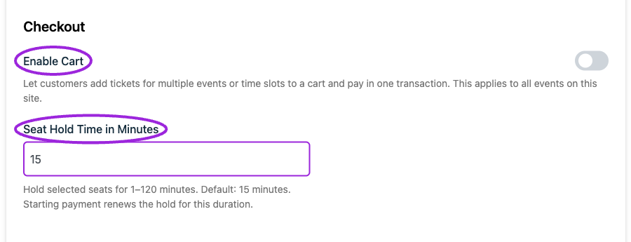
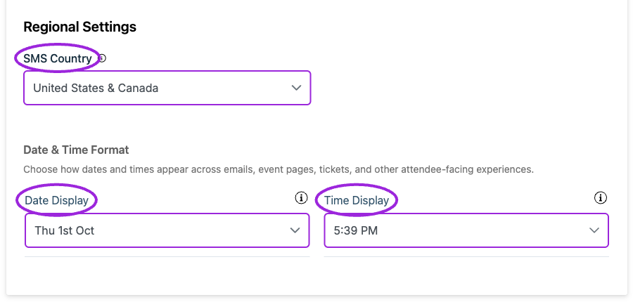

Choose the correct site, then open **Settings → General**. Edit the site fields and select **Save** at the top right. **Date Display** and **Time Display** save automatically when changed.

## Site identity

| Field | Purpose |
|---|---|
| **Site Name** | The site's display name. |
| **Site URL** | The website associated with the site. Use Domains & Sender Identity to configure a hosted Ticket Spot URL or custom domain. |
| **Host Information** | Rich text introducing you or your organization in the event page's **Meet the Host** section. Supports bold, italic, underline, and links. |

<Frame caption="Settings → General contains the site name, site URL, and Host Information shown in the event page’s Meet the Host section. Save applies site-form edits.">
  
</Frame>

## Checkout

**Enable Cart** lets customers add tickets for multiple events or time slots and pay in one transaction. It applies to every event on the site.

**Seat Hold Time in Minutes** accepts a whole number from **1 to 120**; the default is **15**. Selected seats are held for that duration, and starting payment renews the hold for the same duration. Save after changing either setting.

<Frame caption="Enable Cart allows checkout across multiple events or time slots. Seat Hold Time accepts whole minutes from 1 to 120, with 15 minutes as the default; starting payment renews that hold.">
  
</Frame>

## Regional settings

**SMS Country** lists the regions supported by the account. It selects the destination region used for SMS sending. Save after changing it.

**Date & Time Format** contains **Date Display** and **Time Display** for emails, event pages, tickets, and other attendee-facing surfaces. These controls update automatically and show a current-date/time example for each choice.

<Frame caption="Regional Settings contains SMS Country and the shared Date Display and Time Display formats. Date and time format changes update automatically; save other General fields with Save.">
  
</Frame>

Date choices include abbreviated or full month names, optional weekday and year, and numeric month/day/year or day/month/year with two- or four-digit years. Time choices include 12-hour time with AM/PM, 24-hour time, and 24-hour time with an AM/PM suffix.

These formats do not change the event timezone or payment currency. Widget-specific formatting is in **Design → Widget → All Settings → Display → Date & time**. See [Language, translation, and locale settings](/branding-and-design/language-and-locale) and the [locale FAQ](/getting-started/language-and-locale-faq).

## Other settings

- [Domains, email sender, reply-to address, and tracking IDs](./domain-and-analytics)
- [Event submissions](./event-submissions)
- [Mobile check-in](./mobile-check-in)
- [Marketplace and organizations](./marketplace-and-organizations)
