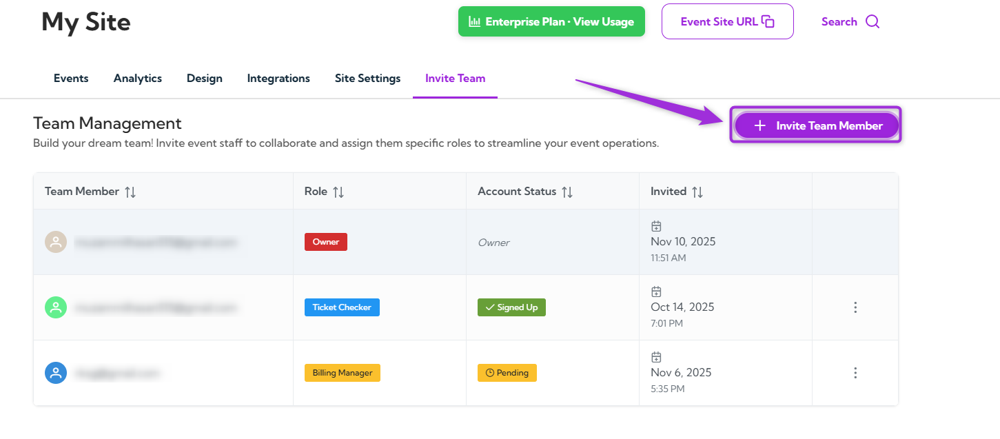
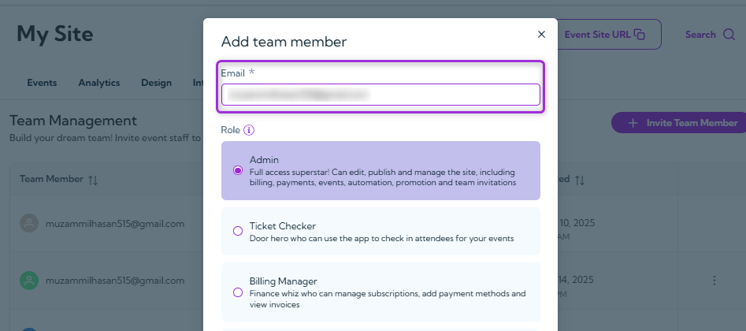
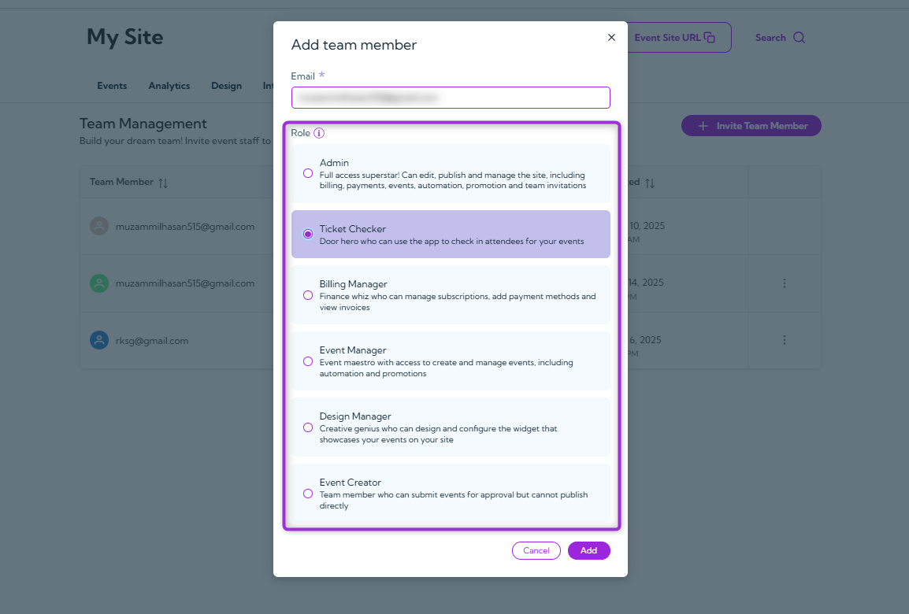
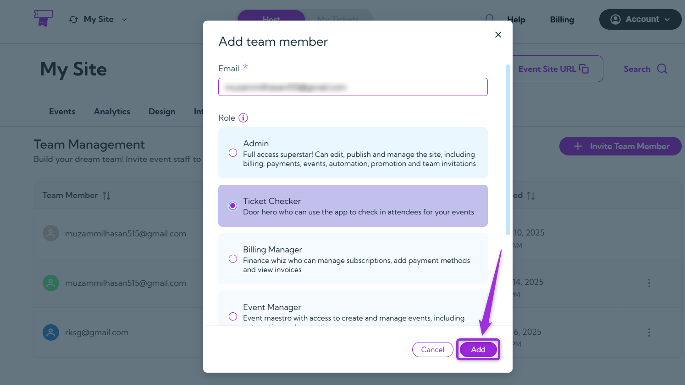
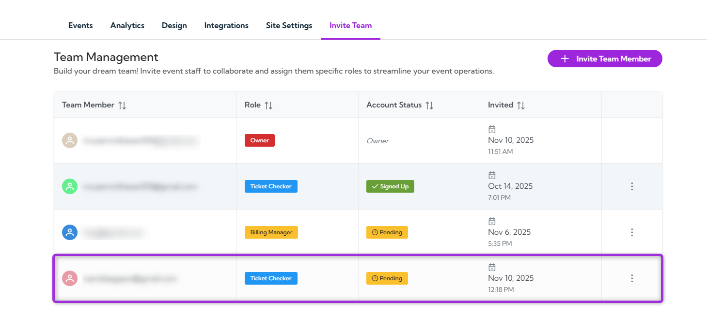

Inviting team members and assigning the right roles helps keep your **Ticket Spot** account organized and secure. Each role comes with specific permissions, so adding users with the correct access level ensures smooth collaboration across events, billing, and design tasks. The steps below show you how to invite members and set their roles with clarity and control.

Let’s get started 🚀

**step 1**: Log in to your Ticket Spot account and click on the **Invite Team** tab from the top navigation bar to open the team management page.

**step 2**: Click the **Invite Team Member** button on the top right side to add a new member to your team.

**step 3**: Enter the team member’s email address in the **Email** field to invite them to your team.

**step 4**: Select the role from the list to decide what this member can view, edit, or manage, based on the role and its permissions. 
 

The table below shows each role and the level of access it provides.

| Role           | Permissions                                                                 |
|----------------|-----------------------------------------------------------------------------|
| **Admin**          | Full access to all settings, billing, events, promotions, automation, and team management. |
| **Ticket Checker** | Can check in attendees for events using the app.                            |
| **Billing Manager**| Manages subscriptions, billing details, invoices, and payment methods.     |
| **Event Manager**  | Can create and manage events, promotions, and automation.                  |
| **Design Manager** | Can design and configure the event widget for your site.                   |
| **Event Creator**  | Can create events and submit them for approval, but cannot publish directly.|

**step 5**: Click the **Add** button to send the invitation and create the new team member entry.

Once the team member is invited, they appear in the list with their **role**, **account status**, and **invite date**.

When the team member accepts the invitation, their status will change from **Pending** to **Signed Up**. 

Your team setup is now complete, and you can update roles or add new members anytime as your team grows.