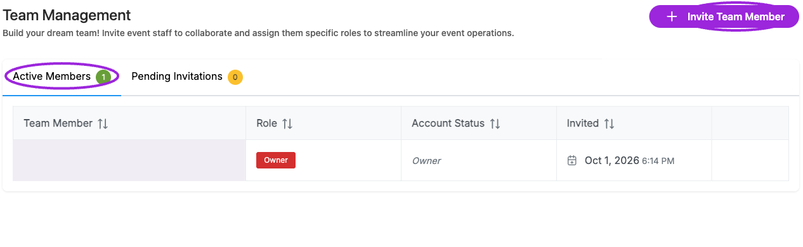
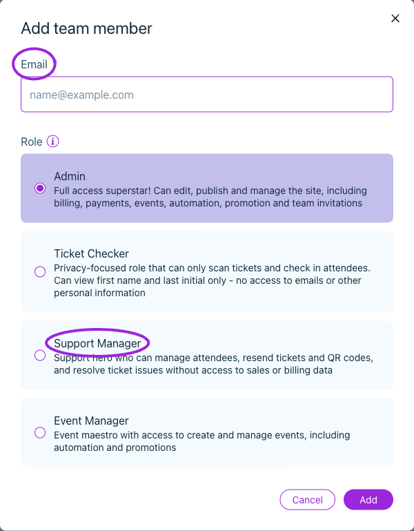

Choose the intended workspace, then open **Invite Team** in the top navigation. **Team Management** separates **Active Members** from **Pending Invitations**.

<Frame caption="Invite Team separates Active Members from Pending Invitations. The owner row has no removal menu; personal email values are concealed.">
  
</Frame>

## Send an invitation

1. Select **Invite Team Member**.
2. Enter the person's **Email**.
3. Choose the **Role** matching their responsibilities.
4. Select **Add** to send the invitation.
5. Review **Pending Invitations** while waiting for acceptance.

<Frame caption="Invite Team Member offers Admin, Ticket Checker, Support Manager, and Event Manager. Enter an email and choose a role; Add sends the invitation.">
  
</Frame>

## Available roles

| Role | Access described by the current invitation form |
|---|---|
| **Admin** | Edit, publish, and manage the site, including billing, payments, events, automation, promotions, and team invitations. |
| **Ticket Checker** | Scan tickets and check in attendees. Sees first name and last initial, without email or other personal information. |
| **Support Manager** | Manage attendees, resend tickets and QR codes, and resolve ticket issues without access to sales or billing data. |
| **Event Manager** | Create and manage events, including automation and promotions. |

Existing accounts may show legacy role names. The current invitation picker offers the four roles above. The workspace owner is listed separately and has no removal menu.

Workspace team access and [event-specific hosts](/event-management/hosts) are configured separately. See [Manage invitations](./manage-invitations) to review statuses and change existing access.

## Assign checkpoint scanning staff

For the checkpoint release, an owner or administrator can assign an event and checkpoint when inviting or editing staff. The assigned account automatically redeems that checkpoint when it scans an eligible regular ticket. See [Ticket checkpoints](/on-site/ticket-checkpoints) for release prerequisites, setup and screenshots.
